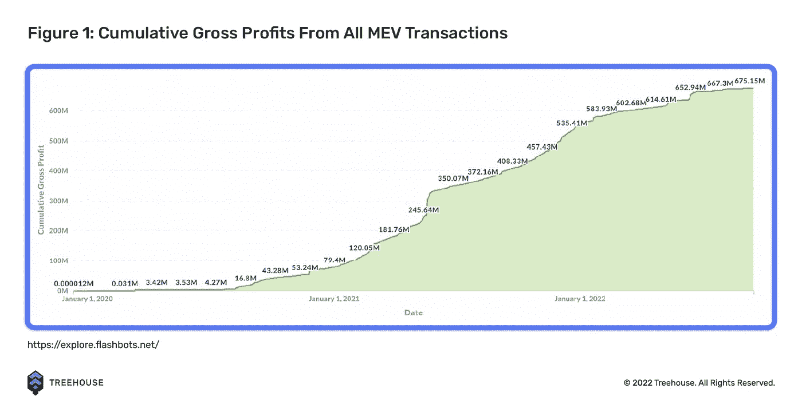
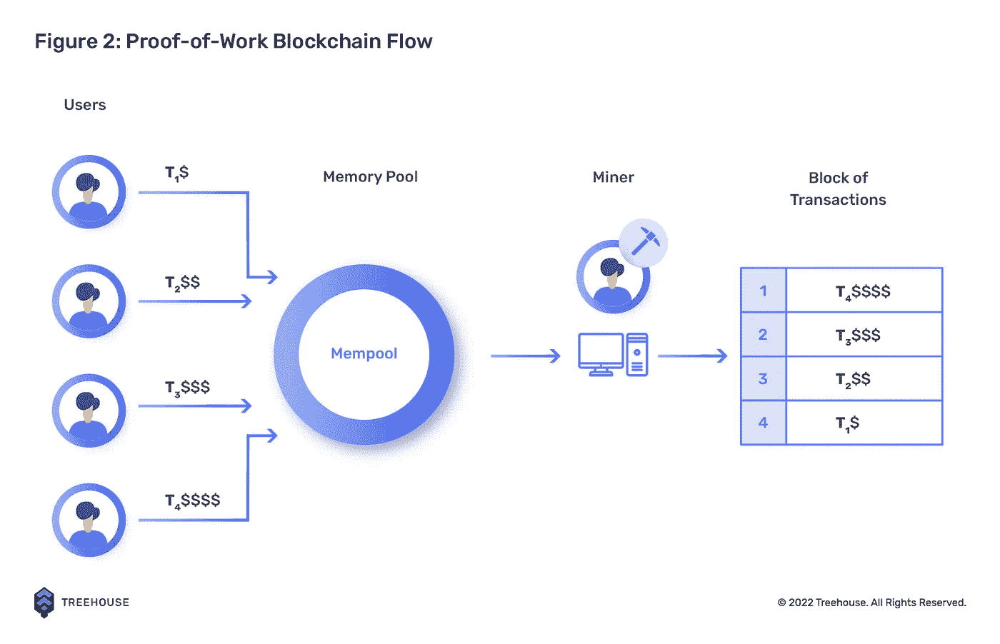
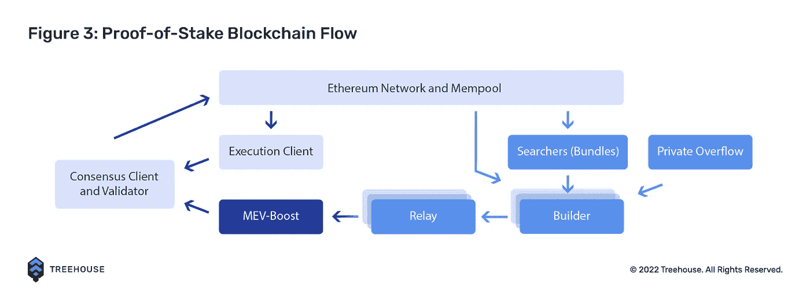

# 什么是最大可提取值(MEV)？

> 原文：<https://medium.com/coinmonks/what-is-maximal-extractable-value-mev-e4c0b76eb5e?source=collection_archive---------6----------------------->

*本文旨在深入了解最大可提取值(MEV)及其提取方式。如果你对去中心化金融(DeFi)不熟悉，可以考虑先在这里阅读我们关于*[*DeFi*](https://www.treehouse.finance/learn-defi/what-is-defi)*[*【区块链】*](https://www.treehouse.finance/learn-defi/what-is-a-blockchain)*[*加密货币*](https://www.treehouse.finance/learn-defi/what-is-crypto) *的入门文章。在阅读本文之前，您可能还想阅读我们关于* [*【以太坊】*](https://www.treehouse.finance/learn-defi/guide-to-ethereum-how-it-started-and-how-it-is-going)*[*合并*](https://www.treehouse.finance/learn-defi/everything-you-need-to-know-about-the-ethereum-merge) *，以及* [*共识机制*](https://www.treehouse.finance/learn-defi/the-difference-between-proof-of-work-pow-and-proof-of-stake-pos) *的文章。****

# **MEV 简介**

**最大可提取价值(MEV)是指采矿者或验证者可以从正在生成的区块中排除、包括或重新排序交易中获得的最大利润。MEV 是在通常的街区奖励和汽油费之外赚取的，因此它有时被视为以太坊用户的“隐形税”。**

**MEV 以前被称为“矿工可提取价值”，因为在[合并](https://www.treehouse.finance/learn-defi/everything-you-need-to-know-about-the-ethereum-merge)之前，矿工在以太坊链上的活动，这个概念变得流行起来。将[从工作证明(PoW)移至利益证明(PoS)](https://www.treehouse.finance/learn-defi/the-difference-between-proof-of-work-pow-and-proof-of-stake-pos) 后，该概念不再仅适用于矿工，也适用于验证者。**

**2020 年 8 月，当两位研究人员丹·罗宾逊和圣乔治·孔斯坦托普洛斯发表了一篇文章将以太坊的[记忆池](https://academy.binance.com/en/glossary/mempool#:~:text=A%20mempool%20(a%20contraction%20of%20memory%20and%20pool)%20is%20a%20cryptocurrency%20node%E2%80%99s%20mechanism%20for%20storing%20information%20on%20unconfirmed%20transactions.%20It%20acts%20as%20a%20sort%20of%20waiting%20room%20for%20transactions%20that%20have%20not%20yet%20been%20included%20in%20a%20block.)称为“黑暗森林”时，MEV 的概念变得突出，因为它的掠夺性环境充满了准备捕捉 MEV 的机器人。值得注意的是，尽管 MEV 主要与以太坊相关，但它并不仅仅是以太坊的问题。类似以太坊的连锁店也会面临 MEV 相关的问题。**

# **MEV 的性能**

****

**自 2020 年初以来，MEV 活动增长迅猛，在所有 MEV 交易中，累计毛利超过 6 . 75 亿美元。专注于构建产品以捕捉 MEV 的项目，如 [Flashbots](https://www.flashbots.net/) 和 [Manifold Finance](https://www.manifoldfinance.com/) ，正在不断进入这个领域。**

# **MEV 如何在工作证明链中工作？**

****

# **矿工们**

**在合并前以太坊或 PoW 链中，挖掘者负责从 mempool 中选择和安排用户事务，mempool 是链前的存储区域，其中有待处理的事务等待确认。然后，他们将这些事务添加到下一个块中。默认情况下，矿商选择天然气或交易费用最高的交易来优化利润。然而，由于矿工运行合同代码，他们可以决定交易的顺序，以获得高于通常的大宗奖励的利润。**

## **搜寻者**

**MEV 的很大一部分其实是搜索者和他们的机器人提取的，而不是矿工。搜索者是在区块链寻找机会捕捉 MEV 的用户，通常利用机器人和自动化工具。**

## **搜索者如何与矿工合作**

**当利润提取机会被识别时，搜索者按照他们期望的顺序创建交易包。一旦创建了捆绑包，搜索者必须请求矿商验证交易以提取 MEV。有两种方法可以做到:**

1.  **搜索者可以通过在优先天然气拍卖中竞价来竞争**
2.  **搜索者可以通过 [Flashbots](https://docs.flashbots.net/) 私下与矿工交流他们的订购偏好**

# **常见 MEV 策略**

## **领跑**

**可以把前端运行想象成在一个已知的未来事务发生之前跳到执行队列的前面。搜索者使用专门的前置机器人来搜索内存池，以发现有利可图的交易。这些机器人有助于在原始交易之前提交具有更高天然气费用的竞争交易以供批准。**

## **反向运行**

**当一个事务被放置在一个已知的挂起目标事务之后时，就会发生回退。反向运行机器人寻找导致[自动做市商(AMM)](https://www.treehouse.finance/learn-defi/what-are-amms-and-how-do-they-work) 池失衡的大宗交易，这样它们就可以执行相反的交易，以实现利润最大化。他们还监控 mempool 中的新令牌对列表，以从初始流动性背后的令牌对中购买尽可能多的一个令牌，只留下少量令牌供其他交易者稍后购买。这导致购买的代币价格上涨，之后机器人将通过以更高的价格卖回代币来获利。**

## **三明治攻击**

**三明治攻击类似于抢注，但是搜索者进行两次交易而不是一次。要进行三明治交易，搜索者必须识别大型分散交易所(DEX)交易，这些交易将显著提高一对代币中一个代币的价格。然后，搜索者将在交易之前立即从池中购买所识别的代币，目的是在交易之后立即将其出售，以从代币的价格上涨中获利。**

## **清算**

**清算人通过清算贷款协议(如 Aave、Compound 和 Maker)中的超额抵押贷款来提取 MEV。在[收割](http://harvest.treehouse.finance/connect)上看你在这些协议中的位置。通过竞争成为第一个清算贷款的人，搜索者通过在借款人能够偿还债务之前清算他们的贷款，以收取贴现抵押品和清算费，从而从不知情的借款人那里提取 MEV。**

## **时间强盗袭击**

**时间强盗攻击包括重组过去的街区，当 MEV 比街区奖励大得多时才有意义。假设一个矿工在三个区块的第一个发现了套利机会。另一个拥有强大散列能力的矿工注意到了这一点。不是在前一个采矿者发现的三个区块之上采矿，后一个采矿者可能提议三个包含改变的交易的竞争区块，以捕捉套利机会。**

# **MEV 的负面影响**

## **对网络的影响**

**时间强盗攻击破坏了网络的稳定，因为它损害了事务的终结性和不变性。如果矿商有动机重组区块以获取 MEV，那么区块链作为安全、可预测和无许可账簿的前提就分崩离析了。**

## **对用户的影响**

**对于业余交易者来说，诸如抢先交易和三明治攻击这样的策略会导致价格滑动增加，失去套利机会。前置运行的僵尸程序也经常导致网络拥塞和高额交易费用。**

# **未来的解决方案？**

## **提议者-建造者分离**

****

**随着以太坊的[合并](https://www.treehouse.finance/learn-defi/everything-you-need-to-know-about-the-ethereum-merge)和从 PoW 到 PoS 的过渡，一种被称为提议者-构建者分离(PBS)的解决方案被引入，以对抗 MEV 在[共识层](https://www.treehouse.finance/learn-defi/the-difference-between-proof-of-work-pow-and-proof-of-stake-pos)的不利影响。**

**传统上，PoW 中的矿工、验证者和 PoS 一起工作来构建有序交易的块，并提出新的块以添加到链中。在 PBS 中，验证者仍然对块进行提议和投票，但是一类新的被称为块构建者的专门实体现在负责排序事务和产生块。**

**与传统方法不同，验证者在接受中标之前看不到块的内容。这减少了可能控制块中的交易排序的各方窃取 MEV 的情况。由于经济激励减少，PBS 也阻止了集中化，因为大型矿池不太可能控制区块提议者的角色。**

## **构建器 API**

**虽然 PBS 应该减少 MEV 提取的影响，但实现它需要改变以太坊的共识协议。同时，Builder API 充当 PBS 的临时工作实现。构建器 API 的一个例子是 Flashbots 的 [MEV-Boost。](https://boost.flashbots.net)**

**在 MEV-Boost 中，搜索者寻找有利可图的 MEV 交易，并将其发送给负责聚合和捆绑这些交易的区块构建者。relayers 在将块传递给块建议的验证器之前，检查来自构建器的块，而不是通过公共内存池。‍This 过程鼓励交易隐私，这防止了诸如抢先运行和夹层等 MEV 攻击。**

**MEV-Boost 还降低了集中化的风险，因为任何验证者，包括个人赌注者，都可以获得 MEV 机会，并且与大型赌注池集成以提高 MEV 利润的压力较小。MEV-Boost 也有助于降低汽油费和减少网络拥堵，因为搜索者参与的是离线密封价格拍卖，而不是 PGA 式的竞标战。**

# **MEV…现在怎么办？**

**解决合并后以太坊中与 MEV 相关的问题是研究的核心领域。有了上面提到的改进，希望加密用户能够保持安全，而不用担心 MEV 攻击。在交易方面，MEV 的未来看起来很光明。随着越来越多的 MEV 工具被开发出来，我们预计这个领域将会持续增长。**

****免责声明 ****

***本出版物仅供参考和娱乐。本出版物中的任何内容都不构成财务建议、交易建议或任何其他建议，也不构成买卖证券或任何其他资产或参与任何特定交易策略的要约。本出版物不考虑您的个人投资目标、财务状况或需求。Treehouse 不保证本出版物中提供的信息是最新的或准确的。***

***新来的 DeFi？如果您觉得这很有用，请查看我们的其他* [*学习 DeFi*](https://treehouse.finance/learn-defi) *文章，深入了解 DeFi 的奇妙世界！或者，浏览我们的* [*见解*](https://treehouse.finance/insights) *部分，阅读关于 DeFi 空间的更深入分析。您也可以试用我们的旗舰产品，* [*【收获】*](https://harvest.treehouse.finance/connect?utm_source=medium&utm_medium=content&utm_campaign=harvest) *，全面分析您的 DeFi 资产。最后，订阅快讯更新* [*这里*](https://www.treehouse.finance/newsletter?utm_source=medium&utm_medium=content&utm_campaign=treehouse%20daily) *！***

> **交易新手？尝试[加密交易机器人](/coinmonks/crypto-trading-bot-c2ffce8acb2a)或[复制交易](/coinmonks/top-10-crypto-copy-trading-platforms-for-beginners-d0c37c7d698c)**