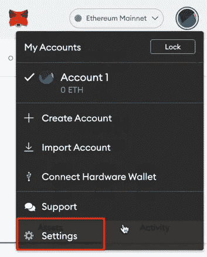

# 什么是 Metamask？

> 原文：<https://medium.com/coinmonks/what-is-metamask-4fef95356356?source=collection_archive---------49----------------------->

它是以太坊式的区块链处理和互动的桥梁。Metamask 归 ConsenSys Software Inc .所有，这家区块链公司专注于基于以太坊的工具和基础设施。已经发展了。通过一个小的浏览器插件和移动应用程序，交易很容易。

MetaMask 相对于其竞争对手的最大优势之一是，除了作为智能手机的应用程序，它还可以作为浏览器的扩展来访问，允许与各种网站和在线平台轻松集成，并且该功能被高度使用。DeFi 协议和 NTF 市场是近几个月来经历显著增长的两个行业。

例如，DeFi 申请从 2019 年的 20 亿美元抵押品增长到 2021 年的 800 多亿美元。

NTF 市场也打破了连续记录，拥有无与伦比的百万富翁人数和每月数十亿美元的平台销售额。

随着 MetaMask 在许多这些平台上的广泛使用，钱包的使用量呈爆炸式增长，自 2020 年 7 月以来增长了 1800%以上，月活跃用户数超过 1000 万——高于一年前的 545000 人。

Metamask 特别适合通过组合 dex 以最佳汇率交换基于以太坊的令牌。这项功能名为 Metamask Swap，收取交易金额 0.875%的服务费。

## 使用元掩码:好特性

《元掩码使用指南》经常提到的主要好处如下:

**开源:**所有元掩码代码都是在线的，免费提供。你可以在家里创建自己的版本！(你可以，但我是在开玩笑)开源软件可以被社区审查和更新，所以它是不断发展的。

**高清设置:**分级确定性设置帮助用户备份账户。它通过给用户种子短语来做到这一点。种子短语可用于重置丢失的帐户信息。

**内部硬币购买:** MetaMask 连接到两个加密交易所，用户可以在那里直接购买加密货币。它的用户可以使用比特币基地购买以太，和 ShapeShift 购买以太或 ERC20 令牌。

**客服:** MetaMask 希望以太坊网络能够接触到尽可能多的人。它的主页有一个介绍视频和一个单独的详细支持页面。

**简单界面:**一旦设置好，MetaMask 使用起来非常简单。所有的功能都准备得很清楚，这样即使是新手也可以轻松地买卖货币。

**本地密钥库:**一些钱包提供商将密钥存储在他们自己的服务器上。像比特币基地这样提供钱包的交易所很常见。元掩码密钥存储在用户自己的浏览器中，而不是任何远程服务器上。这给了用户对他们的公钥和私钥更多的控制。

**社区:**元面具是以太坊社区的重要组成部分。它拥有超过一百万的活跃用户。他在 Twitter 上也有近 7 万名粉丝。

这一切都很好！那么使用 MetaMask 有什么不好呢？

## 使用元掩码:不良特征

没有什么是完美的。如果我们不提及元掩码使用审查中最显著的缺点，那将是一个错误。

**浏览器访问:** MetaMask 无法访问您的信息，但安装的浏览器可以。虽然您的浏览器无法访问您的私人代码，但它可以收集有关您何时以及如何使用该应用程序的信息。Mozilla 和 Google 在加密社区中不是很受欢迎。大多数加密用户对这些公司收集信息感到不太欢迎。这可能会让一些用户放弃使用元掩码的想法。

**在线:**在线钱包有利有弊。它最大的缺点之一就是安全性。任何存储在网上的信息都比存储在网下的信息有更大的被黑客攻击的风险。元掩码没有提供足够的安全性。记住，总是使用几种类型的钱包。

**1:下载 MetaMask 钱包**
转到[https://metamask.io/](https://metamask.io/)并点击“下载”。选择您喜欢的浏览器或移动应用程序，并安装 MetaMask 扩展。

*MetaMask 支持* ***iOS、Android 原生应用以及 Chrome*** *，****Firefox****，****Brave****和* ***Edge 浏览器扩展*** *。*

**2: MetaMask 钱包安装** 点击 MetaMask 扩展，点击“入门”。

您可以使用种子短语导入现有的钱包，也可以创建一个新的钱包。

**3:如何创建新的元掩码钱包**
如果您想帮助改进元掩码，请单击“创建钱包”,然后在下一个窗口中单击“我同意”,或者单击“不，谢谢”继续。

**4:** **为你的钱包创建一个强密码。**

**5:为您的钱包安全存储种子短语** 点击“点击此处显示秘密单词”以显示种子短语。

*   元掩码要求您将种子短语存储在安全的地方。如果您的设备崩溃或浏览器重置，这是收回资金的唯一方法。我们建议你写下来。最常见的方法是把你的 12 个单词的短语写在一张纸上，然后安全地存放在一个只有你能拿到的地方。**注意:如果您丢失了种子短语，MetaMask 无法帮助您找回钱包，您的资金将永远丢失。**
*   永远不要向任何人或任何网站分享你的种子短语或你的私钥，除非你想让他们完全控制你的资金。

点击“下一步”。

**6:种子短语确认**
按单词在上一屏幕中出现的顺序点击每个单词，确认您的秘密备份短语。点击“确认”继续。

**恭喜你！您的 MetaMask wallet 已成功设置。**
您现在可以通过点击首选浏览器右上角的元掩码图标来访问您的钱包。

# 如何添加新的元掩码网络

如果你想添加一个新的元掩码网络，甚至是可能的。遵循这些简单的步骤，你马上就能完成！

**1:打开 Metamask 钱包**

要添加元掩码网络，您应该打开元掩码钱包。为了做到这一点，你应该打开你的网络浏览器，打开你的钱包。

**2。转到设置并选择网络**

接下来，点击你的个人资料图片，你可以在右上角看到。这样做将允许您导航到弹出式菜单中的设置。单击后，选择“网络”选项。

**3。点击添加网络**

选择网络后，您将看到您添加的所有网络。在该菜单的底部，您可以看到一个名为“添加网络”的新按钮。您可以点击它并继续添加新网络。

当您尝试添加新的元掩码网络时，您需要输入一些信息。这包括:

**网络名称:**您可以选择任何网络名称。但是，我鼓励你加一个有意义的名字，这样你就很容易搞清楚了。

**新的 RPC 规则:**这将是一个 URL，它将作为进入区块链的入口点。

**链 ID:** 这是一个唯一的 ID 号，由你与之交互的区块链网络提供。

**货币符号:**可选参数。你可以从滚动条中选择一个合适的符号。

**Block Explorer URL:** 这也是一个可选参数。这是一个可以用来访问块资源管理器的 URL。如果您希望获得与交易相关的详细信息，您可以考虑使用此功能。

**4。点击保存**

添加完网络后，您可以单击保存按钮。这样做将让您在网络选项下看到新添加的元掩码网络。

**探索本指南:** [如何向元掩码添加令牌](https://metaschool.so/articles/how-to-add-tokens-to-metamask/)

## 可以添加到元掩码的不同网络有哪些？

我还分享了一个不同网络的列表，你可以将它添加到你的 MetaMask 钱包中。您可以浏览这些详细信息，并根据您的喜好添加任何网络。

## 和谐

*   RPC 网址: [https://api.harmony.one](https://api.harmony.one)
*   连锁 ID: 1666600000
*   符号:一
*   区块浏览器:[https://explorer . harmony . one](https://explorer.harmony.one)

## 雪崩

*   RPC URL:[https://API . avax . network/ext/BC/C/RPC](https://api.avax.network/ext/bc/C/rpc)
*   链条编号:43114
*   符号:AVAX
*   block explorer:[https://cchain . explorer . avax . network](https://cchain.explorer.avax.network)

## 币安智能连锁

*   RPC URL:[https://bsc-dataseed.binance.org/](https://bsc-dataseed.binance.org/)
*   链条编号:56
*   象征:BNB
*   街区探险家:[https://bscscan.com](https://bscscan.com)

## 多边形

*   RPC URL:[https://RPC-mainnet . matic . quiknode . pro](https://rpc-mainnet.matic.quiknode.pro)
*   链条编号:137
*   符号:MATIC
*   街区探险家:[https://polygonscan.com](https://polygonscan.com)

> 加入 Coinmonks [电报频道](https://t.me/coincodecap)和 [Youtube 频道](https://www.youtube.com/c/coinmonks/videos)了解加密交易和投资

# 另外，阅读

*   [用于 Huobi 的加密交易信号](https://coincodecap.com/huobi-crypto-trading-signals) | [HitBTC 审查](/coinmonks/hitbtc-review-c5143c5d53c2)
*   [TraderWagon 回顾](https://coincodecap.com/traderwagon-review) | [北海巨妖 vs 双子星 vs BitYard](https://coincodecap.com/kraken-vs-gemini-vs-bityard)
*   [如何在 FTX 交易所交易期货](https://coincodecap.com/ftx-futures-trading)
*   [OKEx vs KuCoin](https://coincodecap.com/okex-kucoin) | [摄氏替代度](https://coincodecap.com/celsius-alternatives) | [如何购买 VeChain](https://coincodecap.com/buy-vechain)
*   [ProfitFarmers 回顾](https://coincodecap.com/profitfarmers-review) | [如何使用 Cornix 交易机器人](https://coincodecap.com/cornix-trading-bot)