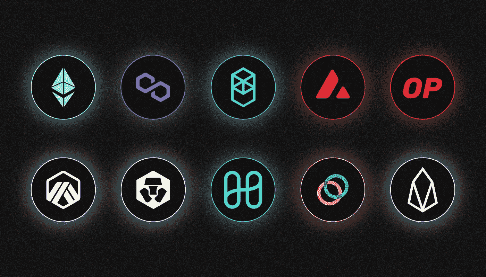
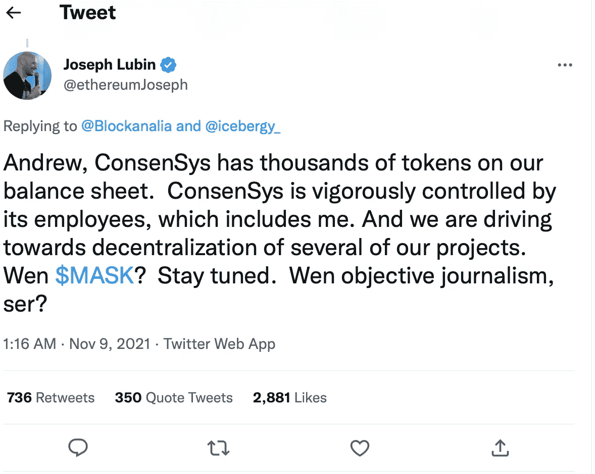

# 什么是 MetaMask？

> 原文：<https://medium.com/coinmonks/what-is-metamask-662c07ac917f?source=collection_archive---------26----------------------->

***MetaMask 是由 ConsenSys 创建的加密钱包。我们真的需要它吗？它的利弊是什么？让我们来了解一下！***

MetaMask 允许您存储和转移在以太坊或 EVM 兼容的区块链上发行的加密货币和 NFT。它还包括加密货币兑换服务。

MetaMask 最受欢迎的版本是一个浏览器扩展，它允许钱包在 web 应用程序级别与分散应用程序的智能合约进行交互。

元掩码通常用于分散金融(DeFi)应用程序和不可替代的令牌(NFT)。

# 在哪里可以找到 MetaMask？

Meta Mask 是由以太坊联合创始人 **Joseph Lubin** 创建的公司 ConsenSys 开发的。

这个钱包是在 2016 年**发布的**，在 DeFi sphere 流行起来之前。直到 2020 年，它只能作为谷歌 Chrome 和 Firefox 的浏览器扩展。

MetaMask 现在可以作为 iOS 和 Android 的移动应用程序，以及谷歌 Chrome，Firefox，Brave 和微软 Edge 的 web 扩展。当后者进入其页面时，它会“无缝”连接到一个集中式应用程序的智能合同。这使您能够使用该协议并进行加密货币转账，而无需设置单独的钱包。

# 元遮罩使用哪个区块链？

最初，MetaMask 只支持以太坊，但现在它支持所有与[以太坊虚拟机(EVM)](/@SunflowerCorpAdmin/what-is-an-ethereum-virtual-machine-evm-450ffe44e815) 兼容的流行网络。您可以在应用程序设置中连接新的主网络。

**2022 年 5 月**初，Meta Mask 支持以下网络的所有加密货币:[以太坊](/@SunflowerCorpAdmin/what-is-ethereum-eth-37e0ff2c7af1)、[多边形](/sunflowercorporation/what-is-polygon-matic-916f4fa2afee)、 [Fantom](/sunflowercorporation/what-is-fantom-4ffad859b95a) 、[雪崩](/sunflowercorporation/what-is-avalanche-5de8f06e2bca)、乐观以太坊、Arbitrum One、极光网络、Cronos、Harmony、Celo、EOS。

# **什么是元掩码置换？**

MetaMask 钱包具有内置的 DeFi 服务，允许您交换不同的数字资产。它是与 Codefi 合作开发的。

这项服务基于聚合器原理:它从领先的分散交易所实时收集硬币报价，并选择最佳价格。Uniswap、Title、Air Stop、0x 和 1inch.exchange 是列表中的站点。

MetaMask 交换的其他功能包括更低的交换费用和防滑保护。

# 有哪些优点？

Meta Mask 应用程序有几个明显的优势:杰出的开发人员、大量的加密货币、支持服务、附加功能和简洁的设计。

此外，MetaMask 是一个非托管加密钱包:它的开发者不收集私钥或用户密码。也就是说，地址的所有者完全控制他们的资金。

MetaMask 插件部分开放源代码，允许独立开发人员为应用程序的开发做出贡献，并识别潜在的漏洞。

# 缺点是什么？

还没有因为代码漏洞而导致涉及 MetaMask 钱包的严重黑客攻击事件。另一方面，互联网连接是 MetaMask 的主要缺点之一。这使得它的个人用户容易受到攻击。

为了解决这个问题，MetaMask 在 **2018** 中增加了连接账本硬件钱包的能力，将“冷”钱包的安全性与“热”钱包的便利性相结合。

在 **2021** 结束时，一些 Meta Mask 用户成为使用假冒钱包网站的大规模网络钓鱼攻击的受害者。

【2022 年 4 月，钱包团队就以太坊基础设施提供商 Infura 造成的潜在故障发出警告。他们还建议关闭元掩码的 iCloud 备份。

# 元掩码有自己的令牌吗？

目前，MetaMask 项目还没有自己的令牌。然而，在 2021 年 11 月的**，Consensus 的负责人 Joseph Lubin 暗示这可能会改变。**

****

**Source: [Twitter](https://twitter.com/ethereumJoseph/status/1457834493469884418?ref_src=twsrc%5Etfw%7Ctwcamp%5Etweetembed%7Ctwterm%5E1457834493469884418%7Ctwgr%5E08879de24367c457d9e7e8911a32db7680a3e646%7Ctwcon%5Es1_&ref_url=https%3A%2F%2Fforklog.com%2Fnews%2Fdzhozef-lyubin-nameknul-na-vozmozhnost-poyavleniya-u-metamask-sobstvennogo-tokena)**

**仅仅几个月后，该公司再次对这个故事做出回应。根据首席运营官 Jacob Cantale 的说法，MetaMask 增加了一个管理令牌，这是权力下放过程中的一个“重要方面”，将有助于将项目管理权移交给社区。**

**与此同时，坎塔勒告诫不要期待慷慨的象征性空投。**

# **元掩模是如何演变的？**

**最初，对使用元掩码源代码没有任何限制。然而，在 2020 年 8 月，该应用的开发者要求拥有大量受众的商业项目与他们就该程序的付费使用达成特别协议。**

**2020 年 9 月，ConsenSys 推出了 MetaMask 的手机应用。**

**最新版本的移动钱包还支持 Apple Pay 支付和“无气交易”，这大大简化了用户购买菲亚特加密货币的过程。**

**开发者打算在不久的将来加入比特币支持。**

> **你有什么想法？如果您对元掩码主题有任何补充，请在下面留下您的评论！**
> 
> **在[媒体](/@SunflowerCorpAdmin)或[推特](https://mobile.twitter.com/sunflower_corp)上关注[向日葵公司](https://sunflowercorp.com/)定期更新关于趋势加密新闻。**

****

**[*向日葵公司*](https://sunflowercorp.com/) *—专注于最佳交易体验和卓越技术的新型加密货币衍生品交易所。***

***我们提供杠杆高达 x100 的 BTC/USDT 永久期货，以及最具趋势性的工具。当您与我们交易时，您将获得一个可定制的交易终端、各种图表、技术分析工具、各种订单类型，以及“止损”和“止盈”订单选项。***

> **交易新手？尝试[加密交易机器人](/coinmonks/crypto-trading-bot-c2ffce8acb2a)或[复制交易](/coinmonks/top-10-crypto-copy-trading-platforms-for-beginners-d0c37c7d698c)**