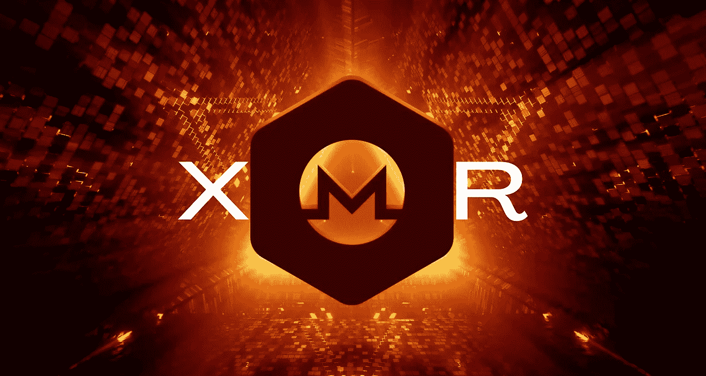

# 什么是 Monero (XMR)加密货币？

> 原文：<https://medium.com/coinmonks/what-is-monero-xmr-cryptocurrency-6da227eed5d5?source=collection_archive---------21----------------------->

Monero (XMR)加密货币于 2014 年推出，其主要目标是允许各种交易以匿名方式私下进行。尽管众所周知，BTC 可以隐藏一个人的身份，但由于区块链是透明的，追踪付款的原始来源就变得简单了。另一方面， [**Monero (XMR)加密货币**](https://procommun.com/2022/05/articles/finance-articles/what-cryptocurrencies-are-very-good-to-spend-in/) 被设计成使用先进的加密技术来隐藏接收者和发送者。

Monero (XMR)加密货币背后的整个团队表示，Monero (XMR)加密货币的两个主要和最大的优先事项是隐私和安全，其次是易用性和效率。主要目的是保护所有用户，无论一个人或一个用户的技术能力如何。总体而言，Monero (XMR)加密货币可以让支付或交易变得便宜、快捷，而不用担心审查。

> 阅读更多关于 procommun.com[的此类文章](https://procommun.com/2022/05/technology/what-is-monero-xmr-cryptocurrency/)

# Monero (XMR)加密货币的创始人是谁？

最初，七名开发者联合起来创造了 Monero 加密货币，其中五人决定保持匿名。有传言称，Monero (XMR) [**加密货币**](https://procommun.com/2022/05/articles/technology-articles/how-cryptocurrency-trading-software-program-is-encouraging-to-expand-your-crypto-system-technologies/) 是比特币的发明者中本聪发明的。

Monero (XMR)加密货币的起源可以追溯到 Bytecoin，这是一种分散的、专注于隐私的加密货币，于 2017 年推出。两年后，Bitcointalk 论坛的一名成员(名为“感谢今天”)破解了 BCN 的代码库，随后，Monero (XMR)加密货币诞生了。据信，多年来，数百名开发人员为 Monero (XMR)加密货币做出了贡献。

# 是什么让 Monero (XMR)加密货币独一无二？

不同的东西使得 Monero (XMR)加密货币独一无二。该项目的最大目标之一是实现最大程度的去中心化，这意味着用户不需要信任网络上的任何其他人。网络隐私是通过一些独特的功能实现的。每一枚流通中的比特币都有自己的序列号，这意味着加密货币的使用情况可以被监控；Monero (XMR)加密货币是完全可替代的。默认情况下，关于接收者、发送者和被转移的加密货币数量的细节是模糊的，Monero (XMR)加密货币主张这一提议优于 Zcash 等竞争对手的隐私币，并且是选择性透明的。

混淆是通过使用环签名来实现的。在这里，过去的事务输出是从区块链中挑选出来的，充当诱饵，这意味着外部观察者无法判断是谁签署的。例如，如果 John 发送 200 XMR 给 Susan，这个数量也可以分成随机的块来增加不同的难度。为了确保事务不能相互链接，还为只使用一次的每个事务创建隐藏地址。这些与众不同的特征导致 Monero (XMR)加密货币越来越多地被用于非法交易，而不是著名的比特币加密货币，特别是在暗网市场上。此外，全球各地的政府，尤其是美国，也向任何能够破解 Monero (XMR)加密货币代码的人提供了数百美元。

# 有多少 Monero (XMR) [加密货币币](https://procommun.com/2022/05/news/crypto/bitcoin-crypto-holders-pay-attention-to-this-polkadot-undervalued-apecoin-cro-terra-news-youtube/)在流通？

Monero (XMR)加密货币有点不寻常，因为 XMR 没有代币销售，此外，也没有预先开采代币。在撰写本文时，Monero (XMR)加密货币的流通供应量为 17，703，471。Monero (XMR)加密货币旨在抵御通常用于挖掘新比特币的专用集成电路。这意味着每天使用计算设备开采 Monero (XMR)加密货币成为可能。

> 原载于 procommun.com 的

> 加入 Coinmonks [电报频道](https://t.me/coincodecap)和 [Youtube 频道](https://www.youtube.com/c/coinmonks/videos)了解加密交易和投资

# 另外，阅读

*   [BigONE 交易所评论](/coinmonks/bigone-exchange-review-64705d85a1d4) | [CEX。IO 审查](https://coincodecap.com/cex-io-review) | [Swapzone 审查](/coinmonks/swapzone-review-crypto-exchange-data-aggregator-e0ad78e55ed7)
*   [最佳比特币保证金交易](/coinmonks/bitcoin-margin-trading-exchange-bcbfcbf7b8e3) | [比特币保证金交易](https://coincodecap.com/bityard-margin-trading)
*   [加密保证金交易交易所](/coinmonks/crypto-margin-trading-exchanges-428b1f7ad108) | [赚取比特币](/coinmonks/earn-bitcoin-6e8bd3c592d9)
*   [WazirX vs CoinDCX vs bit bns](/coinmonks/wazirx-vs-coindcx-vs-bitbns-149f4f19a2f1)|[block fi vs coin loan vs Nexo](/coinmonks/blockfi-vs-coinloan-vs-nexo-cb624635230d)
*   [BlockFi 信用卡](https://coincodecap.com/blockfi-credit-card) | [如何在币安购买比特币](https://coincodecap.com/buy-bitcoin-binance)