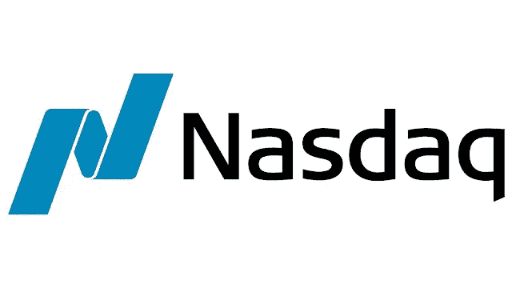

# 什么是纳斯达克 100 指数

> 原文：<https://medium.com/coinmonks/what-is-nasdaq-100-6ef876875356?source=collection_archive---------69----------------------->

纳斯达克(全美证券交易商自动报价协会)是一家位于纽约市的证券交易所。它以第一个电子股票市场和大量科技公司上市而闻名。它成立于 1971 年，目前是全球市值第二大证券交易所，仅次于纽约证券交易所(NYSE)。

[纳斯达克](https://www.nasdaqstrategy.com/2022/12/what-is-nasdaq-100.html)指数是纳斯达克股票交易所上市的 3000 多种普通股的市值加权指数。它经常被用作科技股和其他成长股表现的基准，因为它包括许多高科技和互联网公司。

> 交易新手？在[最佳加密交易](/coinmonks/crypto-exchange-dd2f9d6f3769)上尝试[加密交易机器人](/coinmonks/crypto-trading-bot-c2ffce8acb2a)或[复制交易](/coinmonks/top-10-crypto-copy-trading-platforms-for-beginners-d0c37c7d698c)

你可以在纳斯达克网站[或通过金融新闻和数据提供商如彭博和雅虎财经找到纳斯达克上市公司的实时股票报价和其他金融信息。](https://www.nasdaqstrategy.com/)