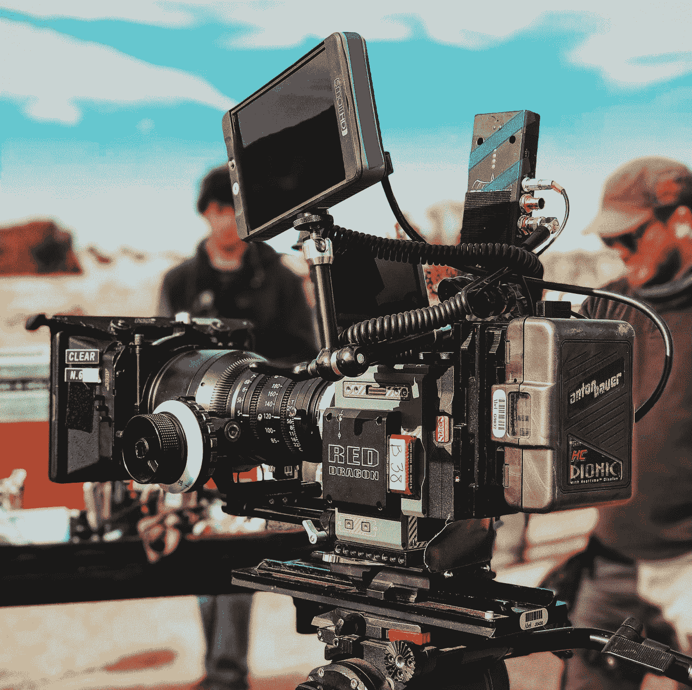
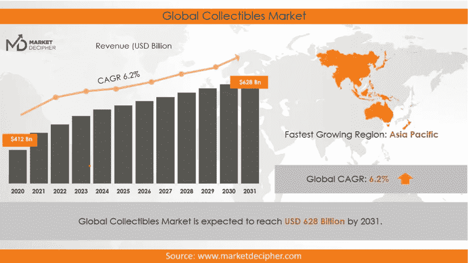

# 什么是 NFT:初学者入门？

> 原文：<https://medium.com/coinmonks/what-is-nft-an-introduction-for-beginners-e4796712d631?source=collection_archive---------39----------------------->

**深入了解 NFTS**

Photo by [Andrey Metelev](https://unsplash.com/@metelevan?utm_source=medium&utm_medium=referral) on [Unsplash](https://unsplash.com?utm_source=medium&utm_medium=referral)

NFT 是一个基于资产的公用事业公司，其身份来自区块链网络，是一个不可替代的令牌。我想这可能太复杂了，难以理解。现在让我们以更精确的方式再看一遍。

任何可以与另一种物质交换，但价值不变的东西都被称为可替代物。它们本质上是一样的，交易时保持相同的价值。任何代币或货币可以转换成另一种代币，但仍保持其价值不变，这种代币或货币被称为可互换的。例如，你可以用一张 1 美元的钞票换另一张 1 美元的钞票。你既没有赚更多的钱，也没有损失更多的钱，因为价值保持不变。

另一个例子是，如果你最喜欢的名人或你国家的总统给你一个小笔记本或笔记本。你很有可能用这份礼物换一个由同一家设计和生产公司生产的笔记本或小本子。因为这本书与来自同一制造商的相同设计的其他书没有什么区别，这表明它是一个可替换的对象。

但是假设你最喜欢的名人给你一本小书，然后在上面签名。这立即将这本书与所有其他书籍区分开来，包括那些不是书的书籍，并赋予它不同的价值。NFT，更随意的发音也称为“nefts”，不同于同类的其他资产，必须托管在区块链网络上。

不可替代的代币，也称为 NFT，是实物资产的数字表示，如一块不动产、数字艺术品、视频游戏收藏或头像、记录等。，具有链接到区块链网络的唯一地址或身份。它可以是任何东西，包括艺术品、传家宝或像房地产这样的有形资产。

Photo by [Chris Murray](https://unsplash.com/es/@seemurray?utm_source=medium&utm_medium=referral) on [Unsplash](https://unsplash.com?utm_source=medium&utm_medium=referral)

**NFT:什么时候开始的？**

从 2014 年 5 月 3 日第一个 NFT 被生产出来并以 4 美元的价格卖给 Anil Dash 开始，由于硬币被创造出来的 NameCoin Blockchain，NFT 市场多年来发展迅速。NFT 是他的妻子詹妮弗·麦考伊拍摄的麦考伊的视频。

根据 [Statista](https://www.statista.com/statistics/1221742/nft-market-capitalization-worldwide/) [的数据，截至 2018 年，NFT 和收藏品的市值为 409.6 亿美元。](https://www.statista.com/statistics/1221742/nft-market-capitalization-worldwide/).)2020 年，NFT 市值为 3380.4 亿美元，高于 2019 年的 1415.6 亿美元。根据[market deciper](https://www.marketdecipher.com/report/collectibles-market)的数据，2021 年收藏品市场价值 4020 亿美元，预计到 2031 年将增长到 6280 亿美元，理想情况下，到 2032 年将超过 1 万亿美元。

Source link: [https://www.marketdecipher.com/report/collectibles-market](https://www.marketdecipher.com/report/collectibles-market)

该图展示了随着时间的推移，市场资本总额和 NFT 使用率的指数增长。鉴于市场估值在过去的两到三年里增长了 700%以上，更大的增长和接受的可能性似乎更大。考虑 NFTs 在先进技术中的预期用例及应用。根据 Marketdecipher 和其他人的说法，NFT 和收藏品的市场可能超过 1 万亿美元。

> 根据市场解密的数据，2021 年收藏品市场价值 4020 亿美元，预计到 2031 年将增长到 6280 亿美元，理想情况下，到 2032 年将超过 1 万亿美元。

By Winkelmann, Mike. — [https://static.wixstatic.com/media/a64726_ce7a64e6ade34b549d0b3d06963bead9~mv2.jpg/v1/fill/w_517,h_576,al_c,q_80/a64726_ce7a64e6ade34b549d0b3d06963bead9~mv2.webp](https://static.wixstatic.com/media/a64726_ce7a64e6ade34b549d0b3d06963bead9~mv2.jpg/v1/fill/w_517,h_576,al_c,q_80/a64726_ce7a64e6ade34b549d0b3d06963bead9~mv2.webp), CC BY-SA 4.0, [https://commons.wikimedia.org/w/index.php?curid=108165015](https://commons.wikimedia.org/w/index.php?curid=108165015)

随着曝光率和采用率的增加，该行业出现了大量的购买和交易。2021 年，一位数字艺术家以 6900 万美元的价格出售了一组数字作品。数字艺术家毕普(真名迈克·温克尔曼)以 6930 万美元的价格出售了他的第一个 5000 天数字艺术收藏，完成了这一壮举。他标记为“每一天:前 5000 天”的数字艺术品

正如您所想象的，这增加了对 NFT 领域的兴趣和采用。《NFT 的数字艺术》以 6930 万美元的价格售出，是 NFT 市场历史上的重要事件。目前最昂贵的 NFT 是由一位名叫帕克的身份不明的数字艺术家创作的“The Merger”，它总共花费了 9180 万美元，超过了毕普 6930 万美元的 NFT。

除了 Pak 的《合并》和 Beeple 的《每天:第一个 5000 天》, NFT 工业还购买了其他大量的非功能性食物。此外，在售出《天天》后不久，皮普尔似乎倾向于生产价值数百万美元的 NFT 作品，因为他发行了《人类一号》,这是一件售价 2900 万美元的 NFT 作品。

这座钟是帕克和朱利安·阿桑奇创作的一件艺术品，是有史以来最昂贵的 NFTs 之一，现在是第三贵。诸如 Crypto Punks collections、TPunk、X-Copy 和 Edward Snowden 等 NFT 价值数百万美元。BoredApeYatcht Club、Crypto Kittens 和 Disney NFTs 是 NFTs 的进一步集合。

NFT 仅仅是数字艺术，DOGS 或 CATS 的照片吗？

区块链地区对新来者的一个常见误解是，NFT 指的是猫、小猫、小狗以及大猩猩(或其他猿类)的滑稽形象。尽管它们可能是非功能性测试，但也有非功能性测试的其他方面。你可以交易财产，而不必担心财产的真实性。这是因为你要购买的潜在房产(在这种情况下)在区块链网络上有一个数字身份，其中包含引用身份所有者的元数据和关于房产的其他重要信息。

有争议的是，数字艺术和商品，而不是有形资产，是目前最昂贵的非实物资产。NFT 技术仍然越来越受欢迎，这是一个了不起的事实。要作为不动产等有形财产所有权的参照，它必须为每个国家或至少大多数国家的法律所接受。NFT 的全部潜力最终将被利用。它将根据联邦规则证明所有权，并促进更快、更灵活地购买、出售和交易这些实物资产。

**NFT 能负担得起吗？**

> T4:金融时报不一定很贵，尽管当我们想到它时，我们通常会想到一件“贵的东西”它必须与众不同，并对持有者有一个清晰的使用案例。NFT 的价格可能低至 5 美元、7 美元或 10 美元，这取决于它的使用情况。没必要花 10000 美元或更多。

**什么将产品或物品定义为 NFT？**

当一个产品是独一无二的并且在区块链网络上有自己的身份时，它通常被认为是一个 NFT。该产品是一个 NFT，因为元数据指向它并包含关于它的数据。假设不同的 NFT 公司发布了约 1000 件 NFT 系列产品。这是否意味着这 1000 个项目是相同的，使它们具有相同的价值？

> **当一个产品是独一无二的，并且在区块链网络上有自己的身份时，它通常被认为是一个 NFT。**

这些被称为集合，从其他项目中脱颖而出。它们之间可能有某些相似之处，但是因为它们有唯一的地址，所以它们也是唯一的。尽管它们偶尔会彼此相似，但 NFT 系列中的每一件 NFT 作品都有着出众的品质。考虑一个移动电话或手机。不管制造了多少台这样的设备，每台都有一个唯一的 IMEI 号。即使它们可能是相同的制造商、相同的型号和名称，它们也不能被复制。每个 NFT 的独特性都遵循相同的原则。

请确保您在媒体和 Twitter 上分享和关注我。

[https://twitter.com/PrinceSamuel_A](https://twitter.com/PrinceSamuel_A)

你愿意深入了解什么是区块链和加密货币的更多细节，以及我的个人资料中的更多信息吗？关注我并订阅我的电子邮件，以便在我发表文章时收到通知。注意安全！

 [## 什么是区块链技术？

### 区块链科技:区块链技术 101 你需要知道的一切

medium.com](/@princesamuelaadeyemo/what-is-blockchain-technology-560db5c3d8cf)  [## 什么是加密货币？

### 它是如何工作的？

medium.com](/coinmonks/what-is-cryptocurrency-5255ff3625a5) 

> 交易新手？试试[密码交易机器人](/coinmonks/crypto-trading-bot-c2ffce8acb2a)或者[复制交易](/coinmonks/top-10-crypto-copy-trading-platforms-for-beginners-d0c37c7d698c)