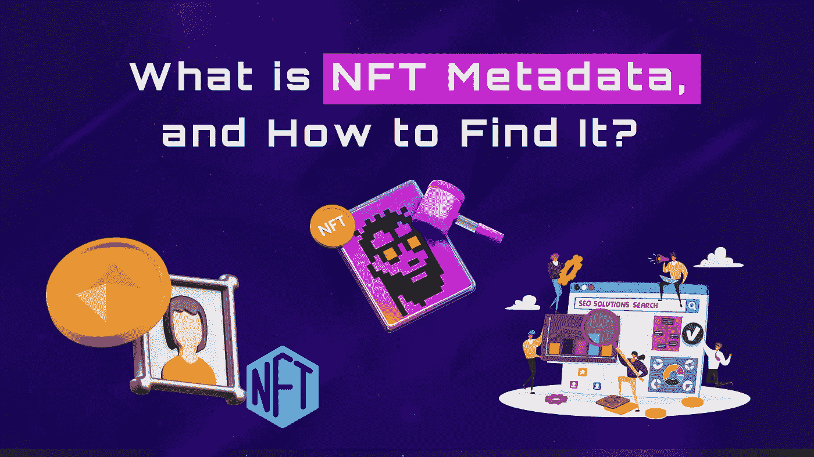

# 什么是 NFT 元数据，如何找到它？

> 原文：<https://medium.com/coinmonks/what-is-nft-metadata-and-how-to-find-it-9801ec0817c?source=collection_archive---------31----------------------->

从提供数字资产的所有权到充当艺术、音乐、电影等底层内容的访问密钥，不可替代令牌(NFT)已被证明是许多行业的游戏规则改变者。虽然 NFT 元数据还不是一个行业术语，但它是一个必不可少的技术组件。

2012 年或 2013 年，文件的[散列](https://www.easytechjunkie.com/what-are-hash-files.htm)或其他数据被添加到比特币区块链中，以证明它们的存在或合法性。这一进步为创造[【彩色硬币】](https://academy.bit2me.com/en/que-es-una-colored-coin/)奠定了基础，这是一种唯一可识别的令牌，通过向比特币交易添加元数据来识别。那么，这个元数据到底是什么，你如何找到它？在本文中，您将了解如何从合同中提取 NFT 元数据，阅读 NFT 文件，以及检查任何 NFT 的元数据。

# 什么是 NFT 元数据？

NFT 是区块链托管的[加密令牌](https://www.geeksforgeeks.org/what-is-a-cryptographic-token/)，可以将数字资产表示为 JPEG、GIF 或 MP4 文件。元数据是存储在数据本身中的关于其他数据的信息。它还帮助服务器更有效地处理和存储数据。NFT 的创建者认为必要的名称、描述和其他元素都在其元数据中指定，元数据是提供其他数据相关信息的数据。此外，为 NFT 提供价值的照片和其他“主要”数字资产通常与 NFT 的元数据相关联。

NFT 元数据是构成 NFT 内容的数据集合，通常以 [JavaScript 对象符号](https://www.w3schools.com/js/js_json_intro.asp) (JSON)格式表示。NFT 的元数据可能包括其名称、描述、交易历史、特征、存储图片的链接等信息。此外，无论是照片还是电影，NFT 的元数据都可能指向用于查看 NFT 的链接。人们对 NFT 元数据最关心的是它们的外链存储在哪里——是像亚马逊网络服务还是谷歌驱动？此外，谁监管 NFT 元数据的在线存储？

由于 NFT 市场使用元数据向买家和卖家提供不可替代的令牌，元数据必须采用市场可以理解的格式。因此，如果需要，您应该采用现有的元数据标准，并修改它以满足您的特定需求，从而使您的 NFTs 尽可能地与市场、钱包等生态系统兼容。NFT 起源于以太坊生态系统，ERC-721 提案是第一个被广泛采用的可互操作的 NFT 的正式标准。ERC-721 以标准化的 JSON 格式指定元数据。JSON 是 NFT 元数据最常用的格式，因为它是一种轻量级格式，对数据布局没有限制。

# NFT 元数据存储在哪里？

组成 NFT 的数据必须存储在某个地方，有两种方法:链上和链下。保持 NFT 在线意味着整个 NFT，包括它的图片和信息，都存储在一个区块链上。虽然这种形式的存储确保消费者可以验证数字作品的所有部分，但它并没有被数字艺术家或项目广泛使用。这是因为照片(如 JPEG 文件)包含大量数据，在区块链上存储大量数据的成本非常高。大多数创作者或项目团队都会保留他们制作的非功能性文档的图片。

存储 NFT 离链意味着部分或全部 NFT 存在于区块链之外。一些生产商更喜欢将他们的 NFT 保存在集中的存储服务器上，如[亚马逊网络服务](https://aws.amazon.com/free/?trk=2738afd4-9401-4d18-8e3e-1b1c194dea07&sc_channel=ps&s_kwcid=AL!4422!3!509606977827!p!!g!!amazon%20web%20services&ef_id=Cj0KCQiAvqGcBhCJARIsAFQ5ke7CwRNncdtsX18EKv4ak7dplBE6fkdk7l2VChBUdiwqZQ7iL3yQIEgaApWnEALw_wcB:G:s&s_kwcid=AL!4422!3!509606977827!p!!g!!amazon%20web%20services&all-free-tier.sort-by=item.additionalFields.SortRank&all-free-tier.sort-order=asc&awsf.Free%20Tier%20Types=*all&awsf.Free%20Tier%20Categories=*all) (AWS)或 Google Drive 然而，大多数人更喜欢分散的服务，如[星际文件系统](https://www.geeksforgeeks.org/interplanetary-file-system/) (IPFS)，一个分布式点对点(P2P)文件共享网络。此外，由于发送到 IPFS 的文件在许多节点上都进行了加密，因此它们受到服务器故障影响的可能性大大降低。IPFS 也创造了 NFT。Storage，完全免费，专门用于存储 NFTs。如果你投资了一个不可替代的令牌，你可以通过使用 NFT.Storage 将它的数据上传到 IPFS 和 Filecoin，立即确保它的长期保存

# 如何找到 NFT 元数据？

当一个 NFT 项目可用于铸造，你获得了它，一个随机数发生器会给你的 NFT 一组属性。这些数据保存在元数据中。令牌的信息永久保存在区块链上。该记录提供了有关令牌的含义、当前所有者和交易历史的信息。那么，NFT 元数据是如何创建的呢？使用 NFT 跟踪和验证服务，可以查看 NFT 的元数据、确认其所有权并跟踪其交易历史，该服务使用市场数据库来验证令牌 ID 和合同地址是否与内容的合法所有者相关联。

如果你选择一个符合 NFT 编码标准的服务，众多可用的 NFT 验证工具中的一个将为你搜索。以太坊区块链浏览器 Etherscan 是一个众所周知的发现和验证 NFT 的工具。用户可以使用该平台来验证交易历史、钱包地址、元数据、智能合同和其他链上数据。类似地，使用像 BscScan 这样的区块链浏览器，您可以在 [BNB 链](https://www.scorechain.com/resources/crypto-glossary/bnb-smart-chain-bsc)网络上访问您需要的所有 NFT 元数据。

但是，要从管理不可替换令牌的智能合约中提取该令牌的元数据，您必须首先获得对 NFT 智能合约的访问权限。元数据应可通过协议的“细节”部分进行审查和验证。

如前所述，NFT 的元数据可以包括诸如数字资产的质量、当前所有者和交易历史等信息。以太网扫描可用于验证符合 ERC-721 和 ERC-115 令牌规范的 NFT 的元数据。以太扫描等区块链浏览器可以帮助用户验证交易历史、钱包地址、元数据、智能合同和其他链上 NFT 数据。

# 总结

在一个日益数字化的时代，元数据和它所代表的数据或材料一样重要。虽然在讨论 NFTs 时有时会忽略元数据，但它是数字资产最重要的组成部分之一。作为最受欢迎的数字资产类别之一的基础，元数据的重要性可能会随着 NFT 行业的发展和采用的普及而增长。

> 交易新手？试试[密码交易机器人](/coinmonks/crypto-trading-bot-c2ffce8acb2a)或者[复制交易](/coinmonks/top-10-crypto-copy-trading-platforms-for-beginners-d0c37c7d698c)