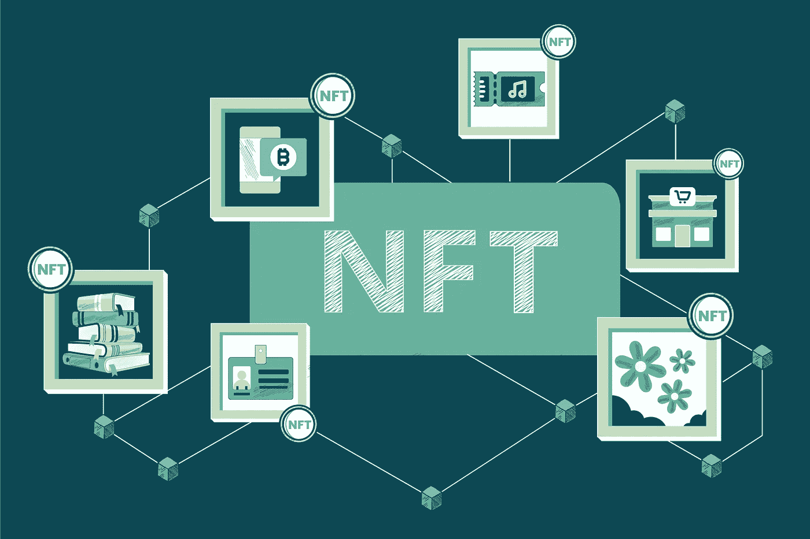

# NFT 在赌什么

> 原文：<https://medium.com/coinmonks/what-is-nft-staking-4ce4db58a87a?source=collection_archive---------32----------------------->

不可替代令牌(NFT)是独一无二的加密资产，它反映了对有形或无形对象的占有，因此充当价值存储。随着资产变得越来越稀缺，NFT 变得越来越有价值。它们是位于区块链的资产，任何人都可以声称能够产生巨大的利润，就像其他加密货币一样。

去年的流行语是 NFT。柯林斯字典将它选为“年度词汇”然而，NFT 变得越来越受欢迎，不仅因为它是第一家担保经证实的数字资产所有权的公司，还因为它有利可图。

在推出的第一个月内，美国 Onessus Blockchain Systems 的 WhenStaking 平台就有 200 万美元的原生硬币 VOID 锁定在 9000 个 staked NFTs 中。结果，NFT 现在拥有价值 300 万美元的市场。

但 NFT 到底在赌什么，它是如何提供如此可观的回报的？让我们来看看吧。

# NFT 立桩

支持 NFTs 的能力是 NFTs 和分散金融(DeFi)协议的优势之一。将数字内容存放或“锁定”到 DeFi 协议智能合同中以获取利润是一种赌注。

虽然一些平台允许您使用任何 NFT，但其他平台会要求您购买本机 NFT 以获得赌注令牌奖励(通常在平台的本机实用工具令牌中定价)。

作为贡献资源的交换，矿工可以获得当地的加密货币。许多受欢迎的区块链所使用的“利害关系证明”共识机制也是一种赌注形式。

区块链主要依靠世界范围的交易验证者网络来验证交易，然后才将其包括在区块链块中。验证者(或矿工)的选择取决于他们对区块链网络运行承诺的比特币数量。

通过 staking，您可以向项目捐赠 NFT，同时通过将资产提交给区块链获得奖励或费用，从而获得被动收入。NFT 赌注现在可以在“玩到赚”( P2E)游戏平台上使用，如“分散土地”、“沙盒”、“Axie Infinity”等。

> 交易新手？试试[加密交易机器人](/coinmonks/crypto-trading-bot-c2ffce8acb2a)或者[复制交易](/coinmonks/top-10-crypto-copy-trading-platforms-for-beginners-d0c37c7d698c)

游戏玩家可以用加密货币购买的游戏内 NFT 占据了 NFT 市场的一半以上。例如，自 2018 年成立以来，Axie Infinity 的销售额已超过 20 亿美元。

然而，重要的是要记住，不是所有的 NFT 都可以下注。因此，你应该在购买 NFT 前仔细检查细节。

# NFT 赌注如何工作

当你下注 NFT 时，下注平台会根据稀有度和年收益率(APY)计算其价值。APY 随着你的 NFT 变得越来越稀少而增加。NFT 创造持续收入流(如版税)的能力也决定了它的价值。

# 你能在哪里标上 NFTs？

有许多平台为 NFT 赌注。让我们看看一些平台及其优缺点。

# 奥尼苏斯

来自 Onessus 区块链游戏的许多不同的 NFT 可以使用 WhenStaking 平台的货币 VOID 下注。根据赌注时间，它支付高达 80%的 APY NFT 赌注。

## 优势

这些是使 NFT 赌注平台比其他平台更具优势的重要特征:

*   一个内置的租借系统，允许游戏玩家租借 NFT。游戏玩家将永远能够使用 NFTs 的工具。
*   下注 NFT 奖励 NFT 持有者 EXP，鼓励他们锁定更长的时间。当你从 1 级升到 50 级时，经验值会增加。

## 不足之处

用 NFTs 填补空隙的机制是一个很大的缺点，这让人们望而却步。但是，您可以在锁定时间后领取您的 NFT 和作废令牌。

# 仅 1

这个平台提供了一种独一无二的赌注机制，建立在与内容创作者的社交互动之上。它允许用户在他们选择的内容创建者的 NFT 上下注$LIKE。如果创作者在社交媒体上与投资者有很高的互动，那么给予的 APY 会更高。

## 优势

*   这是一个有报酬的系统，创作者和消费者的时间和注意力得到补偿。
*   它的用户没有受到胁迫，也不需要付钱给第三方来让他们的内容受欢迎以产生收入。

## 不足之处

利用这种 NFT 的明显缺点是，它鼓励更多的研究人员体验网络，这最终会降低代币的价值。但是，用户数量越大，可用性越好。

# 基拉

Kira 是目前最令人印象深刻的 NTF 系统之一。首先，用户必须将他们的资产从 DeFi 钱包转移到 KIRA 网络才能使用 Kira。随后，会发出一个请求。请求被接受后，KIRA 网络治理可以通过分配相关利益来处理和批准它。

## 优势

使用 KIRA 有几个好处。其中一些列举如下:

*   即使有其独特的特点，如缺乏打桩限制，它提供了多层安全额外的保护。
*   它奖励和激励 NFT 持有者，同时为客户提供稳定的收入。
*   它的治理可以决定影响其网络的某种速度。

## 不足之处

目前的挫折是缺乏公众意识。有几个人表现出了一些兴趣，但仅此而已。Kira 将不得不加强它的营销策略，以便在 NFT 地区出名。