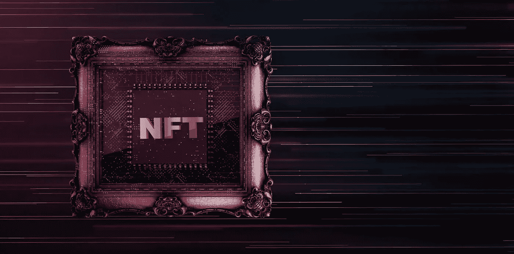

# 什么是 NFT 洗盘交易？

> 原文：<https://medium.com/coinmonks/what-is-nft-wash-trading-97e0207219d9?source=collection_archive---------57----------------------->

骗子和欺诈者是所有商业活动中的一个持续威胁。正当合法的企业主和企业家寻求提高生产力和增加收入的方法时，骗子也创新令人发指的行为来欺骗人们，误导不知情的受害者放弃他们的血汗钱。

洗盘交易是骗子用来操纵市场的一种交易技术。通常，这些骗局行为的最终目标是在骗子获取巨额利润的同时，让合法投资者将资金转移到骗局中。

在这篇文章中，我讨论了 NFT 清洗交易，以及为什么它对这个相对年轻的空间是可怕的。

# 什么是洗盘交易？

洗盘交易是一种操纵交易技术，在这种交易中，买卖双方是一样的。从实际意义上来说，这种行为可能是一个人或一群人在他们之间买卖某种资产。

对于要完成的[清洗交易](https://www.zdnet.com/finance/blockchain/more-than-8-million-made-from-nft-wash-trading-chainalysis/)，卖方将资产出售给买方，买方将资产回售给卖方。然后这个过程重复多次。通过这种方式，基础资产的交易量增加，从而使合法投资者相信有机会在该资产类别中获利。

通常，清洗交易发生在很短的时间内。如果未被发现，基础资产的价值就会膨胀，骗子会通过将其出售给合法投资者来套现。

这种见不得人的做法在不同的市场都会发生。这发生在股票市场、加密交易所，以及最近的 NFT 空间。

# 什么是 NFT 洗盘交易？

NFT 市场的清洗交易与其他市场的操作非常相似。 [NFT 清洗交易](https://cryptopotato.com/over-33-of-nft-volume-is-wash-trading-bitscrunch-ceo-interview/)发生在 NFT 的买方和卖方是同一个人的时候。也有可能是两个人合谋作案。

个人能够通过在他们拥有的多个钱包之间出售 NFT 来清洗交易 NFT。换句话说，他从一个钱包里卖，从另一个钱包里买。购买钱包然后在另一个交易中卖回给原来的钱包。这一行为被多次重复，以制造对 NFT 的虚假需求。

当一个不知情的投资者或收藏家看到这种 NFT 的需求量很大时，他们可能会受到诱惑而购买它。此时，卖家会大幅提高 NFT 的价格，卖给收藏者。

作为一名 NFT 投资者或收藏家，在投资 NFT 之前，重要的是要透过巨大的交易量来看问题。确保你查看了该系列的底价。如果一只 NFT 的价格明显高于底价，这可能是清洗交易的迹象。不要忘记看看 NFT 的特点和稀有性。如果它不罕见，那么它的高价可能是清洗交易的结果。

# 为什么 Wash 贸易不利于 NFTs

毫无疑问，NFT 最近吸引了创纪录的销售。尽管如此，这并不能否认这样一个事实，即这个市场相对年轻，不具备传统股票市场的影响力。因此，wash 交易不利于全球 NFT 生态系统的整体增长。

首先，NFT 清洗交易对投资者来说是一个不好的信号。对于已建立的 NFT 项目，清洗交易可能导致藏品底价暴跌。卷入清洗交易争议的小型 NFT 收藏肯定会发现很难扩大规模。随着时间的推移，投资者将失去兴趣，这可能会阻碍数字艺术的整体增长。预计 NFT 市场的整体增长可能有限。

其次，NFT 清洗交易可能会导致与各国政府之间出现更大的问题。由于骗子、小偷和欺诈者能够在政府和反洗钱机构的雷达之外匿名执行大型交易，加密领域已经与法规进行了长期斗争。这些骗子可能会膨胀无价值的 NFT，作为在区块链上存储被盗资金的一种方式。因此，持续的 wash 交易可能会强化政府对加密法规的立场，或者完全禁止与加密相关的交易。

因此，一个两难的问题出现了——我们是应该取消区块链中的匿名以防止欺诈，还是应该保持匿名并窝藏罪犯？显然，加密货币领域还有很长的路要走。

# 结果

NFT 洗盘交易是一种糟糕的做法，会误导投资者，最终让他们损失资金。清洗交易对 NFT 领域尤其不利，因为它有可能摧毁迄今取得的成果。如果不加以控制，wash 交易可能会让各国政府采取行动，削弱加密空间或逆转去中心化。

> 交易新手？试试[密码交易机器人](/coinmonks/crypto-trading-bot-c2ffce8acb2a)或者[复制交易](/coinmonks/top-10-crypto-copy-trading-platforms-for-beginners-d0c37c7d698c)