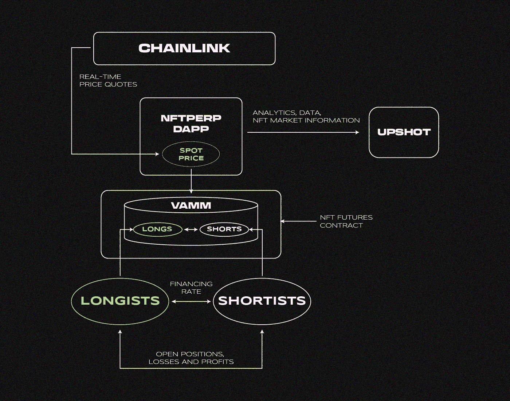

# 什么是 NFTperp，为什么要关注它？

> 原文：<https://medium.com/coinmonks/what-is-nftperp-and-why-should-you-care-52614f7d446f?source=collection_archive---------7----------------------->

NFTperp 是 L2 解决方案 Arbitrum 上的一个分散式应用程序。该产品允许用户在 NFT 收藏品上开立永久期货头寸。项目的风险和前景如何？让我们来了解一下！

NFTperp 于 2022 年 4 月 7 日启动。它利用了一个 vAMM 模型(由 Perpetual Protocol 首创)并进行修改。这是一个有远见的产品，具有分散的协议和对任何人开放的 MVP 版本。

# **NFTperp 的目标受众是什么？**

1.  NFT 代币的持有者，他们准备建立空头头寸来对冲风险
2.  NFT 贸易商
3.  希望从该系列中获利的 NFT 行业新来者

# **它是如何工作的？**

–NFTperp 协议通过 Chainlink oracle 收集关于现货市场上某一系列产品最低价格的实时信息

–数据进入 vAMM 协议

–vAMM 是做市商协议，包含资产的现货价格以及所有未结头寸

–交易商通过 NFTperp 接口开仓，一切都由 ETH(基本保证金)担保

–宣传资料将转到智能合约 vAMM 协议

–根据收款价格，头寸持有人获利或遭受损失

–为了平衡未平仓头寸，主导方支付融资利率

*   需要一个融资利率来平衡市场，以激励少数人开放交易
*   对占优势的一方有利，大多数交易以百分比的形式公开

# **vAMM 协议是如何工作的？**

–没有订单簿

–没有流动性池

一些交易者的利润是由其他交易者的损失形成的

–所有未结头寸的资金都存储在 vAMM 协议中

–vAMM 协议对用户的交易进行结算

–融资利率也通过 vAMM 协议支付

–结算周期—每 8 小时一次

# **清算呢？**

1.  第一阶段平仓:当保证金降至 **6.25%** 时，初始头寸的 **25%** 平仓
2.  当保证金进一步减少 **2.5%** 时，头寸被完全平仓
3.  **在头寸完全清算后，协议接收清算保证金的 **1.25%** 。资金存入保险基金**

**–一个有 x10 杠杆的头寸被打开，其盖子是 1 ETH**

**–头寸达到 10 个 ETH: 1 个 ETH 是安全的，9 个 ETH 是借入的**

**–头寸**部分**平仓，价格 **9.375 ETH****

**–头寸以 **9.125 ETH** 的价格**完全平仓****

# ****项目怎么赚？****

**–每个未平仓合约的佣金——0.3%。**

**-0.15%归保险基金**

**–0.075%进入项目池**

**–0.075%分配给未来的代币堆垛机**

**在以下情况下，会出现额外的动态佣金模型**

**–期货价格和 oracle 价格之间的差异为 2.5–5%:1%的费用用于多头，0.1%用于空头**

**–期货价格和 oracle 价格之间的差异> 5%: 5%的费用用于多头头寸，空头头寸不收费**

# **有哪些风险？**

**–vAMM 经济模型中的一个错误**

**来自 Huobi Ventures 的人员和其他 DeFi 项目的开发人员参与了协议的构建。建立了合理的系统经济模型，改进了协议的机制。但是总有系统错误和不可预见情况的风险。**

**–对智能合同的黑客攻击**

**目前还没有外部审计，也没有办法查看智能合同代码，但即使在审计之后，也总有人能够破解协议**

**–不可预见的市场环境**

**市场波动很大，有时难以预测，NFT 市场更容易受到这种风险的影响。不能保证有些项目不会突然垮掉。因此，可能会出现一连串的交易员平仓和协议故障。**

**–有一个保险池，积累了针对此类情况的金融保险的所有收费交易的一半**

# ****NFTperp 的令牌组学是什么？****

**这个项目目前没有任何象征意义。计划于 2022 年 3-4 季度上市。已经有赌注和佣金费用:**

**–赌注是一个危险信号，正如 DeFi 部门所显示的那样，我们迟早将不得不鼓励持有者持有代币，而不是出售代币**

**–代币费是一种控制代币数量的工具，因为代币可能会被烧毁**

*****度量:*****

**唯一地址的数量— 150**

**列表中集合的数量— 1 (BAYC)**

# ****项目前景如何？****

**这将取决于:**

**–该协议将衍生出哪些集合**

**–如何选择这些系列**

**当仅列出 BAYC、MAYC 和 CryptoPunks 时，该产品将主要用于对冲其现货头寸。**

**当列出前 10/20 个项目时，包括志那都红豆、月鸟等，该产品可以成为交易者赚钱的成熟交易，因为目前没有类似的产品。**

**该计划将实施止损、限价单、借贷**

*****项目缩放的 2 个问题:*****

**–产品扩展到 Solana 生态系统的速度有多快？**

**–Arbitrum 的工作稳定性如何？**

# ****结论是什么？****

1.  **该项目处于最早期阶段，没有团队代表。**
2.  **该产品将作为一种对冲工具**
3.  **有扩张的前景。目前，有可能参加测试网或农场令牌。现在，它是在一个想法成为主流之前对它的投资**
4.  **种子和私人投资应该会有回报。这个项目可以吸引观众**

> **我们希望在下面的评论中听到你对 NFTperp 项目的想法。如果你喜欢这篇文章，订阅我们的[媒体提要](https://medium.com/sunflowercorporation)以获得更多类似的内容。敬请期待！**

> **交易新手？试试[密码交易机器人](/coinmonks/crypto-trading-bot-c2ffce8acb2a)或者[复制交易](/coinmonks/top-10-crypto-copy-trading-platforms-for-beginners-d0c37c7d698c)**