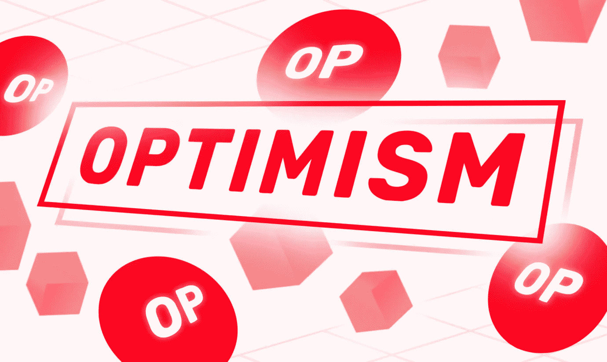

# 什么是乐观主义(OP)？细节和投资

> 原文：<https://medium.com/coinmonks/what-is-optimism-op-details-and-investment-e048b171bb25?source=collection_archive---------65----------------------->

什么是乐观主义？
[**【乐观(OP)**](https://bit.ly/BinanceRegistation) 是以太坊的第二层伸缩解决方案，或者更确切地说是乐观汇总，可以支持所有以太坊 Dapps。乐观主义允许用户在以太坊网络上发送交易，并以低得多的煤气费更快地完成交易。

乐观主义在 4 月 27 日宣布，它将创建一个分散的自治组织，简称 DAO，称为乐观主义集体。随着这一消息，乐观宣布了乐观(OP)令牌和赠品。

乐观集体将由以下机构管理:vàToken House 公民之家。

**(乐观 OP)** 有什么特别的

可扩展性是以太坊网络目前最大的问题。“扁平化”等扩展解决方案旨在改善最终用户的整体体验。

由于高需求，以太坊对于普通用户来说已经变得过于昂贵。当网络拥塞时，用户不得不打一场加油战，试图将他们的交易转移到下一个街区。

第 2 层扩展解决方案旨在通过“离线”处理交易，而不是在以太网上发布很少的“证据”来证明数据是正确的，从而解决这个问题。通过这样做，乐观主义为以太坊网络节省了大量的工作，也使它对最终用户来说更加有效和容易访问。

**应用集**
[**乐观**](https://bit.ly/BinanceRegistation) 将于 2021 年下半年登场。optimission 目前提供了一组应用程序，可用于目前在 web 上提供的许多 dapps，包括 Uniswap、Synthetix 等领先的协议。

以太坊 dapps 向第二层协议如乐观协议的大规模迁移预计将在今年加速。随着越来越多的用户从第 1 层转移到利用乐观网络的效率和可用性，这一过程只会加速。

**汽油费**
在实施了一系列削减汽油费的网络升级后，乐观公司现在提供所有现有乐观公司的最低交易费，包括 Arbitrum 和 Boba 网络。

在撰写本文时，乐观公司目前向用户提供 0.7 美元的令牌交换费，其次是 0.77 美元的 Boba Network 和 1.02 美元的 Arbitrum。

加入乐观的人越多，乐观从协议费中获得的收入就越多。从本质上讲，这使得乐观公司在支付 1 级天然气费用时有了更高的预算，从而进一步降低了最终用户的费用。

**EVM 兼容**
现在网络完全兼容 EVM。虽然它不影响最终用户体验，但 EVM 奇偶校验对开发人员来说是一个巨大的胜利，因为现在在乐观上部署 dapp 要容易得多，因为你不必担心它，担心编译器。

**OP token omics**关键指标
股票代码:OP.
区块链:以太坊。
合同:更新…
令牌标准:ERC-20。
令牌类型:实用，控制。
流通中:更新…
初始报价:4，294，967，296 OP.
总计:更新…

**代币分配**
生态系统基金:25%。
自定义空投:19%。核心贡献者:19%。
蔗糖:17%。追溯性公共产品融资(RetroPGF): 20%。

**生态系统基金**
生态系统基金将用于直接资助有助于扩大集体生态系统(OPCO)的社区和公司。生态系统基金的专项拨款将进一步细分为以下类别:

管理基金:5.4%
合作伙伴基金:5.4%
种子基金:5.4%
未分配:8.8%
生态系统基金被设想为一种启动机制，当基金中的 OP 耗尽时将完全关闭。

**自定义空投**
乐观基金会将把 OP 的一部分分批发放给乐观派和以太坊社团成员。

空投#1 分发 5%的 op 代币。该发行版面向他们社区中的活跃成员。地址和数量的选择是为了奖励乐观主义者，同时也是为了吸引主流以太坊的乐观主义者。

乐观主义将 OP 分发到超过 25 万个地址。

**主要贡献者**
分发给那些帮助把乐观主义集体从概念变为现实的人，并将继续为协议的发展买单。主要参与者的分布受封锁期的限制。

Sugar Xaddy
投资者。糖业公司的拨款将被冻结。

**追溯公共产品融资(RetroPGF)**
由公民之家分配。RetroPGF 计划每季度举行一次，以确保所有 OPCOs 都获得适当的奖励。

**Token 用例**
乐观集体基于创建强大而有价值的开发生态系统的理念:

**OP 令牌持有者的累积价值**
价值由贡献者创造，并直接依赖于资金。“公益物的追溯融资”。
价值由用户和社区成员通过持续的 OP 赠品，以及通过 OP 生态系统的资金支持的项目激励来创造。

**投资者**
最近，03 年 3 月 17 日，乐观公司宣布在 B 轮融资中以 1500 亿美元的估值筹集了 20.22 亿美元。据 TechCrunch 报道，这一轮与 Paradigm 和 Andreessen Horowitz (a16z)联合牵头。

2002 年 2 月，乐观宣布了一轮 20.21 亿美元的 A 轮融资，由 Andreessen Horowitz 牵头。

**乐观主义(OP)在哪个交易所交易？**

您可以在这里 交易和投资乐观(OP)

> **交易新手？尝试[加密交易机器人](/coinmonks/crypto-trading-bot-c2ffce8acb2a)或[复制交易](/coinmonks/top-10-crypto-copy-trading-platforms-for-beginners-d0c37c7d698c)**