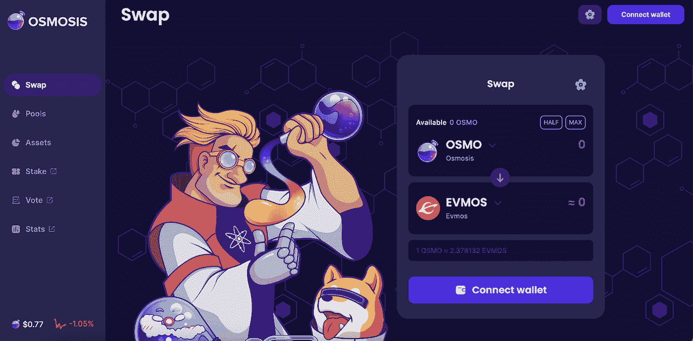
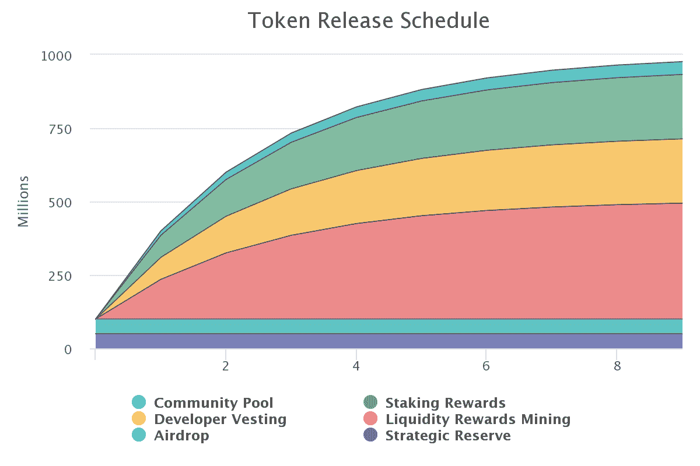
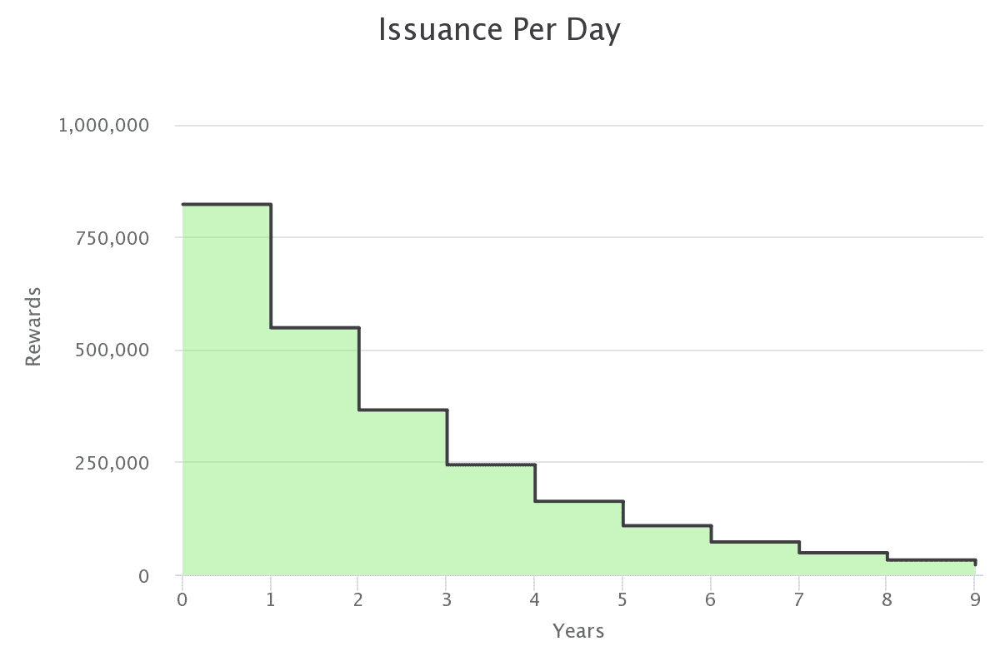

# 什么是渗透(OSMO)？所有关于渗透

> 原文：<https://medium.com/coinmonks/what-is-osmosis-osmo-all-about-osmosis-2a663ccb7578?source=collection_archive---------9----------------------->

对于任何寻求在 DeFi 市场发展的生态系统来说，AMM DEX 是最重要的组成部分之一。如果以太坊有 Uniswap，币安智能链有 Pancakeswap，那么 Cosmos 就以渗透为代表。

渗透到底是什么？在这里，您可以了解更多关于渗透的亮点和 OSMO 令牌的令牌组学。

> 从顶级交易者那里复制交易机器人。免费试用。

# 什么是渗透？

渗透是使用 Cosmos SDK 开发的尖端 AMM 协议，它将使程序员能够创建和启动他们自己独特的 AMMs。

通过利用 Cosmos SDK，渗透继承了 Cosmos Hub 的所有固有特性，包括 BFT 利益一致证明和区块链间通信协议等。

渗透旨在满足各种规范，这些规范将促进创新、安全、主权和用户友好性，如下所述:

1/持续改进:渗透是 AMM 的实验室和试验场，人们在这里试验各种方法，使资产管理系统为金融资产发挥最大作用。能够为 DeFi 市场中的问题和低效率找到解决方案的“DeFi 科学家”是流动性提供者。

2/用户治理:因为渗透是流动性提供者的协议，所以应该由他们来治理。渗透需要细粒度的链上协议控制。这些操作包括每周流动性挖掘激励分配，根据市场条件改变全球 AMM 参数，以及在社区池中投资以促进生态系统增长。

3/安全和主权的协调:由于渗透是一个主权区块链，它可以根据利益相关者的决定迅速改变。但网络安全的保证会限制可以安全持有的资产数量。因此，渗透小组将慢慢开始使用新技术，如链间安全，以提高其监管水平。

# 渗透的显著特征

## 由 IBC 提供动力的跨链 AMM

在渗透之前，宇宙网络上没有运行良好的跨链 AMM。这意味着宇宙生态系统中的资金流少了一块。

从建立的第一天起，渗透就被做成了一个跨链的 AMM。通过使 IBC 成为主要工具，渗透能够访问宇宙区块链号上所有的本地资产，这些资产价值十亿美元。该项目还希望与不支持 IBC 的链合作，如基于以太坊的 ERC20 链、类似比特币的链、BNB 链和许多其他 L1 和 L2。

## 可定制的曲线、费用和其他参数

AMMs 具有固定曲线算法、费用比率和 TWAP 计算参数。如果开发商想要一个新的掉期模型，他们必须构建一个新的 AMM 基础设施。

在潜移默化中，AMM 不是硬编码的。可以为每个流动性池定制关键因素(互换费用或令牌权重)，曲线方法和 TWAP 计算也是如此。

任何时候都可以做出新的曲线。通过使用时间依赖性、波动性指数和链外预言，这种新颖的曲线可能比以前的 AMM 模型更强大，以前的模型只接收令牌余额数字。

无需为每次 AMM 模型升级建立新的 AMM 协议，曲线开发人员可以轻松地在渗透上部署新的曲线，减少部署时间和组件集成程序。

## LP 治理

AMM 协议为所有流动性池设定了全球参数。它简化了 AMM 的设计，但降低了液体供应商对泳池的决策权。

尽管最近的关注，AMM 是一个新的和有缺陷的 Defi 结构。各种项目通过迭代、修改和增强 AMM 来竞争。为了保持竞争力，渗透已经升级了池曲线、定价模型等。

为了反映 LP 投资组合偏好，渗透池可以调整其权重，并增加或减少资产中点(例如，向 stableswap 池添加新的 stablecoins)。

在渗透 AMM 的设计中，治理是一个优先事项，以确保流动性不会随着每次升级而流失。安全机制(rage-quit 功能)保护 LP 免受恶意治理攻击。

## 流动性提供者激励

AMM 流动性提供者扮演着最重要的角色。保持流动性提供者将资产锁定在新资产池的动机需要合适的激励。除了 OSMO 令牌奖励，渗透还允许第三方为流动性池提供激励。

这个过程可以使用渗透的“激励模块”来进行由于激励提供者希望奖励长期用户，同时排除短期奖金寻求者，因此该模块有利于锁定其 LP 令牌更长时间的流动性提供者。通过使用该模块，激励发起人可以降低流动性池的波动性，并为交易者创造更一致的体验。

## 超流体打桩

您可以在超流体模块中为治理批准的池设定 LP 股份。

这对于股权证明是一个巨大的改进，因为它使 DeFi 资产能够得到本地资产的支持，从而增强了网络安全性。标记查询的功能将保持不变。与此同时，赌注奖励的搜索将不再包括多余资产的支出。超流体奖励的分配与 LP 奖励的分配相同，发生在 epoch time，直接发送到用户的账户。需要超流体查询。

# 持有 OSMO Token 的好处

OSMO 令牌将用于以下情况:

*   **激励:**在渗透池中提供流动性以获得激励。
*   **下注**:用户可以下注 OSMO 代币来获得网络奖励或者空投奖励
*   **治理**:持有 OSMO 令牌的用户可以通过投票提案参与项目的治理决策。

# OSMO 令牌详细信息

## 关键指标 OSMO

*   代称:渗透。
*   股票代码:OSMO。
*   区块链:宇宙。
*   令牌类型:公用事业和治理。
*   总供应量:10 亿 OSMO。
*   循环供应量:499，713，549 OSMO。
*   赌注年利率:~ 23%
*   砌块高度:7401295

## OSMO 令牌分配

1，000，000，000 渗透水(OSMO)的总供应量将分配如下:

*   流动性回报挖掘:40.5%—4.05 亿 OSMO
*   开发商授权:22.5% — 225，000，000 OSMO
*   赌注奖励:22.5%—2.25 亿 OSMO
*   战略储备:5%—5000 万 OSMO
*   空投:5%—5000 万渗透压
*   社区池:4.5%—4500 万 OSMO

*   渗透将在 genesis 获得 1 亿美元的初始供应，在 Fairdrop 接受者和战略储备之间平均分配。
*   与大多数 Cosmos SDK 链不同，Cosmos SDK 链中的令牌是基于每个块进行分发的，Osmosis 有每天的纪元，并且只在每个纪元结束时才发布新的令牌。

## OSMO 代币销售

渗透不会打开一个象征性的销售。所有渗透代币将通过空投、开发者解锁、跑马圈地、渗透平台上的流动性挖掘等方式进行分发。

## OSMO 令牌发布时间表

在初始令牌模型下，新令牌将在“第三次”时间表下发布。与比特币减半类似，代币发行每年减少四分之一，在渗透中，代币发行每年将减少三分之一(365 个每日时代)。

为了进一步说明，第三个调度工作如下:

*   第一年，总共会有 3 亿枚代币发行。
*   365 天后，这一数字将被⅓削减，第二年将总共发放 2 亿个令牌。
*   在第 3 年，将总共发行 1.33 亿个令牌。
*   按照同样的模式，OSMO 将能够达到 10 亿的渐进最大供应量，这是第三次下降过程的结果。

# 如何赢得和拥有 OSMO 令牌

目前可以通过以下方式获得 OSMO 令牌:

*   直接在渗透或币安购买 OSMO
*   股份 OSMO 赚取 OSMO 代币
*   在渗透池中提供流动性，以赚取 OSMO 或奖励。

目前，用户可以在 CEX 的交易所购买 OSMO，如币安、 [MEXC](https://www.mexc.com/en-US/register?inviteCode=mexc-beehive) 、 [BingX](https://bingx.com/invite/JY0XI9) 、Hotbit 和 Bitget。

在币安[这里](/@beehive.validator/how-to-transfer-and-stake-evmos-via-osmo-atom-on-binance-2fbb84d1eb56)查看更多购买和订购 OSMO 的说明

# 团队、投资者和合作伙伴

## 组

乔希·李(联合创始人):

*   教育:美国印第安纳州安德森大学
*   Lee，韩国人，随后于 2019 年至 2021 年在多家区块链公司工作，包括担任项目经理的 Lunamint 和担任生态系统开发分析师的 Tendermint (Ignite)。

[**推特**](https://twitter.com/dogemos)/[/**领英**](https://kr.linkedin.com/in/josh-lee-84582961?original_referer=https%3A%2F%2Fwww.google.com%2F)

桑尼·阿格沃尔(联合创始人):

*   教育背景:美国加州大学伯克利分校工程和计算机科学学位(2015-2017)
*   Aggarwal 于 2017 年在 Tendermint 担任研究科学家。同年，他还共同主持了每周区块链播客，震中。在 2021 年与其他人一起创办渗透实验室之前，他于 2018 年创办了 Sikka。Sikka 是一家区块链基础设施公司，专注于为分散式互联网加入协议和网络。Sikka 目前在 Cosmos Hub、Kava 和 Akash 网络上运行一个 Top 5 验证程序。

[**推特**](https://twitter.com/sunnya97)/[/Linkedin](https://kr.linkedin.com/in/sunnya97?trk=org-employees)

## 投资者

根据 Crunchbase 的统计数据，渗透基金会在 2021 年 10 月 27 日通过首次发行硬币共筹集了 2100 万美元。这笔投资由 Paradigm(与私人投资者 Charlie Noyes 合作)牵头，该基金由比特币基地联合创始人 Fred Ehrsam 管理。罗伯特·莱什纳的 scout fund、Robot Ventures、Nascent、Terraform Labs 的首席执行官 Do Kwon、Figment 和 Ethereal Ventures 都是投资者。

## 伙伴

渗透的合作伙伴主要是来自宇宙生态系统的链条。比如 Cosmos Hub，Axelar，Evmos，Juno，Konstellation，Sifchain，Terra 等。其他可以提及的合作伙伴有 Sikka、Chainapsis 等。

# 路线图和更新

## 渗透 v13 氟升级

此次升级增加了以下功能:

稳定的交换池

*   Stableswap 池为两种紧密相关的资产提供了低滑点。
*   他们有一个预期的价格比，AMM 在这个价格附近提供了低滑点。

IBC 限速

*   治理可以定义对于特定的 denom、渠道和时间段，有多少价值可以流入和流出链。
*   提高渗透资产的安全级别，以防渗透、交易对手链或 IBC 内部出现任何安全问题。

跨链 Cosmwasm 合同

*   IBC 已升级到 3.4.0 版，允许元数据作为消息的一部分传递。
*   支持跨链交换等用例。

## 2022 年 12 月 12 日的常规激励调整

## 将 WMATIC 添加到主要类别资产的列表中，以及 WMATIC 引导流动性激励措施

自举激励表明，渗透利益相关者希望快速建立功能性 WMATIC 流动性，以通过 Axelar 桥促进 Polygon 和渗透之间的交易和流动性流动。

项目社区:[网站](https://osmosis.zone/) | [推特](https://twitter.com/osmosiszone) | [媒体](https://medium.com/osmosis) | [不和](https://discord.com/invite/osmosis)

🚀在[渗透](https://wallet.keplr.app/chains/osmosis?modal=validator&chain=osmosis-1&validator_address=osmovaloper1pz8wre7clpym5cz9ufpt6nvcayvspqqh7yw4y7&referral=true) 🧪 | [埃夫莫斯](https://wallet.keplr.app/chains/evmos?modal=validator&chain=evmos_9001-2&validator_address=evmosvaloper1nfx47fqnqpcarqwt7qn4fk0llc57vvh3wgg35c&referral=true)用蜂箱支撑和打桩🚀| [医疗集团](https://www.mintscan.io/medibloc/validators/panaceavaloper1tppl0m9tqpy04vdmhxk7gya90zfftj94vkyn2t) | [里松](https://www.mintscan.io/rizon/validators/rizonvaloper1gyrrvup6x3g732uhxq9x0qd4lyjjcs62j0kdhf) | [马罗](https://t.me/beehive_maro) | [宝珠](https://staking.orbs.network/) ⭐️

**蜂巢研究**

[Linktree](https://linktr.ee/validatorbeehive)l[Global](https://t.me/Beehive_Global)l[韩国](https://t.me/ttcteamjna) l [越南](https://t.me/Beehive_VN) l [Medium](/@beehive.validator)

> 加入 Coinmonks [电报频道](https://t.me/coincodecap)和 [Youtube 频道](https://www.youtube.com/c/coinmonks/videos)了解加密交易和投资

# 另外，阅读

*   [Bookmap 评论](https://coincodecap.com/bookmap-review-2021-best-trading-software) | [美国 5 大最佳加密交易所](https://coincodecap.com/crypto-exchange-usa)
*   [密码交易机器人](/coinmonks/crypto-trading-bot-c2ffce8acb2a) | [硬币门评论](https://coincodecap.com/coingate-review)
*   最佳加密[硬件钱包](/coinmonks/hardware-wallets-dfa1211730c6) | [Bitbns 评论](/coinmonks/bitbns-review-38256a07e161)
*   [新加坡十大最佳密码交易所](https://coincodecap.com/crypto-exchange-in-singapore) | [收购 AXS](https://coincodecap.com/buy-axs-token)
*   [红狗赌场评论](https://coincodecap.com/red-dog-casino-review) | [Swyftx 评论](https://coincodecap.com/swyftx-review)