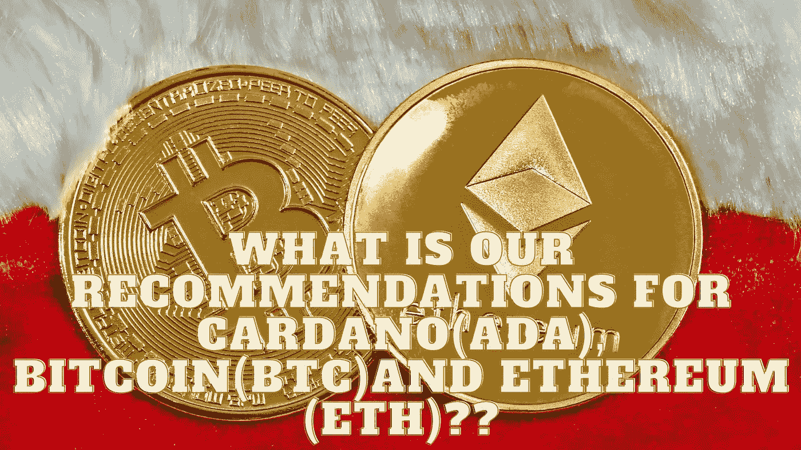

# 卡达诺(ADA)，比特币(BTC)，以太坊(ETH)有什么推荐？？

> 原文：<https://medium.com/coinmonks/what-is-our-recommendations-for-cardano-ada-bitcoin-btc-and-ethereum-eth-1a5a003163d8?source=collection_archive---------26----------------------->

Source photo Unsplash.com

# 卡尔达诺

有一种叫做 Cardano 的加密货币没有得到应有的赞誉。它是数学家和计算机科学家经过广泛研究后发展起来的一种加密技术。

第一版区块链联邦理工学院的创始人查尔斯·霍金森就是其中之一