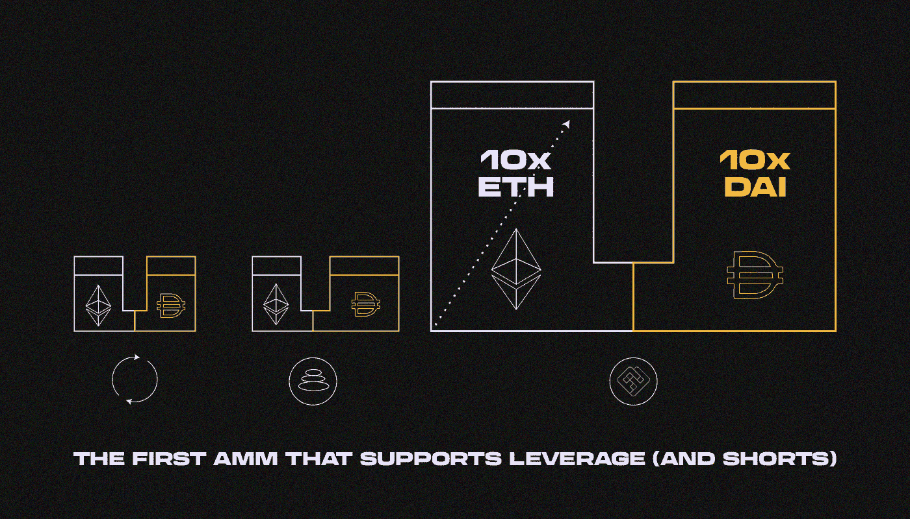

# 什么是永久协议？

> 原文：<https://medium.com/coinmonks/what-is-perpetual-protocol-f73780dbb325?source=collection_archive---------17----------------------->

***Perpetual Protocol 是一个链上永续期货指数，具有很强的流动性和构建者现成的可组合性。它的理念和令牌学是什么？让我们来了解一下！***

永久协议是一个开源软件项目。它的使命是为所有人创造强大的金融工具。永久协议的核心产品是在区块链上运行的永久期货 DEX(去中心化交易所)(xDai 上的 v1 和乐观上的 v2)。

Perpetual Protocol 成立于 2019 年，由一小群初创公司创始人和软件工程师组成。该项目早期被称为“罢工”，后来转向永久期货，并在 2020 年夏天更名为永久协议。核心团队成立于台湾，现在成员遍布世界各地，一个蓬勃发展的社区组成了永久道——指导项目长期方向的组织。

第一个 mainnet 版本于 2020 年 12 月在 xDai 网络上推出。该协议的第二个版本于 2021 年 11 月在乐观号上推出。

**永久协议:**

*   乐观网络中的永久期货
*   在智能合同系统上工作，被认为是一个分散的应用程序
*   没有 KYC，但该应用程序在某些地区不可用
*   最大杠杆——X10
*   最大可能 TVL——2000 万美元(无杠杆)

# **基本力学有哪些？**

自动做市商(AMMs)在 DeFi 空间中用于描述利用数学函数来确定资产价格并随后促进两种或多种资产交换的协议或应用。AMM 最流行的例子是 [Uniswap](/sunflowercorporation/what-is-uniswap-2ab17b51b63b) ，这是一个使用常数函数 x*y=k 进行令牌交换的分散式交易所(DEX)。

永久协议的 vAMM 使用与 Uniswap 相同的 x*y=k 常数乘积公式。正如 vAMM 的“虚拟”部分所暗示的，在 vAMM 本身内部没有存储真实的资产池(k)。相反，实物资产存储在智能契约库中，该契约库管理支持 vAMM 的所有抵押品。与传统的 AMMs 不同，永久协议使用 vAMM 作为价格发现，但不用于现货交易。

vAMM-protocol 是一个负责执行交易的做市协议。

该协议有两个参与者:

*   接受者(交易者)——交易。
*   庄家(流动性提供者)——为项目提供流动性，以便交易者可以开仓交易

*示例:*

*约翰想用 x10 杠杆建立一个 100 美元的永久协议头寸。山姆将 1000 美元的流动资金投入永久协议。约翰可以从萨姆存入的流动资金池中取出 900 美元，进行 1000 美元的交易。*

流动性池基于 Uniswap v3 工作，但永久协议流动性池不在 uni WAP 界面中显示。永久协议做市类似于普通流动性池。有 10 倍的杠杆来提供流动性和建立交易头寸。

# **融资利率**

对于透明的市场环境，期货价格必须接近现货价格。因此，融资利率应介于多头和空头头寸之间。

融资利率是使期货价格接近资产现货价格所必需的

*融资利率根据这些原则运作:*

1.  对于多头头寸:

正利率(多头比空头多):“多头”持有者向“空头”持有者支付资金利率

负利率(空头比多头多):“多头”持有者从“空头”持有者那里获得佣金

2.对于空头头寸:

正比率(多头比空头多):“空头”持有者从“多头”持有者那里得到佣金

负利率(空头比多头多):“空头”持有者向“多头”持有者支付佣金

支付融资利率会降低保证金，并可能导致头寸平仓

# **交易者的交易结构**

*   交易的最大杠杆——X10
*   保证金——用户存入的资金
*   购买力——交易的最大资金额(利润* 10)
*   保证金比率——交易中自有资金的百分比(头寸价值/质押)

当保证金比率低于 6.25%时，就会发生清算

清算后，剩余保证金的一部分归清算人，另一部分归保险基金

*举例:*

*交易者约翰想以 10 的杠杆开一个 100 美元的头寸。保证金是 100 美元。购买力是 1000 美元。保证金比例为 10%。当亏损 37.5 美元(初始保证金 10%的 3.75%)时，进行清算。该头寸将被进一步平仓*

# **清算**

1.  如果只有一个开放的位置，它将被完全清算。剩余的保证金将由清算人和保险基金分享。
2.  如果有几个开仓，清算人会优先考虑最大的一个，以尽快恢复偿付能力，但他会清算它，直到恢复平衡。

清算由 bot 执行，bot 可以在技术文档永久协议上创建。

清算者:机器人的所有者会因为成功的清算而获得奖励。奖励从待平仓头寸的剩余保证金中提取

*示例:*

*交易员约翰的头寸被平仓。他遭受了 37.5 美元的损失。62.5 美元在清算人和保险基金之间分配*

流动性提供者也使用完全相同的方案。

# **流动性提供者**

流动性提供者是普通的交易者，但他们的资产被用于交易安全，他们的报酬来自:

*   交易商佣金收费——0.09%
*   产出农业——来自代币流动性(瑞士联邦理工学院、BTC 等。)

流动性提供者可以像普通交易者一样被清算

该项目从交易者头寸的佣金中获利——0.1%

# **风险管理**

*   所有交易者的头寸都由流动性提供者的储备资金担保
*   没有追缴保证金。如果头寸降至最低保证金抵押品，清算将开始
*   没有银行挤兑风险，因为所有头寸都提前抵押

# **指标**

最大净 TVL——2000 万美元

象征性价格——0.55 美元

ATH 代币价格——24 美元

ATL——0.51 美元

流通市值——3876 万美元

完全稀释的市值——8259 万美元

锁定的总价值——2252 万美元

市值——3872 万美元

# **结论**

Perpetual protocol 在其 vAMM 创新中展示了为杠杆交易者提供链上流动性的技术能力，而无需流动性提供商和迁移到新的第 2 层可扩展性解决方案的灵活架构。随着新市场的增加和限价单等新功能的引入，该协议捕获的每日交易量和后续交易费用将引导交易者下注。在 DeFi 生态系统中的著名基金和顾问的支持下，该协议有可能成为分散式衍生协议新兴市场的领导者。

尽管如此，还是有几个缺点:

—该项目建立在不透明的机制上

—没有关于项目的信息:

*   清算供应商的杠杆
*   保险基金
*   清算剩余利润的分配
*   融资利率公式

—不清楚如果发生银行挤兑和流动性危机，该项目将如何应对

—在一些国家无法访问该应用，尽管该网站将自己定位为真正的 DEX 应用

> 如果您对永久协议主题有任何补充，欢迎发表评论！
> 在跟踪更新方面，订阅我们的 [Medium Feed](https://medium.com/sunflowercorporation) 。
> 敬请期待！

> 交易新手？尝试[加密交易机器人](/coinmonks/crypto-trading-bot-c2ffce8acb2a)或[复制交易](/coinmonks/top-10-crypto-copy-trading-platforms-for-beginners-d0c37c7d698c)