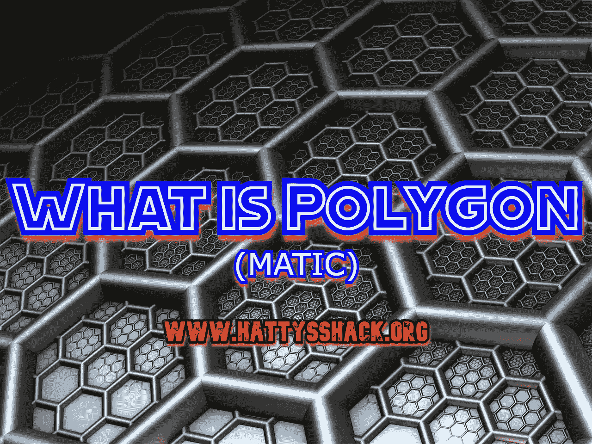

# 什么是多边形(MATIC)？

> 原文：<https://medium.com/coinmonks/what-is-polygon-matic-87b00610b2e1?source=collection_archive---------15----------------------->

[多边形](https://polygon.technology/)成立于 2017 年，原名“MATIC Network”。它是由四名工程师 Mihailo Bjelic、Sandeep Nailwal、Anurag Arjun 和 Jaynti Kanani 创建的。

超过 37，000 个 dApps 使用 Polygon 来扩展其性能。Polygon 可以实现高达 7,000 TPS(每秒事务数)的事务速度。这使得 Polygon 相比以太坊(20 TPS)和比特币(7 TPS)速度极快。

Polygon 在撰写本文时的价格为 1.03 美元，其 ATH(历史最高)为 2.7275 美元。

[多边形](https://polygon.technology/)已经大规模成长，据说是以太坊的更好版本。这也是连接加密资产的一种方式。桥接是在第 1 层和第 2 层网络之间以及不同的区块链网络之间传输资产和信息。

以太坊的交易速度非常慢，而且与其他所有的加密项目相比，汽油费很高。以太坊正在致力于解决这些问题，在接下来的几年里，以太坊应该会变得更加普及，对于像我这样从事微交易的人来说也更容易使用。我听说，在分片更新之后，我们将看到以太坊的一些重大变化，但在此之前，人们正在转向更便宜、更快的区块链项目。

多边形增长的一个例子是[不可阻挡的域名](https://unstoppabledomains.com/?ref=248487d3f2b84e4)。起初，不可阻挡的域名只能在以太坊区块链上铸造，但随着时间的推移，以太坊的费用使得人们很难铸造他们的域名和改变他们域名上的东西。所以现在你可以把你的域名和多边形连接起来，这样你就可以免费创造和改变设置了。

这只是平台转向更快、更方便的区块链项目的一个例子。

**多边形的利弊**

[多边形](https://polygon.technology/)有缩放框架。这意味着 Polygon 有一个框架，允许开发人员创建自己的缩放解决方案。这使得它非常容易建立。

多边形是分散的。分散化意味着不是一个主要群体控制某件事情，而是一群更小的群体或个人控制

Polygon 很快被各大交易所采用，并得到了币安和以太坊创始人 Vitalik Buterin 等知名人士的认可。

**多边形的缺点**

多边形并不是唯一一个快速且具有缩放解决方案的加密项目。扩展解决方案是一种通过提高效率和产量来扩展系统的方法，同时最大限度地减少对当前运营的影响。

多边形是以太坊的第二层，但是随着以太坊的发展和升级，有可能不再需要多边形。一旦以太坊通过即将到来的升级，如上海和分片，它将能够超过 100，000 TPS(每秒交易量)。这将意味着交易将变得非常快，天然气费用将下降。这将使以太坊被更广泛地采用，并消除其竞争。

**结论**

[Polygon](https://polygon.technology/) 是一个令人惊叹的项目，看起来前景光明。有几个加密项目可以做 Polygon 所能做的事情，但是没有被广泛采用。

即使以太坊升级了，Polygon 仍然存在，但是我认为很多已经转用 Polygon 的以太坊用户在看到以太坊真正的能力后会转回来。当然，这只是我的想法。你对多边形和以太坊有什么想法？Polygon 拥有庞大的用户群和强大的社区，所以谁知道未来会怎样。

查看我的网站，了解更多赚取、学习和投资 Crypto 的方法。

[哈蒂的小屋](https://www.hattysshack.org/)

[read.cash 上的原创文章](https://read.cash/@HattyHats/what-is-polygon-matic-bf09ee25)

> 交易新手？尝试[加密交易机器人](/coinmonks/crypto-trading-bot-c2ffce8acb2a)或[复制交易](/coinmonks/top-10-crypto-copy-trading-platforms-for-beginners-d0c37c7d698c)