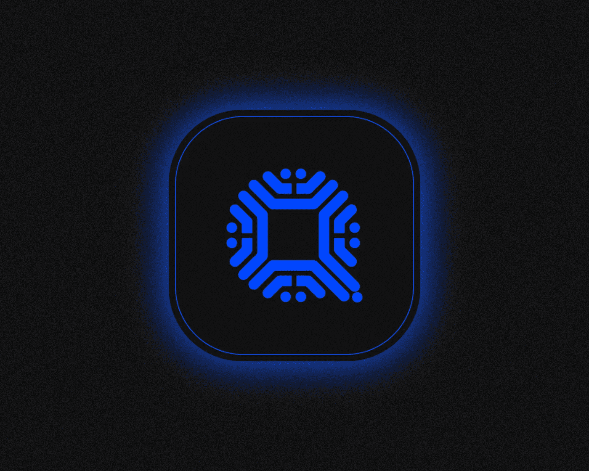
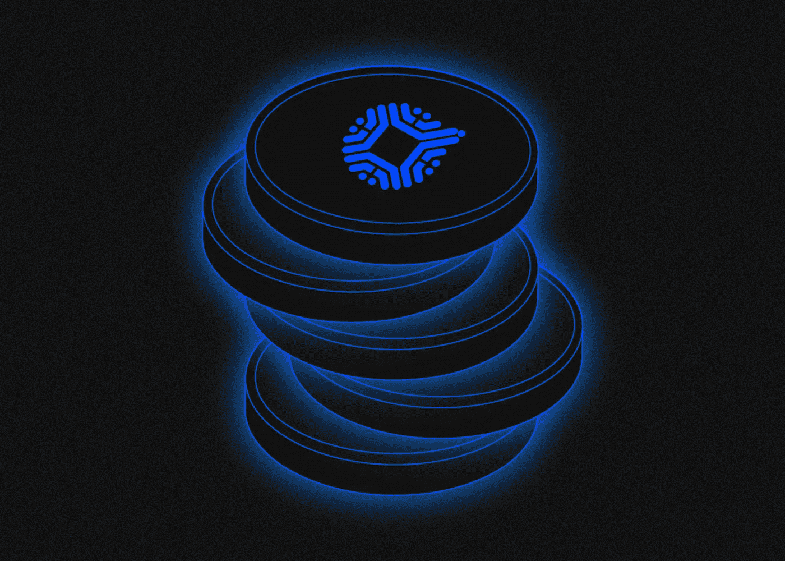

# 什么是 Qtum？

> 原文：<https://medium.com/coinmonks/what-is-qtum-e18459139a2e?source=collection_archive---------34----------------------->

[***Qtum***](https://www.qtum.org/ru)***(发音为“quantum”)是一个开源的智能合约平台，运行在共同化的利害关系证明共识算法上。它是如何工作的？它有什么特点？我们来看看吧！***

Qtum 区块链将比特币的未用完交易输出(UTXO)模型与以太坊虚拟机(EVM)相结合。

Qtum 是一个本地 QTUM 区块链令牌。验证者每开采一个区块可获得 0.5 QTUM 的奖励。

每块的奖励每四年递减一次。到 **2045** 时，将降至零，代币的最大供应量将达到 107，822，406 QTUM。

Qtum token 目前得到超过 15 个钱包和 30 个加密货币交易所的支持。[Qtum 生态系统](https://qtumeco.io/)包括三个堆叠服务和七个支付服务，以及三个用于启动节点的平台。月地超宇宙平台和 QiSwap 分散交易所正在开发中。

# Qtum 是谁创建的，何时创建的？

该平台由 **Patrick Dai** 于 **2016** 年创立。

他的职业生涯始于阿里巴巴的产品经理，后来在区块链项目 Factom、Vechain、Bitse Group 和 Meilink 工作。戴目前是新加坡非营利组织 Qtum Chain Foundation 的主席。

Qtum 的技术总监是**尼尔·马希**。首席开发者是大卫·杰森 T20。该项目总部位于美国迈阿密。

**2017 年**，Qtum 团队在以太坊区块链上发行了 1 亿枚代币。同年 3 月，发生了一次 ICO，参与者用比特币和以太坊购买了 5100 万个 QTUM 代币，价值 1560 万美元。

另外 800 万 QTUM 被私人投资者购买，1200 万 QTUM 留在开发团队。其余的令牌由 Qtum 链基金会控制。

主网上线**2017 年 9 月 13 日**。之后，ERC20 tokens QTUM 在区块链本土重新发行。

# 什么是 Qtum 特性？

Qtum 的工作基于相互化的利害关系证明共识算法，这是利害关系证明的一种变体。获得区块奖励的机会取决于用户的赌注与赌注中 QTUM 总数的比率。

Qtum 团队开发了账户抽象层(AAL)技术，该技术允许用户的 UTXO 被表示为单个账户余额，从而更容易使用智能合约。

AAL 支持 C、C++、Rust 和 Python 编程语言，这样开发者就可以在 Qtum 上实现现有的应用。

要从区块链以太坊传输 DeFi-protocols，可以使用 [Janus](https://github.com/qtumproject/janus) proxy-adapter，它允许在 Qtum UTXO-区块链上运行 Uniswap 和 OpenSea 等流行项目。

此外，Qtum 团队引入了分散治理协议(DGP ),旨在让用户无需硬分叉就能更改基本网络参数。

# 如何成为 Qtum 网络中的赌注者？

用户可以将 QTUM 令牌直接发送到堆栈(在线堆栈)，或者将它们委托给另一个用户(离线堆栈)。

对于在线堆叠，您需要:

*   下载 [Qtum 核心](https://qtumeco.io/wallet)钱包；
*   将它与区块链同步；
*   在 wallet 侧边菜单的赌注部分将 QTUM 令牌转移到赌注。

Qtum 方案对标桩没有最低限制。你可以使用一个[专用计算器](https://qtum.info/misc/toolbox/stake-calculator)来计算预期奖励。在本文发表时，赌注的年收益率为 5.73%。

**2020 年 8 月 28 日** Qtum 网络激活更新 0.19.1。它允许将 QTUM 令牌委托给其他用户(超级堆栈)。

要通过 Qtum Core wallet 委托 QTUM:

*   打开赌注菜单的“委托”选项卡；
*   单击右上角的“+”按钮添加代理人；
*   输入超级经纪人的姓名和地址，并指定您同意为委托支付的佣金。

尽管超级堆叠可以自由设置自己的限制，但要委托的最小令牌数是 100 QTUM。

只有具有 2，000 个或更多确认的代币才能发送到下注。

在 2021 年 4 月**的 FastLane hardfork 之后，平均区块链间隔从 128 秒减少到 32 秒。**

# **QTUM token 在项目生态系统中扮演什么角色？**

**该令牌可用于:**

*   **支付网络交易费用；**
*   **对 Qtum 更新的建议进行投票，如改变块大小或计算网络佣金；**
*   **作为代表或超级堆叠。**

**QTUM 目前在币安、火币、北海巨妖和其他交易所的交易价格约为 4 美元。**

> **你有什么想法？如果您对 Qtum 主题有任何补充，请在下面留下您的评论！**
> 
> **在[媒体](/@SunflowerCorpAdmin)或[推特](https://mobile.twitter.com/sunflower_corp)上关注[向日葵公司](https://sunflowercorp.com/)定期更新关于趋势加密新闻。**

****

**[*向日葵公司*](https://sunflowercorp.com/)*——专注于最佳交易体验和卓越技术的新型加密货币衍生交易所。***

***我们提供杠杆高达 x100 的 BTC/USDT 永久期货，以及最具趋势性的工具。当您与我们交易时，您将获得一个可定制的交易终端、各种图表、技术分析工具、各种订单类型以及“止损”和“获利”订单选项。***

> ***交易新手？试试* [*密码交易机器人*](/coinmonks/crypto-trading-bot-c2ffce8acb2a) *或* [*复制交易*](/coinmonks/top-10-crypto-copy-trading-platforms-for-beginners-d0c37c7d698c)**
> 
> ***分散加密持股，了解* [*币安的替代方案*](https://coincodecap.com/binance-alternatives)**
> 
> ***加入 Coinmonks* [*电报频道*](https://t.me/coincodecap) *和* [*Youtube 频道*](https://www.youtube.com/c/coinmonks/videos) *获取每日* [*加密新闻*](http://coincodecap.com/)**

# **另外，阅读**

*   **[复制交易](/coinmonks/top-10-crypto-copy-trading-platforms-for-beginners-d0c37c7d698c) | [加密税务软件](/coinmonks/crypto-tax-software-ed4b4810e338)**
*   **[网格交易](https://coincodecap.com/grid-trading) | [加密硬件钱包](/coinmonks/the-best-cryptocurrency-hardware-wallets-of-2020-e28b1c124069)**
*   **[密码电报信号](/coinmonks/top-3-telegram-channels-for-crypto-traders-in-2021-8385f4411ff4) | [密码交易机器人](/coinmonks/crypto-trading-bot-c2ffce8acb2a)**
*   **[最佳加密交易所](/coinmonks/crypto-exchange-dd2f9d6f3769) | [印度最佳加密交易所](/coinmonks/bitcoin-exchange-in-india-7f1fe79715c9)**
*   **[开发人员最佳加密 API](/coinmonks/best-crypto-apis-for-developers-5efe3a597a9f)**
*   **最佳[密码借贷平台](/coinmonks/top-5-crypto-lending-platforms-in-2020-that-you-need-to-know-a1b675cec3fa)**
*   **[免费加密信号](/coinmonks/free-crypto-signals-48b25e61a8da) | [加密交易机器人](/coinmonks/crypto-trading-bot-c2ffce8acb2a)**
*   **[杠杆代币的终极指南](/coinmonks/leveraged-token-3f5257808b22)**