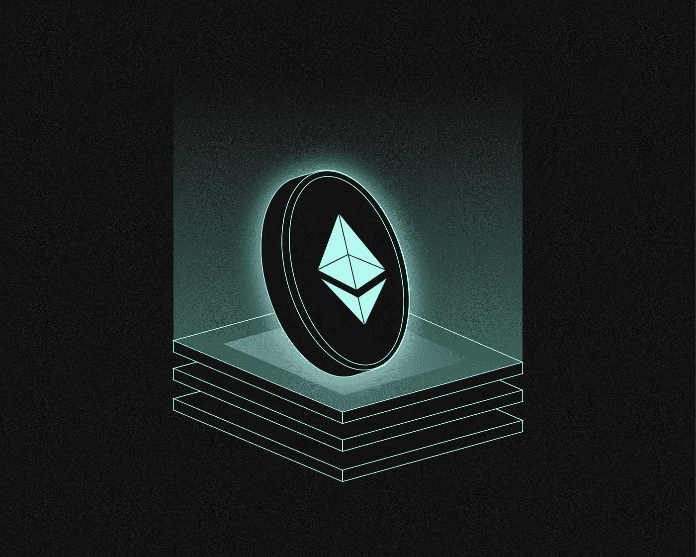
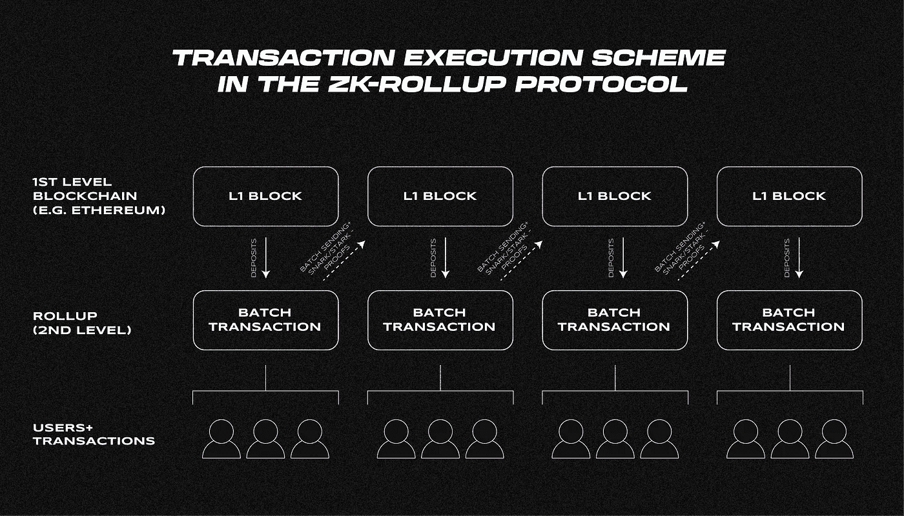
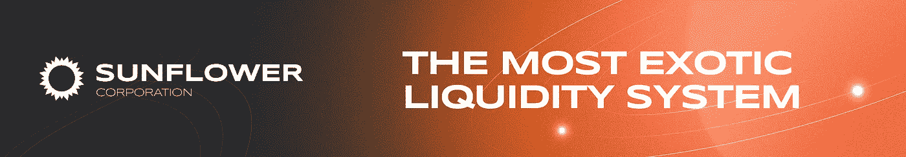

# 什么是 Rollups 技术？

> 原文：<https://medium.com/coinmonks/what-is-rollups-technology-3ba240bf715f?source=collection_archive---------28----------------------->

***“roll ups”是以太坊二级协议的主要技术。它是如何工作的？对以太坊规模化有什么帮助？一起来了解一下吧！***

零知识证明方法广泛应用于汇总解决方案中。ZK 卷是这些技术的集合。

汇总允许您在扩展主以太网的同时确保高度的交易隐私:许多交易被组合到一个包中，该包在第一级区块链中得到确认。

在以太坊生态系统中，基于 ZK 的流行二级协议包括 Starnet、zkSync、Loopring、Polygon Miden 等。乐观汇总是 L2 平台 Arbitrum One 和乐观中使用的一项独立技术。

# 零知识证明是如何工作的？

零知识证明(ZKP)方法是由科学家**沙菲·戈德瓦瑟**和**希尔维奥·米卡利**在 **1985** 的文章[“交互式证明系统的知识复杂性”](https://people.csail.mit.edu/silvio/Selected%20Scientific%20Papers/Proof%20Systems/The_Knowledge_Complexity_Of_Interactive_Proof_Systems.pdf)中提出的。

他们提出了一种在不泄露信息内容的情况下证明其真实性的方法。

为此，您必须创建一个特殊的“确认”，验证者可以用它来验证源数据的准确性。发送者必须进行一系列的计算，如果他有必要的知识，所有的计算都是正确的。验证者知道正确答案的价值，允许您确认所拥有信息的真实性。因此，双方对消息内容的了解都很有限。

考虑下面的场景:一个不能辨别颜色的色盲者看到两个球。一个是红色的，另一个是绿色的，但是这个人分辨不出来。

你必须演示相反的情况，但不要说出球的颜色。您通过将对象传递给对话者来实现这一点，对话者将它们隐藏在背后。然后他拿出球给你看。然后这个人把它藏起来，重复这个动作。你必须回应他是否在背后改球的问题。因为你知道正确的答案，你将能够通过一系列的实验来证明你的情况。但是，你不必透露额外的信息。

# 零知识证明在 ZK 卷中是如何使用的？

ZKP 方法使得一组技术的发展成为可能，这些技术被统称为 ZK 卷，今天以太坊生态系统中的许多关键二级协议都是在此基础上运行的。维塔利克·布特林称 ZKP 是攀登区块链主平台最重要的技术。

“汇总”数据包是从一系列事务中创建的，在这些事务中，每次传输的数据都被压缩。这种“卷积”向第一级(在这种情况下，以太坊)的主网络提供证明，允许您确认包中所有交易的真实性，而无需单独考虑每一个交易。在验证之后，包被包括在其中一个块中。单个汇总包可以包含数千个事务，但在第一级区块链中只存储了最少的数据。

三个要素确保了 ZK 卷的运行:

*   对事务进行分组的 L2 协议虚拟机；
*   验证包的验证者智能协定；
*   向一级区块链发送数据包并更新状态的模块。

二级网络节点执行基本的交易验证。在接收到一定数量的传输并将它们组合成一个包之后，它生成一个 ZK 证明。该包验证已在一级网络中部署的智能合约。它还允许向 L2 区块链输入和提取资金。

A scheme for executing transactions in protocols of the ZK-Rollup type

“汇总”还包括 L2 网络中的用户余额，以 [Merkle 树](/@SunflowerCorpAdmin/what-is-the-merkle-tree-91825a8a8891)的形式呈现。它的根存储在契约中，允许您跟踪网络状态的变化。每个交易的确认值也被发送到第一级区块链。该数据包含分阶段计算的 Merkle 根。通过记录区块链中的中间值来确认包装中的每次转移。

# ZK 卷装技术有哪些优势？

零知识证明最初用于匿名加密货币项目，但近年来，它作为以太坊的一种解决方案得到了广泛应用。

ZK 汇总使您能够处理用户数据，而不会泄露任何个人信息。特别是，该算法可以在不显示用户余额的情况下检查资金的可用性。这些特征对于需要保护客户个人信息的企业来说至关重要。

使用基于 ZK 累计的解决方案显著降低了交易费用。许多翻译被组合到一个包中，其中所有数据都被压缩，例如使用索引而不是地址。这使您可以在一级区块链中保存更少的信息。费用由所有发送者分摊，因此每个用户支付的费用更少。

ZK-在将资金提取到主网络时，累积提供了较低的延迟，因为智能合约会在将包包括在区块链中之前验证数据的有效性。

# ZK 证明有哪几种？

ZK 汇总有多种实现方式，其中最常见的有:ZK-斯纳克(及其变体 Plonky2)、ZK-斯塔克斯、zkSync 等。“证据”的大小和验证所需的计算成本因技术而异。

**ZK-斯纳克**

ZK-斯纳克生成一个小而容易验证的确认。计算椭圆曲线的值以获得证明所需的成本比散列法少，因此该算法具有较低的成本。该方法要求证明在发送后立即销毁。为了使算法工作，节点生成一个公钥和一个私钥，然后销毁后者。使用公钥创建另一个密钥对。然后使用私钥生成确认，然后使用公钥验证确认。

**ZK-斯塔克**

ZK-斯塔克斯生成一个证明，而不需要验证者和验证者之间的交互。数据验证花费的时间更少，使得该技术更具可扩展性。该算法采用哈希算法，使其能够抵抗量子计算机的攻击。

**zkSync**

[zkSync](https://zksync.io/) 是一种 L2 协议，基于同名的 roll-up 算法。该平台支持智能合约，并允许您转移资产。该算法具有不超过 500 Gwei 的每个交易的低气体限制。zkSync 2.0 的主要优势是兼容[以太坊虚拟机](/@SunflowerCorpAdmin/what-is-an-ethereum-virtual-machine-evm-450ffe44e815)。

# ZK 汇总и乐观汇总使用哪些项目？

如今，以太坊生态系统中有几种使用 ZKP 的流行解决方案:

*   **StarkNet 平台**
    基于其私有版本 StarkEx，大型 DeFi 协议 Rhino，不可变 X，dYdX 和 Sorare 工作。
*   [**Mina 协议**](https://minaprotocol.com/)
    它是一个轻量级的区块链，使用 ZK-斯纳克技术生成 22 KB 的块。您可以使用该平台来执行智能合同和运行分散的应用程序。
*   [**loop ring**](https://loopring.org/#/) 它是一种使用指令簿的分散式交易协议。在以太坊网络中实现，ZK 证明用于其操作。
*   [**多边形 Miden**](https://polygon.technology/solutions/polygon-miden/) 是基于 zk-STARKs 的“rollup”，配合特殊的虚拟机 Miden VM 工作。

除了基于 ZKP 的汇总之外，还有一组被称为乐观汇总的解决方案。不同之处在于如何验证事务:在乐观模式中，事务包被认为是有效的，只有当有人挑战它们时，事务才会被检查。

在每次传输验证之后，零泄露证明将数据存储在主网络中。因此，该技术确保了网络的当前状态得以保留。类似地，与 ZK 汇总不同，基于乐观汇总从协议中提取资金需要欺诈检查，这可能需要长达两周的时间。资金回笼到第一级区块链的时间由指定的期间决定。另一方面，在 ZK 汇总中验证数据的要求增加了资源消耗和财务成本。

两个流行的以太坊 L2 协议——[Arbitrum](/@SunflowerCorpAdmin/what-is-arbitrum-39877bf8b6cf)和[乐观](/the-capital/what-is-optimism-op-487d3f13b750)——基于乐观汇总工作。

# 什么是 Validium？

有复杂的解决方案——[验证](https://ethereum.org/en/developers/docs/scaling/validium/)。这是一种折衷的技术，它结合了不同级别存储的证据。确认被发送到主区块链，但数据存储在其他地方。该解决方案降低了佣金，但假设依赖外部存储。如果后者失败，用户不会损失资金，但他们将无法进行交易。

你有什么想法？如果你有什么要补充的，请在下面留下你的评论！

*关注* [*向日葵公司*](https://sunflowercorp.com/) *上* [*中*](/@SunflowerCorpAdmin) *或* [*推特*](https://mobile.twitter.com/sunflower_corp) *定期更新关于潮流的隐秘新闻。*

> 交易新手？尝试[加密交易机器人](/coinmonks/crypto-trading-bot-c2ffce8acb2a)或[复制交易](/coinmonks/top-10-crypto-copy-trading-platforms-for-beginners-d0c37c7d698c)