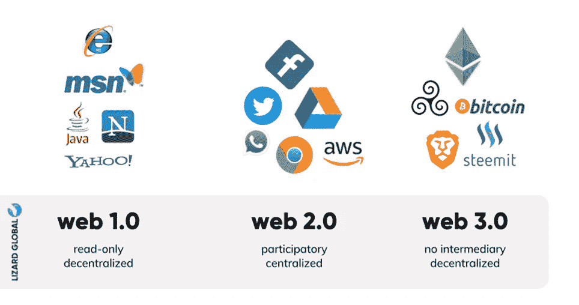
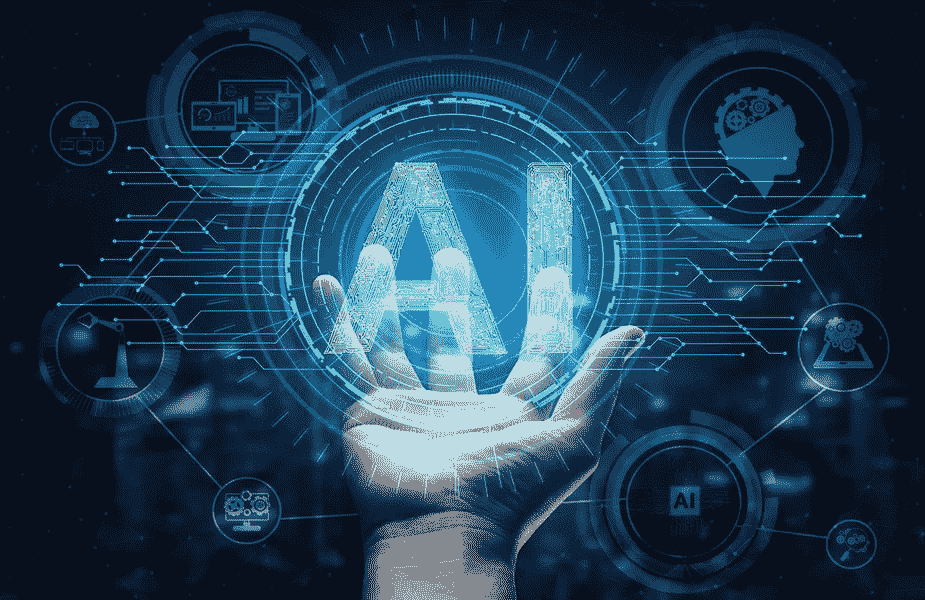
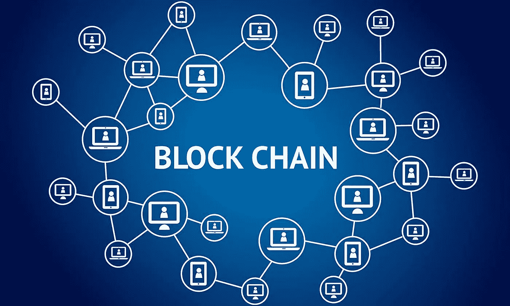

# 什么是语义网或 Web 3.0？

> 原文：<https://medium.com/coinmonks/what-is-semantic-web-or-web-3-0-2bd4093811e8?source=collection_archive---------5----------------------->

[https://forkast.news/what-is-web3-how-shape-crypto-future/](https://forkast.news/what-is-web3-how-shape-crypto-future/)

有多少次我们在搜索引擎上搜索一个特定的主题，却没有得到我们需要的信息？现在，想象一个搜索引擎，在那里我们可以找到我们要找的东西。一些老的互联网开发者已经把它命名为 WEB 3.0。

**什么是 web 3.0？**

**它将如何改变互联网？**

**我们为什么需要 web 3.0？**

**什么是去中心化的互联网思想？**

这是每个互联网用户都会问的几个问题。要了解 web 3.0，就要了解 web 和 web 2.0。

# Web 3.0，Web 2.0 和 Web 1.0 的继承者

Web 3.0 将成为第三代网络。

## Web 1.0

现代互联网之母万维网或 web 1.0 于 1989 年由蒂姆·伯纳斯·李创建。Web 1.0 是一个静态的 Web，没有搜索引擎，很少有用户交互。在 web 1.0 中，信息是只读的，就像没有评论自由的维基百科页面一样。网页上的信息是通过 HTML、URL 和 HTTP 技术访问的。我们可以把 web 1.0 称为信息有限的单向高速公路。

## Web 2.0

2005 年，web 1.0 演变成了 Web 2.0，这个术语是由 Tim O'Reilly 在 2004 年创造的。Web 2.0 也被称为读写和社交网络，用户交互性更强。Web 2.0 不仅允许用户消费内容，还允许用户使用 JavaScript、HTML5 和 CSS3 等技术进行创作和分享。

web 2.0 上的大部分信息都归世界科技巨头所有，如 Meta(脸书)、Google 和 Twitter。与 web 1.0 不同，在 web 2.0 中，数据可以在不同的站点之间共享，从而允许用户生成的内容激增。

## Web 3.0

第三代 web， **Web 3.0** 还在后头。至于现在，我们对 web 3.0 还没有一个合适的定义。Web 3.0 基于人工智能(AI)、机器学习、利用区块链技术的技术。

Web 3.0 也被称为语义网，因为它使用人工智能和机器学习技术，以更像人类的方式提供信息。Web 3.0 使用区块链技术来提供最大限度的隐私。在区块链，技术信息以块的形式存储，分布在不同的服务器上，用户除了使用数据之外，还可以拥有数据。

web 2.0 和 web 1.0 的区别是相当明显的。Web 2.0 是用户与脸书、推特、YouTube 等应用的互动。另一方面，网络是一个只读网络，信息有限。然而，web 2.0 和 web 3.0 之间的区别并不明显，因为 web 3.0 还没有到来。

[https://lizard.global/blog/what-is-web-3-and-how-will-it-change-the-internet-as-we-know-it/](https://lizard.global/blog/what-is-web-3-and-how-will-it-change-the-internet-as-we-know-it/)

# web 3.0 的主要特性

要理解 web 3.0，我们应该了解它的特性:

语义万维网

人工智能

到处存在

区块链

3d 世界

## 语义万维网

伯纳斯-李称 web 3.0 为语义网。语义意味着理解一个词的意思和情感。举个例子，

我喜欢纸杯蛋糕。

我是❤纸杯蛋糕。

这两个句子外表不同，但意思相同。Web 3.0 将允许计算机从所有网站收集数据，并以更人性化的方式向用户提供信息。

## 人工智能

Web 3.0 将以前所未有的方式使用人工智能。虽然 web 2.0 也使用人工智能，但大部分是基于人类的，容易受到腐败和虚假信息的影响。例如，一家公司在不同的在线平台上销售其产品，可以通过付费给人们来对其进行评级，从而操纵其评级。

在 **Gamespot 交易失败**后，谷歌的人工智能系统已经从 Play Store 删除了约 10 万条对 **Robinhood** 应用的负面评论，当时它检测到有人试图操纵评级，以人为否决该应用。

[https://itchronicles.com/artificial-intelligence/where-is-ai-used-today/](https://itchronicles.com/artificial-intelligence/where-is-ai-used-today/)

通过这种方式，web 3.0 将使用 AI 和机器学习为消费者提供最定制和无偏见的结果。

## 到处存在

互联网的连接和在世界每个角落的存在将把一切都放在互联网上。Web 2.0 也因为社交网络而无处不在，但这取决于你是否有互联网连接。

Web 3.0 向前迈进了一步。随着 IoT(物联网)的演进，智能手机和电脑将不再是互联网的唯一关注点。

## 区块链

Web 3.0 通过使用区块链技术，使用户数据更加安全和隐私。区块链将分散数据，防止互联网巨头利用个人数据谋利。

[https://www.techjuice.pk/what-is-blockchain/](https://www.techjuice.pk/what-is-blockchain/)

区块链技术正在通过以下方式彻底改变整个互联网:

Nfts

分散式应用程序

秘密党员

分散财务

## 3D 世界

现代大脑认为 web 3.0 将通过革命性的 3d 图形来软化现实世界和互联网世界之间的界限。第三代网络将创造一个 3d 世界，不仅增强了游戏体验，还增强了健康、电子商务和其他生活领域。

[https://www.instagram.com/shayanahmedusman/](https://www.instagram.com/shayanahmedusman/)

# Web 3.0 生活

这五个特性将很快定义 web 3.0。语义和人工智能将使浏览体验更像人类。让我们看一个 web 3.0 的例子

你想洗车，还想吃中国菜。你向你的汽车助手询问洗车和中餐，它会通过比较不同网站上的数千条评论，为你提供洗车服务的位置和最好的中餐餐馆的 3d 菜单。

在 web 3.0 中，所有日常离线设备，如烤箱、冰箱和运输机器，都将通过运行它们的 dApps(分散应用程序)成为互联网的一部分，将互联网指数级地融入日常生活。

# 结论

在这篇文章 **Web 3.0** 中，已经讨论了一些关于 Web 3.0 的早期和基本思想。所以，如果你喜欢我的文章，请关注我，如果你有任何问题或疑问，欢迎在评论区提问。

谢谢你。

> *加入 Coinmonks* [*电报频道*](https://t.me/coincodecap) *和* [*Youtube 频道*](https://www.youtube.com/c/coinmonks/videos) *了解加密交易和投资*

# 另外，阅读

*   [Bookmap 评论](https://coincodecap.com/bookmap-review-2021-best-trading-software) | [美国 5 大最佳加密交易所](https://coincodecap.com/crypto-exchange-usa)
*   [密码交易机器人](/coinmonks/crypto-trading-bot-c2ffce8acb2a) | [硬币门评论](https://coincodecap.com/coingate-review)
*   最佳加密[硬件钱包](/coinmonks/hardware-wallets-dfa1211730c6) | [Bitbns 评论](/coinmonks/bitbns-review-38256a07e161)
*   [新加坡十大最佳加密交易所](https://coincodecap.com/crypto-exchange-in-singapore) | [购买 AXS](https://coincodecap.com/buy-axs-token)
*   [红狗赌场评论](https://coincodecap.com/red-dog-casino-review) | [Swyftx 评论](https://coincodecap.com/swyftx-review)