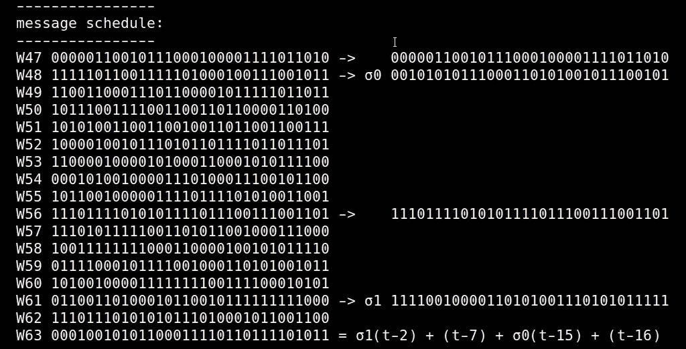

# 什么是 SHA 256，它是如何工作的？

> 原文：<https://medium.com/coinmonks/what-is-sha-256-and-how-does-it-work-8088f7289b50?source=collection_archive---------5----------------------->

**(Img from:** [**[0]**](https://www.flaticon.com/free-icon/sha-256_2586154)**)**

# **1。什么是 SHA 256？**

SHA 256(安全哈希算法)是由 NSA(美国国家安全局)开发的一组 SHA-2 加密哈希函数中的一种哈希算法。哈希算法将输入输出为固定大小的唯一哈希。哈希算法几乎不可能逆转，并且很可能被认为是输出唯一的哈希。之所以称之为最有可能，是因为理论上两个不同的输入有给出相同输出的可能性。因为只要你愿意，你就可以进入 SHA-256 算法，并且它们都被总结为 256 位。所以总共有 2 个⁵⁶不同的散列值。这确实是一个天文数字。由于有两个⁵⁶不同的散列可用，发现冲突的概率也相当低。

现在我们知道了在实践中没有两个散列是相同的，这种差别有多大呢？例如，如果输入数据的一个字母大写或不大写，那么散列与旧的相比改变了多少？回答:完全。更准确地说，我们找不到逻辑和数学上的相似之处。只要稍有变化，哈希值就会变得完全随机。这也被称为**雪崩效应**。

**(These two hashes do not resemble each other in any way.)**

# **2。SHA 256 是做什么的？**

在认证和加密的名义下，我们从 SHA-256 那里获得了一些基本且非常重要的特征。最重要的特性是我们在开头提到的部分:它给出了一个独特的输出。这很重要，因为想象一下，一个需要验证的数据可以用另一个数据来验证。当然，对于 SHA-256 来说，这在理论上是可能的，但可能性极小。另一个特点是返回不可行，是单向函数。换句话说，很难从作为输出的十六进制值中找到原始值。唯一的方法是一个一个地尝试十六进制值或原始的 256 位值，并用暴力方法连续地比较它们。

如果这样的函数不是确定性的，那就真的很可悲了。换句话说，一个因设备而异的 SHA-256 函数会给它最适用的对等系统带来很大的问题。因为需要在一台计算机上验证另一台计算机上产生的值，所以这项工作无法正常完成，因为设备不同。因此，该函数是不随环境变化的确定性函数，并且从不依赖于其所在设备的特性和硬件。如果你想用手中的纸和笔来完成这个功能，当你完成它时，你得到的结果将和你在计算机上运行这个功能时得到的结果是一样的。

我一会儿会谈到它是如何工作的，但是用纸和笔做这件事要花很多时间。但与人类不同，计算机可以非常快速地进行这种计算。特别是当使用简单的按位逻辑函数和公式(如 SHA-256)且循环很少的函数时，可以很快获得结果。这是另一个重要特征。想象一下，一个数据需要验证，需要几个小时，甚至不是几个小时，而是几分钟。这将使当前的系统变得相当麻烦。

## **总结 SHA-256:**

**1。不可行逆转，**

**2。单向，**

**3。唯一输出，**

**4。雪崩效应，**

得益于这些特性，它常用于比特币挖矿。矿工的工作是将交易数据输入到该函数中，并替换除该数据之外输入的任意数字 Nonce，希望在哈希值中看到一定数量的 0。

# **3。SHA-256 是如何工作的？**

让我们看看这个如此重要的算法是如何工作的。让我们从一开始就警告你，这部分将是相当技术性的。但是相信我，这并不难。如果你能深入了解和分析，也许你也能逆向工程！即使还没有人能做到。

# **3.1)基本操作**

为了感知算法的工作逻辑，需要了解几个基本运算。

**1。右移(SHR):** 是基本的位运算。其逻辑包括将现有的位向右移位。由于向右移位，左边的第一位被设置为零，最右边的位成为前一位。

**例如:10101001 SHR 3→00010101/SHR 3 所指的右移量。所以向右移动了 3 位。**

**2。向右旋转(ROTR):** 其逻辑与右移类似。唯一的区别是，当我们将它向右移动时，丢失的位分别出现在左边，没有前导 0。我们可以认为这些比特以循环的方式排列。

**例如:10101001 ROTR 3→00110101/ROTR 3 进行移位，使后 3 位在前。**

**3。异或(XOR):** 它是这样工作的，设有两个命题 p 和 q，并且这些命题用 1 和 0 来表示正确或不正确使得:

**异或，**

**p = 1 时输出= 0，q=1**

**p = 1 时输出= 1，q=0 时**

**p = 0 时输出= 1，q=1**

**输出=0 对于 p=0，q=0 是数学上确定的。**

**例如:**

**p = 11001001**

**q = 00101010**

**异或— — —**

**输出= 11100011**

**4。二进制加法(ADD):** 表示二进制中的加法。和十进制的加法没有太大区别。只有数字可以是 1，而不是最大值 9。在超过 1 的情况下，我们像十进制一样在下一位数字上加 1。我们一直加，直到不超过为止。

> 交易新手？尝试[加密交易机器人](/coinmonks/crypto-trading-bot-c2ffce8acb2a)或[复制交易](/coinmonks/top-10-crypto-copy-trading-platforms-for-beginners-d0c37c7d698c)

**例如:** 00001100 + 00010101 = 00100001 为了理解结果的准确性，我们需要能够在二进制中计数。对于二进制系统中的计数，基于第一个数字 0 应用诸如 1*(2⁰的符号。这里 1 决定它是 0 还是 1，0 决定它在哪个数位。在这种情况下:

**第一个 number:0*(2⁰)+0 *(2)+1 *(2)+1 *(2)+0*(2⁴)+0*(2⁵)+0*(2⁶)+0*(2⁷)= 12，**

**第二个数:1*(2⁰)+0 *(2)+1 *(2)+0 *(2)+1*(2⁴)+0*(2⁵)+0*(2⁶)+0*(2⁷)= 21，**

**我们的结果是:1*(2⁰)+0 *(2)+0 *(2)+0 *(2)+0*(2⁴)+1*(2⁵)+0*(2⁶)+0*(2⁷)= 33。因此它可以转换成十进制。**

**5。复合运算:**以上运算的组合运算。但是因为它们是特定的，所以它们有命名法。让我们称初始电流位为“X”:

1.  **) σ0(小写适马-0):** 小写 Sigma0 是复合运算。将 ROTR 7 应用于 X 并将其放在第一部分，将 ROTR 18 应用于 X 并将其放在第二部分，将 SHR 3 应用于 X 并将其放在第三部分，并对所有部分应用 XOR。
2.  **) σ1:(小写适马-1):** 在小写 Sigma1 中，函数对 X 应用 ROTR 17 并将其放在第一部分，对 X 应用 ROTR 19 并将其放在第二部分，对 X 应用 SHR 10 并将其放在第三部分，并对它们全部应用 XOR。
3.  **)σ0 =(大写适马-0):** UppercaseSigma0 是一个复合运算，它对 X 应用 ROTR 2 将其放在第一部分，对 X 应用 ROTR 13 将其放在第二部分，对 X 应用 ROTR 22 将其放在第三部分，并对所有这些应用 XOR。
4.  **)σ1 =(大写的适马-1):** 在大写的σ1 中，函数对 X 应用 ROTR 6 并将其放在第一部分，对 X 应用 ROTR 11 并将其放在第二部分，对 X 应用 ROTR 25 并将其放在第三部分，并对所有这些应用 XOR。

6。Choice(Ch): 适用于 X、Y、Z 位。如果 X 的当前位为 1，Y 的当前位被写入输出，如果 X 的当前位为 0，Z 的当前位被写入输出。

**例如:**

**X: 11001001**

**Y: 00110110**

**Z: 11100100**

***Ch———*—**

**输出:00100100**

**7。多数(Maj):** 适用于 X、Y、Z 位。检查处理位，并将多数位写入输出。

**例如:**

**X: 01100001**

Y: 10010110

**Z: 01101101**

***主要———*—**

**输出:01100101**

# **3.2)常量:**

常量是随机出现的数字，用于在后期压缩消息。有 64 个数字，它们是通过取前 64 个素数的立方根随机产生的。在得到立方根之后，整数部分被丢弃，并且基于小数部分被限制为 32 位。它被表示为 K[i]，I 是变量:

**k0 = ∛2 = 1.2599210498948732→2599210498948732**

**→01000010100010100010111110011000**

**k1 = ∛3 = 1.4422495703074083→4422495703074083**

**→01110001001101110100010010010010001**

**k2 = ∛5 = 1.7099759466766968→7099759466766968**

**→1011010111100000011111011110011111**

**k3 = ∛7 = 1.912931182772389→912931182772389**

**→11101001101101110110111011010100101**

**。**

**。**

**。**

**k63 = ∛311 = 6.775168952273312→775168952273312**

**→1100011001111000101111000111110010**

# **3.3)函数的算法:**

现在我们已经完成了准备工作，让我们一步一步地检查函数的运行情况:

**第一步:** **识别输入:**在这一步，我们输入想要查找其 hash 的字符串。例如:abc

**第二步:输入到 8 位 ASCII 表的等价:**虽然 ASCII 的原始形式是 7 位，但我们基于它的 8 位版本。“abc”输入对应于:→[97，98，99]= 979899 = 011000010110001001100011

**第三步:填充:**我们有 24 位，但结果是，如果我们想得到 256 位的散列，我们需要在 512 位的块中工作，原因在下面的步骤中。

**所以 24 位取为:11000010110001001100011**

在末尾添加“1”作为分隔符:11000010110001001100011000111

**然后用 0 填充，直到它是 448 位:**11000010110001110000000000000000000000000000000000000000000…………………………………………..0000000000000000000000000000000000

**我们已经声明它以 512 位部分工作，我们输入的长度以最后 64 位中的位来写:**1100001011000110000000000000000000000000000000000000000000000000…………………………………。…. 000000000000000000000000000000…………**11000**

**‘11000’**二进制是 24。因此，消息被分成 512 位的块。如果我们的消息长于 448 位，则需要第二个消息块。所需的循环迭代。

**第四步:消息调度，将消息拆分成 16 个部分:**我们得到的 512 位消息被拆分成 16 个部分。从左边开始，每个取 32 位并继续。“t”表示为变量:

**W0 = 11000010110001001100011100000000**

**W1 = 000000000000000000000000000000000**

**W2 = 00000000000000000000000000000000**

**。**

**。**

**。**

**W15 = 0000000000000000000000000000011000**

**步骤 5:完成到 64:** 如果我们希望我们的消息的摘要值是 256 比特，则需要 64 个消息。为此，使用以下公式展开(假设 t 为最后一条消息)

**W[t]=σ1(t-2)+(t-7)+σ0(t-15)+(t-16)**

别忘了这里的加法是二进制的！

这个总数被写入新的传入消息，并且扩展继续。W63 是最新消息。

**第六步:压缩:**此时，比特将开始被压缩和汇总。为此，有必要首先初始化哈希值。为了使消息的初始值看起来是随机的，这次取前八个素数的平方根，减去整数部分，然后乘以 2，因为需要 32 位数据。

**a =√2 = 1.4142135624→0.4142135624 * 2 = 1779033703**

**b =√3 = 1.7320508076→0.7320508076 * 2 = 3144134277**

**c =√5 = 2.2360679775→0.2360679775 * 2 = 1013904242**

**d =√7 = 2.6457513111→0.6457513111 * 2 = 2773480762**

**e =√11 = 3.3166247904→0.3166247904 * 2 = 1359893119**

**f =√13 = 3.6055512755→0.6055512755 * 2 = 2600822924**

**g =√17 = 4.1231056256→0.1231056256 * 2 = 528734635**

**h =√19 = 4.3588989434→0.3588989434 * 2 = 1541459225**

**如果转换成比特:**

a，b，c，d，e，f，g，h 可称为工作变量或初始哈希值。在我们改变这些变量之前，我们需要生成两个临时数字。为此，使用以下两个公式(T1: 1。临时号码，T2: 2。临时号码，I 表示为变量):

**T1 =σ1(e)+Ch(e，f，g) + h + K[i] + W[i]**

**T2 =σ0(a)+Maj(a，b，c)**

为了压缩，初始哈希值下移一行，值“a”为空，T1 和 T2 的和写入“a”部分，T1 添加到“e”部分。

**(Shifted down)**

**(Addition applied)**

对于消息调度中的每个消息，这个过程继续，K[i]和 W[i]的值一个接一个地增加。当第 64 条消息的压缩过程完成时，结果值与初始散列值相加，并显示最终比特值。

对于分配为 512 位的每个消息块，都要这样做。因为第一个消息块就像我们的例子一样，所以最初的散列值是根据前八个素数的平方根写入的。第一个块之后的块的初始哈希值是基于前一个块的最后值写入的。

**(Multiple message blocks compressed)**

压缩最后一个消息块后，最终的哈希值以位为单位显示。该值从二进制转换为十六进制，并从。

所以我们的终极价值是:

**→ba 7816 BF 8 f 01 cfea 414140 de 5d AE 2223 b 00361 a 396177 a9cb 410 ff 61 f 20015 ad**

如果我们用纸笔做了所有的操作，就会发现这个结果。你可以从我留在下面的链接的网站上试试。感谢您的阅读。

# 阿里夫·埃姆雷·阿卜杜勒奥卢

***来源:***

[0]:[https://www.flaticon.com/free-icon/sha-256_2586154](https://www.flaticon.com/free-icon/sha-256_2586154)

[https://www.youtube.com/watch?v=f9EbD6iY9zI&t = 1109s](https://www.youtube.com/watch?v=f9EbD6iY9zI&t=1109s)→**SHA-256 是怎么工作的？/learnmebitcoin**

[https://blog . boot . dev/cryptography/How-sha-2-Works-Step-By-Step-sha-256/](https://blog.boot.dev/cryptography/how-sha-2-works-step-by-step-sha-256/)→**SHA-256 如何按部就班**[https://andersbrownworth.com/blockchain/hash](https://andersbrownworth.com/blockchain/hash)→**SHA-256 演示现场**

> 加入 Coinmonks [电报频道](https://t.me/coincodecap)和 [Youtube 频道](https://www.youtube.com/c/coinmonks/videos)了解加密交易和投资

# 另外，阅读

*   [OKEx vs KuCoin](https://coincodecap.com/okex-kucoin) | [摄氏替代度](https://coincodecap.com/celsius-alternatives) | [如何购买 VeChain](https://coincodecap.com/buy-vechain)
*   [ProfitFarmers 回顾](https://coincodecap.com/profitfarmers-review) | [如何使用 Cornix 交易机器人](https://coincodecap.com/cornix-trading-bot)
*   [如何匿名购买比特币](https://coincodecap.com/buy-bitcoin-anonymously) | [比特币现金钱包](https://coincodecap.com/bitcoin-cash-wallets)
*   [瓦济里克斯 NFT 评论](https://coincodecap.com/wazirx-nft-review)|[Bitsgap vs Pionex](https://coincodecap.com/bitsgap-vs-pionex)|[Tangem 评论](https://coincodecap.com/tangem-wallet-review)
*   如何使用 Solidity 在以太坊上创建 DApp？