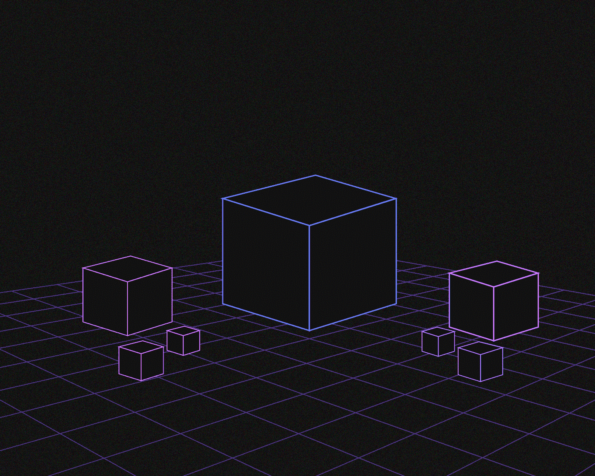
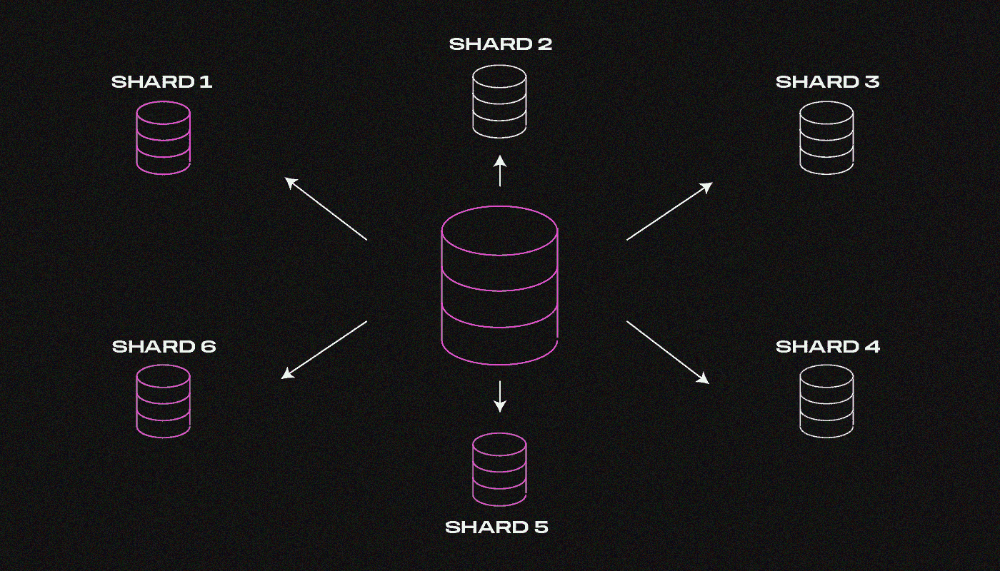
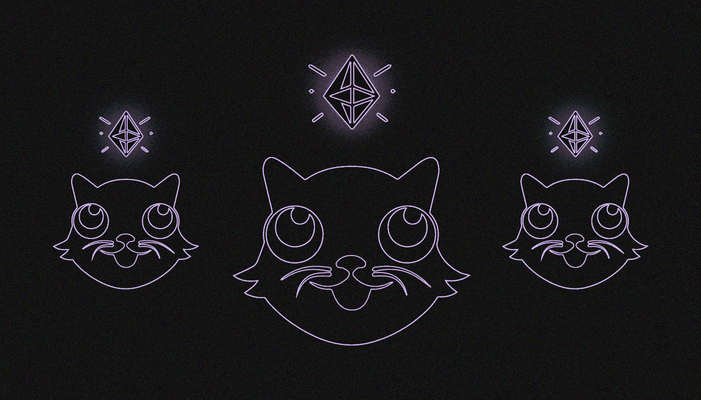
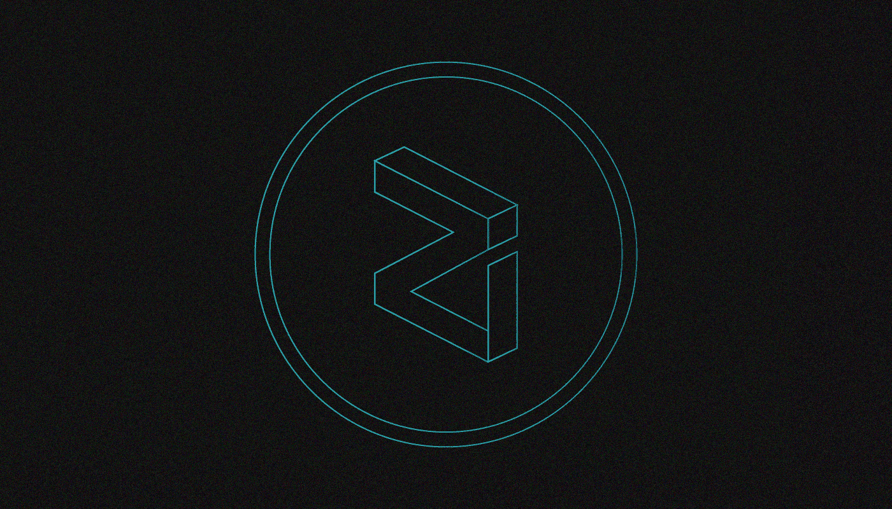

# 什么是分片？

> 原文：<https://medium.com/coinmonks/what-is-sharding-3866d0e58be9?source=collection_archive---------25----------------------->

***分片是一种跨多个数据库分离和存储单个逻辑数据集的方法。我们为什么需要它，它是如何工作的？我们一起来读吧！***

水平数据分离是分片的另一种定义。

# **谁在什么时候发明了方巾？**

自从 20 世纪 90 年代后期以来，分片的概念已经被用于传统的集中式数据库的管理中。“碎片”(fragment)一词的流行要归功于 [Ultima Online](https://uo.com/) ，这是最早的多人在线角色扮演游戏之一，开发者将玩家分布在不同的服务器(游戏中不同的“世界”)上，以处理流量。

按照地理位置划分用户数据库是在业务中使用分片的一种常见场景。来自相同地理位置的用户被分组在一起，并被分配到单个服务器。

# **在区块链的背景下，什么是分片？**

区块链是由代表单个服务器的节点组成的数据库。在区块链环境中，分片是指将区块链网络划分为单独的部分(分片)。每个碎片都有自己的智能合约和账户余额。

与每个节点负责验证整个网络中的每个事务的方案不同，每个球被分配一个验证事务和操作的节点。

通过将区块链划分为更易于管理的段，可以增加事务吞吐量，从而解决大多数现代区块链面临的可伸缩性问题。

# **分片是如何工作的？**

*我们来解释一下以太坊的例子:*

以太坊区块链由数千台被称为节点的计算机组成，每台计算机都向网络“借”一定量的哈希码。以太坊虚拟机(EVM)使用这个哈希表来执行智能合同和管理分散应用程序(DApps)。

目前，以太坊是在顺序执行的基础上运行的，这意味着每个节点必须计算和处理每个操作。因此，交易通过验证过程需要相当长的时间:以太坊每秒大约执行 10 次交易，而 Visa 每秒大约执行 24，000 次交易。

因为整个注册表存储在每个设备上，所以将计算机添加到网络中并不一定会提高效率，验证链只会变得更长。

分片背后的思想是用并行执行模型取代每个节点必须计算每个操作的模型，在并行执行模型中，节点只处理某些计算。这使得可以同时处理多个事务。

区块链被分成碎片(子域或分段)。节点只管理它们所连接的注册表的一部分(执行进程和确认事务)，而不是整个注册表。

# **分片解决了什么问题？**

分片是缩放问题的一个潜在解决方案。

区块链越受欢迎，越多的用户开始交易，启动分散的应用程序，并参与其他基于网络的活动。因此，交易率下降，阻碍了区块链的长期增长。增加的交易活动需要节点加强交易验证过程。这些区块链有“堵塞”的风险，就像以太坊在 CryptoKitties 繁荣时期所做的那样，当时该游戏占网络交易的 11%。

如果节点组负责单独的段，则每个节点不需要维护整个注册表来执行每个操作。因此，事务验证可以并行执行，而不是以线性方式执行，从而提高了网络速度。这解决了缩放问题。

# **分片的缺点是什么？**

分片的主要问题是通信和安全。如果区块链被分割成几个独立的部分，每个部分就成了自己的网络。除非使用特殊的通信机制，否则一个子域中的用户和应用程序将无法与另一个子域中的用户和应用程序通信。

在分段的区块链中出现了一个安全问题，因为黑客可以很容易地捕获一个碎片，这是因为控制各个分段所需的散列值较低。(所谓的 [1%攻击](https://www.mangoresearch.co/1-shard-attack-explained-ethereum-sharding-contd/))。

在捕获数据段后，攻击者可以向主网络发送无效的交易。此外，该特定数据段中的数据可能会变得无效，并且不可挽回地丢失。以太坊以随机样本的形式提供了一个解决方案——分片协议被随机分配到各个部分，以确认块的认证。

# **分片的替代方案是什么？**

开发人员提出了两个解决方案来提高区块链交易的性能和速度。

第一种选择是增加块大小。关键概念是，块越大，可以放入的事务就越多，因此每秒的事务数也就越高。

然而，块越大，验证它所需的计算能力就越大。如果块大小显著增加，只有最强大的计算机才能管理作为节点运行所需的计算能力。

由于这种计算机设备的高成本，节点池将不可避免地变得更小和更集中，增加了 51%的攻击风险。增加块大小需要一个硬分叉，这有可能分裂社区:如果不是所有用户都接受更新，将出现两个使用不同硬币的不同链。增加块大小可能不是一个长期的解决方案。

第二个建议是使用 altcoins，这样就可以在自己的网络上使用自己的硬币实现各种功能和应用。

这种模式将提高生产率，因为单个区块链不会过载，但它也将增加安全风险，因为计算能力将分布在多个区块链上。再次，网络黑客攻击的风险会增加，因为执行 51%攻击所需的计算能力会低得多。

# 谁使用分片？

Zilliqa 是第一个使用分片的平台。在拥挤阶段，它能够实现每秒 2，828 个事务的指标。

近区块链生态系统使开发人员能够创建和部署分散的应用程序。Near 将自己标榜为“PoS 上的分片区块链”,并声称其分片技术允许节点保持足够小，以在低性能设备上运行，甚至可能在移动电话上运行。

以太坊为基于智能合约开发 DApps 提供了一个区块链生态系统。以太坊基金会打算在更新的以太坊 2.0 协议中加入分片。

其他使用分片技术的项目包括 [Cardano](/@SunflowerCorpAdmin/what-is-cardano-ada-59e7c3e9d5fe) ，QuarkChain 和 PChain。

# **分片的未来如何？**

分片技术出现在 Libra 数字货币的[白皮书](https://developers.libra.org/docs/the-libra-blockchain-paper)中。在发布之前，脸书收购了 Chainspace，其开发团队专门研究分片。具体细节仍不得而知，但可以假设的是，一种分片将被引入天秤座区块链。

分片理论上可以成为所谓的区块链困境的解决方案。

正如 Vitalik Buterin 所解释的，区块链三难困境是区块链的三个关键特征中只有两个可以同时保留，即安全性、去中心化和可扩展性。如果与分片相关的困难被克服，就有可能在不牺牲分散性或安全性的情况下扩展分布式网络。

> 我们希望在下面的评论中听到你对分片的看法。如果你喜欢这篇文章，订阅我们的[媒体提要](https://medium.com/sunflowercorporation)以获得更多类似的内容。敬请期待！

> 交易新手？试试[加密交易机器人](/coinmonks/crypto-trading-bot-c2ffce8acb2a)或者[复制交易](/coinmonks/top-10-crypto-copy-trading-platforms-for-beginners-d0c37c7d698c)