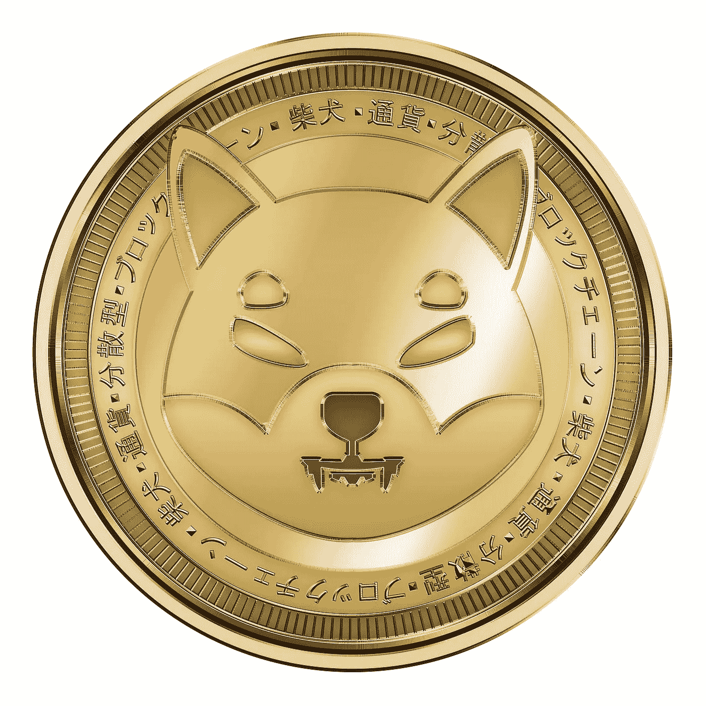

# 什么是柴犬(SHIB)加密货币？

> 原文：<https://medium.com/coinmonks/what-is-shiba-inu-shib-cryptocurrency-c676c59c0341?source=collection_archive---------25----------------------->

Source photo [Shiba Criptomonedă Blockchain — Imagine gratuită pe Pixabay](https://pixabay.com/ro/illustrations/shiba-criptomoned%c4%83-blockchain-6723430/)

加密货币柴犬在 2020 年 8 月推出后的过去几个月里人气飙升。作为一种建立在以太坊网络上的开源加密货币，它的目标是快速、安全和廉价。

柴犬的显著之处在于它是一种迷因币，这意味着它被设计成一个笑话，旨在用于开玩笑，而不是作为一项严肃的投资。柴犬…