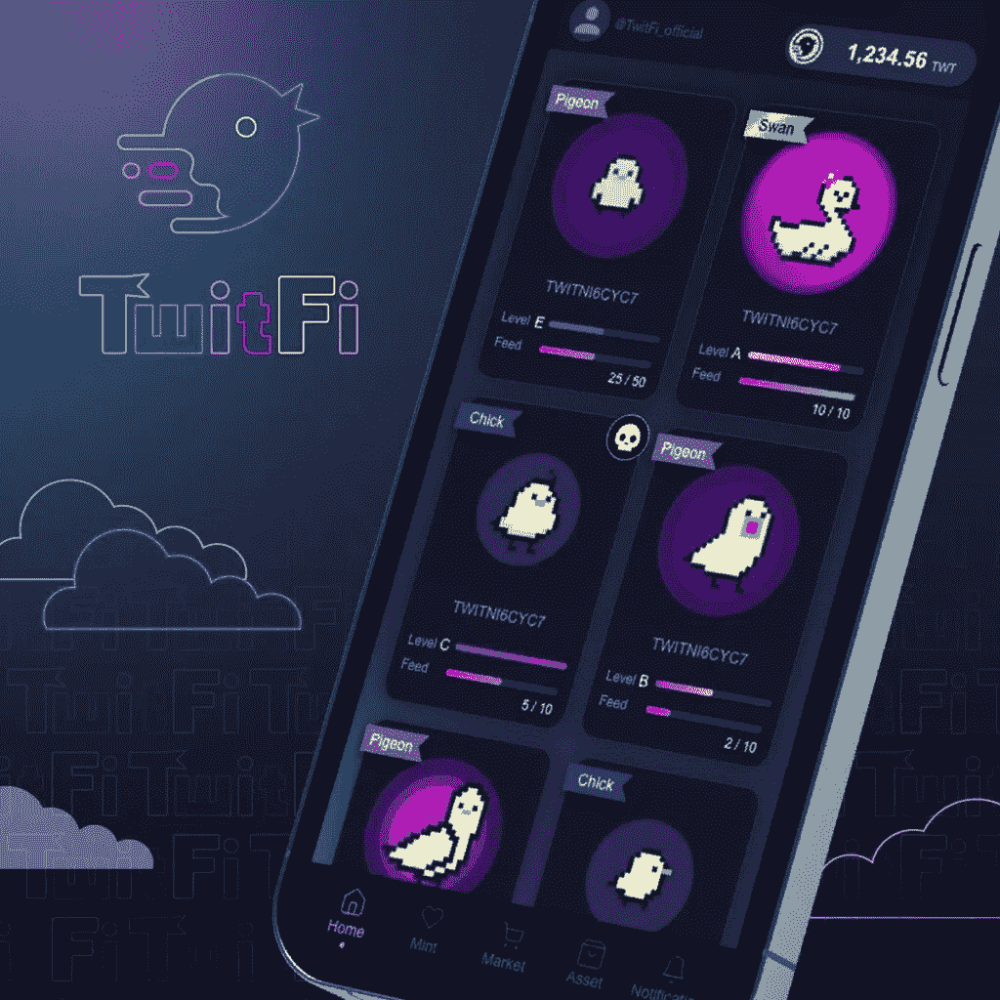
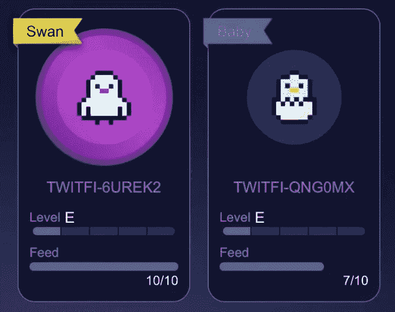
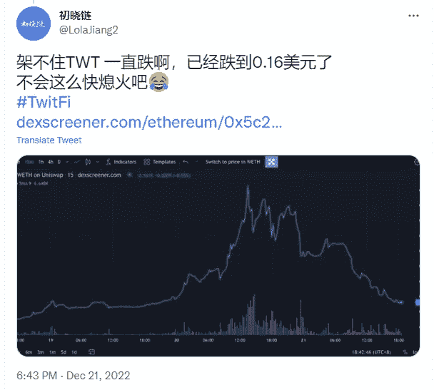
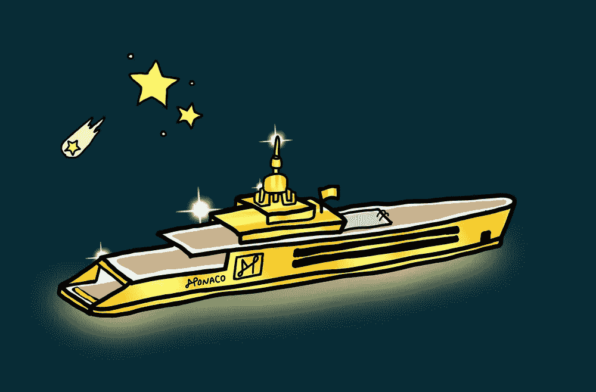
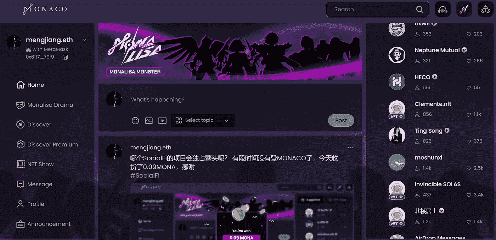
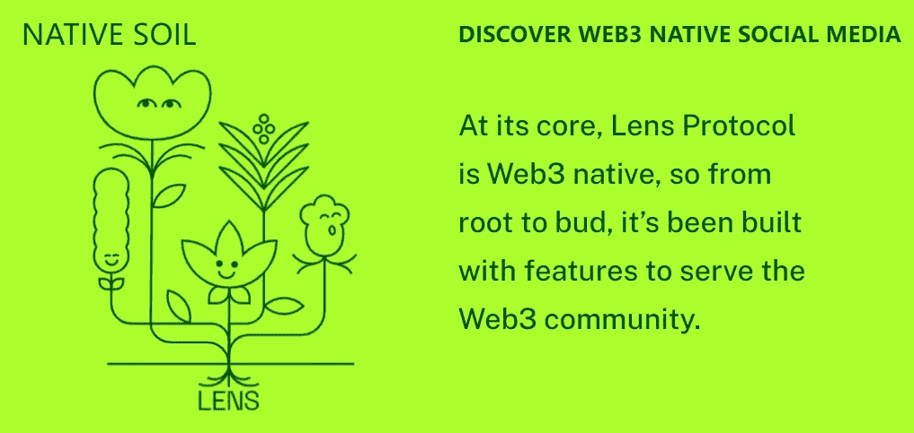
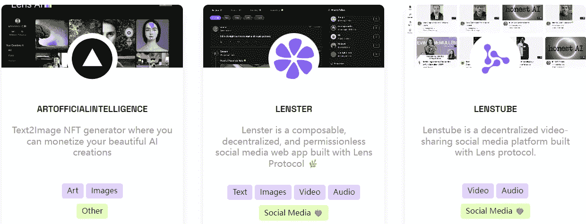

# 什么是 SocialFi？哪个 Web3 项目可以分享 2Earn？

> 原文：<https://medium.com/coinmonks/what-is-socialfi-which-web3-project-can-share2earn-fb8309e8f7df?source=collection_archive---------9----------------------->

这两天推特上有一个组外项目 TwitFi。发微博就能挣钱。直接解释了什么是 SocialFi，一边社交一边赚钱。

TwitFi 是如何工作的？

TwitFi 的玩法是玩家绑定钱包和推特账号，持有伯德 NFT，用#TwitFi 的标签发推特，然后就可以获得 TWT，享受发推特赚钱的乐趣。让用户在社交中发帖互动获益，实现内容和流量的货币化。

在 TwitFi 项目中，有不同类型的 NFT，如婴儿、小鸡、鸽子和天鹅，具有不同的属性、能量和输出。级别越高，发布相同数量的 TWT 获得的 TWT 数越高。

socialfi project TwitFi

此外，NFT 也可以升级和薄荷，并可能受到病毒感染。如果感染超过一定次数，NFT 可能会自动销毁。随机的游戏组合也增加了游戏的乐趣。

在 TwitFi 游戏中，玩家花几块钱油费免费铸造普通 NFT，或者花 0.163ETH 购买稀有蛋 NFT。从不同的蛋中孵化出 NFT 鸟的概率各不相同。

有了 NFT 之后，你可以发微博赚钱。

TwitFi project NFT

楚小莲花了大约 5 美元的汽油费，薄荷创造了一个鸡蛋 NFT，打开了一个婴儿 NFT，用#TwitFI 的标签发了两条推文，得到了 10 台币。

获得的行波管 50%可以提取，50%需要锁定一个月。TWT 目前价格为 0.16 美元，从 1 美元的高点下跌，价格继续波动。

如果是另一种类型的 NFT，可以多拿台币，但是需要先买 NFT。

奇克 NFT 目前的底价是 0.034ETH，约合 40 美元，奇克 NFT 发一条推特可以获得 50 台币。

Get rewards for posting with hashtags

**什么是 SocialFi？**

SocialFi 是一款结合了社交社交和金融理财的社交金融产品。个人在社区中的影响力通过社交活动、内容创作、娱乐、游戏等被符号化，转化为真实的收入。

发微博不仅是为了表达分享和积累粉丝，也是为了通过社交网络来转收入。
目前个人创作者、kol、喜欢分享的人都是 SocialFi 的内容分享者，他们没有好的变现方式。如果 SocialFi 能够将内容分享转化为收入，将极大地解决这些用户的需求。

但目前没有一个 SocialFi 项目能持续发展，大部分只是一波热潮，没有可持续性。

SocialFI project MONACO NFT

从去年一度热闹非凡的 SocialFI 赛道摩纳哥出发，上线时就很难找到体验码。只有持有该项目的 NFT 的玩家才能体验封闭测试版。其项目的 NFT 楼面价从几 ETH 降至 0.0098 ETH，官方推特从 10 月 8 日开始停止更新。

用户可以通过在平台上发帖、点赞、互动获得 MONA，也可以在项目中质押 MONA，获得更多利益。项目模式是内容挖掘，社交中的 Share2Earn，但好像已经不运营了。

Social project MONACO

在这段时间里，社会项目 Lens 协议也有了一定的知名度。

Lens Protocol 是一个 Web3 社交图，让用户掌握自己与社群的联系，形成一个可组合的、移动的社交图，归用户所有。

持有 Lens Protocol Profiles NFT 的用户可以在 Lens Protocol 的生态项目之间自由移动，并在不同项目之间共享社交数据。

Lens is a web3 social graph

在链条上，用户创建个人资料，关注他人，创建和收集不同项目的数据，基于 Lens 协议构建的项目可以共享链条上的用户数据，形成共赢。

据说已经有数百个项目建立在 Lens 协议上，并且已经铸造了超过 90，000 个其项目的 NFT。但项目最终能否成为社交项目，取决于其生态系统的数量和用户数量。
不然用户直接发微博就够了，何必去小平台发帖，也没人喜欢！

Lens ecological projects

SocialFi 讨论一直很热，但是还没有一个 SocialFi 项目足够走出圈子继续发展。

从 defi，gamefi，NFTfi，以及各种 web3，都有代表性的项目，但似乎没有一个 SocialFi 项目成为赛道的佼佼者，能走出 FOMO 的圈子。

从用户角度来说，有社交需求，希望解决金融金融的需求，但是没有一个 SocialFi 项目真正解决这个痛点。

期待以后更好的 SocialFi 项目。

以上只是我个人观点，没有投资建议。我是楚小莲，我正在关注元宇宙和 web3。​​​​​​​​​​

> 交易新手？试试[加密交易机器人](/coinmonks/crypto-trading-bot-c2ffce8acb2a)或者[复制交易](/coinmonks/top-10-crypto-copy-trading-platforms-for-beginners-d0c37c7d698c)
> 
> 多样化的密码持有，了解[币安替代品](https://coincodecap.com/binance-alternatives)
> 
> 加入 Coinmonks [电报频道](https://t.me/coincodecap)和 [Youtube 频道](https://www.youtube.com/c/coinmonks/videos)获取每日[加密新闻](http://coincodecap.com/)

# 另外，阅读

*   [复制交易](/coinmonks/top-10-crypto-copy-trading-platforms-for-beginners-d0c37c7d698c) | [加密税务软件](/coinmonks/crypto-tax-software-ed4b4810e338)
*   [网格交易](https://coincodecap.com/grid-trading) | [加密硬件钱包](/coinmonks/the-best-cryptocurrency-hardware-wallets-of-2020-e28b1c124069)
*   [密码电报信号](/coinmonks/top-3-telegram-channels-for-crypto-traders-in-2021-8385f4411ff4) | [密码交易机器人](/coinmonks/crypto-trading-bot-c2ffce8acb2a)
*   [最佳加密交易所](/coinmonks/crypto-exchange-dd2f9d6f3769) | [印度最佳加密交易所](/coinmonks/bitcoin-exchange-in-india-7f1fe79715c9)
*   [开发人员的最佳加密 API](/coinmonks/best-crypto-apis-for-developers-5efe3a597a9f)
*   最佳[密码借贷平台](/coinmonks/top-5-crypto-lending-platforms-in-2020-that-you-need-to-know-a1b675cec3fa)
*   [免费加密信号](/coinmonks/free-crypto-signals-48b25e61a8da) | [加密交易机器人](/coinmonks/crypto-trading-bot-c2ffce8acb2a)
*   杠杆代币的终极指南