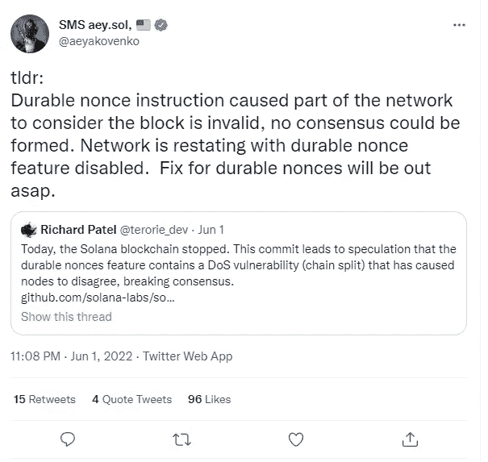

# 索拉纳是什么？加密货币的历史与展望

> 原文：<https://medium.com/coinmonks/what-is-solana-history-and-forecast-of-cryptocurrency-f97c6fca3b84?source=collection_archive---------42----------------------->

**两名前高通员工和一名博士如何创造了被他们称为“以太杀手”的加密货币 Solana**

2022 年 6 月初， [**索拉纳(SOL)**](https://bit.ly/ProjectSerenityCryptoOfficial) 加密货币经历了又一次冲击:其区块链因一个 bug 而停止工作四个小时，结果，加密货币的价格在一天之内下跌了 11%。根据初步数据，失败是由于向交易分配一次性号码的机制出错，因此开发人员不得不重新启动区块链。这已经不是索拉纳第一次停工了。2021 年 9 月，由于交易过载，区块链宕机了近 18 个小时，2021 年 4 月，宕机了 7 个小时。

直到最近，没有人知道索拉纳(SOL)加密货币，下一个“以太杀手”的响亮头衔听起来太可悲了。但 Solana 在 2021 年 11 月初仅上涨了 24%，突然成为加密货币评级的领导者。截至 2021 年底，SOL 的市值排名第四，超过了卡尔达诺和 XRP，目前排名第九。我们在材料中讲述了创造索拉纳的历史，也给出了 2022 年溶胶价格的预测。

**索拉纳的创建历史**
索拉纳于 2017 年由高通前员工阿纳托利·亚科文科和格雷戈·菲茨杰拉德，以及埃里克·威廉姆斯博士和数据科学家创建。该系统的测试版出现在 2020 年。

在白皮书(白皮书，或项目宣言)中，亚科文科描述了索拉纳的主要目标——减少区块链节点同步或达成共识所需的时间。高速应该有助于开发人员扩展他们的分散应用程序(分散应用程序，或 dApps ),并确保他们的用户群快速增长。

为了加快系统速度，Solana 特别使用了专有的历史证明(PoH)算法和利益证明(PoS)算法。

PoH 允许您记录甚至在交易信息添加到区块链之前发生的事件。因此，索拉纳区块链上的节点可以创建区块，而不必与整个网络“协调”它们的行动。这减少了交易时间。

顺便说一下，当亚科文科还是 DropBox 云服务的员工时，他已经有了创建提高工作效率的算法的经验。

索拉纳使用了其他几项旨在提高区块链速度的技术。例如，涡轮协议就是其中之一，它将所有信息分解成更小的“片段”。

据亚科文科称，他们的区块链能够以“光速”运行

**什么是索拉纳加密货币**？
在同名的区块链上使用的索拉纳加密货币，可以通过确认交易或者使用这个生态系统中的程序获得。

由于 PoS 算法在用户之间分配奖励，用户还可以“被动地”获得代币。这将取决于他们积累的加密货币的数量——这个过程被称为赌注。它基于以太区块链的新版本——以太坊 2.0 的工作原理。

SOL 的排放是有限的，比特币也是如此。限量 4.89 亿币。

**视角索拉纳**至于“乙醚杀手”这个称号，现在谈还为时过早。因此，只有几十个分散应用程序(dapps)仍在索兰区块链上工作，而以太坊已经有几千个了。然而，这很容易用 2015 年开播的事实来解释。

此外，认真的投资者相信索拉纳的前景。2021 年 6 月初，这家初创公司能够筹集超过 3.14 亿美元的资金。其中很大一部分是由硅谷的主要投资公司之一安德森·霍洛维茨投资的。安德森·霍洛维茨是 Skype、脸书、Twitter、比特币基地密码交易所和其他成功公司的首批投资者之一。

有趣的事实:索拉纳在该轮投资中筹集的确切金额为 314，159，265.359 万美元，即 pi 乘以 1 亿。

显然，索拉纳的开发者并不想让他们的区块链成为以太的“杀手”。因此，亚科文科在接受 TechCrunch 采访时表示，他“不会因为对抗以太坊而生病”

**索拉纳价格预测**
2021 年 11 月，索拉纳汇率为 250 美元。即使是最大胆的预测也没有假设硬币会有这样的增长。其市值为 750 亿美元(根据 2021 年 11 月的 CoinMarketCap 数据)，已闯入全球加密货币排名的第四位。2022 年 5 月，加密货币在资本化方面排名第七。

专家认为，综合因素导致了索拉纳价格的爆炸性增长。让我们说出主要的几个:

加密货币市场的总体增长。继比特币之后，其他硬币也经常涨价——这被称为 altcoins 的季节；

很多人真的把索拉纳看做以太坊的一个很好的替代品，尤其是从技术角度来看；

像 Breakpoint 这样的大型会议，聚集了加密社区的精华，总是激起人们对他们组织的硬币的兴趣。

加密货币的价格在 2021 年 11 月达到顶峰。2022 年，索尔依然无法克服。今年 3 月，加密货币目前跌破 79 美元。目前，2022 年的最高价格是 140 美元。然后从 3 月底到 4 月初，索拉纳的成本急剧上升。

2022 年 5 月初，溶胶价格开始下跌。5 月 5 日，Altcoin 的价格为 93 美元，5 月 10 日，这一价格降至 73 美元，两天后降至 43 美元。索拉纳的价格在 6 月 13 日达到了 27 美元。

加密货币的崩溃与其网络的故障和停止有关。索拉纳区块链在 6 月 1 日下跌了 4 个多小时。停止网络意味着不再产生新的数据块。因此，这会影响与 SOL 的交易。验证者在 4 小时后重启网络。

Solana 的联合创始人 Anatoly Yakovlenko 表示，这些问题将在下次更新中得到解决。

然而，加密货币在 2022 年已经经历了 12 次崩溃。上一次停电发生在不久之前——4 月 30 日。索尔区块链无法承受来自帮助启动新 NFT 项目的采矿机器人的压力。他们报告说，网络交易超过 600 万笔。

现在越来越多的索拉纳区块链项目出现在 NFT 市场。因此，恶意软件的数量增加了。SOL 开发者正试图解决这个问题。例如，他们对那些报告不存在交易的机器人进行了处罚。

根据 Trading beasts 的数据，2022 年 SOL 的平均价格将为 36.5 美元。到夏天结束时，加密货币可能会达到 33 美元至 49 美元。大众智慧估计，到 2022 年，一种加密货币的平均价值将约为 52 美元。分析师强调，Solana 的开发者仍然需要说服投资者，网络不会再有黑客入侵，也不会再被暂停。

回想一下，在 2022 年 2 月，有一次黑客攻击了虫洞桥——一个允许用户将他们的令牌从索拉纳系统转移到以太坊的桥，反之亦然。被盗资金总额达 3.2 亿美元。

CoinPedia 的分析师坚持更乐观的看法。在他们看来，2022 年 SOL 的最低成本是 75 美元，最高是 106 美元。

[**如果您想了解更多如何使用加密货币获得高额收入和被动收入，请点击此处**](https://bit.ly/ProjectSerenityCryptoOfficial)

免责声明:本文中提供的信息仅是作者的观点，而非投资建议，仅用于教育目的。通过使用这些信息，您同意这些信息不构成任何投资或财务指示。在做出任何投资决定之前，一定要进行自己的研究，并咨询财务顾问。

> 加入 Coinmonks [电报频道](https://t.me/coincodecap)和 [Youtube 频道](https://www.youtube.com/c/coinmonks/videos)了解加密交易和投资

# 另外，阅读

*   [如何在加拿大购买加密货币？](https://coincodecap.com/how-to-buy-cryptocurrency-in-canada)
*   [无聊猿游艇俱乐部(BAYC)评论](https://coincodecap.com/bored-ape-yacht-club-bayc-review)
*   [5 款最佳加密交易终端](https://coincodecap.com/crypto-trading-terminals) | [最佳 DeFi 应用](https://coincodecap.com/best-defi-apps)
*   [在美国如何使用 BitMEX？](https://coincodecap.com/use-bitmex-in-usa) | [BitMEX 评论](https://coincodecap.com/bitmex-review)
*   [最佳期货交易信号](https://coincodecap.com/futures-trading-signals) | [流动性交易所评论](https://coincodecap.com/liquid-exchange-review)