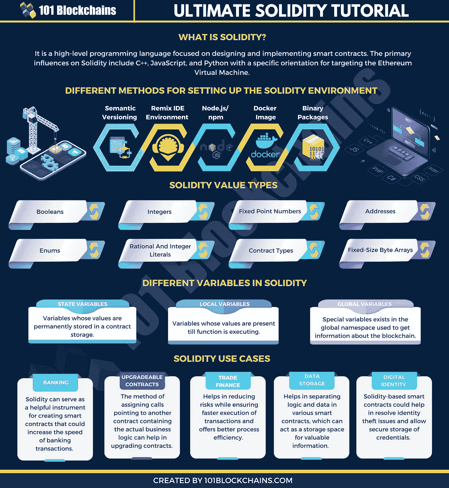
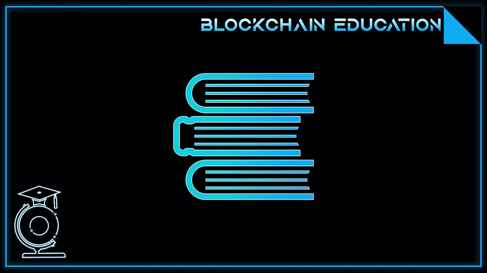

# 区块链中的坚固性是什么？

> 原文：<https://medium.com/coinmonks/what-is-solidity-in-blockchain-473827a9b5b4?source=collection_archive---------27----------------------->

在我们的 YouTube 上观看视频的同时，享受这个流的资源！

YouTube:[https://youtu.be/eLj7f4X_68E](https://youtu.be/eLj7f4X_68E)

不和:【https://discord.gg/J73qhkj7kr】T2

推特:【https://twitter.com/CryptoverseDAO】

linktree:[https://linktr.ee/cryptoversedao](https://linktr.ee/cryptoversedao)

什么是扎实？

Solidity 是一种相当简单的语言，它是为处理现实世界解决方案的简单方法而特意创建的。加文·伍德最初是在 2014 年 8 月提出的。以太坊链的几个开发者如 Christian Reitwiessner，Alex Beregszaszi，Liana Husikyan，Yoichi Hirai 和许多其他人都为创造这种语言做出了贡献。Solidity 语言可以在以太坊平台上执行，以太坊平台是实现区块链网络以开发去中心化公共分类帐来创建智能合同系统的主要虚拟机。

这种语言具有与 C 和 JavaScript 相同的功能。此外，该语言支持状态变量(类似于面向对象编程中的对象)、数据类型和编程函数。然而，这种语言在整个平台上面临着持续的升级和快速的变化。因此，作为一名程序员，你需要通过以太坊平台论坛、博客和聊天室来关注更新。

然而，这种语言仍然要处理跨平台的不断更新和修改。随后，一个有抱负的 SOLIDITY 开发者应该通过以太坊平台的论坛、聊天室和网站了解更新。目前，以太坊和实体都在经历梦幻般的成长。

> 交易新手？尝试[加密交易机器人](/coinmonks/crypto-trading-bot-c2ffce8acb2a)或[复制交易](/coinmonks/top-10-crypto-copy-trading-platforms-for-beginners-d0c37c7d698c)

你能用坚固做什么？

正如我们上面解释的，稳固是以太网的基础。没有坚固性=没有以太坊。多亏了这种语言，你可以这样做:

Dapps:
编程语言让开发者能够创建自己的分散式应用。一种思考方式就像你在智能手机上获得的应用程序。你可以从 app store 下载各种应用，从游戏到健身到银行。Dapps 也一样。主要区别在于它们是开源的，没有中间人(因此有了“去中心化”这个词)。就像苹果应用商店中的应用程序是为了在 iOS 上运行而构建的一样，以太坊上的 dapp 是为了在 Solidity 上运行而构建的。

智能合约:在 Dapps 中，有几段代码，即智能合约。当满足某些条件时，这些帮助人们交换金钱、股票、财产和几乎任何有价值的东西。这样就不需要像公证人这样昂贵的第三方了。

初学者的坚实基础:

可靠性语言支持以下通用值类型:

布尔值:它返回一个 true 或 false 值。
整数:Solidity 支持无符号和有符号整数的 int/unit。
地址:一个地址最多可以携带 20 个字节的值。
字符串文字:使用双引号或单引号来描述字符串文字。它们意味着尾随值零。修饰符:修饰符确保在代码执行前满足预定义的条件。
映射:映射返回与给定存储站点相关的值。

这些泛型值类型可以进一步集成，以开发复杂的数据类型。

让我们稍微深入一下上面的值类型:

我们将从理解语法和一般数据类型以及变量数据类型开始。Solidity 支持通用值类型，即:

布尔值:返回值为真或假。返回布尔数据类型的逻辑运算符如下:

！逻辑否定
& &逻辑合取，“与”
||逻辑析取，“或”
==相等
！=.不平等

整数:Solidity 分别支持有符号和无符号整数的 int/unit。这些存储分配可以有不同的大小。uint8、uint256 等关键字可以分别用来分配 8 位到 256 位的存储大小。默认情况下，分配是 256 位。也就是说，uint 和 int 可以用来代替 uint256 和 int256。与整数数据类型兼容的运算符有:

比较:<=, =，>。这些用于评估 bool。
位运算符:&，|，^按位异或‘或’，~按位求反，“非”。
算术运算符:+，-，一元-，一元+，*，/，%余数，**取幂，<T22【左移，>右移。

当模数运算符应用于“除以零”运算的零时，EVM 返回运行时异常。

地址:一个地址可以容纳一个 20 字节的值，相当于一个以太坊地址的大小。这些地址类型由作为合同基础的成员支持。

字符串文字:字符串文字可以用单引号或双引号来表示(例如，“foo”或“bar”)。与 C 语言不同，Solidity 中的字符串文字确实意味着尾随值零。例如，“bar”将表示三个字节的元素，而不是四个。类似地，在整数文字的情况下，文字本身可以使用相应的 fit 进行转换，即字节或字符串。

修饰符:在智能契约中，修饰符用于确保在执行代码之前定义的条件的一致性。

Solidity 提供了基本的数组、枚举、操作符和哈希值来创建一个称为“映射”的数据结构这些映射用于返回与给定存储位置相关联的值。

数组是由程序员定义大小的连续内存分配，其中如果大小被初始化为 K，并且元素的类型被实例化为 T，则数组可以被写成 T[k]。

数组也可以用符号 uint[][6]动态实例化。这里的符号用六个连续的内存分配初始化一个动态数组。类似地，二维数组可以被初始化为 arr[2][4]，其中两个索引指向矩阵的维度。

我们将从一个简单的契约结构开始我们的编程冒险。考虑以下代码:

pragma solidity⁰.4.0；
合同存储基础{
单位存储值；
函数集(uint var){
stored value = var；
}
函数 get()常量返回(uint) {
返回 storedValue
}
}

在上面的程序中，第一行代码声明了要用 Solidity 的 0.4.0 版本编写的源代码。因此，该代码将与相应的 EVM 或任何其他高级版本兼容。

这样的声明对于确保程序在编译器的所有兼容版本中都能按预期执行是至关重要的。单词“Pragma”指的是给编译器的指令，用于顺序执行源代码。

Solidity 是静态类型化的语言。因此，每个变量类型无论其作用域如何，都可以在编译时实例化。这些基本类型可以进一步组合以创建复杂的数据类型。然后，这些复杂的数据类型根据各自的偏好相互同步。

编译和测试我们的智能合同:

要在本地系统上测试您的智能合约，您需要安装一个易于使用的测试环境，并接受简单的 Truffle 命令。您可以使用以太坊 TestRPC 来实现这一点。它基本上是一个细长的代码，在用户站点创建一个“假”节点，并使用 8545 端口编译您的 Solidity 代码。编译器将源代码转换成 EVM 代码，从而使您能够测试您的代码，而实际上不必花费您的以太币。以下是一些快速安装命令:

npm i -g 以太坊-testrpc
testrpc -m“这是示例代码检查检查”

要在 Truffle 中启动编译命令，我们使用以下命令:

一旦源代码编译成功，控制台会返回一条“保存工件”的消息。否则，它会返回代码的编译错误。

一旦你熟悉了智能合约的概念，继续学习以太坊网络上的 DApp 设计。

智能合约为在线业务和区块链创新创造了一个充满机遇的新世界。该技术通过创建去中心化的账本来验证和促进数字谈判并展开合同，从而诞生了区块链 2.0。稳健是一种语言，它将使合同系统发挥其真正的潜力并超越它。

作为一名初学者，本指南向您概述了该语言中涉及的编程规则，以及如何使用这些基础知识来创建您自己的智能合同系统。

概述:执行的稳健性流程

Solidity 与另一种编程语言 JavaScript 在语法上的一致性极大地提高了系统的可用性。作为初学者，你必须清楚 solidity 编程语言命令下的执行过程:

以太坊格式文档绘制了一个 32 字节大小的指令文本，其中包含一个堆栈和内存模型。EVM 生成一个程序堆栈，用于监控信息存储和程序计数器下的注册表。为了保持一个连续的流来控制程序，程序计数器循环/跳跃。

此外，与由区块链的节点提供的永久存储许可相比，虚拟存储器为信息分发提供了在某种程度上可扩展的短存储器。

为以太坊创建 solidity 语言的目的是维护智能合约的确定性和准确性。该节点在以太坊中的连接块内执行编程工具和智能契约，以创建新的块。

这意味着正在执行的代码是根据块的顺序注册的。

当进入执行过程的新阶段时，程序阶段转移到新的存储交换。首先，这些交换在矿工的位置进行。执行后，新块被分散到区块链内的不同工作节点。

为了确认智能合约框架的可信度，每个节点通过使用块的任何本地副本关联状态变化来自主检查块。在状态变化是确定性的情况下，区块链的节点接受交换。类似地，在节点不能达成一致的情况下，块的执行停止，并且网络可以结束。

结论

可靠性是一种语言，它有能力开发具有健壮功能的合同框架。智能合约为区块链的进一步发展和在线业务的多个领域创造了大量机会。

