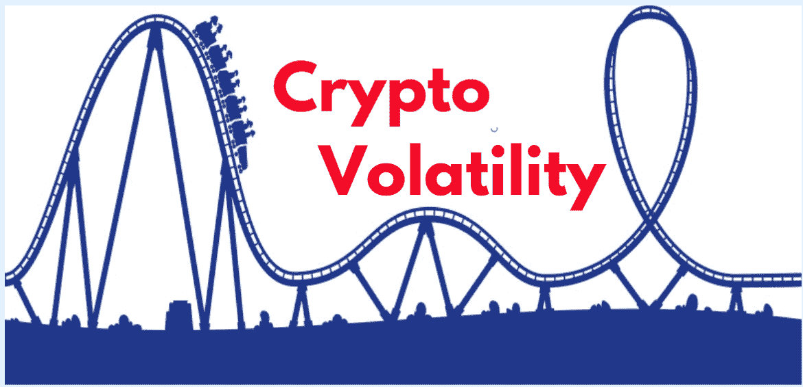
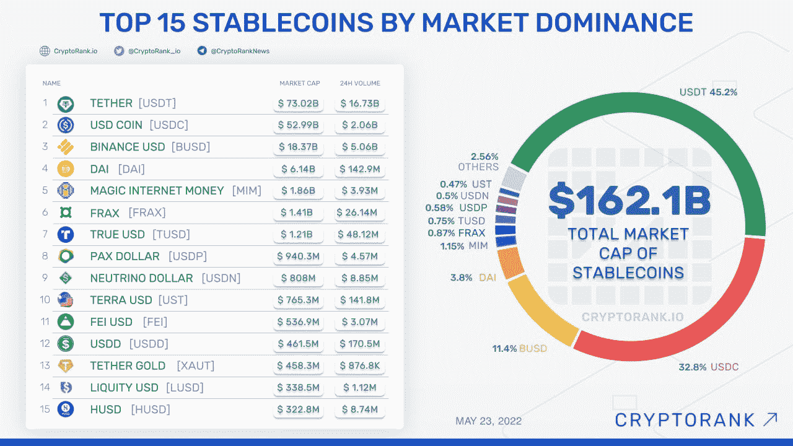

# 什么是 Stablecoin 密码？

> 原文：<https://medium.com/coinmonks/what-is-stablecoin-crypto-4d7f4aabced2?source=collection_archive---------35----------------------->

# 关键要点

*   Stablecoins 有效地弥合了法定货币和加密货币之间的鸿沟。
*   Stablecoins，或持有基本一致价值的数字资产，在分散金融(DeFi)和更广泛的区块链生态系统中释放出广泛的效用。
*   稳定信贷的主要类型是法定抵押和加密抵押，而算法管理和商品抵押的稳定信贷也正在出现并推动创新。

在比特币开创了加密货币的行业之后，市场上爆发了很多新的概念和理论。近年来流行的一个概念是稳定币。那么，什么是 stablecoin，它与市面上的其他 cryptos 有何不同？

加密货币的概念已经变得非常流行，因为它建立在区块链和密码学的坚实理论基础上。然而，像比特币和替代币这样的数字资产本质上是不稳定的。稳定的货币提供了数字货币的优势，同时消除了波动性。

现在想象一下拥有一种安全、低成本、有资产支持的加密货币。是的，资产担保，看起来不真实，但有稳定的收入是可能的。是的，这是一个全新的术语，正在攀登加密普及阶梯。你可能想了解更多关于资产支持加密货币的信息，所以不再拖延，让我们开始吧。

# 什么使稳定的硬币稳定？

Stablecoins 是一种加密货币，其价值与另一种资产挂钩(相当于)。该资产可以是美元、另一种货币或加密货币、黄金等贵金属或多种因素的组合。

最有利的选择之一是美元，许多稳定的货币的基础资产是美元。也就是说，1 稳定币等于 1 美元。因此，stablecoins 消除了加密价格的波动性，同时利用了它们的透明、隐私和安全等特性。

此外，稳定的债券也有基础资产支持。换句话说，假设有 10 万美元的硬币在流通，那么随后的金额应该放在银行储备中。

# [稳定的优势](https://www.analyticssteps.com/blogs/stablecoins-explained-types-examples-advantages-and-investing-guide)

*   与其他加密货币相比，稳定币的波动性较小。
*   投资稳定的股票是安全的；由于有固定资产的支持，稳定的货币。
*   稳定的货币有利于国际支付；在国外支付从未如此简单。

# 2022 年的稳定增长类型

[稳定的硬币主要有 4 类](https://www.blog.xanpool.com/post/what-is-stablecoin):

## fiat-collateralized stable coins(离链)

最常见的稳定币与法定储备挂钩(就像一美元)。这些硬币与选定的法定货币以 1:1 的比例持有。对于流通中的每一种稳定的货币，银行账户中都会持有等量的货币。这种稳定的硬币是由等价的法定货币支持的。

Tether (USDT)和 TrueUSD (TUSD)是受欢迎的稳定货币，由美元储备支持，与美元平价。

## 商品抵押债券

与比特币不同，基于商品的稳定币持有有形资产来支撑其价值。资产可以是黄金、房地产、石油等。创建代表物理资产的令牌(stablecoins)可以为新业务打开窗口。此外，稳定的信贷不受地理位置的限制，这增加了流动性、透明度和效率。

## 加密抵押的稳定硬币(链上)

这种稳定的货币得到了比特币和以太坊等其他加密货币的支持。由于基础加密货币极易波动，稳定的加密货币被过度抵押。这意味着密码的高价值需要被存储为资产。

## 算法稳定积分

[算法稳定币](https://www.investopedia.com/terms/s/stablecoin.asp)不使用法定货币或加密货币作为抵押品。相反，它们的价格稳定源于使用专门的算法和智能合约来管理流通中的代币供应。当市场价格低于其追踪的法定货币价格时，算法稳定币系统将减少流通中的代币数量。或者，如果代币的价格超过其追踪的法定货币的价格，新的代币进入流通，以向下调整稳定的硬币价值。

# 使用哪种稳定币？

[最稳定的加密货币列表](https://www.bankoncube.com/post/most-stable-cryptocurrencies-for-investment-in-2021)按市值排序，因为它被认为是稳定货币价值的真实指标，因为它们大多数都与价值为 1 的美元挂钩。你可以看下面的图片来了解当前稳定的硬币市场。

Image credit to Cryptorank.

# 你该不该投资稳定的股票？

稳定的硬币不是典型的赚钱机器。在这一点上，它们不同于比特币、以太坊和其他密码播放器。但它们是更可靠的资产，波动性最小。因此，如果你想要一份被动收入和区块链技术来加快点对点支付和交易，它们是一个不错的选择。

查看我们与加密货币和稳定货币相关的 10 大问题和答案。

[https://medium . com/@ alpynelabs/new-to-crypto-thes-the-answers-to-your-top-10-questions-f842b 0553233](/@alpynelabs/new-to-crypto-these-are-the-answers-to-your-top-10-questions-f842b0553233)

> *加入 Coinmonks* [*电报频道*](https://t.me/coincodecap) *和* [*Youtube 频道*](https://www.youtube.com/c/coinmonks/videos) *了解加密交易和投资*

# 另外，阅读

*   [有哪些交易信号？](https://coincodecap.com/trading-signal) | [Bitstamp vs 比特币基地](https://coincodecap.com/bitstamp-coinbase) | [买索拉纳](https://coincodecap.com/buy-solana)
*   [密码交易机器人](/coinmonks/crypto-trading-bot-c2ffce8acb2a) | [维护审查](https://coincodecap.com/uphold-review)
*   [如何给 MetaMask 钱包添加 Arbitrum？](https://coincodecap.com/how-to-add-arbitrum-to-metamask-wallet)
*   [KuCoin vs 北海巨妖 vs BitYard](https://coincodecap.com/kucoin-vs-kraken-vs-bityard)
*   [加密交易的最佳 VPN](https://coincodecap.com/best-vpns-for-crypto-trading)
*   [ProfitFarmers 回顾](https://coincodecap.com/profitfarmers-review) | [如何使用 Cornix Trading Bot](https://coincodecap.com/cornix-trading-bot)