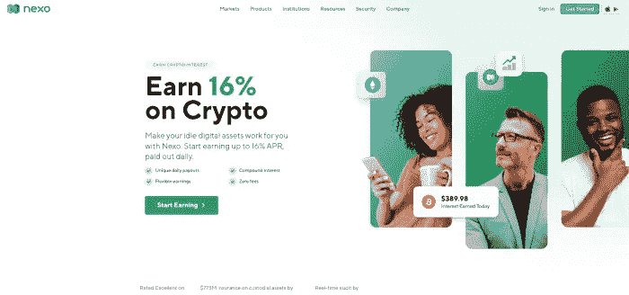

# 什么是赌注？

> 原文：<https://medium.com/coinmonks/what-is-staking-c90d22427504?source=collection_archive---------29----------------------->

Illustrated

像很多加密的东西一样， **staking** 可能是一个复杂的想法，也可能是一个简单的想法，这取决于你想要解开多少层理解。对于许多交易者和投资者来说，知道**下注**是持有某些加密货币获得回报的一种方式是关键。但是，即使你只是想获得一些**赌注**奖励，至少了解一点它是如何以及为什么以这种方式工作也是有用的。

# 赌注是如何运作的？

Illustrated

如果你拥有的加密货币允许**下注**——目前的选项包括以太坊、Tezos、Cosmos、Solana 和 Cardano——你可以“下注”你的一些资产，并随着时间的推移获得百分比奖励。

你的密码在下注时获得奖励的原因是区块链让它发挥作用。允许**赌注**的加密货币使用一种被称为“赌注证明”的“共识机制”，这是他们确保所有交易都得到验证和保护的方式，中间没有银行或支付处理器。你的密码，如果你选择赌注，成为这个过程的一部分。

# 为什么只有部分加密货币有跑马圈地？

这是它开始变得更加技术性的地方。例如，比特币不允许**下注**。要理解为什么，你需要一点背景知识。

加密货币通常是分散的，这意味着没有中央权威机构在运作。那么，在一个分散的网络中，所有的计算机如何得到正确的答案，而不需要像银行或信用卡公司这样的中央权威机构来提供答案呢？他们使用“共识机制”

*   许多加密货币——包括比特币和以太坊 1.0——使用一种被称为工作证明的共识机制。通过工作证明，该网络在解决一些问题时投入了巨大的处理能力，如验证地球两端陌生人之间的交易，并确保没有人试图花同样的钱两次。这个过程的一部分涉及到全世界的“矿工”，他们竞相成为第一个解开密码难题的人。获胜者有权将最新的“验证交易块”添加到区块链上，并获得一些密码作为回报。
*   对于像比特币这样相对简单的区块链(其功能很像银行的账本，跟踪进出交易)，工作证明是一个可扩展的解决方案。但是对于像以太坊这样更复杂的东西——它有各种各样的应用程序，包括在区块链上运行的整个 DeFi 世界——当有太多活动时，工作证明可能会导致瓶颈。因此，交易时间可能会更长，费用可能会更高。

# 跑马圈地有什么好处？

许多长期密码持有者将**赌注**视为一种通过产生回报使他们的资产为他们工作的方式，而不是在他们的密码钱包中收集灰尘。

**Staking** 还有一个额外的好处，那就是有助于您所支持的区块链项目的安全性和效率。通过**下注**你的一些资金，你使区块链更能抵御攻击，并加强其处理交易的能力。

# 您可以使用哪个平台进行标桩？

Nexo Earn Interest

[**Nexo**](https://nexo.io/) 是一家在美国有牌照的借贷平台。 **Nexo** 成立于 2018 年。用户目前可以在 Nexo 平台上以每年高达 10%的利息下注 Stablecoin。Nexo 也被称为 Stablecoin **Staking** 的最佳平台之一。

> [*在这里注册一个新的 Nexo 账户*](https://nexo.sjv.io/PartnerNexo)

发生在和之间的事情让投资者对交易所失去了信心。 [FTX 对投资者撒谎导致 FTX 崩溃](https://www.bloomberg.com/news/articles/2022-11-11/sam-bankman-fried-s-assets-go-from-16-billion-to-zero-after-ftx-collapse)。然而，与 FTX 不同的是， **Nexo** 了解 FTX 的问题并公布所有信息。

*   投资者可以查看 Nexo 的牌照:[https://nexo.io/licenses-and-registrations](https://nexo.io/licenses-and-registrations)。
*   Nexo 的实时证明:[https://real-time-attest.trustexplorer.io/nexo](https://real-time-attest.trustexplorer.io/nexo)
*   投资者对 Nexo 的保险:通过 Nexo 与 BitGo、Ledger、Bakkt、Fireblocks 和其他顶级托管人的合作，Nexo 钱包的总保险金额已增加到 7.75 亿美元，这些托管人的设施通过伦敦劳埃德保险社和 Marsh and Arch 的保险公司辛迪加进行保护。
*   诱人的 Stablecoins 储蓄利率:Nexo 在 Stablecoins 的储蓄利息和币安差不多，最高每年 10%，最低灵活 8%。然而，投资者在币安只能存 2000 美元以获得灵活的储蓄利息。但在 Nexo，投资者可以存入最高 10 万美元的灵活储蓄利息。

# 结论

对于加密领域的任何投资者来说，下注是最安全的方式。通过**下注**赢得您的钱。DCA 你的代币用**跑马圈地**才是长久之计。你以后会因为这件事觉得自己很幸运。如果你担心**打桩**的风险，你也可以在 **Nexo** 上**打桩** flex。

> [*在这里注册一个新的 Nexo 账户*](https://nexo.sjv.io/PartnerNexo)

以上都是**什么是跑马圈地？**如果你对我有任何问题，请在本帖下方评论；我会为你写下他们。别忘了跟随我的媒介。祝你投资之旅成功。

> ***阅读更多:***[***https://medium . com/coin monks/how-to-optimize-stable coin-with-nexo-1 D8 ffc 976262***](/coinmonks/how-to-optimize-stablecoin-with-nexo-1d8ffc976262)

> 交易新手？尝试[加密交易机器人](/coinmonks/crypto-trading-bot-c2ffce8acb2a)或[复制交易](/coinmonks/top-10-crypto-copy-trading-platforms-for-beginners-d0c37c7d698c)