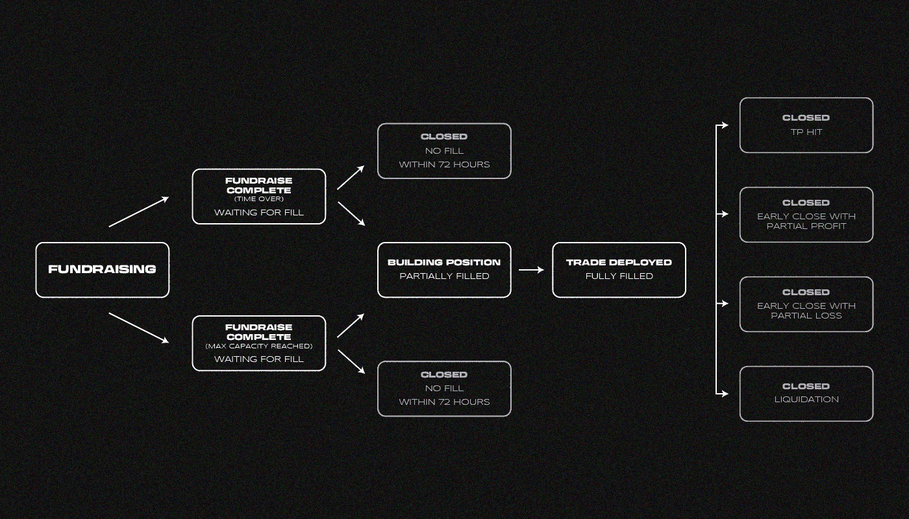

# 什么是 STFX？

> 原文：<https://medium.com/coinmonks/what-is-stfx-2722896b0d39?source=collection_archive---------6----------------------->

STFX，单一贸易金融交易所，是短期资产管理的 DeFi 和 SocialFi 协议。它的理念是什么？让我们来了解一下！

该项目首创了**单一交易金库**的概念——专门用于**一笔交易**的短期、非托管、主动资产管理金库。stv 与迄今为止存在于 DeFi 和 TradFi 中的长期、持续、多资产投资组合形成对比。

其思路很简单: **1 STV = 1 金库= 1 交易**。

STFX 允许用户创建或投资专注于单一交易的短期 stv。

# **其产品有哪些？**

*   STFX 是一个分散的协议，运行在乐观主义的 L2 解决方案上
*   单一交易基金交易所(STFX)是基于单一交易基金(STF)的产品
*   STF 金库(作为一种产品)是一种来自用户(管理者)的交易交易的投资理念，其金融模式是基于来自其他用户(投资者)的众筹
*   STFX 的主要思想是从长期股票和交易策略转向快速和短期交易
*   该项目被定位为加密货币投资市场的抖音

# **产品的目标受众是什么？**

*   有自己策略的雄心勃勃的交易者，他们缺乏交易大量资金的资源
*   失去存款的交易者
*   无法置身于市场之外的高风险投资者

**STFX 用户:**

*   创建和管理交易策略的经理
*   投资者

# **它是如何工作的？**

## **系统流程:**

1.  经理概述了交易参数:工具类型、方向、近似进场、止损或平仓、获利和杠杆。管理人员将选择他们希望哪些参数可见，哪些保持不透明
2.  经理“启动”金库，金库将来自步骤#1 的基础交易参数作为元数据推入乐观智能合约
3.  印心后，STV 募款期开始。当出现以下情况之一时，筹款将完成:达到保险库筹款能力，或持续时间限制到期
4.  一旦筹款结束，将向金库征收佣金，收集的资金将自动转移到永久协议。这些资本随后被用作保证金抵押品，以根据合同规范执行交易
5.  交易在永久协议和其他分散的衍生产品交易所进行
6.  一旦头寸被平仓(TP/SL/清算被触发)，PnL 被发送回乐观智能合约
7.  如果产生了利润，管理人和 STFX 平台的绩效费将被记入借方，然后投资者可以要求他们的原始本金+应计利润
8.  STF 金库(作为一种技术解决方案)是一种智能合约，用户可以向其发送资金，以参与投资交易。

## ***【STF】—*—**

*   交易资产
*   交易方向(多头/空头)
*   交易金额
*   交易杠杆(最大值— x10)
*   获取利润值
*   止损值
*   为交易实施收集资金的时间

–最少 1 小时

–最多一周

## ***永久协议——STF 的执行者——金库***

–STFX 是一个接受者，它通过 STF 智能合同以永久协议向其用户下订单

–一旦 STF 保管人收集了资金并确认可以进行交易，STFX 将自动使用收集的资金在永久协议中的 STF 账户参数上开立一个头寸

–如果 72 小时后，STF 账户经理没有确认准备好开仓，所有投资者都可以拿回他们的资金

# ***STFX(作为技术方案*** )

*   STF-金库集合器
*   用于创建和投资交易的用户界面

## ***STF——金库管理员:***

–通过用户界面创建 STF 保险库

–管理 STF 金库:

*   确认准备开始交易
*   未平仓交易
*   关闭交易

–根据 STFX 过去的交易，每个经理都有一定的声望

*高声誉允许:*

*   提高托管保险库的资金上限
*   同时管理更多保管库(开始时管理 1 个保管库)

–不直接管理投资者资金

## ***投资方:***

–在交易中投资他们的资金

–从成功的交易中获得一定比例的利润和初始投资资金

–收到初始投资资金减去不成功交易的损失

–收到他们的初始投资减去盈亏平衡交易的协议费

–每个投资者都有不同的声誉水平，这取决于过去的保险库投资

–高声誉允许同时投资更多金库(开始时同时投资 3 个金库)

# **记号组学**

STFX 是 STFX 平台的本土标志，1B 单位的供应有着严格的上限，随着时间的推移，将表现出通缩属性。STFX 被设计成一种实用令牌，为网络中的许多关键功能提供服务。

代币的总数是 10 亿

代币赌注者将从协议业务中收取 80%的费用

代币赌注者的佣金降低

# **项目怎么赚？**

佣金——所有 STF 股份的 0.3%

佣金——所有盈利交易的 3%,不考虑原始佣金

## **利润分配**

*   协议利润的 80%归赌注者所有
*   20%的利润归道 STFX 协议库所有

# 它有什么风险？

–永久协议将无法应对 STFX 的交易量。在这种情况下，它可能会膨胀其流动性(如果 STFX 变得更受欢迎，这是有可能的)

–永久协议限于 2 亿至 2.2 亿美元 TVL

*为了实现高销量，STFX 必须:*

*   如果永久协议在达到最大 TVL 之前无法处理交易，那么就做一个流动性提供者
*   寻找其他 DEX 衍生品来提供交易
*   创建自己的 DEX 衍生品，并在那里提供流动性

–黑掉 STFX/永久智能合约。该项目需要在 testnet 格式的审计和压力测试

# 结论

1.  该团队对其目标受众有一个清晰的概念。项目团队明白，大多数人在密码领域寻找情感和快钱
2.  该项目有潜力成为解决实际市场问题的成熟产品
3.  市场目标是提供一种产品，为每个希望且不需要太多时间的人提供便捷的加密货币访问
4.  作为一项业务，该产品可以通过佣金和清算其用户的永久头寸来产生利润(投资有直接回报)
5.  该产品能够扩展到不同的网络和协议，这将吸引更多的用户
6.  该产品基于经理人-投资者-协议之间的平衡机制，每个人都从中获利
7.  永久协议作为一个实施平台，在流动性和交易抵押品数量方面提出了几个问题
8.  现在一切都处于早期阶段，项目有基础，有市场眼光，有团队，有想法。它需要扎实的营销才能成功
9.  这个项目是在熊市中进行的，团队不会有过高的期望，会有时间实现所有的产品想法

> 如果你对 STFX 的话题有任何补充，欢迎评论！
> 在追踪更新方面，订阅我们的[中馈](https://medium.com/sunflowercorporation)。
> 敬请期待！

> 交易新手？尝试[加密交易机器人](/coinmonks/crypto-trading-bot-c2ffce8acb2a)或[复制交易](/coinmonks/top-10-crypto-copy-trading-platforms-for-beginners-d0c37c7d698c)