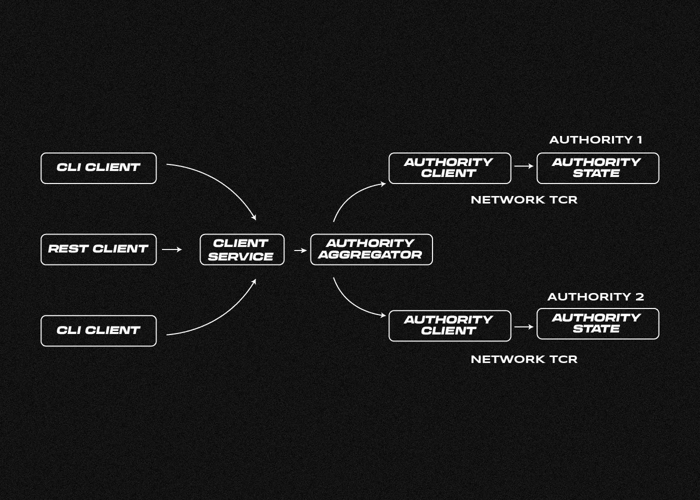
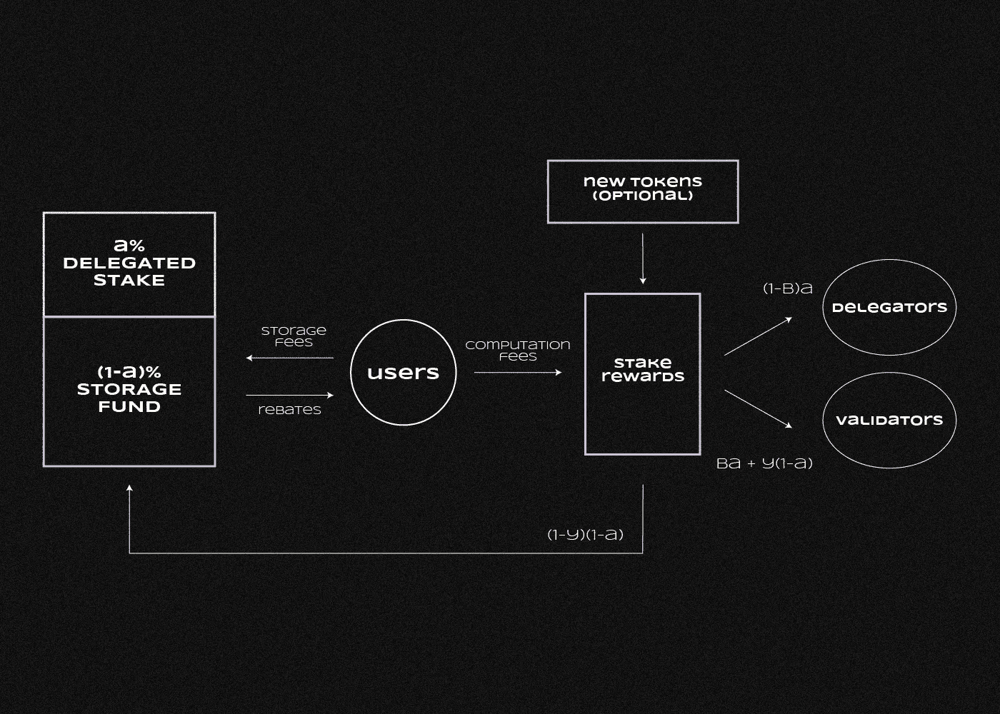

# 什么是 Sui 区块链？

> 原文：<https://medium.com/coinmonks/what-is-sui-4e904e4f8e7e?source=collection_archive---------2----------------------->

***Sui 是由 Mysten 实验室开发的高性能第 1 层(L1)区块链，用于分散式延迟敏感型应用。它是如何工作的？这些项目的前景如何？一起来了解一下吧！***

Sui 区块链，像 Aptos 一样，是基于 Diem 的工作，一个失败的 Meta 公司区块链平台。Sui 代码是使用为 Diem 开发的 Move 语言的修改版本编写的。

具有堆叠和委托能力的利益证明算法确保了 Sui 网络的操作和安全性。

Sui 的共识过程采用了新颖的 Narwhal 和 Bullshark 协议，这两个协议支持并行计算，使得 Sui 具有高度的可伸缩性。

# 谁开发和资助项目？

Sui 区块链由 [Mysten Labs](https://mystenlabs.com/) 开发，该实验室于【2021 年 9 月在加利福尼亚州由一群前 Novi Research 的高管和开发人员创建，Novi Research 是 Meta Corporation 的一个部门，从事 Diem 区块链和 Move 编程语言的工作。**Novi Research 前研发总监 Evan Cheng** ，Mysten Labs 联合创始人兼首席执行官。

新项目于 2022 年 3 月 22 日首次公开宣布，并于 2021 年秋季开始工作。

这家初创公司已经筹集了两轮资金。知名的 Andreessen Horowitz 基金在 2022 年初领投了 3600 万美元的 A 轮，第二轮 B 轮融资 3 亿美元，Mysten Labs 估值 20 亿美元。

隋考网[2022 年**8 月**推出](https://sui.io/resources-sui/announcing-sui-incentivized-testnet/)。

# Sui 的特点和优势

Sui 开发人员将其定位为一个通用网络，具有高带宽、快速和廉价的交易，以及易于使用的 Web3 界面。Mysten 实验室的任务是建立一个运行高性能分散应用的平台。

Sui 的架构在[白皮书](https://github.com/MystenLabs/sui/blob/main/doc/paper/sui.pdf)和[技术文档](https://docs.sui.io/)中有详细描述。该项目的一个特点是使用了自己的编程语言 Sui Move，这是为 Diem 项目开发的 Move 的修改版本。在其他区块链中，基本存储单元是账户，而在 Sui 中，这些是由智能合约创建和管理的对象。一个对象可以是任何类型的资产，并且它们中的每一个都有一个惟一的标识符、一个所有者以及可改变或不可改变的属性。

隋区块链上的每一件物品都有一段可以追溯到它诞生之初的历史。如果它们的历史记录不重叠，那么与它们的事务可以按任何顺序或并行处理。由于这个特性，Sui 可以并行处理多组交易，但没有重复支出的风险。

该特性允许网络带宽的水平扩展，整体性能仅由处理事务的节点数量决定。在测试条件下，Sui 区块链[显示](https://mirror.xyz/orangex.eth/_8a8wgQ3WBNdB7vMYoRY2HxDLuDdzXPqIDdCdwOht4o)的速度超过每秒 120，000 次交易，平均延迟约为 2 秒。

# 隋是怎么工作的？

隋区块链采用众所周知的证据利害关系(PoS)共识算法。事务由验证器组处理，验证器组的组成由每个时期(24 小时)当前活动的完整节点的数量决定。截至 2022 年**11 月**结束，[测试网络](https://explorer.devnet.sui.io/)拥有 4 个验证器和超过 5200 个活跃节点。

事务处理过程根据它是涉及单一所有者对象(任何类型的资产)还是“共享对象”(例如，公共智能合同)而有所不同。

第一类交易包括硬币转移、NFT 发行和投票。此类交易使用基于拜占庭式一致广播机制的简化快速支付程序进行处理。它由四个步骤组成:

1.  事务被发送到一个节点，该节点将其“分发”给验证器；
2.  验证者投票验证交易，并将结果传递给发送者；
3.  发送者创建包含至少 2/3 验证者签名的证书；
4.  证书被发送给验证者，验证者对其进行验证。然后交易进入区块链。

在这个过程中，验证器之间没有共识搜索，这大大减少了事务处理时间。

Parallel transaction processing in Sui using Byzantine Consistent Broadcast. Source: [Sui](https://docs.sui.io/learn/how-sui-works)

反过来，使用共享对象执行事务的过程包含另一个阶段——使用 Sui 共识引擎在验证器之间搜索共识。它由两部分组成:

*   Narwhal
    一个高带宽的 mempool(未确认交易的“等候室”)，负责确保提交给验证器进行确认的数据的同步和可用性。
*   牛鲨
    基于有向无环图和拜占庭容错技术的共识协议。Bullshark 特性允许达成共识，而不需要验证者交换信息。

该过程不仅确保了高网络性能，还确保了容错性，因为即使大量有故障的验证器也不会导致性能下降，而现有的 PoS 区块链就是这种情况。

# 隋加密货币的令牌学和功能

核心网和原生隋币什么时候上线没有信息。然而，该团队已经揭示了该项目的[记号组学](/mysten-labs/announcing-sui-tokenomics-9cb829086e30)。可用的最大金额将是 100 亿个硬币。十亿雾单位将被[分成](https://sui.io/resources-sui/announcing-mist/)个隋币。

当 mainnet 启动时，只有一部分 SUI 发行版将被发行，其余部分将用于 Mysten 实验室团队、投资者、社区成员、验证者奖励和其他目的。Sui 基金会是一个独立于 Mysten Labs 的组织，将资助黑客马拉松，会议，应用开发和开发团队，将获得相当大一部分硬币。

Scheme of Sui Cryptocurrency Stacking and Tokenomics. Source: [The project website](https://docs.sui.io/learn/tokenomics)

隋币有几个作用:

*   验证率；
*   通过赌注委托给验证者(对于普通硬币持有者)；
*   支付交易费用；
*   隋生态系统中的交换、定居和积累手段；
*   通过在线投票参与隋的区块链管理。

SUI 令牌持有者向每个验证器分配一定数量的 SUI 硬币。委派的硬币在纪元期间被锁定，并在纪元结束时获得一部分赌注奖励。因此，当时代改变时，持有人只能撤销他们的 sui 或改变他们的代表。Sui 团队已经声明，完整节点的持有者、开发人员和测试网络中的积极参与者将获得奖励。在主网络中启动 SUI 协议后，节点所有者将每人获得 2,000 SUI，该协议将在一年内禁止销售。

# 隋区块链周围的生态系统是如何演变的？

项目团队已经启动了与 Sui 测试网络通信所需的基础设施。 [Sui Explorer](https://explorer.devnet.sui.io/) block 浏览器于 2022 年 8 月发布，详细展示了博客、地址、交易等信息。

作为谷歌 Chrome 扩展的 Sui 钱包也可以使用。它使用户能够在种子短语的帮助下生成新地址和恢复现有地址，以及查看和管理所有类型的资产，包括 NFT，并与分散的应用程序进行交互。通过其中一个“水龙头”，如 NFT 市场 [BlueMove](https://sui.bluemove.net/) ，钱包可以填充 SUI 测试令牌。

第三方开发团队已经在基于 Sui 开发 60 多个项目。其中包括:

*   分散交易所 [Suiswap](https://suiswap.app/) ，[MovEx](https://www.movex.exchange/)；
*   DeFi services [塞特斯](https://cetusprotocol.crew3.xyz/questboard)，Porto Labs，Kxfinance，Leizd Protocol
*   交叉链桥虫洞和轴网；
*   域名服务[suin 域名服务](https://sui-names.com/)、[suin](https://www.suins.io/)；
*   社交网络 [ComingChat](https://coming.chat/) ，AskMeX，Peeranha
*   NFT 商场蓝动，隋艺术，隋画廊；
*   收藏[隋小混混](https://suipunks.xyz/)、隋飞鸟、隋飞沫；
*   游戏试玩 Xtrem， [F1 狗](https://f1.dog/)，Netmarble。

# 该项目的前景

2022 年 7 月，Mysten Labs 的 Alonso de Gortari 在一次问答会上表示，该公司正在计划公开发售代币，计划在今年晚些时候推出核心网络和 SUI 硬币。然而，自那时以来，项目小组没有就这一问题发表任何声明或补充意见。

最近，Sui 基金会，一个建立在其门户网站上的非盈利组织，宣布了一项针对 Sui 生态系统中应用程序开发者的[资助计划](https://suifoundation.org/#apps)。为从社交网络和游戏到支付系统、金融和法律服务的广泛应用创造解决方案的团队将能够获得 10-10 万美元的资助。

该团队对早期测试网络节点所有者的承诺奖励，以及 Sui 生态系统中大量没有自己令牌的项目，已经引起了 retrodrops 猎人的兴趣。但普通隋测网用户获得奖励的几率未知。

> 你有什么想法？如果你对隋话题有什么补充，请在下面留下你的评论！
> 
> 在[媒体](/@SunflowerCorpAdmin)或[推特](https://mobile.twitter.com/sunflower_corp)上关注[向日葵公司](https://sunflowercorp.com/)，定期更新热门的秘密新闻。

[*向日葵公司*](https://sunflowercorp.com/) *—专注于最佳交易体验和卓越技术的新型加密货币衍生交易所。*

*我们提供杠杆高达 x100 的 BTC/USDT 永久期货，以及最具趋势性的工具。当您与我们交易时，您将获得一个可定制的交易终端、各种图表、技术分析工具、各种订单类型以及“止损”和“获利”订单选项。*

> 交易新手？尝试[加密交易机器人](/coinmonks/crypto-trading-bot-c2ffce8acb2a)或[复制交易](/coinmonks/top-10-crypto-copy-trading-platforms-for-beginners-d0c37c7d698c)
> 
> 加入 Coinmonks [电报频道](https://t.me/coincodecap)和 [Youtube 频道](https://www.youtube.com/c/coinmonks/videos)获取每日[加密新闻](http://coincodecap.com/)

## 另外，阅读

*   [复制交易](/coinmonks/top-10-crypto-copy-trading-platforms-for-beginners-d0c37c7d698c) | [加密税务软件](/coinmonks/crypto-tax-software-ed4b4810e338)
*   [网格交易](https://coincodecap.com/grid-trading) | [加密硬件钱包](/coinmonks/the-best-cryptocurrency-hardware-wallets-of-2020-e28b1c124069)
*   [密码电报信号](/coinmonks/top-3-telegram-channels-for-crypto-traders-in-2021-8385f4411ff4) | [密码交易机器人](/coinmonks/crypto-trading-bot-c2ffce8acb2a)
*   [最佳加密交易所](/coinmonks/crypto-exchange-dd2f9d6f3769) | [印度最佳加密交易所](/coinmonks/bitcoin-exchange-in-india-7f1fe79715c9)
*   [开发者最佳加密 API](/coinmonks/best-crypto-apis-for-developers-5efe3a597a9f)
*   最佳[密码借贷平台](/coinmonks/top-5-crypto-lending-platforms-in-2020-that-you-need-to-know-a1b675cec3fa)
*   [免费加密信号](/coinmonks/free-crypto-signals-48b25e61a8da) | [加密交易机器人](/coinmonks/crypto-trading-bot-c2ffce8acb2a)
*   杠杆代币的终极指南