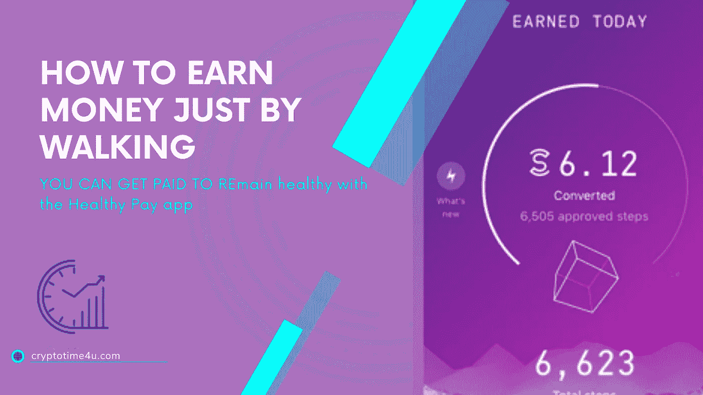

# 什么是 Sweatcoin，它能给你真钱吗？

> 原文：<https://medium.com/coinmonks/what-is-sweatcoin-and-does-it-give-you-real-money-b6838874b57f?source=collection_archive---------15----------------------->

Sweatcoin 是第一个以“移动赚取”模式建立的项目。它的目的是帮助用户从步行或跑步中获得金钱。Sweatcoin 最近获得了很多关注和炒作。它是关于什么的，它的效用是什么？让我们来看看。
sweat coin app 于 2016 年上线。Sweatcoin 的宗旨是健身和激励人们不断运动。该应用在全球拥有超过[***1.1 亿+用户***](https://cryptotime4u.com/what-to-know-about-cryptocurrency-and-scams/) ，推动着人们前进。

# Sweatcoin 实现了:

*   51 个国家的 7600 多万用户
*   600 个合作伙伴提供
*   使用 Sweatcoin 应用后，用户的工作效率提高了 20%
*   尤其是，仅在 2022 年，用价值 7000 万美元的商品和服务来换取台阶。

# Sweatcoin 是如何工作的？

这种加密货币的工作原理与任何其他基于区块链的加密货币一样，通过完成特定任务，你可以获得新的资产。你每走 1000 步，你会得到一枚运动硬币和 95%的金额。Sweatcoin 从所有产生的 sweat coin 中获得 5%的佣金。

用户必须与他人竞争。这有助于在您的社区中传播信息，并为提高效率和增加应用程序使用率提供灵感。
每成功推荐一个，奖励 5 个流汗币。
花运动币买小玩意等。

# sweatcoin 合法吗？

[阅读更多](https://cryptotime4u.com/what-is-sweatcoin-and-does-it-give-you-real-money/)

> 交易新手？尝试[加密交易机器人](/coinmonks/crypto-trading-bot-c2ffce8acb2a)或[复制交易](/coinmonks/top-10-crypto-copy-trading-platforms-for-beginners-d0c37c7d698c)