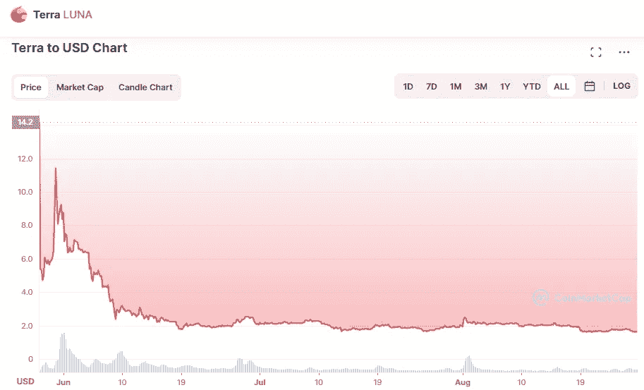

# 什么是 TERRA 2.0 (LUNA)以及 2022–2025 年的价格预测

> 原文：<https://medium.com/coinmonks/what-is-terra-2-0-luna-and-price-prediction-for-2022-2025-c95c86ea1835?source=collection_archive---------3----------------------->

Source photo [Terra price today, LUNA to USD live, marketcap and chart | CoinMarketCap](https://coinmarketcap.com/currencies/terra-luna-v2/)

# 什么是 Terra(露娜)？

如果不使用 Terra 系统的原始数字资产 LUNA，就无法创建 stablecoin peg。基于需求的状态，它被用来折价或溢价交易这些稳定的货币。有了 Terra，您可以进行即时的全球支付，而不需要中央机构。