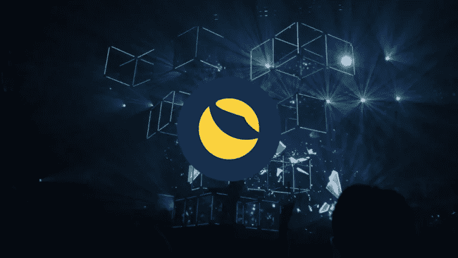

# 什么是 Terra(露娜)？历史、预测和预报

> 原文：<https://medium.com/coinmonks/what-is-terra-luna-history-forecast-and-prediction-e29a54b51989?source=collection_archive---------41----------------------->

Terra 加密货币 [**Terra(露娜)**](https://bit.ly/ProjectSerenityCryptoOfficial) 于 2019 年推出，但它却在 2021 年底——2022 年初被大家挂在嘴边。

短短一年时间，altcoin 的价值涨幅超过 5500%。如果在 2021 年 1 月，LUNA 的价格约为 1.5 美元，那么到 2022 年 1 月，它的价格已升至 85 美元。

2022 年 4 月，altcoin 汇率达到 116 美元的历史最高水平。仅仅几个月，硬币就崩溃了。根据 Glassnode 的数据，5 月份 UST 稳定币的崩溃和 LUNA 的坠落造成了当月 280 亿美元的损失。

在我们的材料中，我们决定弄清楚 LUNA 是如何工作的，它最近受欢迎的原因是什么，以及是什么导致了它最近的崩溃。

**什么是 Terra 加密货币(LUNA)**
LUNA 由韩国公司 Terraform Labs 发明。该公司由企业家 Daniel Sin 和 Do Kwon 于 2018 年创立。

邢之前在韩国在线机票预订服务公司 Ticket Monster 工作，该公司价值 17 亿美元。

LUNA 是 Terra 区块链的本地令牌，它基于一种算法稳定币(即一种使用算法来调节其市场供应的稳定币)。创造者不仅将 Terra 视为另一个区块链，还将其视为一个着眼于商业的成熟的金融和技术系统。

早在 2018 年，TechCrunch 就将该项目描述为“区块链上的支付宝”中国支付宝是世界上最大的支付系统之一，隶属于阿里巴巴集团。

Terrafrom Labs 表示，Terra 应该成为公司除了通常的 Visa、Mastercard 和其他支付方式之外的另一种支付方式。

Terra 的创造者选择 stablecoins 是有原因的。加密货币以其波动性而闻名，因此不适合支付商品和服务。另一方面，稳定的货币与法定货币挂钩，这意味着它们的汇率，顾名思义，更加稳定。的确，有些人认为算法稳定的点数比普通点数更容易波动。

为了开发这个项目，该公司获得了几十家组成 Terra 联盟的公司的支持。“联盟”的成员必须通过他们的服务来促进 Terra 的使用。

去年 12 月，Terra 成为仅次于以太坊的第二大智能合约平台。

**LUNA 加密货币的工作原理**
明确区分 Terra stablecoin 和 LUNA 加密货币非常重要。

除了其他事物之外，为了维持区块链大地的“平衡”,卢娜是必需的。更准确地说，露娜把泰拉稳定币的价格维持在要求的水平。

区块链有几种稳定的货币，与几种货币挂钩:欧元、美元、日元，甚至蒙古图格里克。视稳定币所挂钩的货币而定，它可以被称为 TerraUSD、TerraEUR 等等。

它是这样运作的:当 Terra 网络中所有参与者之间的交易量增加时，对 Terra stablecoins 的需求也会增加。在这种情况下，区块链发行新的月神硬币来保持稳定。

相应地，在相反的情况下——当交易量下降时——Terra 将多余的 LUNA“收回”并“烧掉”。

LUNA 的排放量被动态限制在 10 亿个硬币——也就是说，如果在某个时候超过了这个数量，那么超出的部分将自动“烧完”。

顺便说一下，Terra 和 LUNA 有这样的名字是有原因的。正如开发人员所设想的那样，它们象征着地球和月球之间的关系，这提供了“重力稳定性”。

使用露娜的其他方式
露娜不仅是维持整个 Terra 系统的平衡所需要的，也是在区块链进行采购所需要的。为了买东西，用户需要购买 Terra stablecoin。要做到这一点，你需要“烧掉”一定数量的月神币，获得稳定币，然后在区块链上运行的一个应用程序中付款。

由于特拉区块链运行在赌注算法的证明上，月神持有者可以使用硬币来下注。网络使用这些硬币来确认交易。

通过赌注，投资者还可以获得回报(交易费用的一部分)，并可以通过投票参与有关 Terra 生态系统的决策。

对于赌注，您可以使用 Terra Station 钱包。通过 Terra Station，您还可以访问在 Terra 区块链上运行的分散式应用程序。

**卢纳加密货币**增长的原因
直到 2022 年 5 月卢纳汇率大幅增长的原因被称为几个因素。

其中之一是投资者正在寻找以太坊区块链的替代品，以太坊仍然使用过时的工作证明算法(改用股权证明仍然只是承诺)，其特点是交易处理缓慢，以及交易佣金高。

出于同样的原因，被很多人称为以太坊“杀手”的索拉纳火了。另一个类似的例子是雪崩。

LUNA 受欢迎的另一个原因是 stablecoins 在世界上越来越受欢迎。正如我们已经指出的，与其他加密货币不同，稳定硬币的波动性要小得多，因此作为支付手段比比特币、以太和其他货币更有前途。

事实上，露娜与泰拉稳定币直接相关，这也可能会推高替代币的价格。

此外，有关项目发展的消息也会影响替代硬币的价格。因此，在二月底三月初的一周内，当人们知道 Terra 和 THORChain 协议的整合后，LUNA 的股价一下子上涨了 80%。

值得注意的是，在美国，Terra 与美国证券交易委员会(SEC)有一场法律战。证交会认为，区块链开发商非法向投资者出售证券。这与监管者对 Ripple 的创造者提出的主张是一样的。

5 月 9 日，星期一，Terra 生态系统的算法稳定币——Terra USD(UST)失去了与美元的挂钩(这是任何稳定币最重要的特征)。用于发行它的 LUNA 加密货币崩溃了 95%以上，目前仍处于自由落体状态。

LUNA 成为历史上第一个进入加密货币前 10 名，然后贬值 95%的硬币。由于主要生态系统模式的崩溃，投资者正在积极地从这个区块链土地上撤资。

Terra 称其目标是在传统金融和加密货币之间建立一座桥梁。为此，该项目推出了几个稳定的货币，包括与美元挂钩的 UST。UST 和卢娜(具有浮动汇率的系统的内部硬币)之间的交互算法负责 1: 1 的汇率符合性。正因为如此，UST 被称为算法币，或者分散的稳定币。

**2022 年 5 月初 UST 币的下跌**
2022 年 5 月初 UST 币跌破 1 美元的所有原因都还不清楚。但它随后的下跌暴露了一个漏洞，导致了之前一系列算法 stablecoins 的崩溃:UST 的价值取决于用户对 Luna 令牌价值的信心，而 Luna 的价值最终是基于对 UST 价格将保持稳定的信心。

UST 跌至 0.98 美元及以下的最初原因之一是加密货币市场的抛售，而这又是由美国股市的崩溃引起的。

TerraUSD 挂钩违约始于上周末，此前 TerraUSD 从 Anchor Protocol(一种面向加密投资者的分散式银行)退出了一系列大额交易。

Anchor 协议建立在 TerraUSD 所基于的同一 Terra 区块链网络的技术上。最近几个月，它已经成为稳定币的主要增长动力之一，因为它保证了加密投资者在 UST 下注的 20%的年回报率。

与此同时，通过有助于联系汇率稳定的各种流动性池，以及通过加密货币交易所，TerraUSD 还被交易为其他传统的资产支持的稳定货币。资金的突然流出吓坏了一些开始卖出 TerraUSD 和 Luna token 的交易者。

在挂钩中断之前，TerraUSD 是第三大稳定货币，总市值为 180 亿美元。

UST 的创造者创建了比特币和另一种名为 Avalanche 的加密货币的储备，并承诺他们最终将购买价值高达 100 亿美元的比特币，用于支持 UST 的价值。

该货币的主要倡导者权道(Do Kwon)更新了保持 UST 盯住美元的计划，允许创造更多的卢纳代币，以便市场能够吸收所有发行的 UST。但他在 5 月 11 日写道，为此将付出“高昂的代价”。理论上，LUNA 的价格会下降更多，因为供应量的增加会稀释个别令牌的价值。

根据 CoinDesk 专栏作家大卫·莫里斯的说法，“Terra/Luna 的‘实验’几乎肯定已经结束了。由于整个结构是建立在外部注入的基础上的，因此系统稳定和 TerraUSD 自然恢复联系汇率的可能性接近于零。这些投资者可能终于醒悟了。”

继世界上最大的稳定货币 TerraUSD 之后，泰瑟(USDT)“脱离”了美元。5 月 12 日，USDT 跌至 0.9514 美元的低点。

Tether 的首席技术官 Paolo Ardoino 在同一天表示，加密货币准备“不惜一切代价维持其与美元的联系”。他补充说，泰瑟拥有“一吨”美国政府债券，并愿意出售它们来保护代币。

**LUNA 加密货币汇率预测**
鉴于加密市场的波动性，几乎不可能对任何加密货币的汇率做出准确预测，尤其是长期预测。但有些人仍在尝试。

钱包投资者出版物对这种加密货币的未来持极其乐观的看法——根据预测，一年后 LUNA 的价格将为 151 美元左右。

对 DigitalCoinPrice 更谨慎的预测。他们假设 2022 年的最高替代货币汇率为 0.00004 美元，2023 年为 0.000045 美元，2024 年为 0.0000462 美元。

[**如果您想了解更多如何利用加密货币赚取高额利润和被动收入，请点击此处**](https://bit.ly/ProjectSerenityCryptoOfficial)

免责声明:本文中提供的信息仅是作者的观点，而非投资建议，仅用于教育目的。通过使用这些信息，您同意这些信息不构成任何投资或财务指示。在做出任何投资决定之前，一定要进行自己的研究，并咨询财务顾问。

> 加入 Coinmonks [电报频道](https://t.me/coincodecap)和 [Youtube 频道](https://www.youtube.com/c/coinmonks/videos)了解加密交易和投资

# 另外，阅读

*   [如何在加拿大购买加密货币？](https://coincodecap.com/how-to-buy-cryptocurrency-in-canada)
*   [无聊猿游艇俱乐部(BAYC)评论](https://coincodecap.com/bored-ape-yacht-club-bayc-review)
*   [5 款最佳加密交易终端](https://coincodecap.com/crypto-trading-terminals) | [最佳 DeFi 应用](https://coincodecap.com/best-defi-apps)
*   [在美国如何使用 BitMEX？](https://coincodecap.com/use-bitmex-in-usa) | [BitMEX 评论](https://coincodecap.com/bitmex-review)
*   [最佳期货交易信号](https://coincodecap.com/futures-trading-signals) | [流动性交易所评论](https://coincodecap.com/liquid-exchange-review)