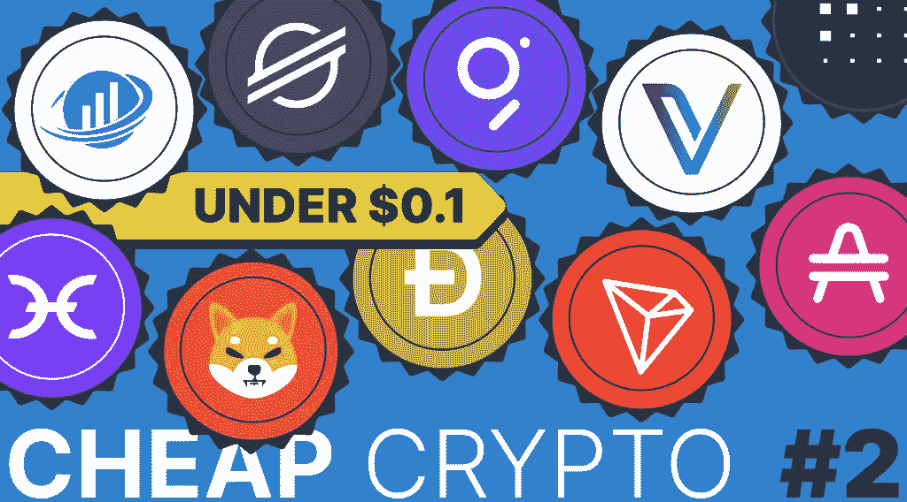

# 现在买什么最便宜的加密机？低于 0.1 美元

> 原文：<https://medium.com/coinmonks/what-is-the-best-cheap-crypto-to-buy-now-under-0-1-a6e600ffe9bc?source=collection_archive---------8----------------------->

让我们看看在加密货币市场衰退期间可以投资的更便宜的加密技术。在这篇文章中，我们将列出另外 10 个最便宜的密码，每枚硬币不到 0.1 美元。[在第一部分](https://stealthex.io/blog/what-is-the-best-cheap-crypto-to-buy-right-now-top-10-under-1/)中，您可以找到从 Ren 到 Polygon 的 10 种价格区间为 0.1 美元到 1 美元的加密资产的概述。

# 现在购买最便宜的加密软件:十大低于 0.1 美元的加密软件

# 柴犬(SHIB)

柴犬(SHIB)是一种分散的加密货币，于 2020 年首次出现在市场上。SHIB 代币是一种基于以太坊的 ERC 20 代币，是 Dogecoin 的直接竞争对手，而柴犬是一种真正的迷因硬币。该令牌不支持智能合约，也没有任何资产支持，但与 Dogecoin 不同的是，SHIB 正在围绕自己建立一个名为 ShibSwap 的完整生态系统。SHIB 令牌也可以从一个用户转移到另一个用户。

柴犬拥有强大的社群，可以称为仅次于 Dogecoin 的第二大知名模因币。根据一些消息来源，如果柴犬更快地消耗其供应，到 2040 年或更早，柴犬可能会达到 0.01 美元。也有人猜测，埃隆·马斯克在他的一条推文中说，要成为百万富翁，你需要 300 万枚柴犬币。

# 赫萝(热)

这是一个鲜为人知的秘密项目，背后有一个迷人的想法。赫萝的目标是成为“应用程序的 Airbnb”它的生态系统通过加密激励用户参与基于云托管的点对点应用市场。通过使用经典的分布式账本技术，赫萝使用户能够在网络上托管和使用各种应用程序，即 hApps。

任何人都可以成为全息链应用程序的主持人，这是赫萝生态系统不可或缺的一部分。在确保网络安全的同时，赫萝和全息链生态系统没有使用传统形式的区块链技术来验证交易和生成新块，而是使用一种特殊的哈希函数。这种不寻常的架构使它在其他加密项目中脱颖而出。

赫萝有一个独特的视野，可能有一些真正的价值。本地令牌热已经在 2021 年达到历史新高，当时它飙升至 0.03157 美元，并且很可能再次达到这一水平。一些密码专家，如 Cryptopolitan，估计 2030 年 HOT 的未来价格在 2.05 美元左右。

# 安培(安培)

Amp 是一个加密货币平台，旨在为投资者提供快速高效的交易。其独特的解决方案是 AMP 抵押品加密货币，允许即时结算和安全交易。投资者在发送资产时抵押他们的 AMP 令牌。虽然资金会立即汇出，但 amp 会由抵押品管理人保管。然后，一旦交易完全结算，Amp 被释放，投资者能够再次完成该过程。转让完成后，Amp 还简化了网络奖励分配。Amp 智能合约提供了各种内置的激励模型，包括微观分配和连续复利。

由于供应固定，AMP token 据说波动性较小，而其抵押品质量得到提高。许多密码爱好者认为 AMP token 可能在 2026 年达到 1 美元，但有些人认为到那一年，它可能只会高达 0.021 美元。

# 兽医

VeChain 是一个专注于物流需求和供应链的区块链平台。VeChain 令牌由 VeChainThor 区块链运营，后者是 VeChain 背后的公共区块链。然而，区块链也有另一种加密货币，分别是 VeThor token 或 VTHO。VeChain 平台的主要目标是成为使用 VeChain 制作的初始硬币产品(ico)和 dApps 的领导者。该项目还旨在成为中介物联网(IoT)。VeChain 的白皮书指出，该平台的使命是“使区块链社区能够毫不费力地将其商业活动转移到区块链”

我们对 VeChain 做了一个简短的概述，该平台似乎正在根据其白皮书发展，建立合作伙伴关系，并推出新的计划。一些著名专家声称，最早在 2026 年，硬币可能会达到 0.090 美元，到 2030 年将超过 0.60 美元。

# Dogecoin (DOGE)

当著名企业家埃隆·马斯克(Elon Musk)首次开始推广 Dogecoin 时，它是一个大炒作。这枚硬币开始只是一个迷因和笑话，但许多人已经拥有了数百万枚硬币。本质上，DOGE 是一种点对点、开源的加密货币。它被认为是一种替代硬币，于近九年前，即 2013 年 12 月推出。像比特币等其他加密货币一样，Dogecoin 可以作为人与人之间转移资金的一种方式，可以作为商品或服务的支付，也可以只是发送现金。

你可以在我们最近的文章中读到更多关于 Dogecoin [的内容。该项目在获得认可后一直创新高，可能仍对密码爱好者有一些投资潜力。例如，根据 WalletInvestor 网站的预测趋势，到 2030 年，Dogecoin 可能会达到 5 美元到 10 美元之间的任何价格。](https://stealthex.io/blog/where-and-how-to-buy-dogecoin-crypto-beginners-guide/)

在过去的一个月里，随着埃隆·马斯克收购 Twitter 的消息传出，Dogecoin 的价格大幅上涨。DOGE 的价格从长期确立的 0.06 美元上涨到 0.15 美元，然后回落到目前的 0.08 美元。

# 创(TRX)

Tron 是一个分散的区块链平台，旨在革新娱乐和数字内容共享。Tron 的基本构件，如 dApps、智能合约、令牌或其委托的利益相关共识证明，都是由其他项目开创的。尽管如此，创基金会在幕后做了很多开发工作。创作者可以在 Tron 网络上创建自己的令牌，网络开发计划的最后阶段包括支持 Tron 网络上的游戏。

虽然创(TRX)现在是一个单独的硬币，但它曾经是一个基于以太坊的 ERC-20 令牌。一些分析师认为，考虑到现代世界有多流行娱乐，Tron 可能是一项可靠的投资。他们甚至预测在 2030 年或更晚的时候，每枚 TRX 硬币会变成 5 美元。

# DeFi 硬币(DEFC)

DeFi 硬币协议是一个社区驱动的公平推出的 DeFi 令牌。在每笔交易中有三个简单的功能:反射、LP 获取和烧掉。此外，DeFi Coin 协议为快速转换、产量农业、赌注、交换和其他基于兴趣的服务的生态系统提供动力。DeFi Coin 建立在币安智能链(BSc)之上，允许快速和低成本的交易。该项目提供 DeFi Swap，这是一种创新的分散式交易所，允许买家和卖家直接与其他市场参与者进行数字货币交易。

Defi Coin 只是众多加密项目中的一个，然而，它可能会带来一些快速的利润，因为它已经一度升至 0.6287 美元的历史高点，尽管当然建议谨慎和研究。

# Fetch.ai (FET)

这个加密项目旨在将人工智能带入加密世界。由人工智能驱动的数字双胞胎可以为分散的金融提供自动化，这些金融可以满足单个用户的需求，或者为链上的 oracles 聚合数百万个数据点。与现有的 oracle 网络相比，这些基于代理的系统提供了更大的灵活性、速度和加密经济安全性，代表了分散金融的未来。这项技术能够创建个性化的 oracles，使用分散和非托管协议来维护用户的 DeFi 位置，以提高加密资产管理的安全性和便利性。

Fetch.ai 网络是一种链间协议，基于 Cosmos-SDK，并使用高性能的基于 WASM 的智能契约语言(Cosmwasm)来允许在链上实现高级加密和机器学习逻辑。考虑到它的创新结构和项目背后的天才想法，它可能值得一看。一些分析师声称，2030 年，FET 的价格应该在 5.85 美元至 6.73 美元之间。

# 图表(GRT)

Graph 是一个开源软件，用于收集、处理和存储来自各种区块链应用程序的数据，以方便信息检索。它是在以太坊区块链上推出的，它分析并收集区块链数据，然后将其存储到各种索引中，称为子图。这允许任何应用程序向其协议发送查询，并接收即时响应。该图的本地加密货币 GRT 用于确保其网络内安全数据的完整性。

GRT token 在 CoinMarketCap 上排名第 75 位，并在 2021 年达到历史最高水平，每单位 2.88 美元。许多消息来源称，到 2030 年，它可能会再次达到 2.68 美元，甚至打破目前的纪录。

# 恒星(XLM)

我们的前 10 名由 Stellar 完成，这是一个开源的分散支付网络。它使用区块链技术，允许用户以非常低的成本快速转移资金。支付网络没有显示出对任何国家货币的偏好。Stellar 的优势在于它适用于任何类型的货币。此外，该网络有自己的原生加密货币，恒星流明或 XLM。Stellar 的一个关键特点是，它旨在通过提供一个单一的网络来增强世界金融系统，在这个网络中，所有金融系统都可以协同工作。

由于 XLM 自 2014 年以来一直在市场上，并在 CoinMarketCap 上排名第 25 位，可以说这或多或少是一个既定的加密项目。因此，一些密码分析家认为 XLM 有一个光明的未来。根据他们的估计，到 2030 年，XLM 的价格可能会涨到 3.25 美元。

# 结论

找到最好的低于 0.1 美元的密码并不是最容易的任务。毕竟，加密市场充斥着属于这一类别的数字货币——通常一个加密项目仍然具有很高的市值，但由于这些令牌的总供应量很高，每个令牌的价格都远低于一美元。此外，很难理解这个项目背后是否有任何真正的价值。以下加密项目——柴犬、赫萝、Amp、VeChain、Dogecoin、Tron、Defi coin、Fetch.ai、The Graph 和 Stellar——构成了我们现在可以购买的第二份十大廉价加密项目列表。这些廉价的加密货币可能会让你知道去哪里寻找或者研究什么。

如果你想购买文章中提到的任何一种加密货币，你可以随时使用用户友好且无需保管的 [StealthEX](https://stealthex.io/) 平台。您可以私下购买 crypto，无需注册该服务。我们的加密收藏有 600 多种不同的硬币，您可以立即进行钱包到钱包的转账，没有任何问题。

# 如何买到便宜的加密货币？

只需去 [StealthEX](https://stealthex.io/) 并遵循这些简单的步骤:

*   选择要兑换的货币对和金额。例如，BTC 到 TRX。
*   按下“开始交换”按钮。
*   提供要将您的加密传送到的收件人地址。
*   处理交易。
*   接收您的加密硬币。

在 [Medium](https://stealthex-io.medium.com/) 、 [Twitter](https://twitter.com/Stealthex_io) 、 [Telegram](https://t.me/StealthEX) 、 [YouTube](https://www.youtube.com/channel/UCeES_XBesX76ge7xf1meuSw) 和 [Publish0x](https://www.publish0x.com/stealthex) 上关注我们，了解关于 [StealthEX.io](https://stealthex.io/) 和其他秘密世界的最新消息。

在购买任何密码之前，不要忘记做自己的研究。本文表达的观点和意见仅代表作者个人

*原载于*[【https://stealthex.io/blog/】T21](https://stealthex.io/blog/what-is-the-best-cheap-crypto-to-buy-now-under-0-1/)*👈*

> *交易新手？尝试[加密交易机器人](/coinmonks/crypto-trading-bot-c2ffce8acb2a)或[复制交易](/coinmonks/top-10-crypto-copy-trading-platforms-for-beginners-d0c37c7d698c)*