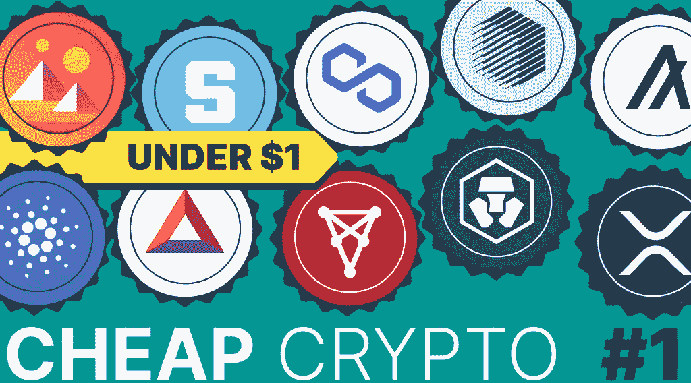

# 现在买什么最便宜？低于 1 美元

> 原文：<https://medium.com/coinmonks/what-is-the-best-cheap-crypto-to-buy-right-now-under-1-b00e849d5c8f?source=collection_archive---------7----------------------->

随着整体经济衰退，臭名昭著的加密冬天正在全面展开，当前的熊市意味着一件事:各种加密资产可以以较大的折扣购买。甚至像比特币和以太坊这样的大型代币也从之前的高点下跌了 70%以上。这些高价值数字资产的价格非常有吸引力，加密货币的下跌趋势为未来的持有和交易提供了一个有趣的机会。虽然专业投资者总是在寻找最好的资产，但即使是“懒惰”的加密爱好者也可以找到许多在可预见的未来可能会大幅升值的加密项目。现在不是只有一个最好的便宜的密码可以买。

许多便宜的密码有各种各样的使用案例，并有可能扰乱各种行业，所以你可以多样化你的投资组合，并试图充分利用你的投资。你的密码越便宜，你就能省下越多的油费和进出钱包的交易费。

在这篇由两部分组成的文章中，我们将尝试看看购买各种加密资产的所有利弊。在第一部分中，我们将看看价格在 0.1 美元到 1 美元之间的 10 种加密资产。文章的第二部分将介绍另外 10 种价格低于 0.1 美元的加密货币。因此，如果您目前正在寻找便宜的 crypto 购买，您可以使用这两篇文章来研究更多的鲜为人知或未发现的项目。

# 现在购买最便宜的加密软件:10 大低于 1 美元的加密软件

# 克罗诺斯(CRO)

Cronos (CRO)是一种有吸引力的加密资产，它是少数几个价格尚未上涨的加密货币交换令牌之一。与 BNB 或火币不同，CRO 币仍然只卖 0.113 美元一枚。考虑到代币背后的交易所 Crypto.com 是市场上领先的加密交易所之一，这可能真的很值。Crypto.com 的总部设在亚洲的新加坡。截至 2022 年，该公司拥有 5000 万客户和 4000 名员工。

你可以在我们最新的文章中阅读更多关于 CRO 硬币的信息，包括其可能的价格预测。

# 任

开放和社区驱动的 Ren 协议支持区块链之间的价值流动。任的目标是将比特币和 Zcash 等热门资产引入以太坊(Ethereum)等平台，让它们参与到一个多链分散式金融生态系统中。Ren 生态系统用于构建、部署和运行使用 zk-SNARK 的应用程序，ZK-SNARK 是一种协议，允许一方证明他们拥有某些信息，而不会向其他任何人透露这些信息。任的平台由三层组成:

*   零知识层，使存储和转移令牌而不暴露钱包余额或交易金额成为可能。
*   互操作性层，扩展了零知识交易，使得在不同区块链之间执行无信任交易令牌以及将令牌从一个区块链桥接到另一个成为可能。
*   Dark Pool Layer 允许用户在不向任何人透露订单价格或数量的情况下打开订单。然后，用户可以使用零知识交易秘密解决订单匹配。

Ren 的核心产品 RenVM 是一个虚拟机，它为去中心化金融带来了互操作性。用户可以利用 REN 在智能合约中锁定比特币或其他资产，并在以太坊区块链上获得相当于以太价值的交易。

考虑到该项目的许多创新功能，许多消息来源称，到 2026 年，REN token 的价格可能会超过 3.90 美元。考虑到其目前的价格在 0.12 美元左右波动，这是一个坚实的增长。

# 奇利兹(CHZ)

下一个最好买的廉价加密货币是什么？好吧，Chiliz (CHZ)在 CoinMarketCap 上排名 42 美元，把自己定位为基于区块链的体育娱乐平台的数字货币。奇利兹(Socios.com)本地令牌是以太坊区块链上的 ERC-20 实用令牌，用作奇利兹和该国的数字货币。后者是一个体育粉丝互动平台，粉丝可以购买品牌不可替代的代币，以显示他们对自己喜欢的运动员、球队和艺人的支持。总而言之，Chiliz 让体育迷能够与他们喜欢的球队一起享受独一无二的体验。球迷可以使用 CHZ 代币为他们喜爱的球队购买品牌球迷代币。

迷人的加密令牌已经在 2021 年达到了历史最高水平，当时它飙升至 0.8915 美元，所以如果你相信该项目的价值，它目前 0.2 美元的价格似乎是一个便宜货。

# 基本注意力标志

下一个值得投资的廉价密码是 BAT 或基本注意力令牌。基本注意力令牌(BAT)是一种加密货币，支持 Brave software 位于区块链的数字广告网络，用于 Brave web 浏览器。营销人员向网站出版商支付 BAT，以获得 Brave 用户的关注。Brave 是一款极其方便且无广告的浏览器，是 Safari 或 Chrome 的有效替代品。它有一个明亮的设计和一个加密钱包，可以存储你在浏览网站时获得的球棒。

本质上，Brave 在其安全、匿名、选择加入的广告系统中提供 BAT 作为交换令牌，旨在让用户、出版商和广告商受益。此外，用户在查看广告时获得了更强的隐私性和安全性，提高了相关性和性能。

目前，BAT 的价格约为 0.3 美元，一些秘密消息来源推测，到 2031 年可能会涨到 10 美元。

# 阿尔格兰德(ALGO)

许多加密爱好者声称，Algorand 是被低估的加密货币之一。阿尔格兰德(ALGO)既是一种数字货币，也是一个区块链平台，其功能被设计成一个主要的支付处理器。Algorand 平台可以快速处理许多交易，并可以托管其他加密货币和基于区块链的项目，使其成为以太坊的直接竞争对手。该平台的本币 ALGO 被用来保护阿尔格兰德区块链，并为基于阿尔格兰德的交易支付处理费。

用户可能会发现 ALGO 令牌很有价值，如果他们相信 Algrorand 的技术细节将吸引那些想要设计和推出新型分散式应用程序的开发人员。投资者也可能会将 Algorand 视为加密货币投资组合的一个可行组成部分，如果他们相信股权证明加密货币最终将接管市场的话。

目前，ALGO 的交易价格约为 0.35 美元，在 CoinMarketCap 上排名 29。对 ALGO 的价格预测是积极的，一些密码专家指出，到 2031 年，令牌的价格可能会上升到 11 美元。

# XRP (XRP)

Ripple 是一家私人公司，使用创新的加密货币技术来实现 XRP 总账，这是一个基于分布式加密货币数据库的实时支付、共享和转发网络。

Ripple 也是更受欢迎的项目之一，自 2020 年美国证券交易委员会(SEC)将该公司告上法庭以来，[一直是头条新闻](https://stealthex.io/blog/xrp-sec-lawsuit-can-the-court-case-be-finally-dismissed/)。就在最近，最大的加密交易所之一比特币基地提交了文件，要求允许帮助 Ripple Labs 与 SEC 进行法律斗争。此外，根据 SEC 放弃其头寸的各种迹象，现在情况看起来对 Ripple 更有利。

如果公司安然无恙地走出法庭，这可能会导致价格上涨。一些专家甚至声称，到 2030 年，XRP 可能会高达 50-75 美元。

# 卡尔达诺

Cardano (ADA)是最著名的加密货币之一，已经在市场上存在了足够长的时间，为交易者和持有者提供了各种机会。ADA coin 是市值最大的加密货币之一。它被设计成以太坊理念的下一代发展。它代表了一个区块链，这是一个灵活、可持续和可扩展的平台，用于运行智能合同，这将允许开发广泛的分散式金融应用程序、新的加密令牌、游戏等。

卡尔达诺刚刚经历了一个[突出的分叉](https://stealthex.io/blog/cardano-hard-fork-how-will-it-change-the-blockchain/)，对系统进行了改进，许多加密消息来源声称，硬币甚至没有达到其巨大潜力的 1/10。一些人认为，到 2031 年，ADA 只会涨到 5 美元，考虑到它现在的价格约为 0.4 美元，这仍然是一个令人印象深刻的壮举。

# 分散土地(法力)

分散土地是广泛使用的[元对](https://stealthex.io/blog/what-is-the-metaverse-in-crypto-world/)之一，这是一个运行在以太坊上的软件，旨在激励全球用户网络运营一个共享的虚拟世界。分散土地的用户可以买卖数字房地产，同时在这个虚拟世界中探索、互动和玩游戏。随着时间的推移，该平台已经发展到为用户实现交互式应用、在线支付和点对点通信。这两个平台的代币包括土地(用于地块的 NTF)和 MANA，这是一种便于购买土地的加密货币，也是元宇宙的虚拟商品和服务。

由于 metaverses 仍处于开发的早期阶段，还不清楚它们将来会有多大。然而，一些密码专家相信他们的潜力，并预测到 2030 年 MANA 将达到 25.60 美元。以目前 0.64 美元的价格，这似乎是一项有吸引力的潜在投资。

# 多边形(MATIC)

Polygon，以前称为 Matic Network，是一个扩展解决方案，旨在提供多种工具来提高速度，降低区块链网络上交易的成本和复杂性。MATIC 基于以太坊，希望帮助它在规模、安全性、效率和有用性方面进行扩展。Polygon 是一个多级平台，其目标是扩展以太坊，这要归功于大量的侧链，所有这些侧链都旨在以有效且经济高效的方式疏通主平台。可以使用以下一种构建可伸缩性方法来构建侧链:

*   等离子链:将交易捆绑成块，批量提交到以太坊区块链
*   zk-Rollups:允许将多个传输捆绑到单个事务中。
*   乐观汇总:类似于等离子链，但也具有伸缩以太坊智能合同的能力。

考虑到 Polygon 的创新可扩展性，一些密码专家大胆预测，其价格可能会在 2030 年升至 21.02 美元的最高峰值。

# 沙箱(沙子)

沙盒是另一个基于以太坊的去中心化 NFT 游戏元宇宙，它让不懂技术的用户能够创建、销售、使用和货币化他们自己的虚拟现实 NFT。沙盒加密项目使用其原生令牌 SAND 来支撑整个游戏内经济。沙盒市场本质上允许玩家通过向其他沙盒玩家出售他们创造的数字资产来赚钱。

据一些专家称，以目前 0.8 美元左右的价格水平，SAND token 可能会成为一个有利可图的投资机会。许多分析师认为，到 2030 年，代币的交易价格至少会达到 19 美元。

# 结论

以下加密项目——Cronos、Ran、Chiliz、Basic Attention Token、Algorand、XRP、Cardano、分散的土地、多边形和沙盒——构成了我们投资的十大廉价加密项目名单。在第二部分，我们将看看另外 10 种加密货币，它们可能是很好的投资。

如果你想购买文章中提到的任何一种加密货币，你可以随时使用用户友好和非托管的 [StealthEX](https://stealthex.io/) 加密交换平台。你可以私下购买加密，不需要注册服务。我们的加密收藏有 600 多种不同的硬币，您可以立即进行钱包到钱包的转账，没有任何问题。

**如何买到便宜的密码？**

只需去 [StealthEX](https://stealthex.io/) 并遵循这些简单的步骤:

1.  选择要兑换的货币对和金额。例如，BTC 到 ALGO。
2.  按下“开始交换”按钮。
3.  提供要将您的加密传送到的收件人地址。
4.  处理交易。
5.  接收您的加密硬币。

在 [Medium](https://stealthex-io.medium.com/) 、 [Twitter](https://twitter.com/Stealthex_io) 、 [Telegram](https://t.me/StealthEX) 、 [YouTube](https://www.youtube.com/channel/UCeES_XBesX76ge7xf1meuSw) 和 [Publish0x](https://www.publish0x.com/stealthex) 上关注我们，了解关于 [StealthEX.io](https://stealthex.io/) 和其他加密世界的最新消息。

在购买任何密码之前，不要忘记做自己的研究。本文表达的观点和意见仅代表作者个人。

*原载于*[*【https://stealthex.io/blog/】*](https://stealthex.io/blog/what-is-the-best-cheap-crypto-to-buy-right-now-top-10-under-1/)*👈*

> *交易新手？尝试[加密交易机器人](/coinmonks/crypto-trading-bot-c2ffce8acb2a)或[复制交易](/coinmonks/top-10-crypto-copy-trading-platforms-for-beginners-d0c37c7d698c)*