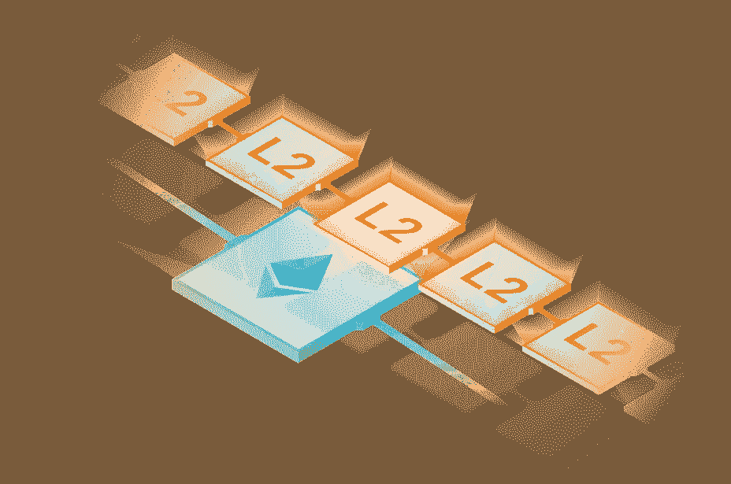
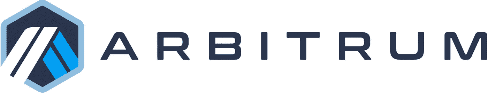
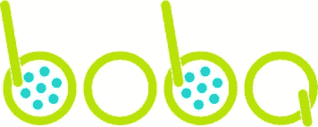

# 最好的以太坊缩放方案是什么？第 1 部分:乐观汇总

> 原文：<https://medium.com/coinmonks/what-is-the-best-ethereum-scaling-solution-part-1-optimistic-rollups-6f18868ac0bb?source=collection_archive---------34----------------------->

这是探索以太坊扩展解决方案的系列文章的第一部分。
在这篇文章中，我们将探索**乐观向上**。

让我们从基础开始。

## 什么是第二层？

第 2 层(L2)是解决方案的总称，旨在通过处理以太坊主网(被视为第 1 层)等区块链之外的交易，同时通过第 1 层获得交易的安全性，来帮助扩展分散式应用程序。

当区块链拥塞时，第 1 层(L1)交易速度下降，使得某些类型的 dapps 的整体用户体验差，并且由于交易发送者需要彼此出价更高来处理交易，交易的汽油费增加到过高的数额。

当使用第 2 层时，事务被提交给第 2 层服务器(对于每个相应的第 2 层，称为节点、验证器、操作器、定序器、块生成器)，而不是直接提交给第 1 层。然后，第 2 层会将这些事务分批分组，然后将它们锚定到第 1 层。

有不同的方法来完成锚定过程。在本文中，我们将重点关注乐观汇总。

## 什么是乐观向上？

乐观汇总是第 2 层(L2)协议，通过在提交给以太坊之前将多个链外事务大批量捆绑在一起来减少以太坊(L1)上的计算。从而将固定成本分摊到每批中的多个交易中，以减少终端用户的费用。乐观汇总还使用技术来压缩数据，以在将数据发布到以太坊之前减小其大小。

乐观汇总的“乐观”来自于协议假设 L2 上的所有事务都是有效的。这样做并不会公布交易批次的有效性证明。

为了维护 L2 交易的有效性，乐观汇总使用欺诈证明方案来检测交易是否计算错误。一旦汇总批次提交到以太坊，任何人都可以通过计算欺诈证据来质疑交易。

如果欺诈证据是正确的，汇总协议重新执行交易并正确地更新汇总的状态。负责包含不正确执行的事务的服务器将受到惩罚。如果累计批次保持未被质疑，则所有交易都被视为真实，并被第 1 层接受。

## 乐观汇总网络

# 乐观

乐观由 OP Labs 于 2021 年 10 月推出。乐观是 EVM 兼容的乐观累计链。其目标是快速、简单和安全。截至这篇文章发表之日，乐观估计总共锁定了 1.42 亿美元。

**令牌** :
乐观令牌(OP)是一个 ERC-20 令牌，让用户参与乐观协议的治理和公共产品的融资。

OP 代币不用于支付乐观的汽油，因为乐观的交易是在 ETH 中支付的，您可以使用桥将其转移到乐观。

**值得关注的项目:** [Uniswap](https://app.uniswap.org/#/swap?chain=optimism)
[曲线金融](https://curve.fi/) [Aave](https://app.aave.com/?marketName=proto_optimism_v3)
[Synthetix](https://staking.synthetix.io/)

# 仲裁一号

Arbitrum 由 Offchain Labs 于 2021 年 8 月推出。Arbitrum 旨在提供一种与以太坊互动完全一样的用户体验，但交易成本要低得多。Arbitrum 拥有一套以太坊扩展解决方案，包括通道、侧链和汇总。截至这篇文章发表之日，共有 25.1 亿美元被锁定在 Arbitrum。

**值得注意的项目:** [Uniswap](https://app.uniswap.org/#/swap?chain=arbitrum)
[Aave](https://app.aave.com/?marketName=proto_arbitrum_v3)
[平衡器](https://arbitrum.balancer.fi/#/)
[图表](https://thegraph.com/explorer)

# 博巴网络

波巴网络原名 OMGX，由恩雅于 2021 年 9 月推出。Boba 是从乐观主义派生出来的乐观主义汇总，具有快速提款等用户友好的功能，允许用户从 Boba 向 L1 提取资金，而无需像其他乐观主义汇总层 2 那样等待 7 天的防欺诈窗口。截至这篇文章发表之日，共有 3066 万美元被锁定在波巴网。

**令牌:** 波巴令牌(Boba)是波巴道的治理令牌，可以在波巴网上下注兑换奖励。

尽管 ETH 是默认的燃气令牌，但所有用户都可以选择更换为 BOBA，从而享受 25%的燃气费折扣。

**值得注意的项目:** [图表](https://thegraph.com/explorer) [乌玛](https://umaproject.org/)
[FRAX](https://app.frax.finance/)
[多铎](https://app.dodoex.io/?from=ETH&to=USDC&network=boba-mainnet&forced=true)

# 最后

可伸缩性一直是以太坊 Mainnet 的开发者和最终用户最关心的问题之一，而第二层，特别是乐观的汇总已经被提出作为解决这个问题的一个很好的解决方案。

存在多个乐观的汇总链，它们在治理和技术上存在着由小到大的差异，随着第 2 层空间的成熟，差异将会更大。目前，很难确定一个乐观的汇总是最佳解决方案，但我们可能会在不久的将来给出一个明确的答案。

请继续关注本系列的下一篇文章，我们将讨论第 2 层的另一种形式，zK rollup。

> 交易新手？在[最佳密码交易所](/coinmonks/crypto-exchange-dd2f9d6f3769)上尝试[密码交易机器人](/coinmonks/crypto-trading-bot-c2ffce8acb2a)或[复制交易](/coinmonks/top-10-crypto-copy-trading-platforms-for-beginners-d0c37c7d698c)