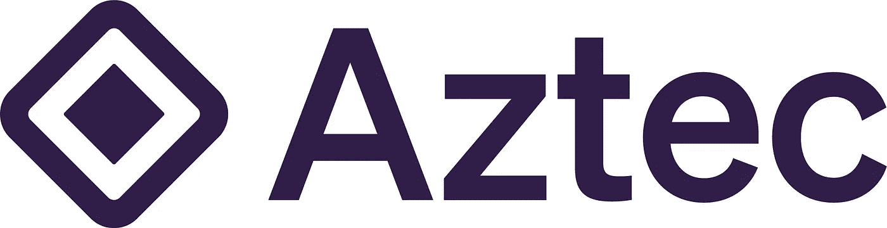

# 最好的以太坊缩放方案是什么？第 2 部分:ZK 汇总

> 原文：<https://medium.com/coinmonks/what-is-the-best-ethereum-scaling-solution-part-2-zk-rollups-e673f014789c?source=collection_archive---------21----------------------->

这是探索以太坊扩展解决方案的系列文章的第二部分。在这篇文章中，我们将探索 **ZK 卷**。

要了解第 2 层的基础知识和乐观汇总，请前往 [*第 1 部分:乐观汇总*](/@thisisjaelee/what-is-the-best-ethereum-scaling-solution-part-1-optimistic-rollups-6f18868ac0bb) 。

所以再一次，让我们从基础开始。

## 什么是 ZK 汇总？

零知识汇总(ZK-汇总)是第 2 层扩展解决方案，通过将计算和状态存储移出链来增加以太坊主网上的吞吐量。

为了证明状态变化的正确性，ZK 卷产生有效性证明。通过有效性证明，ZK-罗博协议证明了对以太坊状态提出的改变是在具有密码保证的生产批次中执行所有事务的结果。

## ZK 汇总和乐观汇总有什么区别？

乐观汇总和 Zk-汇总之间最大的区别在于，乐观汇总在提议更改以太坊 Mainnet 的状态时假设所有事务批次都是合法的，而 ZK-汇总在这样做之前需要加密验证。

> ZK 汇总需要加密验证，而乐观汇总假设所有事务批次都有效。

由于有效性证明，ZK-rollups 只需要提供有效性证明来完成以太坊上的交易，而不是在链上发布所有交易数据。相比之下，乐观汇总提供每批中的所有事务数据。

由于这种差异，当将资金从 ZK 汇总转移到以太坊主网时，延迟最小，因为 ZK 汇总的有效性证明证明退出交易是准确的。这与乐观累计不同，在乐观累计中，由于假设所有交易都有效的设计，从乐观累计中提取资金时会有很长的延迟，以便任何人都有时间通过提供欺诈证据来质疑退出交易。

当通过密码验证镜头比较 ZK 汇总和乐观汇总时，ZK 汇总似乎是明显的赢家。然而，在实际用例的镜头中，由于设计上的差异，事情变得有点混乱。

由于假设所有事务都是有效的，乐观汇总更适合生产，对区块链开发人员来说更容易编程。此外，乐观汇总有助于有效使用 EIP-4844，从而确保成本效益。

请看下面 101 区块链的图表，它说明了乐观总结和 Zk 总结之间的区别。

Optimistic Rollups vs Zero Knowledge Rollups from 101blockchains.com

## Zk-Rollup 网络

## 活套

Loopring 于 2017 年 8 月通过一个 ICO 推出，2019 年 12 月被 Loopring 整合到以太坊。Loopring 旨在提供与以太坊主网相同的安全保证，通过将吞吐量提高 1000 倍，并将燃气费降低到以太坊主网的 0.1%来实现巨大的可扩展性提升。目前总共有 1 . 14 亿美元被锁定在 Loopring。

**令牌:** LRC 令牌(LRC)是一种符合 ERC-20 协议的令牌，用于激励流动性提供商、保险公司和 DAO 管理者的合乎协议的行为。协议费来源于 L2 环线上的经济活动。

**值得注意的 dApps:** [Uniswap](https://app.uniswap.org/)
[loop ring Exchange](https://loopring.io/#/trade/lite/LRC-ETH)

## zkSync

zkSync 是一个以用户为中心的 ZK 汇总平台，由 Matter Labs 于 2020 年 6 月推出，支持支付、令牌交换和在其本地产品上的 NFT 铸造，目前在所有现有和计划的汇总中具有最低的实际 tx 成本。目前共有 5402 万美元被锁定在 zkSync。

**值得注意的 dApps:** [1 inch](https://app.1inch.io/#/1/unified/swap/ETH/DAI)
[Storj](https://www.storj.io/)
[向往金融](https://yearn.finance/#/portfolio)

## ZKSpace

ZKSpace 由 L2 实验室于 2020 年 12 月发射。ZKSpace 原生平台由 AMM DEX、支付服务和 NFT 市场组成。目前共有 3836 万美元被锁定在 ZKSpace。

**令牌** :
ZKSwap (ZKS)令牌是驱动 ZKSwap 网络的 ERC-20 令牌。它激励网络上的所有行为，也用于管理网络和验证交易。

**值得注意的 dApps:** [ZK swap](https://zks.app/trade/swap)
[ZK wallet](https://zks.app/wallet/token)
[ZK sea](https://zks.app/nft)

## 阿兹特克网络

Aztec 于 2020 年 2 月推出，专注于以太坊的隐私和可扩展性。它致力于通过零知识证明实现负担得起的私人加密支付。目前共有 272 万美元被锁定在阿兹特克。

**值得注意的 dApps:** [AAVE](https://app.aave.com/)
[丽都](https://lido.fi/#networks)
[元素金融](https://app.element.fi/fixedrates)

## 最后

ZK-Rollups 是另一个伟大的解决方案，区块链社区正试图用以太坊主网解决当前的可伸缩性问题。

有多种零知识积累链，它们的技术和目的各不相同。目前，如本文所述，乐观汇总网络的开发更加活跃，因为它易于使用和开发，但我们不能否认零知识汇总在安全性方面具有优势，这要归功于有效性证明。在不久的将来，我们很可能会看到零知识汇总令人兴奋的新发展。

敬请关注本系列的下一篇文章，我们将讨论另一种扩展解决方案，侧链。

> 交易新手？尝试[加密交易机器人](/coinmonks/crypto-trading-bot-c2ffce8acb2a)或[复制交易](/coinmonks/top-10-crypto-copy-trading-platforms-for-beginners-d0c37c7d698c)