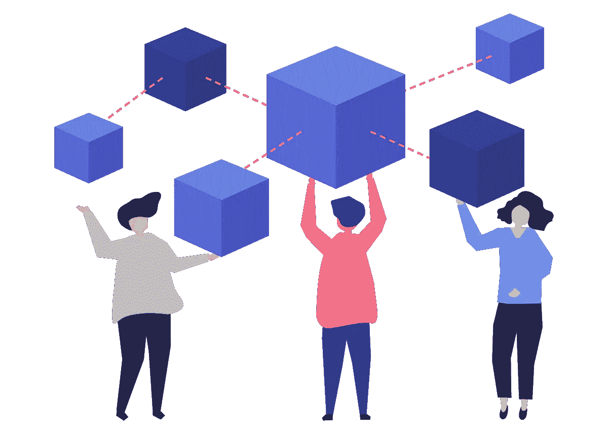
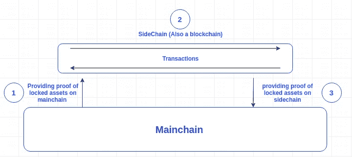
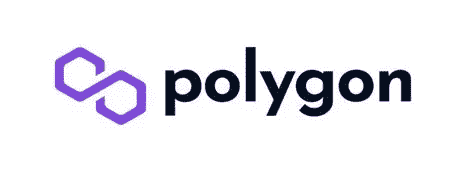
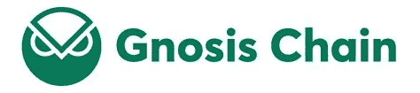
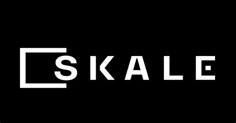
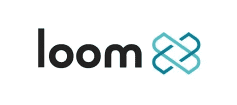

# 最好的以太坊缩放方案是什么？第 3 部分:侧链

> 原文：<https://medium.com/coinmonks/what-is-the-best-ethereum-scaling-solution-part-3-sidechains-dfe2743b0f23?source=collection_archive---------21----------------------->

这是探索以太坊扩展解决方案的系列文章的第三部分。在这篇文章中，我们将探索侧链。

要了解第 2 层基础和乐观汇总，请前往[第 1 部分:乐观汇总](/@thisisjaelee/what-is-the-best-ethereum-scaling-solution-part-1-optimistic-rollups-6f18868ac0bb)。

要了解 ZK 汇总，前往[第二部分:ZK 汇总](/coinmonks/what-is-the-best-ethereum-scaling-solution-part-2-zk-rollups-e673f014789c)。

让我们开始回答基本问题。

## 什么是侧链？

侧链是一个独立于以太坊运行的区块链网络。但是，它通过双向网桥连接到以太坊 Mainnet。通过这个双向桥梁，用户可以将他们的以太坊代币发送到以太坊上锁定代币的智能合约的出口地址，在“竞争期”之后，与锁定在以太坊中的价值相等的资金被释放到侧链中。将资金从侧链转移到以太坊时，也会发生同样的过程。

Source: EthHub Documentation

所以本质上，侧链是独立的区块链网络，有自己的块参数和一致算法，这意味着它们没有以太坊的安全属性。然而，侧链是为有效处理交易而设计的，可以降低费用，提高吞吐量。

此外，几乎所有的侧链都是以太坊虚拟机(EVM)兼容的，这意味着为以太坊编写的智能合约可以立即在侧链上工作。允许分散的应用程序开发者轻松地允许他们在以太坊上的项目在侧链上启动，以获得负担得起的费用和侧链更快的交易的好处。

## 侧链和第 2 层扩展解决方案有什么区别？

第 2 层扩展解决方案和侧链之间的最大区别在于，第 2 层扩展解决方案运行在以太坊主网之上，通过压缩交易包并将它们提交给以太坊主网，从而依赖于以太坊主网的安全性。

> 侧链与以太坊平行运行，而第 2 层扩展解决方案运行在以太坊之上。

另一方面，侧链与以太坊网络并行运行，但通过双向网桥连接，以将令牌移入和移出单独的链。这意味着，与第 2 层扩展解决方案不同，侧链不会将状态变化和交易数据发送回以太坊主网，并且必须依靠其验证器和共识机制的安全性。

## 侧链

## 多边形位置

Polygon 原名 Matic，是 2017 年推出的领先以太坊侧链。随着以太坊从工作证明到利益证明的转变，Polygon 也演变成了 PoS“提交链”，它定期编译链上所有交易的 Merkle 根，并在以太坊上提交。一旦 Polygon 上的事务在以太坊上提交并添加到以太坊块中，这些事务就完成了。如今约有 10 亿美元被锁定在 Polygon。

多边形 PoS 由两条链组成，Heimdall 和 BOR。Heimdall 是由选择块生产者的验证器组成的链，BOR 是产生多边形块的链。Heimdall 协调以太坊上的多边形定位契约和 Polygon 上的验证器之间的信息，以在 BOR 上生成块。

**令牌:** Polygon 的原生令牌是 MATIC，这是以太坊上的一个 ERC-20 令牌。MATIC 用于支付 Polygon 网络上的交易费用，并用于标记和保护链。

**值得注意的 dapp:** 超过 37，000 个 dapp 在多边形生态系统中，包括以下 dapp:
[Uniswap](https://app.uniswap.org/#/swap)
[Aave](https://app.aave.com/?marketName=proto_polygon_v3)
[Sushiswap](https://app.sushi.com/swap?inputCurrency=ETH&outputCurrency=0x6B3595068778DD592e39A122f4f5a5cF09C90fE2)
[Curve Finance](https://curve.fi/)

## 认知链

Gnosis Chain 于 2021 年推出，结合了 xDai 和 GnosisDAO 之间的生态系统。Gnosis Chain 是一家 EVM 兼容的连锁店，在以太坊之前使用 PoS 共识模型，以实现更快更便宜的交易。大约 5300 万美元目前被锁定在 Gnosis。

**令牌:** 两个令牌运行灵知链生态系统，xDai 和 GNO。
xDAI stablecoin 方便交易，支付灵知链上的费用。xDai 是一种与 Dai 挂钩的稳定货币，DAI 与美元挂钩。

GNO 是治理令牌，参与 Gnosis 链上的事务验证过程，并因此获得额外的 GNO 令牌作为帮助保护网络的奖励。

**值得注意的小动作:** [曲线财务](https://curve.fi/#/gnosis/swap) [1 英寸](https://app.1inch.io/#/100/unified/swap/xDAI/USDT)

## 斯卡莱

Skale 于 2018 年推出，由 SKALE DAO 管理。Skale network 创建了定制的弹性侧链，开发人员可以定义侧链以满足他们的需求，调整他们希望用于 Dapps 的侧链以符合特定规范，因此他们可以选择共识协议、虚拟机、父区块链，并在侧链上定义安全协议。

**令牌:** SKALE(SKL)令牌授予作为网络验证者参与的权利，作为委托者参与的权利，或者作为开发者访问网络资源的权利。

## 织机网络

Loom 网络于 2017 年推出，通过创建由多个侧链组成的 DApps 链来运行。当 DApp 开发人员想要创建他们的应用程序时，会为他们分配单独的侧链，然后将这些侧链集成到以太坊这样的第 1 层主网中，以确保侧链的交互和可靠性。

除了以太坊，Loom Network 还与比特币、币安链和 Tron 合作，允许开发人员使用他们在上述所有网络中的资产。

**令牌:** LOOM 令牌是一个 PoS 令牌，用于保护 LOOM 网络的 mainnet，Basechain。织布机持有者可以用他们的代币来帮助保护基链并获得赌注奖励。

## 最后

侧链是一种不同的方式，开发人员已经找到了解决以太坊主网伸缩问题的方法。

顾名思义，侧链是它们自己独立的区块链网络，与以太坊互操作，与乐观和 ZK 汇总形成对比。由于侧链的独立共识机制，许多侧链允许比汇总解决方案更便宜的交易费用，但它无法充分利用以太坊的安全性。

通过这些关于不同扩展解决方案的讨论，我们可以看到一种模式，每种优势都伴随着相应的劣势。在本系列的下一部分，我们将看看另一个有趣的扩展解决方案，Validium。

> 交易新手？尝试[加密交易机器人](/coinmonks/crypto-trading-bot-c2ffce8acb2a)或[复制交易](/coinmonks/top-10-crypto-copy-trading-platforms-for-beginners-d0c37c7d698c)