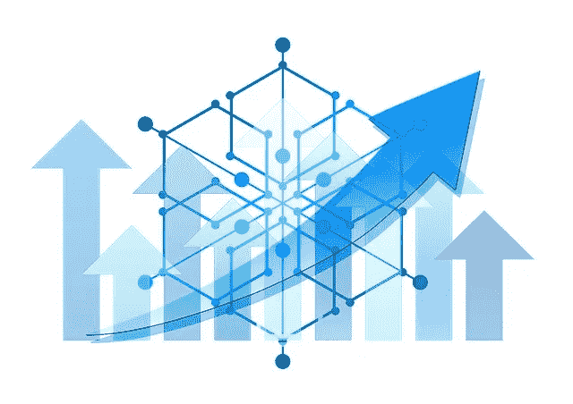
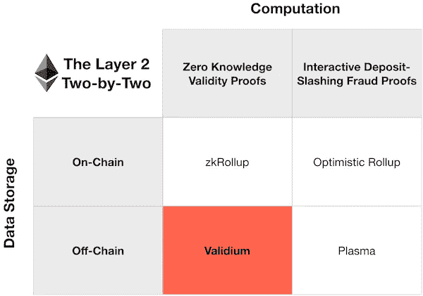
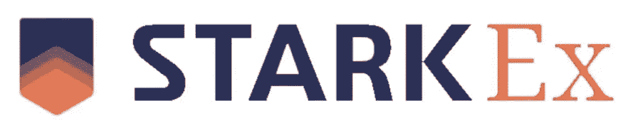
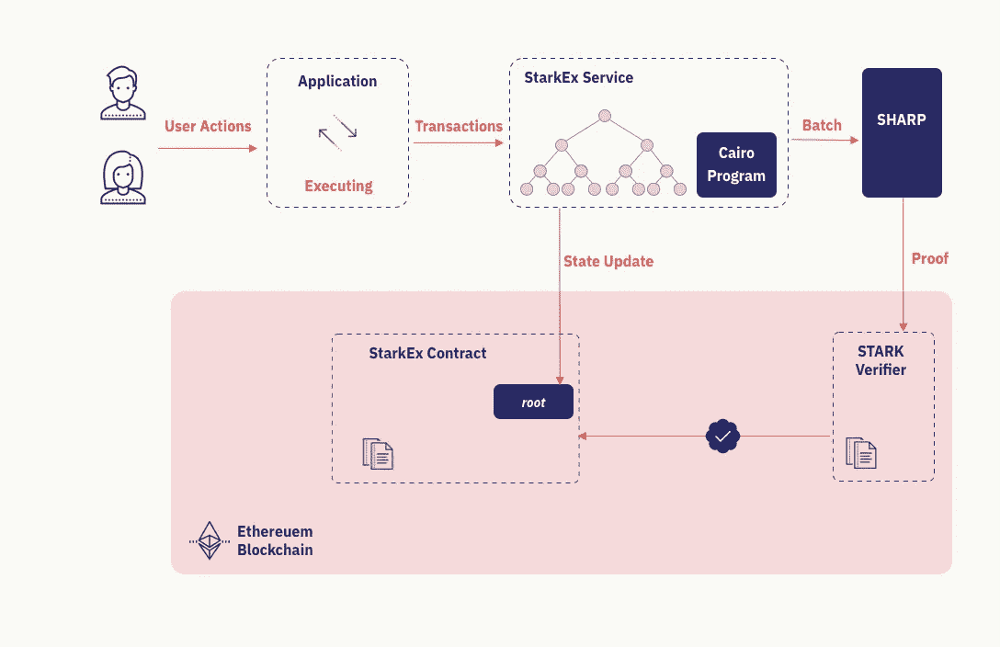
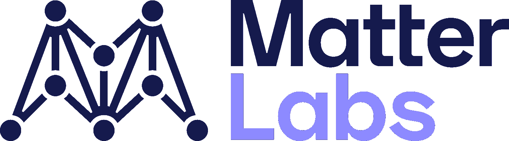
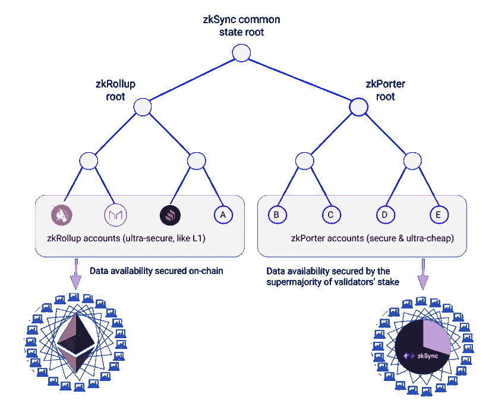

# 最好的以太坊缩放方案是什么？第四部分:有效与意志

> 原文：<https://medium.com/coinmonks/what-is-the-best-ethereum-scaling-solution-part-4-validium-volition-c40e47cd67d4?source=collection_archive---------50----------------------->

这是探索以太坊扩展解决方案的系列文章的第四部分。

在这篇文章中，我们将探索 validium。
要了解第 2 层基础和乐观汇总，请前往[第 1 部分:乐观汇总](/@thisisjaelee/what-is-the-best-ethereum-scaling-solution-part-1-optimistic-rollups-6f18868ac0bb)。
要了解 ZK 汇总，前往[第二部分:ZK 汇总](/coinmonks/what-is-the-best-ethereum-scaling-solution-part-2-zk-rollups-e673f014789c)。
要了解侧链，请前往[第 3 部分:侧链](/coinmonks/what-is-the-best-ethereum-scaling-solution-part-3-sidechains-dfe2743b0f23)。

好了，我们开始回答基本问题。

> 不知道什么时候买卖，试试[复制交易](http://coincodecap.com/go/bityard)。

## 什么是 validium？

Validium 是一种扩展以太坊的方法，它通过 ZK 汇总等有效性证明来确保交易的有效性，但不会将交易数据存储或发送到以太坊主网。这种不将事务数据发送到以太坊的折衷方案极大地提高了可伸缩性，validiums 每秒可以处理大约 9000 个事务或更多，而 ZK 汇总每秒可以处理大约 2000 个事务。此外，通过不在链上存储交易数据，交易信息在链外处理，使它们成为私有的。

> Validium 仅将**有效性证明保持在链上**，并将**交易数据保持在链外。**

由于 validium 的技术设计，属于 validium 用户的资金由以太坊主网上的智能合约控制。用户可以通过提供 Merkle 证明来提取资金，证明智能合约中的部分资金属于用户。一旦提交被确认，Merkle 证明将取款交易包括在有效性证明中，从而处理取款。由于需要交易数据来计算 Merkle proof，这一过程也意味着，如果不与用户共享链外交易数据，用户资金可能会被冻结并限制提款。

source: buildblockchain.tech

## 什么是意志？

由于没有存储和发送交易数据，validium 缺乏链上数据可用性，因此它适合于特定的用例，如 DeFi 中的索引，其中每秒的交易数量和私有基础设施非常重要。为了利用汇总的数据可用性获得 validium 的好处，结合 ZK 汇总和 validium 链创建了 volitions。

当需要时，用户可以在 ZK 对某些交易的链上数据可用性和 validium 的链下数据可用性之间切换。用户可以根据自己的情况自由决定如何处理他们的交易。

## validium 有哪些缺点？

尽管与不同的扩展解决方案相比，validium 考虑到了大量的事务，但还是有明显的弱点。

1.  对通用应用程序/智能合约的有限支持
2.  开发所需的专用计算语言
3.  创建可能导致集中化的 ZK 证明需要高计算能力
4.  对于低吞吐量应用而言，成本较高
5.  如果用户无法访问链外数据，他们的资金可能会被冻结或限制

## 有效/意志

## 斯塔克斯

StarkEx 是由 Starkware 创建的一个意志，由 Cairo 程序和 SHARP 共同构建。根据具体的使用情况，用户可以选择在 ZK 汇总或 validium 数据可用性模式下运行。当在 validium 数据可用性模式下使用时，所有交易都是私有的，并受到后量子安全加密的保护。如今，StarkEx 锁定的总价值约为 5.08 亿美元。

source: Starkware

## 马特实验室 zkPorter

zkPorter 是 Matterlabs 创建的一个意志，它通过分片将 ZK 卷和 validium 结合在一起(在这里阅读更多关于分片的内容)。它可以支持许多碎片，用户可以在链外或链上数据可用性之间进行选择，合同和帐户可以在 zkRollup 或 validium 端无缝互换。

source: Matterlabs

## 总之:

validium/wiltion 是以太坊等第 1 层链扩展创新的下一步。由于绝大部分汇总费用包括将数据发布到以太坊主网上的成本，因此将交易保持在链外可以降低费用并增加吞吐量。然而，这种解决方案有一个巨大的权衡，因为链外数据本身并不公开，validium 服务的用户有一个交易对手风险的问题。这就是为什么，由于交易数据不发送到以太坊的设计，出于安全目的，validium 目前与 zkRollups 等扩展解决方案一起使用，以确保用户可以从这两种技术中获益。

我们现在已经探索了四种 mainnet 扩展解决方案:[乐观汇总](/@thisisjaelee/what-is-the-best-ethereum-scaling-solution-part-1-optimistic-rollups-6f18868ac0bb)、 [ZK 汇总](/coinmonks/what-is-the-best-ethereum-scaling-solution-part-2-zk-rollups-e673f014789c)、[侧链](/coinmonks/what-is-the-best-ethereum-scaling-solution-part-3-sidechains-dfe2743b0f23)和 validium。我希望您在了解它们、它们的不同之处、它们的相似之处以及每种解决方案的利弊时和我一样开心。

就我个人而言，我对每个扩展解决方案了解得越多，就越难确定哪一个是“最好的”。每个扩展解决方案都有独特的优点和缺点，由开发人员决定哪个解决方案最适合他们正在构建的应用程序。然而，我可以说的是，我对区块链科技的未来更有信心。它的未来掌握在可靠的人手中，有动力和聪明的人努力解决区块链今天面临的问题，并将在未来继续这样做。

那么你认为以太坊最好的扩展方案是什么？

> 加入 Coinmonks [电报频道](https://t.me/coincodecap)和 [Youtube 频道](https://www.youtube.com/c/coinmonks/videos)了解加密交易和投资

# 另外，阅读

*   [3 商业评论](/coinmonks/3commas-review-an-excellent-crypto-trading-bot-2020-1313a58bec92) | [Pionex 评论](https://coincodecap.com/pionex-review-exchange-with-crypto-trading-bot) | [Coinrule 评论](/coinmonks/coinrule-review-2021-a-beginner-friendly-crypto-trading-bot-daf0504848ba)
*   [莱杰 vs Ngrave](/coinmonks/ledger-vs-ngrave-zero-7e40f0c1d694) | [莱杰 nano s vs x](/coinmonks/ledger-nano-s-vs-x-battery-hardware-price-storage-59a6663fe3b0) | [币安评论](/coinmonks/binance-review-ee10d3bf3b6e)
*   [加密交易机器人](/coinmonks/crypto-trading-bot-c2ffce8acb2a) | [Bingbon 评论](https://coincodecap.com/bingbon-review)
*   [Bybit Exchange 审查](/coinmonks/bybit-exchange-review-dbd570019b71) | [Bityard 审查](https://coincodecap.com/bityard-reivew) | [Jet-Bot 审查](https://coincodecap.com/jet-bot-review)
*   [3 commas vs Cryptohopper](/coinmonks/3commas-vs-pionex-vs-cryptohopper-best-crypto-bot-6a98d2baa203)|[赚取加密利息](/coinmonks/earn-crypto-interest-b10b810fdda3)