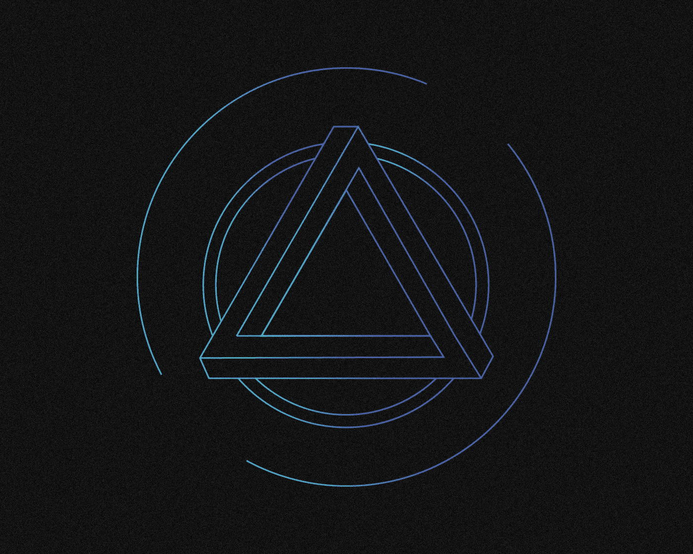
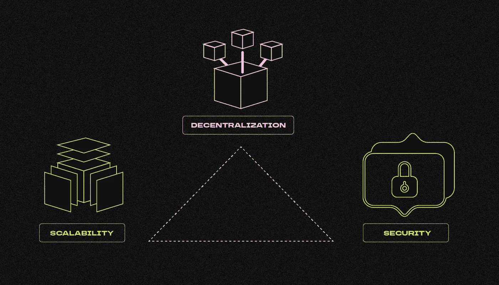
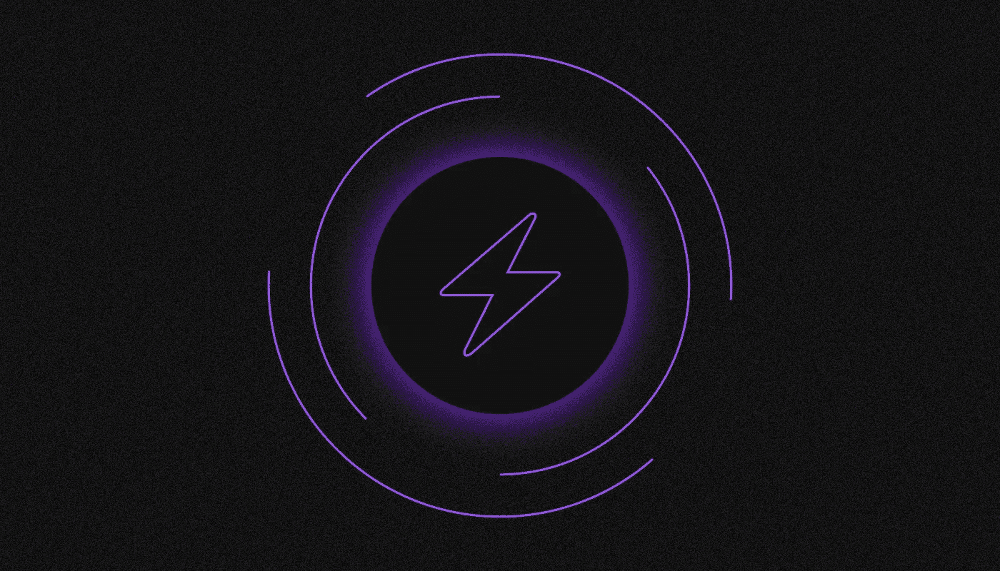

# 什么是区块链三难困境？

> 原文：<https://medium.com/coinmonks/what-is-the-blockchain-trilemma-38a3b495a72f?source=collection_archive---------50----------------------->

***区块链三难定理是一个阐明了任何分布式网络的主要问题的定理。这需要什么？谁创造的？让我们一起来了解一下吧！***

该定理指出，在三个主要特征——权力下放、安全和绩效——中，区块链只能有两个。

# **三难困境是如何产生的？**

科学家埃里克·布鲁尔在 20 世纪 90 年代发明了 CAP 定理。根据它，一个分布式数据库(区块链也属于它)只能有三个主要属性中的两个:一致性、可用性和分区阻力。

结果，这个定理提出了一个问题:分散数据库的创建者必须牺牲这三个属性中的一个，以达到其他两个属性的适当水平。这危及数据库的长期增长。

该理论随后被应用于区块链。以太坊的创造者，Vitalik Buterin，推广了“区块链三难”这个短语，他的项目是第一个完全成熟的开发去中心化应用的平台。因为他们假设用户数量无限增长，以太坊的带宽应该在不牺牲其他重要区块链特性的情况下增加。

在以太坊之后，许多其他项目提出了他们对三难困境的解决方案:EOS、 [Solana](/sunflowercorporation/what-is-solana-fe6900bdf0c3) 、Cosmos、 [Polkadot](/sunflowercorporation/what-is-polkadot-f5d92be3a3a1) 、Near、 [Avalanche](/sunflowercorporation/what-is-avalanche-5de8f06e2bca) 、Everscale、Algorand 等。然而，还没有普遍接受的方法。

# 区块链三元悖论由什么组成？

任何区块链都有三个主要属性:

**可扩展性。**网络能够提高吞吐量，也就是说，单位时间内处理的事务数量不断增加。

**放权。**网络运行无需一个或多个可信实体的验证。对于不能使用普通计算机加入的节点或节点组，不应存在信任。

**安全。**区块链可以抵御相当一部分节点的攻击(理想情况下，网络中所有节点的 50%，但任何高于 25%的节点都是好的水平)。

有三个类别以不同的方式说明了这一规则:

1.  **传统区块链**:比特币、以太币或莱特币。他们的每个参与者管理一个确认每个交易的完整节点。这种网络具有高度的安全性和分散性，但带宽较低。
2.  **高速区块链**:包括使用委托利益证明算法的网络，它们具有少量节点(10-100)。同时对每一个都提出了很高的要求，比如需要昂贵的服务器设备或者大量的原生币。这些都是高效安全的网络，但它们缺乏分散性。
3.  **多链系统:**在这种系统中，应用程序链接到各种区块链，然后通过跨链通信协议相互交互。这是一个分散的、可扩展的网络，但并不安全。毕竟，为了“打破”通常的结构并对所有其他参与者造成负面后果，攻击者必须控制系统的一个区块链中的大多数节点。

# **如何解决区块链三难问题？**

今天，我们可以区分解决这个定理的两种方法，这将使我们避免被迫妥协。

**二级解决方案**

这些是分散网络“顶部”的不寻常的附加物，延伸到链上活动的边界之外。比特币小额支付网络 Lightning Network 就是一个例子。

比特币网络上的传统转账可能既昂贵又缓慢，使得小额交易在经济上毫无意义。闪电网络是为了促进小额 P2P 转账和交易而创建的。这是一个用户可以创建频道的网络。这种信道之间的传输很便宜，只需要几秒钟。传输验证首先发生在应用程序级别，而不是区块链。第二级解决方案被认为是不彻底的措施，无法实现区块链的目标。

**一级解决方案**

这些解决方案的设计和实施要困难得多，但它们具有巨大的潜力，并将改变区块链本身的架构。

各种网络的开发者提供了他们自己的解决“区块链三难困境”的方案，例如使用多种可互操作的区块链、分片、新的加密方法等等。然而，这并不意味着理论家们一定是正确的，或者“区块链三难困境”需要解决。毕竟这是一个抽象的建构，而不是物理规律。

> 我们很想在下面的评论中听到你对区块链·特里埃玛的看法。如果你喜欢这篇文章，请订阅我们的[媒体提要](https://medium.com/sunflowercorporation)获取更多内容。
> 敬请期待！

> 交易新手？尝试[加密交易机器人](/coinmonks/crypto-trading-bot-c2ffce8acb2a)或[复制交易](/coinmonks/top-10-crypto-copy-trading-platforms-for-beginners-d0c37c7d698c)