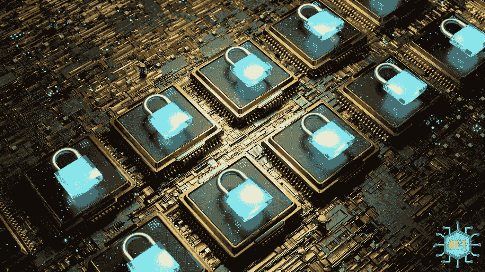

# NFT 智能合约和加密货币智能合约有什么区别？

> 原文：<https://medium.com/coinmonks/what-is-the-difference-between-an-nft-smart-contract-and-a-cryptocurrency-smart-contact-bb0994d3ccdb?source=collection_archive---------13----------------------->

NFT smart contract and a cryptocurrency smart contact

您是否听说过加密货币，但仍然不确定 NFT 智能合约和加密货币智能合约之间的区别？NFT 是“不可替换令牌”的缩写，它是一种可以在某些区块链网络上拥有和交易的数字对象。NFT 智能合约使开发人员能够利用令牌标准在以太坊生态系统中创建自定义令牌。NFT 与另一种基于以太坊的合约(如加密货币智能合约)的主要区别在于，NFT 不运行于任何货币或法定货币。与以太坊生态系统中的所有其他定制令牌相反，只有“NFT”令牌可以在不可伪造的令牌中分发。

在某些情况下，你可能还会听说 ERC 721 智能合约和 ERC 20 代币。NFT 和这两者的区别是什么？ERC 代表“以太坊请求注解”，这是一套关于以太坊区块链上“协议和接口”的标准。所有这些标准都由一个数字(即 ERC 20 令牌标准)唯一指定，该数字充当每个标准的唯一标识符。

> 交易新手？试试[加密交易机器人](/coinmonks/crypto-trading-bot-c2ffce8acb2a)或者[复制交易](/coinmonks/top-10-crypto-copy-trading-platforms-for-beginners-d0c37c7d698c)

# 以下是让 NFT 与众不同的三个特征:

1.首先，每个 NFT 令牌都有其独特的关于空间(即地理)、时间(即时间)或两者的属性。NFT 代币可以是一件独特的艺术品，如一幅画、一栋房子、著名游戏“CryptoKitties”中的虚拟人物，甚至是一辆古董车。

2.其次，NFT 的所有权通常是可以转让的。例如，卖给另一方的画，一旦他们付款，就变成了他们拥有的 NFT。在这个例子中，所有权转移到另一方，并写入双方之间的以太坊智能合约。

3.第三，如果你要转让你的权利，与他人一起分发一幅 NFT，同时保留原始令牌(即这幅画)，原始令牌将仍然是一幅 NFT。因此，只有 NFT 令牌的所有者才能访问 NFT 令牌。

通过这种方式，NFT 的所有权和可转让财产由其书面智能合同控制。这意味着某人不能自由转让其分发 NFT 的权利。所有的权利都应该在它的智能合同中定义，并且只能写入由其他人托管的以太坊区块链。

你可以把加密货币想象成一种数字货币或者“代币”。它也可以被归类为“数字资产”或“代币”，这取决于你的观点或偏好。在本文中，我将与您分享一些关于 NFT 和加密货币之间的区别，以及如何在自己的业务中使用 NFT 代币，而不用担心法律问题。

# 加密货币用在哪里？

如果你将加密货币与任何其他类型的数字资产或数字货币进行比较，很难确定哪种货币适用于特定的场景。毕竟，比特币是其中最受欢迎的，其价值多年来一直在飙升。然而，一旦我们看看加密货币在哪里以不同的方式使用，一些有趣的事实就会浮出水面。你以后会想记住这一点的！

比特币早在 2009 年由一个人(即中本聪)创造，他的愿景是创造“数字现金”。这是一种在世界任何地方转移资金的方式，不收取任何费用。然而，比特币并不是唯一用于在全球转移资金的数字资产。以下是其他一些例子:

1.ERC 20 令牌标准:由以太坊在 2015 年创建，该令牌标准是为希望在以太坊生态系统中创建令牌的开发者而设计的。ERC 20 令牌标准通常也被称为“ERC 20”。你可能听说过其他类型的加密货币，如基于 ERC 20 令牌标准的比特币和黄金。

2.ERC 223 令牌标准:由同一开发者编写的另一种类型，也称为“ERC-223”。这个代币标准允许你在以太坊生态系统上创建一个不可替换的硬币。

3.ERC 721 令牌标准:第三个也是最新的例子，2018 年已经被 ERC 20 令牌标准接受。这个令牌标准是针对不可替换的令牌的，这些令牌可以由唯一的身份集合或者不相同的人员集合或人员群组所拥有。

如果您认为这三个令牌标准彼此相似，那么您可能会惊讶地发现它们互不相同。

当我们谈论加密货币时，当我与您分享以下内容时，您可能也会感到惊讶:

1.“数字货币”的基本思想与“加密货币”的思想有很大不同，后者应用于以太坊生态系统中发行的代币。这些类型的数字资产之间的基本区别是，加密货币不存在于物理世界中，而数字货币更类似于可以在物理世界中使用的货币。

2.加密货币以多种不同的形式广泛分布，如比特币、莱特币和以太坊，本身没有内在价值，而“数字货币”是指基于区块链技术的数字资产(通常称为“令牌”)。

# 你如何使用 NFT？

总之，我们可以使用下面的例子在加密货币和 NFT 之间进行比较:想象一下，如果每个人都决定将“咖啡”这个词称为另一个在特定地区每个人都同意的词。这只会改变你处理这种饮料的方式，而不会影响人们消费咖啡的方式。然而，如果你要彻底改变“咖啡”的含义，从一杯咖啡变成一棵真正的树，为了它的果实或柴火而种植，这将极大地影响它的用途。

这是因为以太坊区块链上发行的代币是一种可以用作数字资产的 NFT。当你购买了 NFT，它就成为你自己的了，你可以将这些权利单独转让给另一方，丝毫不影响它的所有权。

总的来说，我想和你分享三个使用非功能性测试的例子:

1.加密货币:基本上，加密货币没有任何固有的属性或现实生活中的用例。截至目前，加密货币仅用于将资金从一方转移到另一方，而没有任何真实世界的参与。然而，这并不意味着它没有任何用例。例如，加密货币可以用于各种各样的事情，如在线购物、在线游戏、企业之间的在线转账等等。

2.数字货币:数字货币在互联网上或由您和您的公司完全控制的智能合同中被用作交易媒介，如美元或欧元。这些数字货币的价值完全基于你和其他人认为它们的价值，而不管它们在现实生活中的实际价值。

3.NFTs:第三个也是最后一个例子是我们感兴趣的，NFT 或不可替代的令牌。这些令牌也需要受到法律保护，因为输入交易需要特定 NFT 的所有者批准。如果交易是在未经所有者同意的情况下进行的，那么你可能会面临最初发行硬币本身的法律问题。此外，有一些特定类型的令牌标准是专门为数字化现实世界的资产和对象而设计的。

因此，只要你把你的 NFT 保存在它们的智能合约中，并且不试图把它们转移到区块链网络本身之外，它们就永远不会被认为是“数字货币”。

结论

本文只是简单介绍一下加密货币、数字货币和 NFT 之间的异同。虽然重要的是要记住，NFT 的用例比资金转移多得多，但我也相信，现在是所有这三种类型的资产走到一起并学习如何相互合作的时候了，以便它们都可以朝着自己的目标努力。请在评论区告诉我你的想法！