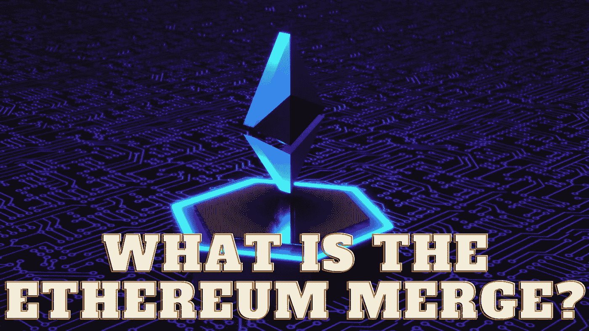

# 以太坊合并是什么？

> 原文：<https://medium.com/coinmonks/what-is-the-ethereum-merge-dc20cc12047a?source=collection_archive---------12----------------------->

Source photo Unsplash.com

# 以太坊合并到底是什么？

这一合并，正如以太坊更新所称，将影响新的加密货币交易在区块链的记录方式。

目前，以太坊和比特币区块链都使用工作验证架构，在这种架构中，节点(作为更大网络一部分的个人计算机)竞争解决困难的…