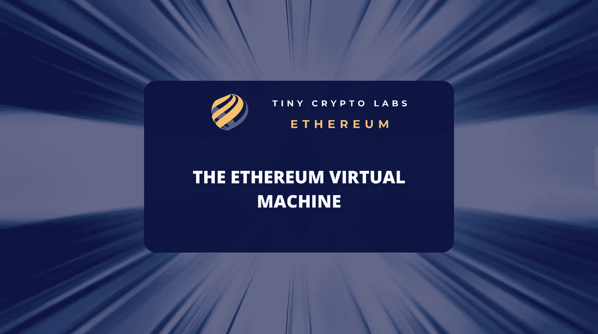

# 什么是以太坊虚拟机(EVM)？

> 原文：<https://medium.com/coinmonks/what-is-the-ethereum-virtual-machine-evm-34e55b1c410?source=collection_archive---------22----------------------->

一种看待以太坊区块链的方式是将其视为一个内置编程语言的区块链。基于共识的、全局执行的虚拟机是描述它的另一种方式。以太坊虚拟机是以太坊协议中负责所有计算(EVM)的组件。

# 以太坊虚拟机是什么？(EVM)

以太坊执行智能合约的能力取决于 EVM。以太坊的智能合约允许去中心化应用(dapps)。此外，由于智能合约，企业可以在以太坊区块链上组织所谓的 ico 或初始硬币发行，以介绍他们的令牌。

**以太坊虚拟机必备**

*   以太坊虚拟机(EVM)是智能合约的运行时环境，用于开发和测试智能合约。
*   EVM 是准完全的，这意味着它可以执行任何计算，只要启动计算的用户有足够的乙醚支付该计算所需的费用。
*   EVM 是一个沙箱化的隔离环境，这意味着它运行的代码不能访问网络、文件系统或其他进程。
*   此外，EVM 无法访问真实世界的数据，例如当前日期、时间或天气。为了获得这样的数据，它依赖于所谓的神谕。
*   以太坊网络的所有完整节点都运行 EVM。

智能合同的开发环境

EVM 是沙箱化的，与现实世界隔离开来。这意味着在 EVM 中运行的代码不能访问网络、文件系统或其他进程。这使得 EVM 成为开发和测试智能合约的完美选择，而不会干扰区块链的运营。

您可能会问自己，为什么在沙盒环境中测试智能合约是个好主意。问题是有缺陷的代码对任何智能合约都是有害的，所以确保智能合约代码中没有缺陷是必须的。

此外，像 EVM 这样的沙盒环境提供了无限的机会来学习、迭代、改进并最终完成稳健的智能合同，以便部署到区块链。

# EVM 是做什么的？

每当在以太坊区块链上发起交易时，无论是简单的价值转移还是智能合约部署，EVM 都必须执行以下三项检查:

它确认交易是否具有正确数量的值，签名是否有效，以及交易随机数是否与特定交易帐户的随机数匹配。如果不匹配，交易会提示错误。

它计算交易所需的费用，并初始化煤气支付。

它将以太网或令牌传送到指定的地址。

如果 EVM 发现发送方没有为启动的事务分配足够的气体，则该事务将失败。在这种情况下，交易费用不偿还给发起者。相反，矿工收到付款。

但是，如果由于收款人地址错误导致交易失败，EVM 会将汇款金额和相关费用返还给汇款人。

EVM 是以太坊魔法发生的地方，为区块链技术和加密货币世界带来附加值。由于 EVM 等功能，以太坊平台非常受欢迎，其原生加密软件 ether 仍然是市值最大的加密软件之一。

# EVM 的局限性

图灵完全是用来描述以太坊虚拟机的术语。计算机执行交给它的每一个计算的能力被称为“图灵完全性”任何可以接受的分析都可以通过以太坊中创建的程序或去中心化 app 来解决。

但是 EVM 是有限制的，这是一种安全预防措施。智能协定可以调用其他协定，潜在地允许无限循环。

EVM 要求每一笔网络交易都要付一笔汽油费，这意味着通过耗尽以太来防止无限的计算循环。EVM 不可能是图灵完全的；相反，它是准图灵完备的。

另一件值得一提的事情是，EVM 甚至无法访问最基本的真实世界数据。例如，EVM 不能自己知道今天是什么日子，也不能知道当前的温度。

EVM 依赖被称为 oracles 的真实世界数据提供商来获取此类数据，这是正确执行智能合同所必需的。oracle 可以从网站、应用程序或其他地方收集数据，并将其输入智能合约。

# 底线

EVM 让以太坊成为一个平台，而不仅仅是一个区块链。然而，EVM 可能是一个更好的系统。围绕交易速度和网络吞吐量存在许多挑战。

这是开发社区和以太坊路线图的焦点领域。如果以太坊要实现其彻底改变我们彼此交易方式的承诺，它将基于对 EVM 的改进。

> 交易新手？试试[加密交易机器人](/coinmonks/crypto-trading-bot-c2ffce8acb2a)或者[复制交易](/coinmonks/top-10-crypto-copy-trading-platforms-for-beginners-d0c37c7d698c)