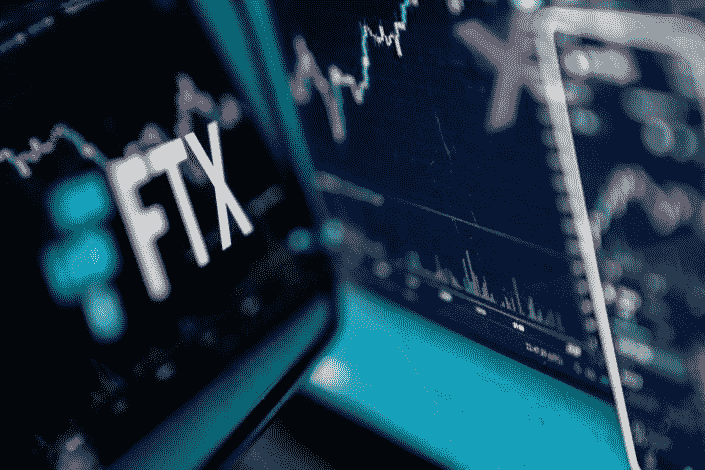
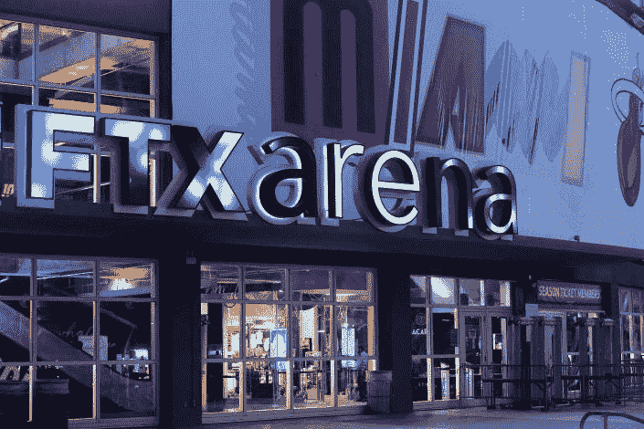
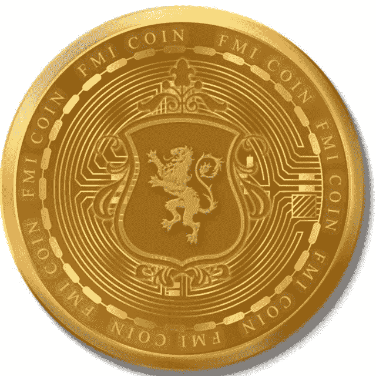

# 什么是 FTX 丑闻？名人支持的加密巨头如何陷入混乱

> 原文：<https://medium.com/coinmonks/what-is-the-ftx-scandal-how-the-celebrity-endorsed-crypto-giant-collapsed-into-chaos-2b3e65330297?source=collection_archive---------7----------------------->

就在几个月前，FTX 似乎是加密货币领域的一个重大成功故事。

不熟悉名字或者行业？那我们从头说起吧。

# FTX 代表什么？

FTX 是“期货交易所”的简称

# 什么是加密货币？

它是以数字形式交易的货币。它应该有“安全装置”来防止它被交易超过一次，跟踪它并保护它不被复制或黑客攻击。

FTX 是交易这些数字资产的最大交易所之一，被监管机构和市场观察人士誉为最透明的加密操作之一。

# 是什么引发了丑闻？

最初，市场认为 FTX 的内爆是老式的银行挤兑交易所储备的结果。

在金融领域一个基本上不受监管的角落，世界上大部分地区仍在学习如何拥有、交易和跟踪加密货币，这对买家、卖家和监管者来说实际上是如何工作的。

然而，随着时间的推移，越来越多的事实浮出水面，围绕该公司的故事变得越来越复杂，而且可能是犯罪。

# FTX 是如何瓦解的？

以下是导致破产的大致时间表:

**11 月 2 日:** CoinDesk [发布了一份报告](https://www.coindesk.com/business/2022/11/02/divisions-in-sam-bankman-frieds-crypto-empire-blur-on-his-trading-titan-alamedas-balance-sheet/)，披露阿拉米达研究公司——FTX 的姐妹公司——的资产负债表上充斥着 FTX 发行的加密货币 FTT。

11 月 6 日:币安创始人赵昌鹏表示，加密货币交易所将出售其所有剩余的 FTX 代币，“因为最近有消息曝光。”随着投资者开始撤离，FTT 价格下跌。

11 月 8 日:币安同意收购 FTX。

11 月 9 日:币安退出接管 FTX 的协议。

11 月 11 日:FTX 申请破产。30 岁的首席执行官兼创始人萨姆·班克曼·弗里德辞职。

**11 月 11 日:** [有报道称，FTX 向其姊妹公司阿拉米达转移了 100 亿美元](https://www.wsj.com/articles/ftx-tapped-into-customer-accounts-to-fund-risky-bets-setting-up-its-downfall-11668093732?utm_source=substack&utm_medium=email)，这引发了人们对最高领导人从何渠道获得该公司财务信息的担忧。

**11 月 13 日:**新闻机构开始[报道在最后几个小时里从 FTX 转移出去的大量资金](https://www.reuters.com/markets/currencies/exclusive-least-1-billion-client-funds-missing-failed-crypto-firm-ftx-sources-2022-11-12/)不见了。

【T11 月 14 日: [据报道，多个监管机构开始调查围绕该公司的](https://www.wsj.com/articles/ftx-sam-bankman-fried-sit-in-the-crosshairs-of-u-s-prosecutors-11668398012?mod=article_inline)刑事责任。

# 这家公司有多大？

这是最大的密码交易所之一，1 月份的估值估计为 320 亿美元。你会发现它的名字被贴在 NBA 体育场上，或者出现在汤姆·布拉迪和拉里·戴维等名人的广告中。

那都过去了。在上周申请破产后，加密交易所已经失去了价值、首席执行官和大部分信誉。

专家表示，FTX 的内爆可能会对整个加密货币行业产生连锁反应。

哥伦比亚商学院(Columbia Business School)兼职教授、密码行业资深人士兼作家奥米德·马莱坎(Omid Malekan)表示:“如果企业的行为像交易所和银行一样，它们就应该像交易所和银行一样受到监管，不管它们是在交易美元还是比特币。”。

# 解释 FTX 的破产申请

这一切都是从本月早些时候开始的，当时数字货币新闻网站 CoinDesk [披露了阿尔梅达研究](https://www.usatoday.com/story/money/business/2022/11/11/crypto-crash-inflation-markets-this-week/10665551002/)——一家由 30 岁的 FTX 创始人萨姆·班克曼-弗里德创立的交易公司，在 FTX 进行交易——严重依赖 FTX 发行的 FTT。

“当资产负债表被泄露时，这有点像有人拉开窗帘，意识到《绿野仙踪》不是我们想象的那样，”Malekan 说。“它打破了这是由这些年轻天才运营的非常高的、专业的、非常成功的运营的幻想。”

报告发表后，币安加密交易所表示将清算其在 FTT 的股份。随着投资者开始撤出资金，这引发了 FTT 和其他加密货币的螺旋式下跌。

华尔街日报报道称，FTX 将数十亿美元的客户资产借给阿拉米达，帮助其为高风险的赌博融资

根据 Twitter 上的一份声明，竞争对手加密货币交易所币安于 11 月 8 日同意收购 FTX，但第二天因“公司尽职调查”和“关于不当处理客户资金和据称美国机构调查的新闻报道”而撤回了对[的收购要约。](https://twitter.com/binance/status/1590449161069268992?t=iTOsxVhTnwy2zfeOGjcEA&s=19)

周五， [FTX 宣布破产](https://twitter.com/ftx_official/status/1591071832823959552)，班克曼-弗里德辞职。

路透社报道称，FTX 至少有 10 亿美元的客户资金不翼而飞。据《华尔街日报》报道，证券交易委员会和司法部正在调查该交易所。

FTX 总部所在的巴哈马当局也表示他们正在调查这次交易。

[法律专家称](https://www.wsj.com/amp/articles/what-to-watch-in-the-ftx-bankruptcy-as-details-remain-scarce-11668475992) FTX 将客户资金用于未明确告知的目的可能成为[欺诈或盗用指控的基础。](https://www.vanityfair.com/news/2022/11/sam-bankman-fried-sbf-ftx-alameda-doj-investigation)

**Crypto crash:** [人们投票时发生的事情。下面是什么是重要的以及为什么](https://www.usatoday.com/story/money/business/2022/11/11/crypto-crash-inflation-markets-this-week/10665551002/)

**FTX 和梅赛德斯:** [F1 车队梅赛德斯暂停与 FTX 的赞助协议](https://www.usatoday.com/story/sports/motor/formula1/2022/11/11/f1-team-mercedes-suspends-sponsorship-deal-with-ftx/50923577/)

这张照片展示了 2022 年 11 月 13 日 DC 华盛顿州笔记本电脑屏幕上反映的加密货币 FTX 的标志。

# 这对其他货币有什么影响？

FTX 申请破产保护后，人们对加密货币的信心动摇了。

流行货币比特币今年迄今下跌了约 65%，以太网下跌了 68%。

但 Malekan 认为，从长远来看，FTX 的破产不会对该行业产生“那么坏的影响”。他将此与互联网早期的世通丑闻相提并论，在那次丑闻中，这家电信公司因被揭露 110 亿美元的会计欺诈而破产。

“二十年后，互联网是我们生活的一个基本部分，因为它解决了重要的问题，”Malekan 说。“最终，要么这项技术是有益的，并成熟到实际上开始以超出猜测的方式影响人们，要么它不会。”

# FTX 集体诉讼

班克曼-弗里德和一些 FTX 的名人代言人现在面临美国加密投资者的集体诉讼。

该诉讼于周二在迈阿密提交，指控 FTX“虚假陈述和

欺骗性的行为。"

“FTX 的欺诈计划旨在利用来自全国各地的不老练的投资者，他们利用移动应用程序进行投资，”诉讼称。"结果，美国消费者集体承受了超过 110 亿美元的损失."

除了班克曼-弗里德，诉讼还提到了在 FTX 广告中出现的名人作为被告，包括汤姆·布拉迪、吉赛尔·邦辰、斯蒂芬·库里、拉里·戴维和沙奎尔·奥尼尔。

FTX 没有立即回应置评请求。

迈阿密的 FTX 竞技场会发生什么？

FTX 还失去了迈阿密热火队比赛场地的冠名权。

FTX 和迈阿密戴德县于 2021 年签署的为期 19 年、价值 1.25 亿美元的赞助协议已经终止。市长 Daniella Levine Cava 发表声明说，该县和该团队将共同努力，为竞技场找到一个新的冠名权合作伙伴。

一级方程式车队梅赛德斯也暂停了与 FTX 的赞助协议。

2022 年 11 月 12 日，迈阿密热火篮球队比赛的 FTX 竞技场的标志被照亮。11 月 11 日星期五，FTX 申请破产保护。

# 山姆·班克曼·弗里德的净资产是多少？

班克曼-弗里德，也被称为 SBF，以其 T2 式的乱发、T4 式的对民主党的巨额政治捐款以及周五 FTX 的崩溃和他的财富而闻名。

据《彭博》报道，这位前 FTX 首席执行官在 3 月份的高峰时期拥有 260 亿美元的净资产，而就在上周，他的身家大约为 160 亿美元。现在他的资产一文不值，他的财产也蒸发了。

正式发布于[《今日美国》](https://www.usatoday.com/)

另外阅读关于新硬币: [*FMI 硬币*](http://www.fmicoins.com/)

[FMI](http://www.fmicoins.com/) 是建立在币安智能链上的数字货币。FMI 是为公司 FMI 网络而构建的。更具体地说，它包括自己的产品，如投资不同类型的项目，创造新的项目等。FMI COIN (FMI)是一种加密货币，部署在币安智能链(BSC BEP-20)上

合同:[0x9d 427 e 2 Fe 3a D2 CB 93 f 83118d 472 a 6068 b4a 778d 6](https://bscscan.com/token/0x9d427E2fe3ad2Cb93F83118d472A6068B4a778D6)

你可以在 [Pancakeswap](https://pancakeswap.finance/) 或者 [Bitkeep App](https://bitkeep.com/download) 上购买 FMI 币。
你可以通过这个来了解详细情况👇

[https://FMI coins . medium . com/how-to-create-FMI-wallet-on-bit keep-app-e 44 a2 a 998 e6a](https://fmicoins.medium.com/how-to-create-fmi-wallet-on-bitkeep-app-e44a2a998e6a)

看看我们的[网站](http://www.fmicoins.com/):【https://fmicoins.com/ 

给我们接通 https://t.me/fmicommunityofficial 的[电报](https://t.me/fmicommunityofficial):

> 交易新手？尝试[加密交易机器人](/coinmonks/crypto-trading-bot-c2ffce8acb2a)或[复制交易](/coinmonks/top-10-crypto-copy-trading-platforms-for-beginners-d0c37c7d698c)