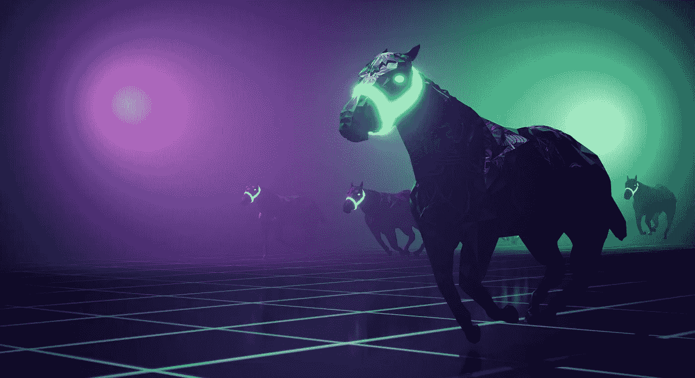
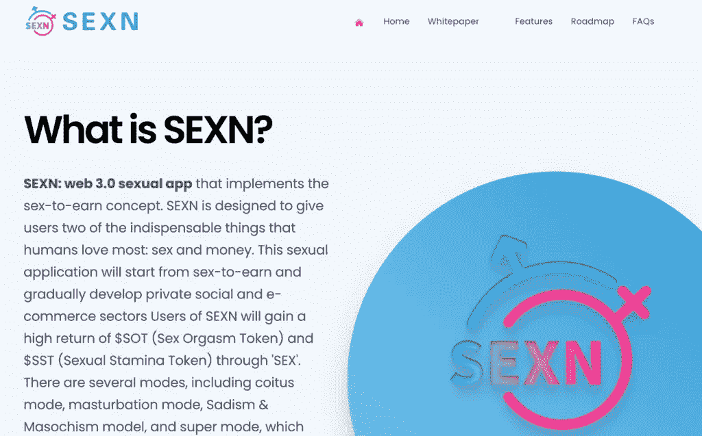
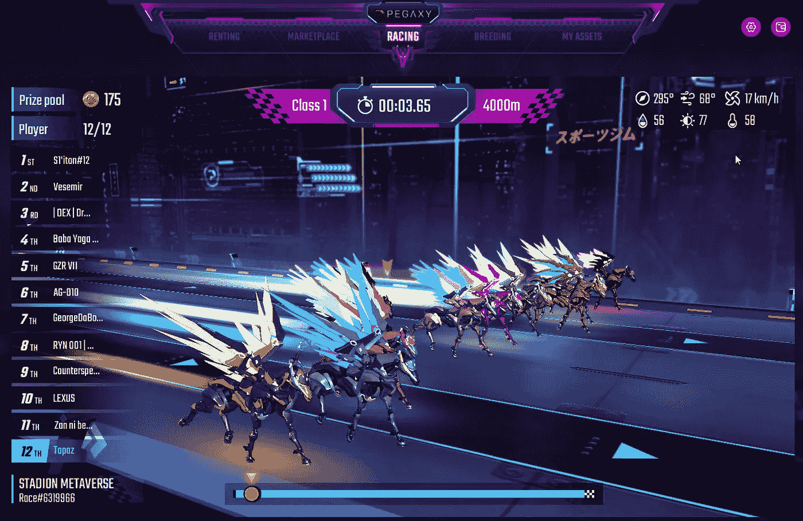
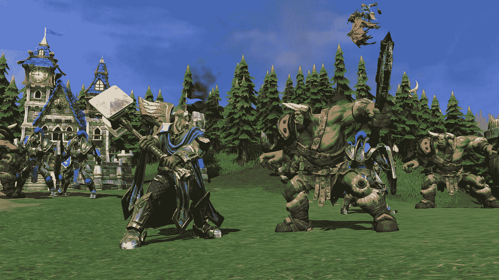

# web3 游戏的未来是什么？

> 原文：<https://medium.com/coinmonks/what-is-the-future-of-web3-gaming-31b8dcb232f3?source=collection_archive---------9----------------------->

Zed Run raised $20M in Series A and brought horse-racing to web3.

当人们问我 web3 游戏的未来是什么，我认为答案并不清楚。

Web3 游戏已经演变成一种完全不同的动物。

它不再是关于游戏、叙事、故事情节、动画、图形、人物，而是关于游戏的象征学、点数、硬币和经济学。

crypto 中的即玩即赚(p2e)游戏非常火爆。

它席卷了整个世界。

Stepn 就是这样一个例子，你基本上记录下你每天的步数，然后把你的鞋子整平。

Stepn was all the hit when it first debut, allowing users to make $ while walking.

所以从技术上来说，它更像是“移动挣钱”。

提升你的鞋子，让它们更稀有，卖掉它们以获得更多利润。

它在去年的加密牛市中大受欢迎。

"在 2022 年 Q2 冬奥会上，这家总部位于索拉纳的“移动赚钱”应用通过平台费赚取了 1.225 亿美元的利润."

对于一家初创公司来说，这在一个季度内是相当可观的数字。

很自然地，一系列相似的克隆产品开始充斥市场，用户突然被淹没在各种选择中。Step，Sweatcoin，MoveZ，Aglet，DotMoovs，Dustland Runners，Genopets 甚至 Sexn。

And you thought it was a joke eh?

所有基本上相同的想法，你移动赚取硬币，水平，得到更好的东西，卖掉它们赚钱，并重复。

是的，当然，p2e 游戏很酷，但是当你吸引了主要是为了快速获利的用户时，一旦炒作消失，他们往往会从一个游戏转移到另一个游戏。

让我们看看更多的例子，好吗？

Pegaxy 是一款“玩到赚”的加密游戏，在最近的时间里已经超越了其他游戏。

Pegaxy took a leaf from Zed Run and crushed it, with better marketing and improving on the flaws of Zed Run.

“Pegaxy 将很快成为 P2E 领域最热门的游戏之一。它还教会了这个羽翼未丰的游戏工作室很多东西，什么有用，什么没用，以及如何处理有缺陷的产品和崩溃的代币价格。根据专注于分散化应用的平台 DappRadar 的数据，虽然这款游戏已经从巅峰下滑——就像它的许多 P2E 同行一样——但每周仍有大约 5.3 万人玩 Pegaxy

Zed Run 是加密世界中的另一款数字赛马游戏。

自 2019 年推出以来，它在 2021 年实现了 3000 万美元的收入。

我很确定 Zed Run 是 OG，Pegaxy 从他们那里获得了一些灵感。

当然，现在是冬天，没人赚钱，也许除了在淘金热期间卖黑桃的交易所，他们不管怎样都赚钱。

自然，web3 游戏的所有代币和硬币都狠狠地崩溃了。

Warcraft captured the world with its immense storyline, well thought-out gameplay and deep character building.

在熊市期间，如果你把目光放远一点，人们会感到恐惧，会把钱和投资从他们最没有信心和信心的地方撤出。

游戏完全属于这一类，随着加密冬天的到来，所有的流动性都迅速耗尽。

我认为 web3 游戏的未来将掌握在伟大的讲故事游戏手中。

游戏将吸引人，令人兴奋，并让用户深深沉浸在故事情节中。

像暗黑破坏神，索尼克，塞尔达，马里奥，星际争霸和魔兽争霸这样的成功的 web2 游戏。

Today, the same number of days (4501) have passed since the Starcraft 2 release compared with the time between Starcraft 1 and Starcraft 2.

他们没有令人困惑的令牌组学和花哨的硬币来吸引用户。

他们用丰富的故事情节、发展良好的角色和高度沉浸的图形做到了这一点，几十年来绝对吸引了数百万粉丝。

因此，可能会出现这样一种情况，伟大的讲故事遇到了声音记号学和中提琴！

你得到了 web3 游戏中第二好的东西。

这将是一个 web2 游戏，设法将他们的游戏与实用的令牌经济学是明智的。

或者，它会是一款 web3 游戏，能够以高超的故事讲述方式吸引用户。

让我们看看谁先到达那里。

-

你对 web3 游戏的未来感到兴奋吗？

-

#创业#商业#创业#成长#成功#社交媒体#文化#创业#战略#讲故事#非技术#游戏#网络 3 #令牌经济学#网络 2 #游戏

> 交易新手？试试[加密交易机器人](/coinmonks/crypto-trading-bot-c2ffce8acb2a)或者[复制交易](/coinmonks/top-10-crypto-copy-trading-platforms-for-beginners-d0c37c7d698c)
> 
> 多样化的密码持有，了解[币安替代品](https://coincodecap.com/binance-alternatives)
> 
> 加入 Coinmonks [电报频道](https://t.me/coincodecap)和 [Youtube 频道](https://www.youtube.com/c/coinmonks/videos)获取每日[加密新闻](http://coincodecap.com/)

# 另外，阅读

*   [复制交易](/coinmonks/top-10-crypto-copy-trading-platforms-for-beginners-d0c37c7d698c) | [加密税务软件](/coinmonks/crypto-tax-software-ed4b4810e338)
*   [网格交易](https://coincodecap.com/grid-trading) | [加密硬件钱包](/coinmonks/the-best-cryptocurrency-hardware-wallets-of-2020-e28b1c124069)
*   [密码电报信号](/coinmonks/top-3-telegram-channels-for-crypto-traders-in-2021-8385f4411ff4) | [密码交易机器人](/coinmonks/crypto-trading-bot-c2ffce8acb2a)
*   [最佳加密交易所](/coinmonks/crypto-exchange-dd2f9d6f3769) | [印度最佳加密交易所](/coinmonks/bitcoin-exchange-in-india-7f1fe79715c9)
*   开发人员的最佳加密 API
*   最佳[密码借贷平台](/coinmonks/top-5-crypto-lending-platforms-in-2020-that-you-need-to-know-a1b675cec3fa)
*   [免费加密信号](/coinmonks/free-crypto-signals-48b25e61a8da) | [加密交易机器人](/coinmonks/crypto-trading-bot-c2ffce8acb2a)
*   杠杆代币的终极指南