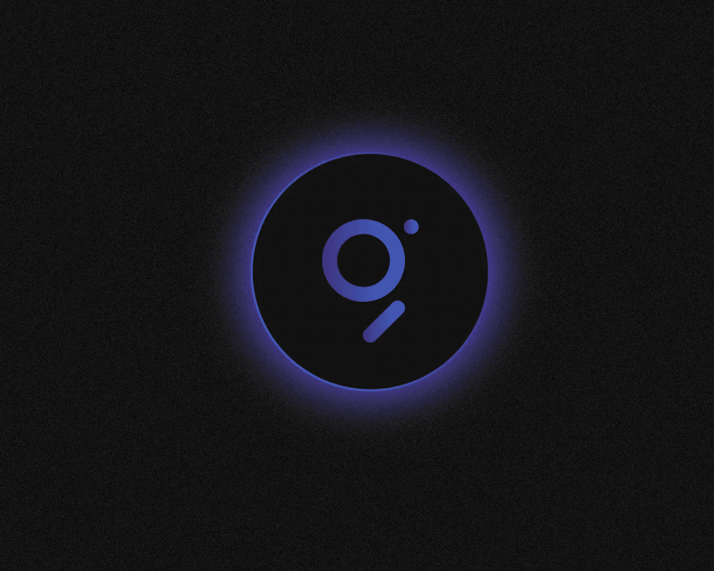
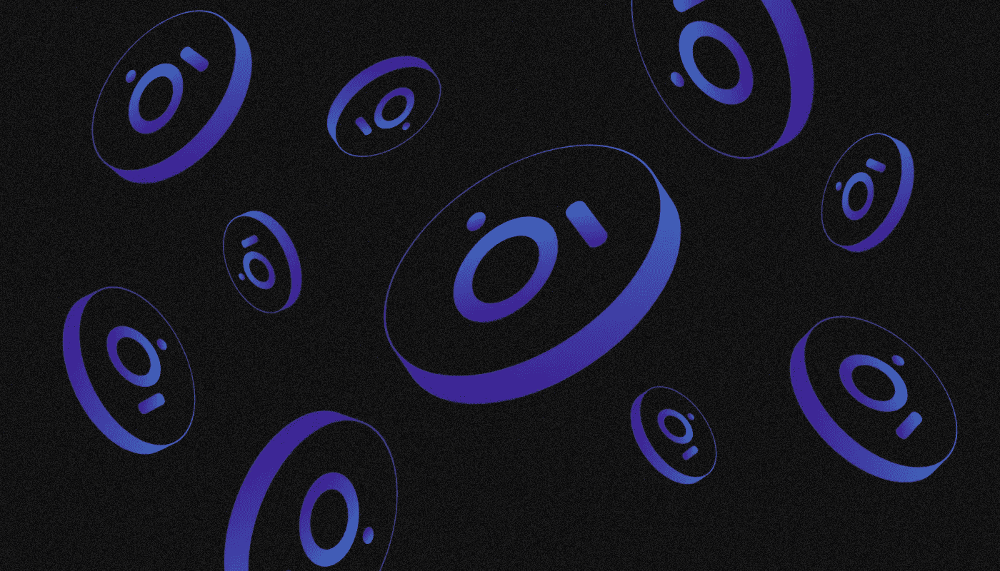
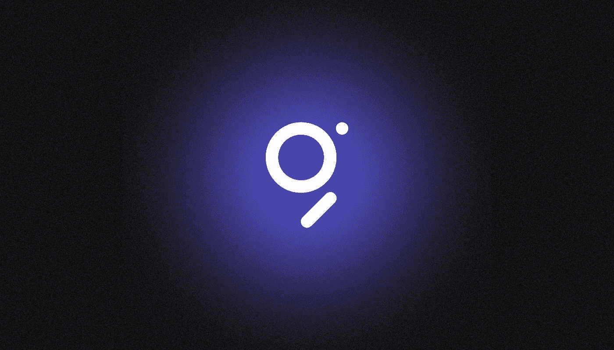

# 什么是图形(GRT)？

> 原文：<https://medium.com/coinmonks/what-is-the-graph-grt-28b9cf6ad671?source=collection_archive---------13----------------------->

[***图***](https://thegraph.com/) ***是一种分散式协议，旨在从公共区块链请求数据，同时还提供有效的索引。它是如何工作的，我们为什么需要它？让我们来了解一下！***

该图的基本功能元素是由第三方开发人员创建的子图，用于接收和索引来自特定区块链的数据。

图协议最初是在以太坊中实现的，但是它的子图现在被用于 30 多个分散的网络中。

Aave、Audius、Uniswap、Opyn、ENS、DAOstack、Synthetix、Gnosis、Balancer、Livepeer、Decentraland 和其他区块链项目都创建了自己的子图，并在今天使用它们。

# 谁画了这张图？

Graph Protocol 由 **Yaniv Tal** 、 **Jannis Pohlmann** 和 **Brandon Ramirez** 于 **2018** 在旧金山创立。他们之前合作过几个软件创业公司，专注于为开发者创造工具。

同年，一个非盈利组织 [The Graph Foundation](https://www.graphfoundation.org/) 在美国注册，承担了技术传播、知识产权保护和生态系统发展支持的任务。

该项目已经在七个阶段中获得了总计**6960 万**美元的资助。这家初创公司在 2019 年 1 月**从 Multicoin Capital crypto fund 获得了**250 万美元**的种子资金。**

2020 年 10 月，举行了一次公开的代币拍卖，筹集了 1200 万美元。最大的一轮融资为 5000 万美元，发生在 2022 年 1 月**。Graph Protocol 的投资者包括比特币基地风险投资公司、数字货币集团、AU21 资本和老虎全球管理公司等基金。**

****2020 年 12 月 17 日，**经过几个月的测试，Graph Network 在区块链以太坊发布。**

**该协议发布后，Graph Foundation 专注于生态系统的开发和第三方工程团队的资金支持。 [Edge & Node](https://edgeandnode.com/) ，由 Graph 团队于 **2021** 年创立，是该协议的主要开发者。**

# **图网络是如何工作的？**

**该图对区块链数据的索引类似于谷歌搜索机器人对互联网网页的索引。在此过程中，文件、数据和元数据将被查看和编目，以便快速找到结果。**

**该协议将数据分成子图，每个子图都有一个开放的 API。任何开发人员都可以创建自己的子图，并将其提供给 Graph Network 社区，以便向分散的应用程序传输数据(例如，令牌报价)。**

**图网络坚持最大分散化的原则:协议的大部分阶段分布在成千上万的社区成员中，他们对网络运行的贡献用 GRT 令牌来补偿。**

**除了创建子图的独立开发团队之外，协议中还有四种类型的参与者:**

*   **索引器
    它们是节点操作者，为了获得报酬，它们将区块链索引并处理请求。他们必须首先阻止至少 100，000 GRT，以保证节点完整性。如果节点提供不正确的数据，操作者将面临惩罚；**
*   ****策展人**
    他们是社区成员，提醒索引器哪些子图包含有价值的数据，应该被编入索引。当馆长把他们的 GRTS 放在一个特定的子图中，信号就产生了。此外，多个策展人可以为一个或多个子图投票。在后一种情况下，他们都将获得与其贡献成比例的佣金；**
*   **这些用户可以将令牌委托给一个或多个索引器，以换取处理请求的一部分报酬。如果代表希望撤销 GRT，他们必须等待 28 天才能解除冻结；**
*   **消费者他们是协议的最终用户，使用 GraphQL 语言接收来自子图的数据。每个请求都用 GRT 令牌支付，这些令牌在索引器、管理器和代理之间分发。**

**对于任何 EVM 兼容的区块链，索引器都可以运行自己的节点，即图形节点。由于集成了 Firehose 工具，笔记还可以与其他区块链进行交互。NEAR、Arweave、Solana 和 Cosmos 网络已经得到支持**

**开发人员可以使用该图来创建 Web3 应用程序，这些应用程序不需要集中式服务器，并且完全在公共的分散式基础设施中工作。**

# **图表的符号组学**

****

**图网络生态系统中使用了 [ERC-20](/@SunflowerCorpAdmin/what-are-erc-20-tokens-afcccbc53962) 标准的实用令牌 **GRT** 。**

**GRT 在为项目吸引资金方面发挥了重要作用。即使在 2018-20 年推出主网络之前，17%的资产要约通过私人和公开的代币销售进行，筹集了 750 万美元。**

**Graph Network 推出时 GRT 的初始发行额为 100 亿。令牌以下列方式分发:**

*   **团队和顾问——23%；**
*   **对社区(用于图形基金会计数的基金和其他目的)—35%；**
*   **投资者——34%；**
*   **边缘和节点公司— 8%。**

**令牌解锁计划预计持续十年。截至 2022 年 8 月日**，总供应量的 74%，即 74 亿 GRT，已经解锁。该资产的额外发行约为每年 3%。也有一些可调节的机制，允许你根据需要从流通中收回并烧掉一部分代币。****

**GRT 是保证图网络协议正常运行的激励系统的重要组成部分。令牌有几种使用情形:**

*   ****资助**——Graph Foundation 在 GRT 中向子图和其他工具的开发者提供资助；**
*   ****Staking** —当索引子图和处理查询时，索引器阻塞 GRT 作为其完整性的保证；**
*   ****发信号** —策展人将他们的 GRT 添加到子图中，以吸引索引器对它的注意；**
*   ****委托** —委托人将 GRT 传递给现有索引器；**
*   ****支付** —数据消费者为子图请求支付 GRT**
*   ****报酬** —索引员、策展人和代表收到请求的部分报酬。**

**该令牌在所有主要的加密交易所进行交易，如币安、比特币基地、Kucoin 和 OKX。该资产市值排名前 100。**

# **图表是如何演变的？**

****2020 年 6 月**，宣布了该协议与 Chainlink 的整合。这使得索引数据能够通过分散的 oracles 网络从子图传输到智能合同。**

****2021 年初**，Graph Foundation 向来自全球十个国家的 50 多个团队提供了 500 万美元的资助，用于开发协议工具、子图和教育资源。**

**项目生态系统产品由 OpenZeppelin、Chainsafe、Consensus Diligence 和其他参与区块链解决方案安全的公司进行审计。**

****2022 年 2 月**，Digital Currency Group、Multicoin Capital、Reciprocal Ventures、Cryptos Capital、NGC 风险投资公司和 HashKey 创建了一只 2.05 亿美元的基金，旨在投资使用该图的区块链项目。**

**同月，图表基金会启动了[图表倡导者](https://thegraph.com/blog/graph-advocates)计划。从社区中挑选了几十名大使来创建教育内容，举办活动，提供技术支持，并确保全球图形资源的可用性。**

****

**【2022 年 4 月，分散自治组织 Graph AdvocatesDAO 接管了 Graph Advocates 计划的控制和融资，以及社区拨款的分配。**

**从开始到现在不到两年的时间里，这个项目已经成为快速发展的 Web3 基础设施和 DeFi 行业的重要组成部分。**

**截至【2022 年 7 月，该图支持 31 个网络上的数据索引，包括[以太坊](/@SunflowerCorpAdmin/what-is-ethereum-eth-37e0ff2c7af1)、[近](/sunflowercorporation/what-is-near-protocol-7a82f06a9d60)、仲裁、乐观(ссылка)、[多边形](/sunflowercorporation/what-is-polygon-matic-916f4fa2afee)、[雪崩](/sunflowercorporation/what-is-avalanche-5de8f06e2bca)、Celo、 [Fantom](/sunflowercorporation/what-is-fantom-4ffad859b95a) 、Moonbeam、 [IPFS](/coinmonks/what-is-ipfs-c150eead23ad) 和 PoA。**

**迄今为止，超过 24000 名开发者已经为 [Uniswap](/sunflowercorporation/what-is-uniswap-2ab17b51b63b) 、Synthetix、仿植物怪兽佐拉、已知起源、Gnosis、平衡器、Livepeer、DAOstack、Audius 和[分散地](/sunflowercorporation/decentraland-the-metaverse-you-want-to-stay-in-d6a6f42c2b4d)等应用部署了超过 31000 个子图。**

> **如果你对图表主题有任何补充，欢迎评论！在跟踪更新方面，订阅我们的[媒体提要。](/@SunflowerCorpAdmin)**
> 
> **您也可以在我们的平台[向日葵公司](https://sunflowercorp.com)上尝试使用加密货币。
> 敬请期待！**

****

> **交易新手？尝试[加密交易机器人](/coinmonks/crypto-trading-bot-c2ffce8acb2a)或[复制交易](/coinmonks/top-10-crypto-copy-trading-platforms-for-beginners-d0c37c7d698c)**