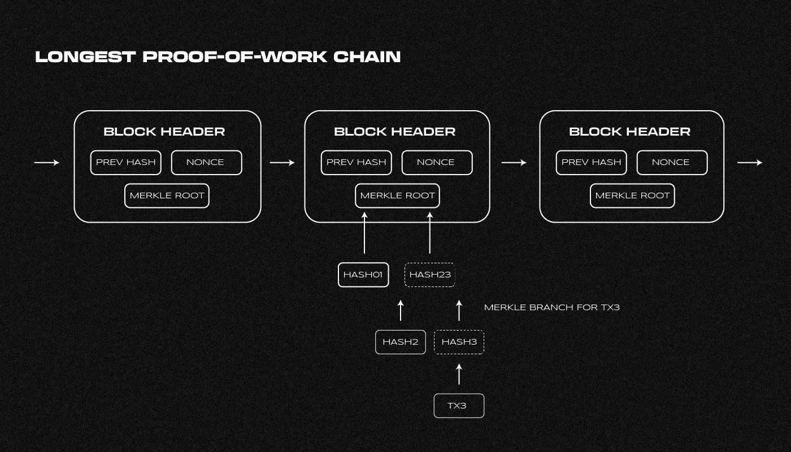
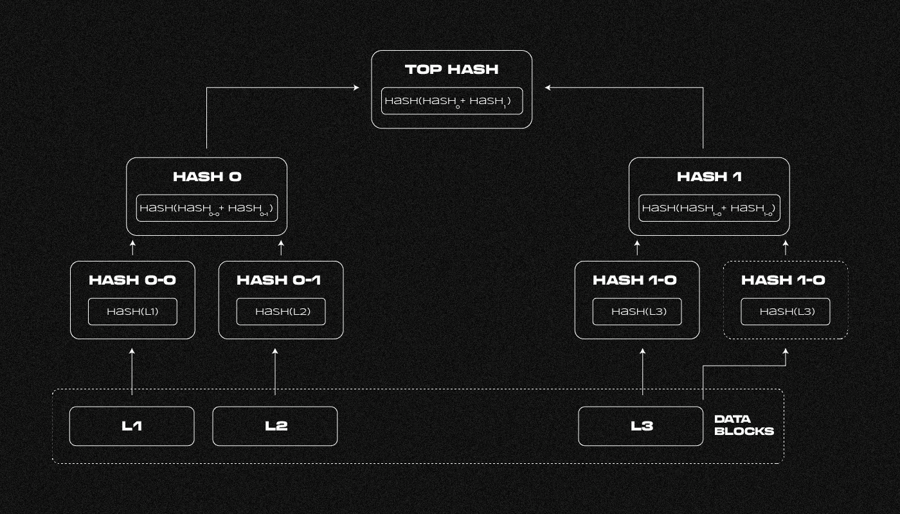
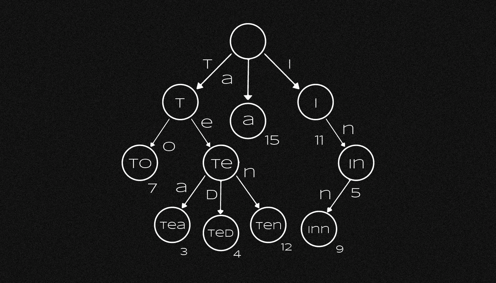
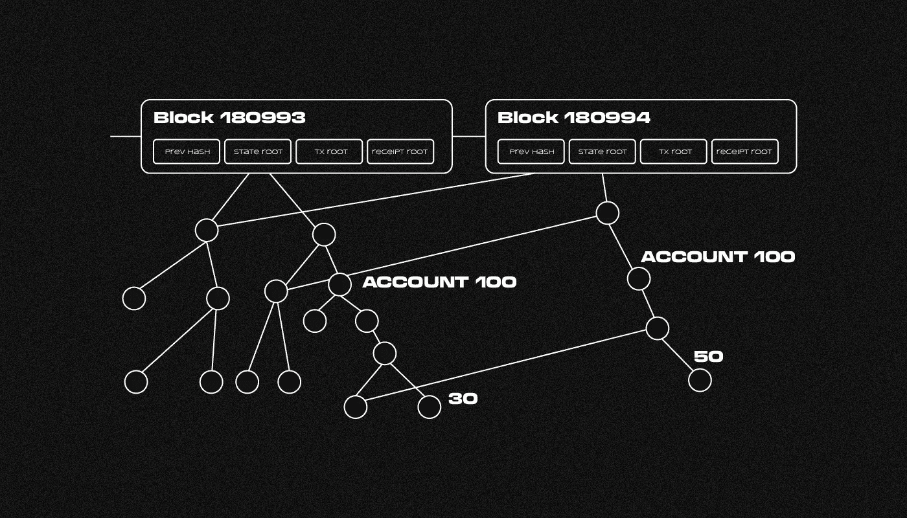

# 什么是 Merkle 树？

> 原文：<https://medium.com/coinmonks/what-is-the-merkle-tree-91825a8a8891?source=collection_archive---------19----------------------->

***Merkle 树(哈希树)是一种为大量数据生成单个哈希的算法。该方法用于检查文件的完整性和验证数据。它是如何工作的？我们为什么需要它？让我们来了解一下！***

哈希树可以表示为一种结构，其分支从底部分支到中间节点。在分支的末端，放置代表数据片段的叶子。根哈希位于树的底部(Merkle root)。后者是比特币块头的必需组件。

可以使用根哈希来验证每个事务。您只需要下载块头和操作的认证路径。Merkle 树减少了所需的计算数量，从而简化了支付验证(SPV)。

# 谁在何时创造了 Merkle 树？

T4 教授 Ralph Merkle 开发了哈希树的概念。在 **1979** 年，他发明了一种表示数字签名的方法。斯坦福大学拥有这项技术的专利。

这位科学家提议使用二叉哈希树。Merkle 还对密码学的发展做出了重大贡献。他因 **1987** 出版物[“基于с传统加密函数的数字签名”](https://link.springer.com/chapter/10.1007/3-540-48184-2_32)而闻名。

# 为什么我们需要 Merkle 树？

集中式系统从所有用户依赖的单一来源提供数据。它确保收到的信息是正确的。

分布式数据库就是区块链。它的内容存储在节点网络上。该节点不能接受来自其他参与者的消息，除非它们被验证。该节点必须决定该块是否包含有效的事务。

Merkle 树可以用来节省计算费用。它们使您能够减少下载的数据量，并通过哈希优化验证。

比特币、以太坊和其他加密货币都使用这种方法。它用于获取验证一组事务的数据字符串。此外，该算法还用于文件系统和数据库。使用 Merkle 树对信息进行错误检查和同步。

# Merkle 树是如何工作的？

Merkle 树是从头开始建造的。散列数据片段产生叶顶点中的值。下一级的节点包含两个子节点之和的散列。串联是一种组合数据的方法。对以下级别的节点重复该操作，直到获得单个散列。如果元素的数量是奇数，其中一个将被复制或不变地转移到下一级。

当构造一个树时，获得一个散列，它被称为 Merkle 根。它代表所有的数据片段。因此，Merkle 树是一个单向散列函数。

该算法允许您创建一个二进制结构，其节点值由两个字符串组成。后一种属性允许验证大量数据，而无需为每个片段重新计算散列。在这种情况下，确定单个元素的真实性的计算成本要低得多。

为了确保数组的正确性和完整性，必须将根哈希与参考值进行比较。片段可以是事务数据或文件的一部分。

# 比特币中的 Merkle 树是如何使用的？

比特币区块链是由写入链末端的碎片构建而成的。它包含有关用户转移的信息。因为事务的数量和信息量都是可变的，所以块没有固定的大小。

比特币节点会创建标头来优化计算。它们由以下要素组成:

*   [块版本号](https://developer.bitcoin.org/reference/block_chain.html)；
*   前一个块的哈希；
*   Merkle 树的根；
*   时间戳；
*   挖掘复杂性的目标；
*   生成块时使用的一次性代码(随机数)。

报头长度为 80 字节，不包括任何事务。因为每十分钟生成一次，所以数据量每年增加 4.2 兆。

事务信息被散列，允许您获得事务 id。传输数据以十六进制格式保存。根哈希表示块中的所有事务。构建 Merkle 树来寻找后者。以下算法用于处理数据:

1.  块中包含事务的散列(标识符):散列(L1)、散列(L2)、散列(L3)等等。它们形成了树叶。
2.  来自两个相邻标识符之和的散列被放置在下一级:散列(散列(L1) +散列(L2))。在二叉树中，每一层的节点数必须是偶数。否则，将复制最后一个单元格的散列，并将其放入另一个元素中。
3.  重复散列数据量的过程，直到获得 Merkle 根。

每个事务的有效性由产生的散列来确认。当形成区块链时，节点仅使用先前块的报头。

隔离证人协议于 2017 年 8 月在**更新。它采用了不同的事务数据结构，从而减小了数据块的大小。该更新的采用降低了比特币区块链的负载。**

# Merkle 树有什么优势？

散列树使得验证事务属于特定块变得更加容易，并确保数据在传输时的完整性。该方法是更容易的支付验证所必需的。在比特币白皮书中，中本聪建议使用 SPV。

如果节点有足够的计算能力，它可以加载所有的块并计算每个事务的散列。然后形成 Merkle 树。它们允许您验证数据的完整性和每个操作的有效性。如果节点资源有限，它只能请求块头和事务 id。

[轻客户端](https://www.coinbase.com/ru/cloud/discover/dev-foundations/blockchain-client-types#Light-clients)加载被验证交易的头和认证路径(Merkle proof)。它们从完整节点请求信息。认证路径包括来自位于从顶点到事务的路径上的每对树节点的散列。

它们从整个节点请求信息。从顶点到事务的路径上的每对树节点的散列被包括在认证路径中。

要验证操作，必须找到 Merkle 根。如果接收到的散列与块报头中的字符串匹配，则交易被确认。几乎不可能在另一个数据集中找到所需的 Merkle 根，从而确保操作的有效性。

SPV 方法使简单客户端能够与区块链交互，同时减少下载的数据量。例如，具有五个事务的 500 千字节的块大小对于 Merkle 的证明只需要 140 字节。

# 以太坊用的是哪棵 Merkle 树？

Merkle 二叉树是表示为列表的数组的理想选择。它的结构保持不变，这使得散列事务更容易。前缀树是以太坊中表示数据的一种不同方式。

该树使您能够将数据存储在关联数组中。字符串是定义集合中元素位置的键。树的分支由不同的符号表示以形成结构，因此元素的键唯一地标识它。

与比特币不同，以太坊区块链使用三种哈希树:

*   事务树；
*   国家之树；
*   包含交易结果数据的树。

块头包括三个根哈希。以太坊允许您创建能够执行一组基本操作的轻型客户端，例如:

*   检查块中是否有交易；
*   确认特定地址的存在；
*   确定用户的余额；
*   找出操作或智能合约的结果。

这些操作是在没有完全加载块的情况下执行的。哈希树简化了计算，允许轻量级客户端在个人电脑、笔记本电脑和智能手机上运行。

以太坊的交易数据处理算法类似于比特币。与状态树交互更加困难。数组元素的键表示用户的地址，其值表示帐户余额。

散列树需要频繁的数据更新以及地址的添加和删除。该算法的实现需要一个可变的结构。它的参数受到限制，以防止 DDoS 攻击，这种攻击允许攻击者创建非常深的树。

否则，更新结构和执行操作将需要很长时间。

树根应该完全由数据决定，而不是由它的参数决定。因此，需要能够以任何顺序进行更新。

您可以使用前缀树来解决这些问题。以太坊中的每个结构元素都有 16 个子元素。此方法最适合以十六进制格式对节点进行编码。

要获得前缀树中的关键字，必须指定与分支对应的连续字符。它们指定了从根到所选元素的路径。键值是动态的，这意味着您可以随时添加或删除新节点。

> 如果您对 Merkle tree 主题有任何补充，欢迎发表评论！
> 在跟踪更新方面，订阅我们的 [Medium feed。](https://medium.com/sunflowercorporation)
> 
> 敬请期待！

> 交易新手？试试[密码交易机器人](/coinmonks/crypto-trading-bot-c2ffce8acb2a)或者[复制交易](/coinmonks/top-10-crypto-copy-trading-platforms-for-beginners-d0c37c7d698c)