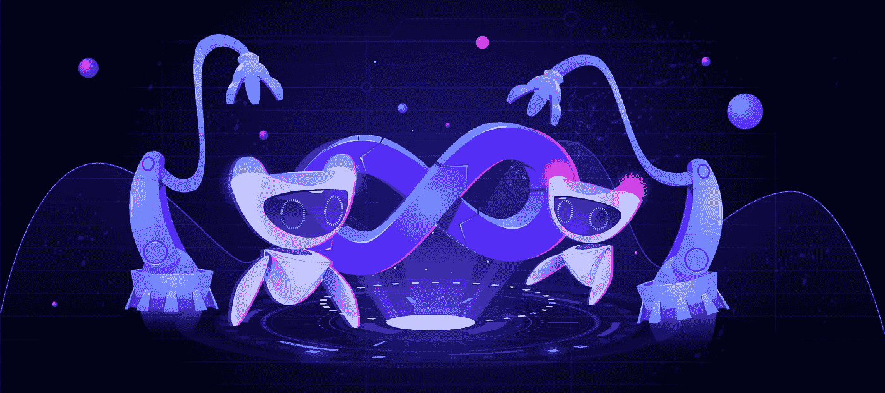

# 什么是元宇宙，为什么它很重要？

> 原文：<https://medium.com/coinmonks/what-is-the-metaverse-and-why-should-it-matter-a734ad3feeeb?source=collection_archive---------35----------------------->

很有可能，你以前听说过“元宇宙”这个术语。从科幻小说到电子游戏，再到商业演示，它已经被广泛应用。但是元宇宙到底是什么？这是一个真实的地方吗？或者这只是我们想象中的虚构？

要回答这个问题，我们需要了解“元宇宙”这个词的实际含义。前缀“meta-”来自希腊语单词μετά，意思是“之后”或“超越”因此，当我们谈论“元宇宙”时，我们谈论的是一个存在于我们的物理世界之外的虚拟世界。

在这个虚拟的世界里，我们必须退一步理解这个术语的来源。“元宇宙”这个词是两个词的组合:“元”和“宇宙”前缀“元”意味着“超越”，而单词“宇宙”指的是所有的存在。所以当我们把这两个词放在一起，我们得到了“超越一切存在”

但是这到底意味着什么呢？嗯，很难说。元宇宙在很大程度上仍然是一个概念，因此，它还没有一个具体的定义。但是我们知道元宇宙是一个虚拟世界，存在于我们的物理世界之外。在这里，人们可以以在现实世界中不可能的方式相互交流，与数字数据交流。

# 元宇宙的起源

元宇宙的概念是由科幻作家尼尔·斯蒂芬森在他 1992 年的小说《冰雪奇缘》中提出的。在小说中，元宇宙是一个与现实世界并存的虚拟世界。这是一个人们可以见面和相互交流的地方。

斯蒂芬森的小说深受威廉·吉布森 1984 年的科幻小说《神经漫游者》的影响，该小说引入了网络空间的概念——存在于计算机和网络中的数字世界。网络空间类似于元宇宙，因为它是一个人们可以以现实世界中不可能的方式见面和互动的地方。

然而，网络空间和元宇宙之间有一些关键的区别。首先，网络空间包含在我们的物理世界中，而元宇宙存在于物理世界之外。其次，虽然网络空间主要由文本和静态图像组成，但元宇宙被设计成完全沉浸式的——更像是一个视频游戏。

但是什么是元宇宙呢？元宇宙是一个用来描述我们玩视频游戏时沉浸其中的虚拟世界的术语。这是一个平行宇宙，任何事情都有可能。我们可以成为任何我们想成为的人，去任何我们想去的地方，做任何我们想做的事。

听起来很棒，对吧？的确如此。元宇宙是一个令人惊叹的地方，可以逃避日常的琐事，体验超乎我们想象的世界。然而，元宇宙有一个主要问题…

还不存在…

元宇宙仍处于起步阶段。对于元宇宙到底是什么，有许多不同的定义，也没有一个平台可以囊括元宇宙的一切。现在，元宇宙存在许多不同的虚拟世界，每个都有自己的规则和条例。

然而，未来有可能出现一个包罗万象的元宇宙。一个我们可以在虚拟空间中见面和互动的地方。一个我们可以创造自己的化身，探索无限可能的地方。

Infinity Realm 仍然处于开发的早期阶段，但是我们对 Infinity Realm 有很大的计划。我们希望它成为想沉浸在虚拟世界中的人们的首选目的地。我们希望它成为一个人们可以聚在一起创造他们自己的故事的地方。

# 元宇宙看起来像什么？

同样，这很难说，因为元宇宙在很大程度上仍然是一个概念，而不是一个实际的地方。然而，许多未来学家和梦想家对元宇宙可能的样子提出了自己的想法。

一个流行的想法来自科幻作家 Vernor Vinge，他设想元宇宙是一个无所不包的数字世界，包含人类创造的每一条信息——包括文档、图像、视频等。这个巨大的信息宝库对任何一个有网络连接的人来说都是可以访问的，这使得世界上的任何人都有可能在任何时间学习他们想要的任何东西。

# 无限领域和元宇宙有什么关系？

无限领域是一个新的即将到来的虚拟世界，它有望成为那些想要沉浸在元宇宙中的人的绝佳目的地。我们创造了 iRem 代币来彻底改变元宇宙世界，通过“玩一玩就能赚”的方法将它带到了游戏的下一个层次。无限境界想通过 [iRem 令牌](https://pancakeswap.finance/swap?outputCurrency=0xa410581Ec8e6B11F41d116cA4E494cA499891323)实现游戏玩家不可能的事情。

# 结论

那么什么是元宇宙呢？是真的吗？或者这只是我们想象中的虚构？答案是肯定的，也是否定的。虽然它还不存在，但有许多人正在努力使它成为现实——当它成为现实时，它将永远改变我们所知道的我们与技术的关系，这就是为什么 Infinity Realm 不断致力于新功能和改进，以便我们可以更快地使元宇宙成为现实，请确保经常检查！如果您有任何建议或反馈，请随时告诉我们。

感谢您对无限境界的关注，我们希望尽快在游戏中见到您！

*原载于 2022 年 11 月 4 日*[*【https://infinityrealm.co】*](https://infinityrealm.co/what-is-the-metaverse-and-why-should-it-matter/)*。*

> 交易新手？尝试[加密交易机器人](/coinmonks/crypto-trading-bot-c2ffce8acb2a)或[复制交易](/coinmonks/top-10-crypto-copy-trading-platforms-for-beginners-d0c37c7d698c)