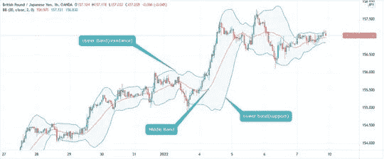
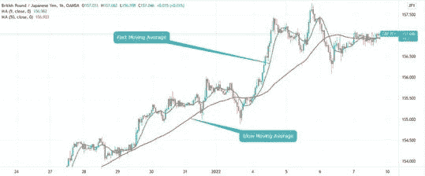

# 交易最可靠的指标是什么？

> 原文：<https://medium.com/coinmonks/what-is-the-most-reliable-indicator-for-trading-374de6ebe3fc?source=collection_archive---------32----------------------->

Image by [Chikwem Chinedu Ogugua](https://liquiditytradeideas.com/participant/admin/) on [Liquiditytradeideas](https://liquiditytradeideas.com/)

**交易最可靠的指标是什么？**这个问题没有唯一的答案，因为不同的交易者对不同的交易指标有不同的重视程度。也就是说，大多数交易者认为特定的指标比其他指标更可靠。

在这篇文章中，我们将讨论什么是交易指标，交易的三个最可靠的指标，交易时使用指标的好处，使用指标的风险，技术指标的四种主要类型，广泛使用的交易指标，以及使用技术指标时需要记住的一些事情。

# 介绍

说到交易，关于什么是最好的交易指标，从来不缺少观点。一些人说最重要的是关注宏观经济，而另一些人声称[技术分析](https://liquiditytradeideas.com/is-technical-analysis-useless/)是成功的关键。

# 什么是技术指标？

技术指标是可以用来预测金融资产未来表现的信号，如股票价格、货币价格等。

有各种不同的技术指标可以用来跟踪股票价格，这些指标可以分为四个主要类别:**趋势跟随**、**振荡指标**、**波动指标**和**支撑/阻力指标**。

 [## 股票市场交易策略。-流动性交易理念

### 股市交易策略！你是股票交易的新手吗？如果是这样的话，你一定会大开眼界！交易策略可以是…

liquiditytradeideas.com](https://liquiditytradeideas.com/stock-market-trading-strategies/) 

# 无指标交易合理吗？

关于没有指标的交易是否合理，有很多不同的观点。一些交易者认为指标对于做出明智的交易决定是必不可少的，而另一些交易者认为指标会误导人，导致糟糕的交易。

那么，真相是什么？无指标交易合理吗？答案可能取决于你问谁，但是如果你想在没有指标的情况下交易，有几件事要记住。

首先，你需要对你交易的市场和影响它的因素有很强的理解，我指的是宏观经济学。

第二，你需要对做决定感到舒服，并相信你的分析。最后，你应该知道无指标交易并不适合所有人——有些人只是喜欢使用指标作为他们交易策略的一部分。

Analysis by [Chikwem Chinedu Ogugua](https://liquiditytradeideas.com/participant/admin/) on [Liquiditytradeideas](https://liquiditytradeideas.com/)

# 使用技术指标有什么风险？

技术指标是一种使用趋势线、成交量和价格数据来预测未来价格的指标。很多技术指标都是用来预测股价的，比如成交量和趋势。

然而，使用技术指标存在一些风险。成交量和趋势可能是不准确的指标。数量会受到各种因素的影响，如供应和需求，如果指示器没有正确校准，数量可能会不准确。

如果指标与市场运动不同步，趋势可能不准确。如果没有正确校准，价格数据可能会不准确，并且价格数据还会受到供应和需求的影响，这可能会导致误导信号。

# 使用技术指标有什么好处？

技术指标用于识别金融市场的趋势和模式。它们可以用来识别机会和警告潜在的风险。

使用技术指标有几个好处。

1.  技术指标可以提供关于市场趋势和状况的有价值的信息。
2.  他们可以帮助你识别市场的潜在低点，并确定可能的进场点。
3.  他们可以为你提供关于市场状况和未来表现潜力的有价值的信息。
4.  它们可以帮助你确定市场条件是否在以一种可能带来有利可图的机会或风险的方式变化。

 [## 2022 年投资长期流动性交易理念的最佳密码

### 2022 年长期投资的最佳密码！想知道是否可以投资一种回报丰厚的加密货币…

liquiditytradeideas.com](https://liquiditytradeideas.com/best-crypto-to-invest-in-2022-for-long-term/) 

# 技术指标的四种主要类型是什么？

在[交易与投资](https://liquiditytradeideas.com/which-is-more-profitable-trading-or-investing/)中报道这个广告，技术指标主要有四种类型，包括:趋势跟踪指标、振荡指标、波动指标、支撑/阻力指标。

这些技术指标根据其各自的功能进行分组，从揭示一段时间内资产的平均价格到提供更清晰的支撑位和阻力位。

网上有各种各样的趋势指标工具。一些最流行的趋势指标工具包括移动平均线指标。这些工具提供了关于市场当前状态的各种信息，可用于帮助识别任何潜在趋势。

**2。振荡器**

振荡指标是一种技术分析指标，允许交易者和投资者通过测量两个连续的高值和低值之间的差异来预测价格的短期运动。相对强度指数是最广泛使用的振荡指标之一。

**3。波动指标**

波动指标是一种帮助你衡量股票价格波动程度的工具。这些指标可以用来识别价格运动的模式，并识别价格变化何时可能导致股票价格范围的高点和低点之间的巨大价差。

**4。支撑/阻力指示器**

支撑位和阻力位指标可用于识别市场何时经历支撑位。其中一些指标包括移动平均线收敛发散指标。

# 一个交易者在交易时应该用多少指标？

这个问题没有明确的答案，因为不同的交易者对交易中使用多少指标有不同的看法。一些人认为，只要有利可图，他们可以使用尽可能多的指标。

而另一些人则认为指标会误导人，没有指标也可以交易。因此，最佳做法是最少使用一个指标，最多使用五个指标。

最终，指标对于帮助做出明智的决定是必不可少的，这取决于个人交易者决定什么对他们最有利。

Analysis by [Chikwem Chinedu Ogugua](https://liquiditytradeideas.com/participant/admin/) on [Liquiditytradeideas](https://liquiditytradeideas.com/)

# 广泛使用的四个可靠的技术指标是什么？

指标对于帮助做出明智的决定是必不可少的，一些技术指标在交易和投资中是常用的。一些最受欢迎的[技术指标](https://liquiditytradeideas.com/top-10-powerful-trading-indicators/)包括移动平均线、相对强弱指标 RSI、布林线和支点。

**移动平均线指标** —这通常被认为是基于过去价格的趋势跟踪指标或滞后指标，移动平均线被认为是交易的可靠指标，并且是可定制的，这意味着投资者或交易者可以在计算平均线时自由选择他们想要的任何时间框架。

**RSI 指标** —相对强弱指数是一种主要用于金融市场分析的技术指标。它被认为是一个可靠的交易指标，然后被纳入图表，以根据最近交易期的收盘价来衡量股票市场或商品的当前和历史强势或弱势。

**布林线指标** —布林线是由 john Bollinger 开发的技术分析工具，主要用于交易股票、商品、证券等。这些波段包括一个波动性指标，衡量商品价格相对于以前交易的高点或低点。

**支点** —支点是外汇交易员使用的一个技术指标，作为潜在未来市场运动的价格水平标尺。支点指标用于确定偏差以及支撑位和阻力位，反过来可以用作利润目标、止损、进场和出场。

 [## 对于交易来说技术分析就够了吗？-流动性交易理念

### 对于交易来说技术分析就够了吗？刚接触交易或对金融市场的概念感到困惑…

liquiditytradeideas.com](https://liquiditytradeideas.com/is-technical-analysis-enough-for-trading/) 

# 我能把技术指标纳入你的交易策略吗？

[技术分析](https://liquiditytradeideas.com/is-technical-analysis-enough-for-trading/)是一门交易学科，它整合了对市场数据(如价格和交易量)的分析，以预测未来的市场走势。

许多交易者使用技术指标来帮助他们做交易决定，技术指标是产生买卖信号的数学公式。

当把技术指标结合到你的交易策略中时，结合其他市场数据使用它们是很重要的，比如价格行为、基本面分析和市场情绪。

通过结合使用技术指标和其他数据，你可以做出更明智的交易决定，提高成功的几率。

# 使用技术指标时有哪些需要记住的事情？

技术指标是交易者通常用来分析价格图表以识别潜在交易机会的数学计算。均线、布林线和 MACD 是一些最流行的技术指标。

虽然技术指标很有用，但重要的是要记住它们只是交易者工具箱中的一个工具。它们不应该单独使用，而应该与其他因素结合使用，如价格行为、[、风险管理](https://liquiditytradeideas.com/money-management-in-forex-trading/)和基本面分析。

如果使用正确，技术指标可以帮助交易者做出更明智的决定，什么时候进场和出场。

# 结论

我们的结论是，最可靠的交易指标是价格行为。这是因为它是唯一与价格直接相关的指标。

价格行为是未来价格变动最准确的指标。通过跟踪价格走势，交易者可以更好地预测市场走向。

其他指标，如移动平均线，在某些情况下可能是有用的，但不应该过于依赖它们。

如果你有兴趣了解更多关于价格行为交易和可靠的交易指标，加入我们的[论坛](https://liquiditytradeideas.com/community/)，了解最新的市场趋势。

*原为 2022 年 9 月 2 日在*[*https://liquiditytradeideas.com*](https://liquiditytradeideas.com/what-is-the-most-reliable-indicator-for-trading/)*发布。*

# 来自液化贸易理念的信息

感谢您成为我们社区的一员！在您离开之前:

*   👏为这个故事鼓掌，跟着作者走👉
*   📰查看更多内容在 [**液态贸易创意**](https://liquiditytradeideas.com/)
*   **📈**加入我们的 [**外汇、密码、股票论坛**](https://liquiditytradeideas.com/community/)
*   **📚发现 [**最佳交易电子书**](https://liquiditytradeideas.com/trading-e-books/)**

> **交易新手？试试[密码交易机器人](/coinmonks/crypto-trading-bot-c2ffce8acb2a)或者[拷贝交易](/coinmonks/top-10-crypto-copy-trading-platforms-for-beginners-d0c37c7d698c)**