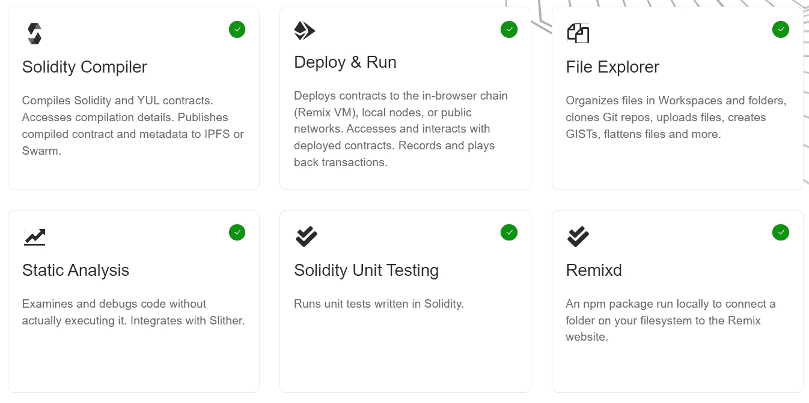
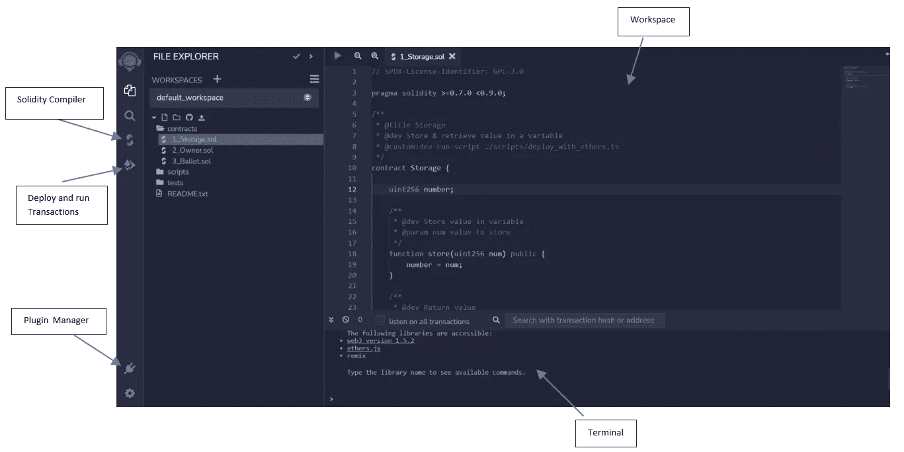
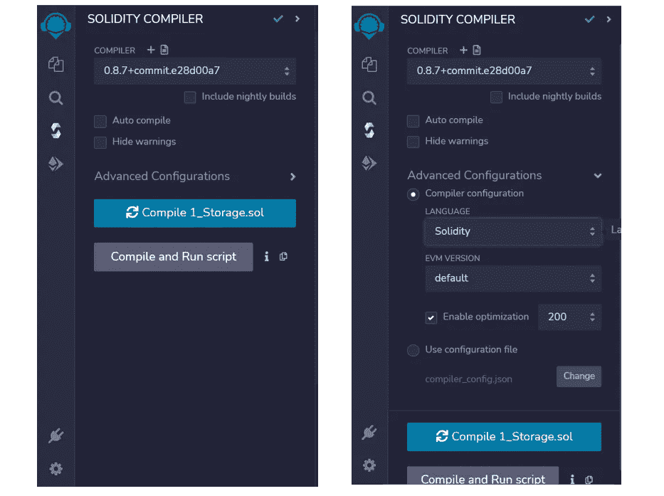
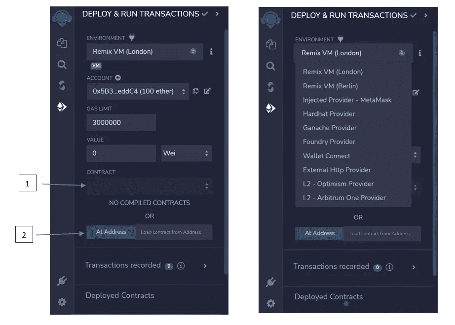
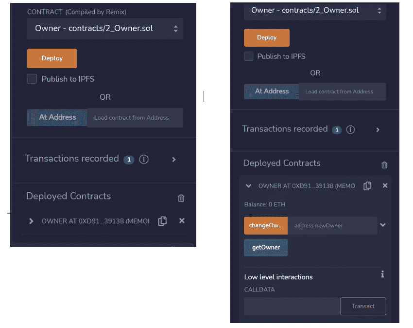

# 什么是 Remix 项目？

> 原文：<https://medium.com/coinmonks/what-is-the-remix-project-49d4642ddd22?source=collection_archive---------30----------------------->

作为一名区块链开发者，我如何发现 Remix 是有用的

[Remix 项目](https://remix-project.org/)是一个丰富的工具集，任何知识水平的用户都可以在智能合约开发的整个过程中使用，并且可以作为一个学习实验室来教授和实验以太坊。

[https://github.com/topics/remix-ide](https://github.com/topics/remix-ide)

Remix IDE 是 [Remix 项目](https://github.com/ethereum/remix-project)的一部分，该项目还包括 [Remix 插件引擎](https://github.com/ethereum/remix-plugin)和 [Remix 库](https://github.com/ethereum/remix-project/tree/master/libs#remix-libraries)。它是一个无需安装的工具，带有用于开发智能合同的 GUI。专家和初学者都使用，混音会让你马上步入正轨。Remix 可以很好地与其他工具配合使用，并允许对您选择的链进行简单的部署过程。Remix 是大家来学习以太坊的地方。Remix-IDE 可在[remix.ethereum.org](https://remix.ethereum.org/)获得，更多信息可在[这些](https://remix-ide.readthedocs.io/en/latest/index.html)文档中找到。Remix 编辑器有在线 IDE、桌面 IDE 和 VSCode 扩展三种版本，这样开发者就可以根据自己的方便选择任何选项。说到我，我的选择是 Remix online IDE，因为它易于使用，也易于访问。

在 Remix 中，一切都是插件。核心插件是为基本操作预装的。附加插件提供了扩展的工具选项板。这些是一些经过验证的插件，可以用于混音

Plugins for Remix

## 为什么你应该使用 Remix IDE？

正如我前面提到的，Remix 是一个开发智能合约的 GUI 工具。任何熟悉在以太坊上开发智能合约的人都会使用某种带有 hardhat 和 truffle 的 IDE 作为以太坊开发环境。但是混音超越了一切。这是一个专门为智能合约开发而构建的 IDE。这个 IDE 使得调试、部署和测试智能合约变得前所未有的简单。它还为我们提供了通过 GUI 界面与部署的合同进行交互的选项。如果您要使用常规以太坊开发环境(如 truffle 或 hardhat)来完成这项工作，您将需要为您的智能合约构建一个 FE 并集成它，这将需要更多的时间和专业知识。

无论以太坊生态系统的知识水平如何，任何开发者都可以使用 Remix。它的主要目的是减少智能合约的开发、调试和测试时间。我个人发现它非常有用，特别是对于测试智能合约，因为使用 GUI 编译、部署和测试花费的时间非常少。

在接下来的部分，我将和你分享一些 Remix IDE 最重要的功能，以及一些我个人认为对区块链开发者有用的 Remix 最重要的功能。

## Remix IDE 的特性

当您导航到在线编辑器时，您会看到类似这样的内容，

上图中显示的部分是 Remix IDE 的一些最重要的特性，如果您开始使用 Remix，您将会用到这些特性。我将解释如何使用这些组件来快速完成您的工作，我向您保证，当您发现使用 Remix 是多么容易时，您将不再需要任何其他以太坊开发工具。

首先是“工作空间”。这与您的普通 IDE 没有什么不同。你可以在这里写任何你能想到的代码。在左侧，您可以看到文件的结构。你可以根据你的需要来组织你的文件。需要注意的是，你不仅仅局限于 sol 文件。你可以用任何语言写任何代码。但是请注意，这个 IDE 是专门为以太坊生态系统编写代码而构建的。

接下来是“坚固性编译器”。这是您展开该选项卡时将看到的内容

我在这个标签中发现了一个很酷的功能，你可以很容易地从一个 solidity 编译器版本切换到另一个版本。此外，IDE 会自动切换到编译器，查看正在编译的代码。考虑到普通以太坊开发环境会抛出错误并且编译器必须手动更新，这是非常酷的事情。如上图所示，在编译智能合同时，使用“高级配置”也非常容易。

接下来是“部署和运行事务”选项卡。编译完代码后，您需要进入该选项卡，将您的智能合约部署到您选择的任何链中。

如上图所示，使用第一个下拉框，您可以选择将智能合约部署到哪个环境。甚至可以连接您的钱包(即元掩码)并使用您钱包中的任何钱包地址和网络。这使得将合同部署到您选择的任何区块链网络变得非常容易。然后，您可以从上图中标记为“1”的字段中选择您编译的智能合同，并单击“部署”。您将很快得到一个确认，表明您的智能合约已经通过终端部署。还可以与已经部署的契约进行交互。任何熟悉 web3 生态系统的人都知道，您需要契约 abi 和地址来与任何已部署的契约进行交互。同样，使用 Remix IDE 你也需要这两个元素。编译合同后，您将获得 abi 文件。然后，您需要做的就是从字段“1”中选择您想要的合同，并在字段“2”中输入部署地址，如上图所示。这将导致您获得一个已部署契约的实例。从这里开始，您可以与该契约进行交互，就像您部署的任何契约一样。

已部署的合同将显示在“已部署的合同”部分。

现在让我们看看如何使用 GUI 与部署的契约进行交互，这是我认为 Remix 最棒的地方。

从上图可以看出，界面上显示了所有可以调用的功能。您只需要传递所需的参数并调用函数。Remix 足够智能，可以识别公共和内部函数、需要参数的函数及其数据类型，并以非常有效的方式呈现给用户，从而使开发人员的工作变得非常轻松。

我想敦促你们每个人都尝试使用混音，并让我知道它是否让你的生活变得更容易。

干杯！！

# 资源

1.  Remix 项目网站—[https://remix-project.org/](https://remix-project.org/)
2.  Remix 项目 GitHub 页面—【https://github.com/ethereum/remix-project 
3.  混音插件引擎—【https://github.com/ethereum/remix-plugin 
4.  Remix 库—[https://github . com/ether eum/remix-project/tree/master/libs # remix-Libraries](https://github.com/ethereum/remix-project/tree/master/libs#remix-libraries)
5.  混合文档—[https://remix-ide.readthedocs.io/en/latest/index.html](https://remix-ide.readthedocs.io/en/latest/index.html)

> 交易新手？试试[加密交易机器人](/coinmonks/crypto-trading-bot-c2ffce8acb2a)或者[复制交易](/coinmonks/top-10-crypto-copy-trading-platforms-for-beginners-d0c37c7d698c)