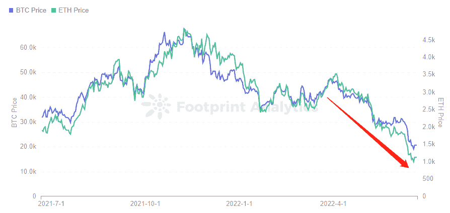
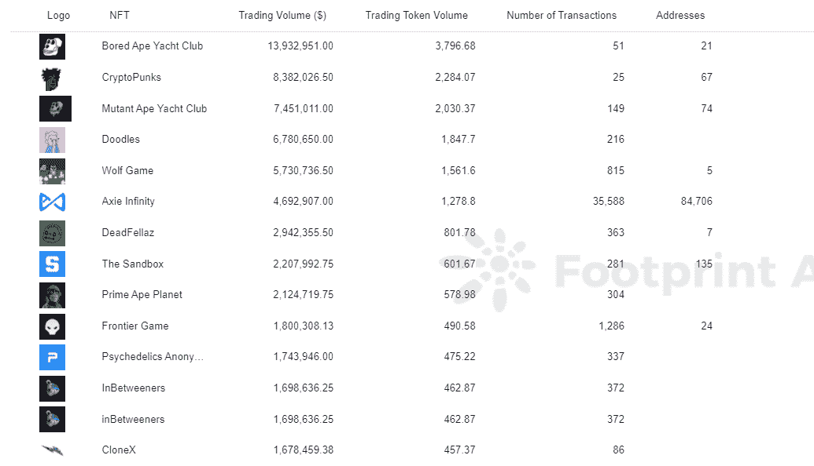
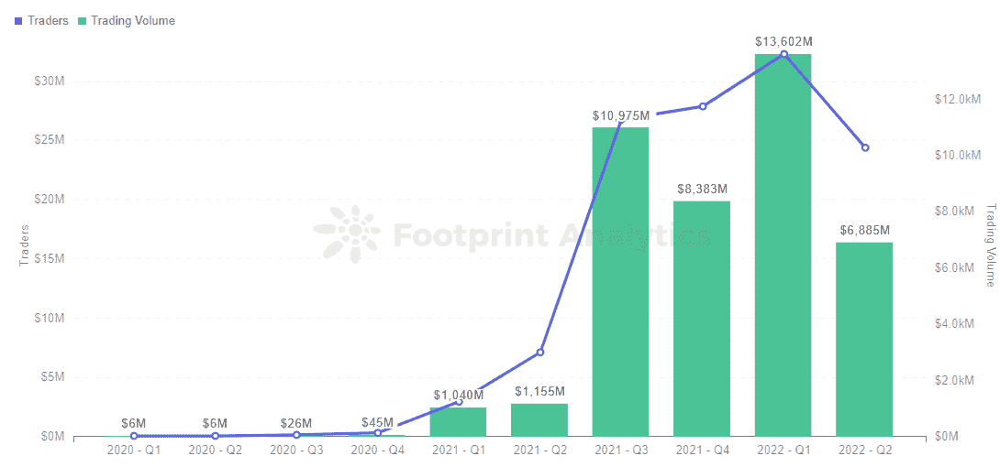
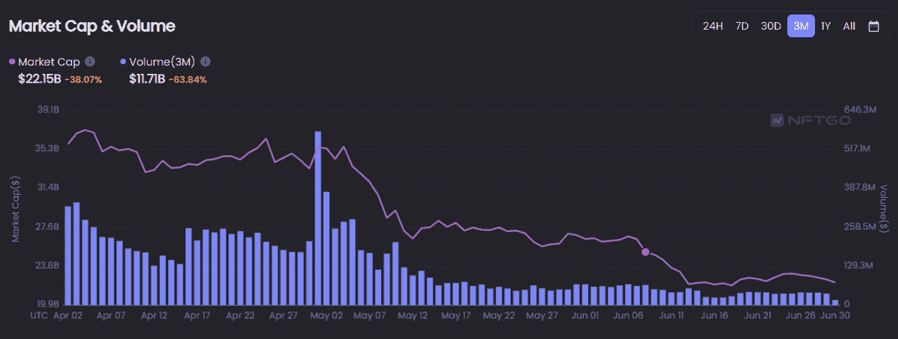
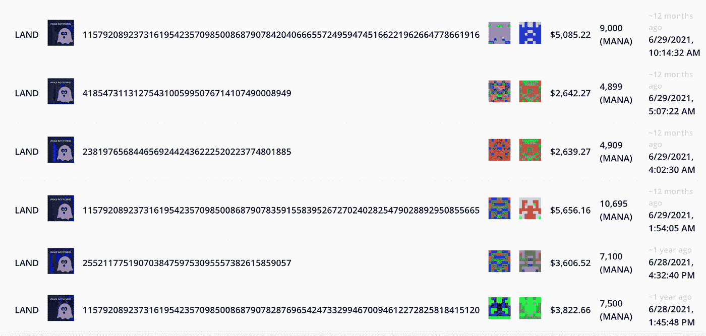
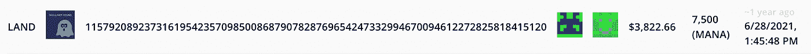
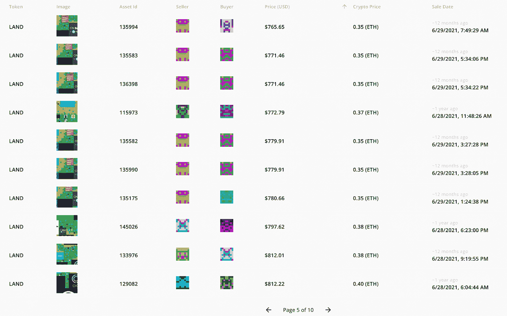

# 什么是最终的蓝筹加密资产:BTC，NFTs，或土地？

> 原文：<https://medium.com/coinmonks/what-is-the-ultimate-blue-chip-crypto-asset-btc-nfts-or-land-cb72f0682adb?source=collection_archive---------49----------------------->

七月。2022 年，杨永晴

数据来源:足迹分析— [BTC & ETH 趋势分析](https://www.footprint.network/@KikiSmith/BTC-ETH-Decentralized-Stablecoin-Market-Analysis?date_filter=past1000days&channel=EN-264)

与上次熊市相比，今天加密市场最大的变化之一是存在不同类型的资产。

而不是在 Dash、莱特币、以太坊、比特币等之间选择。在元宇宙，人们可以投资国家森林公园和数字土地。

常识表明，这些新的、实验性的资产与 T2 BTC 和瑞士联邦理工学院 T3 相比风险更大。虽然很难客观地衡量风险，但我们可以使用环比数据来评估价格波动。

随着熊市全面展开，现在是比较这些资产的最佳时机，看看最终的蓝筹股资产可能会走向何方:Crypto、 [NFTs](https://www.footprint.network/@rogerD/NFT-Maket-Overview?date_range=past30days&channel=EN-264) 或元宇宙地产。

在本文中，我们将比较三个假设的投资者:Abe、Bob 和 Cathy。恰好在一年前，他们都将资金投入到加密领域的不同资产类别中。

安倍的投资组合:50% BTC 和 50%瑞士联邦理工学院。

Bob 的投资组合:50% BAYC & 50%[crypto 朋克](https://www.footprint.network/@nsm/CryptoPunks?channel=EN-264)。

凯茜的投资组合:50%分散土地和 50%沙盒地块。

这些比较并不是一对一的(一年前以每只 6000 美元的价格购买 3 只无聊的猿，与投资 6000 美元购买像 ETH 这样的长期“安全”令牌是非常不同的举动。)因此，我们沿着这些 50/50 线创建了 3 个“合理的”投资组合，它们并不完全相同。后面再解释。

在本文中，我们将跟踪这些投资者的投资组合的表现，并探讨为什么其中一些投资比其他投资更不稳定。

# 安倍的象征性投资组合

投资代币而不是 NFT 的好处之一是流动性和可分性。我们能够在任何一天对 BTC 和 ETH 进行精确的美元估值，购买任何我们想要的数量，并获得公平的市场价格。

一年前的今天，2021 年 6 月 28 日，BTC 花费 35867 美元。为了便于计算，我们将把它四舍五入到最接近的 100，即 35900 美元。ETH 是 2160 美元，四舍五入到 2200 美元。

我们的象征性投资者选择了一个好时机介入。在 2021 年 4 月 13 日比特币基地上市的热情，以及美联储将利率降至 0.25%以刺激经济之后，市场一片轰鸣。然而，主要由于中国的一波严格监管，它暂时崩溃了，安倍出现的时间大约是在这里。

事后看来，安倍买下了周期的底部，向 BTC 投资了 5 万美元，向 ETH 投资了 5 万美元(得到了大约 1.39 的 BTC 和 22.7 的 ETH。)

疯狂的向上攀升一直持续到 2021 年 11 月 8 日，当时安倍的初始投资价值 203，767.52 美元。

但随后，随着散户和投资者削减风险资产，对加密货币的投机热情开始消退。

从 1 月到 6 月，美联储连续加息 75 个基点，这是 28 年来的最大幅度。

> 交易新手？试试[密码交易机器人](/coinmonks/crypto-trading-bot-c2ffce8acb2a)或者[复制交易](/coinmonks/top-10-crypto-copy-trading-platforms-for-beginners-d0c37c7d698c)

2 月份，乌克兰战争引发了宏观经济状况的下滑，导致加密市场的熊市环境。

更糟糕的是，5 月份 Terra Luna 的闪电崩盘看起来像是一系列区块链工业汽车事故的开始。

所有这些事件都压低了 BTC 和 ETH 的价格——对绝大多数非加密公众来说，这些资产是“加密价格”本身的替代品。

*Footprint Analytics — BTC Price & ETH Price*

2022 年 6 月 28 日，安倍 1.39 BTC 和 22.7 ETH 的投资组合价值 54197.7 美元，下跌 45.8%。从历史最高水平下降了 73.4%。

# NFT 投资组合

虽然 NFT 不像 BTC 或 ETH 那样具有流动性，但它们是独一无二的，具有收藏价值。而当市场处于较好的状态时，持有人也可以从中获得一定的美元价值。

2021 年 6 月的 NFT 市场是什么样的？

*   萌发和构建期:

2017 年 6 月，全球首个 NFT 项目 CrytoPunks 正式诞生，将 NFT 概念推向高潮。在 OpenSea 的带动下，NFT 交易变得更加便捷和完善，使得 NFT 的应用领域逐渐从游戏和艺术品扩展开来。

*   扩张期。

到 2021 年， [Axie Infinity](https://www.footprint.network/@Leslie/Axie-Infinity-Dashboard?channel=EN-264) 销量快速上升，推动了 NFT 市场的增长。同年，BAYC 也成立并进入公众视野。

这是 Bob 进入市场的最佳时机，因为 NFT 还处于起步阶段。因为 NFT 遵守一个规律，越早的属性越稀有，价值越高，越低的价格越均衡(NFT 交易市场不成熟，交易频率低)。

2021 年按[交易量计算，BAYC 和 CryptoPunks 位居 NFT 前列。](https://www.footprint.network/chart/Top-10-NFT-projects-by-Trading-Volume-in-2021-fp-3991?channel=EN-264)

*Footprint Analytics —* [*NFT Projects by Trading Volume in 2021*](https://www.footprint.network/chart/Top-10-NFT-projects-by-Trading-Volume-in-2021-fp-3991?channel=EN-264)

假设 Bob 在 2021 年 6 月 28 日以平均价格买入 1 只 BAYC (3.5713 ETH)和 1 只 CryptoPunk (28.9191 ETH)，他的初始投资在当时价值 71478.88 美元。

2021 年，世界经济发展受到疫情的严重影响，主要经济体的财政宽松政策带来了通货膨胀和货币贬值，促使用户转向艺术品、NFT 和 BTC 等加密市场。2021 年 8 月至 3 月，NFT 市场的交易活动继续增加。

*Footprint Analytics —* [*NFT Traders & Trading Volume*](https://www.footprint.network/chart/NFT-Traders-%26-Trading-Volume-fp-22929?channel=EN-264)

如果 Bob 跟随 ETH，在 11 月 8 日(ETH 为 4826.25 美元)高峰时卖出，当时 BAYC 和 CryptoPunk 的平均价格分别为 43.8835 ETH 和 98.5848 ETH，他的投资组合将价值 687587.63 美元，涨幅为 861.95%。

加密市场的崩溃导致投资者对 NFT 的兴趣下降，严重影响了其整体交易量和市值的下降。过去 90 天，总成交量下跌 63.84%，总市值下跌 38.07%。

*Screenshot Source — nftgo — Market Cap & Volume*

截至 2022 年 6 月 28 日，ETH 的交易价格为 1144 美元，BAYC 为 113.5035 ETH，CryptoPunk 为 77.6991 ETH。鲍勃的投资组合价值 218，735.77 美元，同比上涨 206.01%。较历史高点下跌 68.19%。

显然，与所谓的“安全”加密投资 BTC 和瑞士联邦理工学院相比，截至 2022 年夏季初，蓝筹股 NFT 并不像许多人认为的那样不稳定。

**由于在 2021 年 6 月将你的投资组合的一半投资于 BAYC NFTs 是相当疯狂的，我们在这个投资组合中采取了一种不同的 50/50 方法。鲍勃买了 1 个朋克和 1 个猿。*

# 土地投资组合

由于对 2021 年 6 月的元宇宙感兴趣，Cathy 可以被视为早期采用者。那时，“元宇宙”这个词还没有成为一个家喻户晓的名字。

脸书更名为 Meta 还有 4 个月的时间。

元宇宙是《第二人生》的新版本吗？你需要一个虚拟现实耳机来访问它吗？几乎没有一个不深谙密码的人已经知道了。

但是声音还是存在的。6 月 4 日，苏富比在分散地开设了一个虚拟画廊，这款游戏在元宇宙土地拍卖中首次突破 100 万英镑，引起了轩然大波。

2021 年 6 月 28 日，凯茜成为了元宇宙的房东。她的购买是分散地 37 次 NFT 拍卖会中的一次，总共产生了 148，500 美元。

因为区块链上的所有交易都在公共账上，所以我们实际上可以看到并分析在这一天卖出的所有土地。

*Screenshot Source — nonfungible*

6 月 28 日的平均售价约为 4000 美元，从这些销售来看，这似乎是一个合理的评估。(也就是说，如果有一笔天价的交易，那么平均价格就不是凯茜能支付多少的好标准。)

因此，凯茜尝试了一下元宇宙，花 4000 美元买了一块地——也许是这块:

*Screenshot Source — nonfungible*

她还在沙箱里加了一个包裹。当时，搜索词“沙盒”很难让人想起元宇宙的名字，因为它的象征性价格在短短几个月内上涨了 3842%，占据了新闻头条。

6 月 28 日，售出了 46 台 NFT，收入 43，500 美元，平均价格为 945 美元。这比当天的中间价高了几百，但仍然足够准确，可以进行一般分析。

*Screenshot Source — nonfungible*

因此，为了维持资产类别中两个最知名产品的近 50/50 分配，凯茜以 4000 美元的价格购买了 1 块分散土地，并以每块 945 美元的价格购买了 4 块沙盒土地——总共 7780 美元的元宇宙土地投资组合。

她的判断将被证明是有远见的。到 2021 年 11 月 8 日，BTC 联邦理工学院达到顶峰，分散土地的平均销售价格增加了 3.0469 ETH，达到 14705 美元。沙坑土地的平均价格飙升至 6096 美元，上涨了 734.62%。

如果我们只是按平均价格计算，她的 1 块分散土地和 4 块沙盒地价值 39，089 美元。

相反，如果我们看看上面显示的 2021 年 6 月 28 日花费不到 4000 美元的实际资产，那么它增加了 59135 美元。2021 年 11 月 15 日，它以 55，313 美元的价格转手，这是最接近 ETH peak 的交易。

第二年，元宇宙土地价格急剧下降，分散土地和沙盒土地的交易量分别下降了 76.81%和 79.03%。

2022 年 6 月 28 日，凯茜的投资组合从 ATH 下跌了 14，811 美元(-62%)。大获成功，但仍远高于她最初的投资。元宇宙土地显然极其不稳定，仍然可以被称为孤注一掷，而不是安全的蓝筹股。

# 摘要

虽然牛市见证了 NFTs 和元宇宙地产的巨大收益，但顶级项目的环比数据表明，相对于 BTC 和 ETH 等“安全”资产，价格并不像许多人认为的那样波动。

在这篇文章中，我们创建了三个假设的投资组合，并发现安全加密赌注从 ATH(截至 6 月 28 日)比投资到 NFTs 和元宇宙土地的跌幅更大。后两种“风险更高”的资产在牛市中的收益也会高得多。

虽然对此有几种可能的解释(例如，机构更难压低 NFT 和土地的价格)，但该数据支持这样的观点，即顶级 NFT 和元宇宙土地项目在去年全年表现非常好——繁荣、萧条、崩溃等等。

这篇文章由[足迹分析](https://www.footprint.network/)社区提供。

Footprint 社区是一个世界各地的数据和加密爱好者相互帮助了解和获得关于 Web3、元宇宙、DeFi、GameFi 或区块链新兴世界任何其他领域的见解的地方。在这里，你会发现活跃的、不同的声音相互支持，推动着社区向前发展。