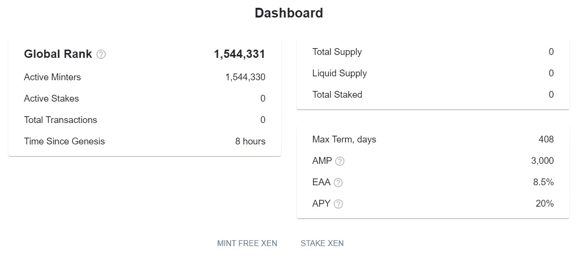

# 有人日进 20 万美元的 XEN Crypto 是什么？

> 原文：<https://medium.com/coinmonks/what-is-the-xen-crypto-that-someone-rakes-in-200-000-a-day-a8e80ce475c8?source=collection_archive---------1----------------------->

最近有一个项目 XEN Crypto 在密码界非常流行。楚小莲会试着介绍 XEN 是什么。

the XEN Crypto

XEN 于 10 月 9 日在以太坊网络上线。是 PoP(参与证明)模式，全民搭建虚拟采矿项目。

创始人是杰克·莱文(Jack Levin)，前谷歌员工№21，无预铸，无管理密钥，不变合同，零供应，100%透明和链上。

项目没有参与门槛。任何玩家都可以通过链接钱包，支付少量油费来获得。铸币后，可以选择质押 1 天或以上。承诺时间的长度决定了要获取的 XEN 的数量。

质押到期需要及时认领，否则 XEN 数量会逐渐减少，7 天后只剩 1%。

The current total supply of ETH network XEN exceeds 10 billion

XEN 上线后的第二天，有人创造了 XEN/ETH 的 LP 流动性，XEN 开始有价了。从最初的 0.005U 上线，短时间涨到 0.01 美元，然后继续下跌。现价现在是 0.00016。

据说有人第一天铸造了 1000 个地址，第二天收发，平均每个钱包 200 美元，一天妥妥的 20 万美元。有些人是真的看热闹，有些人是默默的赚大钱。

认捐一天的钱包，从最初几百块钱的收入变成了几块钱。扣除造币、收币、交易的气费，已经很慢，不值得短线参与。

如果你也想参与社会实验，可以选择更长的时间段，看看以后有没有新的故事。毕竟这种全民参与可能真的会带来一种全新的体验和意想不到的效果。

The income from staking for one day is no longer enough for the GAS fee

XEN 已经计划部署在多个链上。目前 BSC 网络已经上线，8 小时内铸就超过 150 万个钱包地址。

玩家已经把 ETH 网上的玩法搬到了 BSC 链上，明天质押到期的 XEN 不知道会不会有新财富效应，还是直接归零。

之后，XEN 还将在 Avalanche、Polygon/MATIC、Arbitrum、乐观、Cronos、Fantom 等网络上线。

不同网络上的 XEN 不能等比例交换，但可以按一定比例交换，互相交叉链接。

More than 1.5 million XEN minting addresses on the BSC network

高温来得快去得也快。XEN 上线 4 天，经历了一轮牛熊。

第二天收到的 XEN，第一次能卖到 600 多美元，之后迅速下降。6 小时后，只需 80 美元。到了第三天，只剩下 8 块钱，还不够油费。

随着财富效应的消退，参与短线的人越来越少。

当然也有玩家在网上认捐了 100 天，200 天，300 天，等等。不知道那时候是不是还有热度，还是没人管。

The XEN project has burned 4076 ETH

项目创始人杰克·莱文(Jack Levin)是一位连续创业者，他在离开谷歌后启动了许多项目。

从 2010 年开始接触比特币进行点对点支付，2011 年开始挖矿比特币。但他认为，电力开采是对电力的浪费，工作证明是一种过时的方式。他希望以其他方式探索区块链，并发起了 XEN 的尝试。

XEN 是区块链提供的免费令牌，基于自我托管、无信任共识和去中心化，所有人都可以参与。没有预先铸造，没有集中所有权，没有控制，开源智能合同。

在 XEN 面前每个人都有同样的机会，随着时间的推移和共识的增长，XEN 有潜力扮演更重要的角色。

当然，这一切都会在时间中显露，究竟是为了创造更好的体验，还是为了尝试归零，都是不确定的。

Initially someone pledged to get $668 a day

在密码世界里，任何创新的玩法都有可能被传播出圈子。

从 BTC，瑞士联邦理工学院，到 SHIB 总督，等等。，还有人，XEN，每一次新的尝试都是全民狂欢，不断刷新玩法，带来全新体验。

如果你有好的想法，密码世界是一个伟大的实验平台。

以上只是我个人观点，没有投资建议。我是楚小莲，我正在关注元宇宙和 web3。

> 交易新手？试试[加密交易机器人](/coinmonks/crypto-trading-bot-c2ffce8acb2a)或者[复制交易](/coinmonks/top-10-crypto-copy-trading-platforms-for-beginners-d0c37c7d698c)